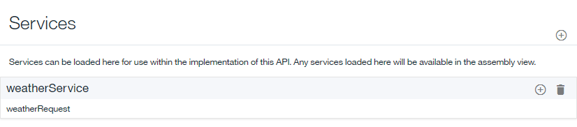

---

copyright:
years: 2019
lastupdated: "2019-3-12"

subcollection: apiconnect

keywords: IBM Cloud, APIs, lifecycle, catalog, manage, toolkit, develop, dev portal, tutorial

---

{:new_window: target="blank"}
{:shortdesc: .shortdesc}
{:screen: .screen}
{:codeblock: .codeblock}
{:pre: .pre}
 

# Esposizione di un servizio SOAP come un'API REST
{: #tut_expose_soap_service}

**Durata**: 20 minuti  
**Livello di competenza**: Principiante  

---
## Obiettivo
{: #object_tut_expose_soap_service}

In API Manager, creerai un'API REST che accederà a un servizio SOAP esistente e lo esporrà come un'API REST.

## Prerequisiti
{: #prereq_tut_expose_soap_service}

1. Prima di iniziare, dovrai [configurare la tua istanza {{site.data.keyword.apiconnect_full}}](/docs/services/apiconnect?topic=apiconnect-tut_prereq_set_up_apic_instance).
2. Prima di iniziare, copia il file di test [weatherprovider.wsdl ](https://raw.githubusercontent.com/IBM-Bluemix-Docs/apiconnect/master/tutorials/weatherprovider.wsdl){: #new_window} nel tuo file system locale.
	>![images/info.png]
	>Puoi fare clic su **Raw** e salvare la pagina risultante nel tuo sistema locale come un file `.wsdl`.

---
## Configurazione di una definizione dell'API REST
{: #setup_tut_expose_soap_service}

1. Accedi a {{site.data.keyword.Bluemix_short}}: https://cloud.ibm.com.
2. Nel **Dashboard** {{site.data.keyword.Bluemix_notm}}, fai clic su **Cloud Foundary Services**. Avvia il servizio {{site.data.keyword.apiconnect_short}}. 
3. In {{site.data.keyword.apiconnect_short}}, assicurati che il pannello di navigazione sia aperto. Se non lo è, fai clic su **>>** per aprirlo.  

  

4. Seleziona **Drafts** nel pannello di navigazione.
5. Seleziona **Add +** > **New API**.

      

	
6. Specifica le informazioni di base dell'API.
	- Nel campo **Title**, immetti `Weather Data`.
	- Lascia il campo **Name** come `weather-data` che viene compilato quando immetti il tuo titolo.	
	- Lascia il campo del percorso di **Base** come `/weather-data`.
	- Lascia il campo **Version** come `1.0.0`.
7. Espandi **Additional properties** per specificare ulteriori proprietà per l'API.
	- Dal campo **API template**, seleziona **Default** per indicare che desideri utilizzare il template predefinito per creare la definizione dell'API.
	- Lascia i campi rimanenti invariati.
	
8. Aggiungi la tua API a un nuovo prodotto e quindi crea la definizione dell'API.
	- Seleziona **Aggiungi un prodotto**.
	- Nel campo **Title**, utilizza `Weather Data product` come valore predefinito.
	- Lascia i campi **Name** e **Version** invariati.
	- Assicurati che la casella di spunta **Publish this product to a catalog** sia selezionata e fai clic su **Sandbox** come catalogo di destinazione.
	
	- Fai clic su **Crea API**. Viene aperta la scheda **Design** per la bozza della tua definizione dell'API.
9. La tua API è ora stata creata. Viene visualizzata la pagina di progettazione.

   

10. Fai clic su **Definitions** sulla barra di navigazione. Fai clic sull'icona **Add Definition** .

11. Espandi la nuova definizione facendo clic su di essa.
12. Denomina la definizione `Weather Data Output`.
13. La definizione avrà cinque proprietà. Fai clic quattro volte su **Add Property** per aggiungere le proprietà aggiuntive. Ridenomina `Property Name` utilizzando i seguenti valori come guida e utilizza il valore predefinito per `Description`, `Type` e `Example`:
    a. Aggiungi nuove proprietà per la definizione **Weather Data Output**.    
       - Nome: codice postale         /  Tipo: stringa   
       - Nome: temperatura /  Tipo: numero intero   
       - Nome: umidità    /  Tipo: numero intero   
       - Nome: città        /  Tipo: stringa   
       - Nome: stato       /  Tipo: stringa   

	
14. Fai clic su **Paths** nella barra di navigazione. Fai clic sull'icona **Add Path** .
15. Imposta il titolo (**Title**) del tuo percorso appena creato su `/getweatherdata`.
16. Espandi l'operazione **GET /getweatherdata** facendo clic su di essa.
	
17. Per la tua operazione **GET /getweatherdata**, fai clic su **Add Parameter** e su **Add new parameter**.
18. Denomina il tuo nuovo parametro `zip_code` e lascia il resto come predefinito.
19. Nella colonna **Schema** della risposta **200 OK** nella sezione **Responses**, seleziona la tua definizione **Weather Data Output**. Per la risposta alla chiamata API, l'oggetto in essa definito da **Weather Data Output** sarà l'oggetto della risposta.
	
20. Fai clic sull'icona di salvataggio  per salvare le tue modifiche.

---
## Aggiunta e configurazione del tuo richiamo del servizio web
{: #add_web_tut_expose_soap_service}

Per aggiungere e configurare le politiche di associazione e richiamo che integrano il tuo servizio web nella tua definizione dell'API, completa la seguente procedura.
1. Nella sezione **Services**, fai clic sull'icona **Add service** . Viene aperta la finestra `Import web service from WSDL`.
	
2. Seleziona **Upload file**.
3. Nella finestra **File Upload**, specifica l'ubicazione del file `weatherprovider.wsdl` che hai scaricato in `step 2` della sezione **Prerequisites** e fai clic su **Open** per continuare.
4. Seleziona il servizio SOAP **weatherService** e fai clic su **Done**. Nella sezione **Services**, il servizio web **WeatherService** viene elencato con una sola operazione **weatherRequest**.
	

		
5. Passa alla scheda **Assemble** e assicurati che sia selezionato **DataPower Gateway policies**.
6. Elimina la politica **invoke** esistente nel canvas passando con il tuo cursore del mouse sulla politica e quindi facendo clic sull'icona **Delete policy** .
		
7. Dalla tavolozza, trascina il servizio web **weatherRequest** nella casella tratteggiata visualizzata nel canvas. Nell'assemblaggio vengono posizionate due politiche di associazione e una di richiamo. La prima politica di associazione assegna le variabili all'input del tuo richiamo del servizio web, mentre la seconda politica assegna gli output del tuo richiamo del servizio web alle variabili. Gli output della prima associazione e gli input della seconda, vengono generati dal WSDL fornito nel passo 4.
		
8. Fai clic sulla politica di associazione **weatherRequest: input** e sull'icona **Edit inputs**  nella colonna input del foglio delle proprietà.
		
9. Fai clic su **+ parameters for operation** e seleziona `get /getweatherdata`.
10. Fai clic su **Done** per aggiungere il parametro `zip_code`.
	
11. Fai clic sul cerchio corrispondente a **zip_code string** nel lato dell'input e quindi sul cerchio corrispondente a **zipcode string** nel lato dell'output.  
	
12. Chiudi il foglio delle proprietà.
13. Fai clic sulla politica di associazione **weatherRequest: output** nella tavolozza e quindi sull'icona **Edit outputs**  nella colonna output del foglio delle proprietà.
14. Seleziona **+ outputs for operation** e `get /getweatherdata`.
15. Seleziona **Done** per aggiungere la definizione dell'output `Weather Data Output`.
	
16. Fai clic sul cerchio corrispondente a **zip string** nel lato dell'input e quindi sul cerchio corrispondente a **zip string** nel lato dell'output. Associa i rimanenti parametri utilizzando quanto segue come guida.
	
17. Fai clic sull'icona **Save**  per salvare le tue modifiche.

Devi includere il richiamo del servizio web nel tuo assemblaggio e un parametro di input associato alla parte appropriata della richiesta SOAP e la parte appropriata associata della risposta SOAP a un output JSON.

---
## Verifica della tua definizione dell'API
{: #test_tut_expose_soap_service}

Per verificare la tua definizione dell'API utilizzando lo strumento di test API Manager, completa la seguente procedura.
1. Fai clic sull'icona **Test**  nella scheda **Assembly** per visualizzare il pannello di test.
	
2. Se hai utilizzato lo strumento di test precedentemente, fai clic su **Change setup**.
3. Scegli `Weather Data product 1.0.0` dall'elenco dei prodotti.
	
4. Fai clic su **Republish product**.
5. Fai clic su **Avanti**.
6. Seleziona `get /getweatherdata` dall'elenco delle operazioni.  
	
7. Scorri fino al campo **zip_code**, immetti `10504`.  
	
8. Fai clic su **Invoke**. L'API restituisce il meteo corrente.  
	

---
## Conclusioni
{: #conclusion_tut_expose_soap_service}

In questa esercitazione, hai completato le seguenti attività:
1. Configurato una definizione API REST
2. Configurato un'API per richiamare un servizio web esistente e restituito il relativo output
3. Verificato la tua definizione API

---

## Passo successivo
{: #next_tut_expose_soap_service}

Proteggi la tua API utilizzando [la protezione tramite OAuth 2.0](/docs/services/apiconnect/tutorials?topic=apiconnect-tut_secure_oauth_2).

Create > **Manage** > Secure > Socialize > Analyze

[important]: ./images/important.png "Importante!"
[info]: ./images/info.png "Informazioni"
[troubleshooting]: ./images/troubleshooting.png "Risoluzione dei problemi" 
