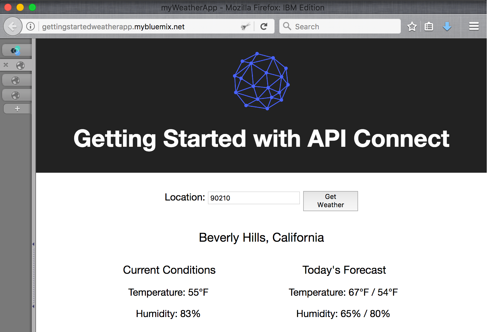

---
copyright:
  years: 2017
lastupdated: "2017-10-31"
---

{:new_window: target="blank"}
{:shortdesc: .shortdesc}
{:screen: .screen}
{:codeblock: .codeblock}
{:pre: .pre}

# Importa la tua specifica API e collegati tramite proxy a un servizio REST esistente utilizzando il toolkit Developer
Durata: 5 minuti  
Livello di competenza: Principiante  

## Obiettivo
Questa esercitazione illustra come puoi portare la tua API esistente nel controllo di gestione con {{site.data.keyword.apiconnect_full}}. In questa esercitazione, importerai una specifica OpenAPI e creerai un proxy API passthrough per un servizio REST esistente.

## Prerequisiti
Prima di iniziare, dovrai [configurare la tua istanza API Connect](tut_prereq_set_up_apic_instance.html) e [installare il toolkit API Connect](tut_prereq_install_toolkit.html).

---

## Esplora l'applicazione di esempio e verifica gli endpoint di destinazione

È stata creata un'applicazione _weather provider_ di esempio per questa esercitazione. La specifica API corrispondente (Swagger 2.0) è nel file [weather-provider-api_1.yaml ](https://raw.githubusercontent.com/IBM-Bluemix-Docs/apiconnect/master/tutorials/weather-provider-api_1.yaml){:new_window}.

1. Per esplorare l'applicazione, vai a [http://gettingstartedweatherapp.mybluemix.net/ ](http://gettingstartedweatherapp.mybluemix.net/){:new_window}.  
2. Immetti un codice postale U.S. valido per ottenere il tuo _**meteo corrente**_ e le _**previsioni di oggi**_.  

3. La precedente applicazione di esempio meteo è stata creata utilizzando API che forniscono dati meteo. L'endpoint per ottenere i dati meteo **correnti** è `https:// myweatherprovider.mybluemix.net/current?zipcode={zipcode}`. Verifica visitando [https://myweatherprovider.mybluemix.net/current?zipcode=90210 ](https://myweatherprovider.mybluemix.net/current?zipcode=90210){:new_window}.  

  

4. In modo simile, l'endpoint per ottenere i dati della previsione **di oggi** è `https:// myweatherprovider.mybluemix.net/today?zipcode={zipcode}`. Verifica visitando [https://myweatherprovider.mybluemix.net/today?zipcode=90210 ](https://myweatherprovider.mybluemix.net/today?zipcode=90210){:new_window}.  

  

---

## Importa la specifica OpenAPI dell'applicazione di esempio per creare un proxy API REST
1. Avvia **API Designer**. Nella tua finestra di terminale, immetti il seguente comando: `apic edit`.
2. Accedi utilizzando il tuo ID IBM.
    
3. In **API Designer**, assicurati che il pannello di navigazione sia aperto. Se non lo è, fai clic su >> per aprirlo.
4. Nel pannello di navigazione, fai clic su **Drafts**.
5. Vai alla scheda **APIs**.
6. Nella scheda delle API, fai clic su **Add**.
7. Dal menu a discesa, fai clic su **Import API from a file or URL**.
   
8. È presente una definizione OpenAPI 2.0 dell'API meteo che utilizzerai in questa esercitazione. Nella finestra di dialogo "Import OpenAPI (Swagger)", immetti questo URL:
`https://raw.githubusercontent.com/IBM-Bluemix-Docs/apiconnect/master/tutorials/weather-provider-api_1.yaml`.
9. Lascia l'opzione _Add a product_ deselezionata e fai clic su **Import**.  
      

Dopo aver importato la specifica OpenAPI, viene visualizzata la vista di progettazione dell'API. Qui puoi visualizzare varie sezioni della definizione OpenAPI. Scorri per esplorare e prendi specialmente nota del valore host. Puoi anche visualizzare OpenAPI nella scheda di origine. 
_Visualizzerai il valore host impostato su _ `$(catalog.host)` _. Questo è l'URL di base del tuo proxy dell'API._
 

## Verifica il tuo proxy API

1. Avvia il server di test locale selezionando l'icona **Start servers**. Una volta che il gateway è avviato, visualizzerai lo stato automaticamente aggiornato in _**Running**_.
    

2. Seleziona la scheda **Assemble**.

3. Fai clic sull'icona di riproduzione (>) per verificare il richiamo della destinazione del proxy dell'API.
   _Per questa esercitazione, utilizzeremo il Micro Gateway integrato, per cui assicurati che sia selezionato **Micro Gateway Policies**.
    

4. Nel pannello di verifica:
  - Seleziona l'operazione **get /current**.  
  - Codice postale è un parametro obbligatorio per questa operazione, per cui immetti un codice postale U.S. valido (ad esempio, 90210).  
  - Seleziona **invoke** e verifica la risposta.

    _Se riscontri un errore CORS, segui le istruzioni nel messaggio di errore. Fai clic sul link nell'errore per aggiungere l'eccezione al tuo browser e quindi nuovamente su **invoke**.
  
  - La risposta prevista è una risposta **200 OK** e i dati meteo correnti per il codice postale 90210.
        

## Conclusioni

In questa esercitazione hai visto come può essere richiamato un servizio REST esistente tramite un proxy passthrough dell'API. Hai iniziato verificando la disponibilità del servizio di esempio tramite il browser web. Poi hai creato un proxy API in {{site.data.keyword.apiconnect_short}} e collegato il proxy al servizio di esempio da richiamare. Infine, hai verificato questo servizio con gli strumenti di verifica interni {{site.data.keyword.apiconnect_short}}.

---

## Passo successivo

Proteggi la tua API utilizzando [la limitazione di frequenza](tut_rate_limit.html), [il segreto e l'ID client](tut_secure_landing.html) o [la protezione tramite OAuth 2.0](tut_secure_oauth_2.html).

Create > **Manage** > Secure > Socialize > Analyze
