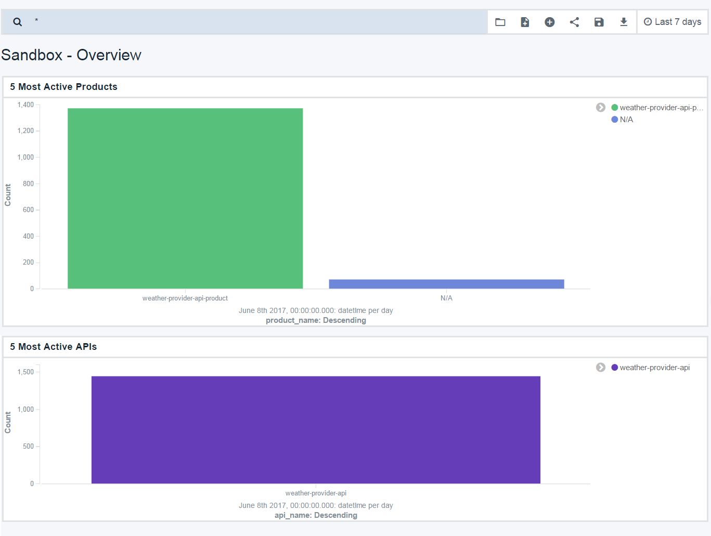
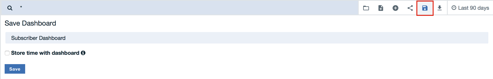
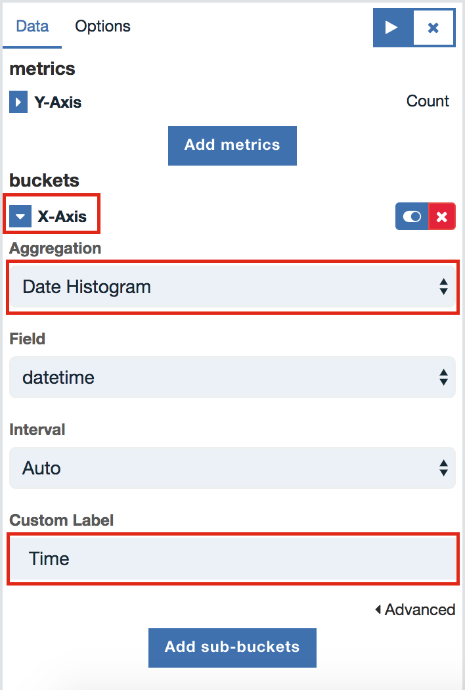
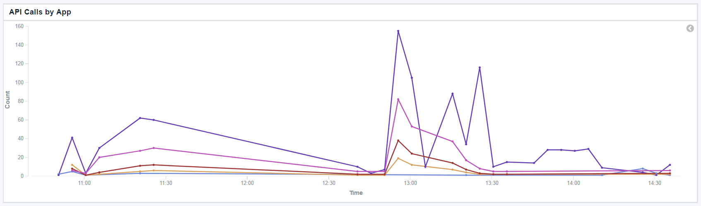

---
copyright:
  years: 2017
lastupdated: "2017-12-15"
---

{:new_window: target="blank"}
{:shortdesc: .shortdesc}
{:screen: .screen}
{:codeblock: .codeblock}
{:pre: .pre}

# Ottieni informazioni approfondite dalle analisi di base
Durata: 30 minuti  
Livello di competenza: Principiante

## Obiettivo
Questa è un'introduzione di base alle analisi API in {{site.data.keyword.apiconnect_full}}. Faremo un tour dei dashboard di analisi disponibili e che puoi seguire con le tue proprie API.

## Prerequisiti
Per poter visualizzare la tue proprie analisi API, devi disporre di un prodotto API creato e pubblicato. In aggiunta, dovrai richiamare la tua API più volte per generare alcuni dati di analisi, preferibilmente utilizzando un ID client da un'applicazione registrata (non l'applicazione di test con pre-provisioning).

Per generare i dati in questa esercitazione, abbiamo utilizzato *Collection Runner* di Postman per richiamare un'API più volte, con dati e ID client differenti. Puoi utilizzare uno strumento simile (come HttpRequester per Firefox) o utilizzare cURL per richiamare la tua API più volte dalla riga di comando. Puoi ottenere le richieste di esempio per la tua API facendo clic sul link **Explore** in {{site.data.keyword.apiconnect_short}}.

## Introduzione alle analisi del catalogo
Come proprietario di un'API, hai bisogno di un modo per valutare l'esito e le prestazioni delle API che offri. Il luogo principale in cui ricercherai le analisi è al livello del catalogo. Se non hai ricevuto un'introduzione ai cataloghi, consulta [Working with Catalogs ](https://www.ibm.com/support/knowledgecenter/en/SSFS6T/com.ibm.apic.apionprem.doc/conref_working_with_env.html){:new_window} nel IBM Knowledge Center per un'introduzione. 

Tu e i tuoi sviluppatori dell'API potete inoltre accedere alle analisi specifiche per l'applicazione nel portale sviluppatori, ma in questa esercitazione, ci concentreremo sulle analisi del catalogo.

Puoi accedere fino a 90 giorni alle informazioni cronologiche e in tempo reale riguardanti le tue API e prodotti pubblicati in tale catalogo. Ti mostra inoltre chi li sta richiamando. Se il tuo catalogo ha più spazi, puoi navigare al livello dello spazio.

Questa esercitazione è composta di quattro attività che ti mostrano come completare le seguenti attività:
* Visualizzare le analisi
* Visualizzare i dettagli del record eventi
* Creare nuovi dashboard
* Creare nuove visualizzazioni

## Attività 1: visualizzazione delle analisi della casella
1. Nel tuo servizio {{site.data.keyword.apiconnect_short}} in {{site.data.keyword.Bluemix_short}}, avvia il tuo dashboard e seleziona il catalogo che vuoi aprire. 
2. Fai clic sulla scheda *Analytics*.

    
  
Visualizzerai il dashboard della panoramica predefinito, che mostra due visualizzazioni di grafici a barre che contengono i seguenti dati dagli ultimi 7 giorni:
* 5 prodotti più attivi 
* 5 API più attive 

3. Passa con il mouse su una qualsiasi barra per visualizzare i dettagli aggiuntivi, come il numero di API, i nomi delle API e così via.

    

4. Utilizza la barra di ricerca per filtrare i dati visualizzati. Puoi anche selezionare un diverso filtro di tempo e/o la frequenza di aggiornamento automatico. Le visualizzazioni si aggiornano per rispecchiare le tue selezioni.

Sono presenti altri dashboard forniti preconfigurati.

5. Fai clic sull'icona della cartella e carica un dashboard salvato e seleziona **api_default** dall'elenco a discesa.

    

Questo dashboard dispone di una serie di visualizzazioni differenti che visualizzano lo stato dell'API, gli errori, i tempi di risposta, il numero totale di chiamate e le chiamate al giorno.

    

## Attività 2: visualizzazione dei dettagli dell'evento

Le visualizzazioni sono un ottimo modo di ottenere una panoramica sui dati utile, ma hai anche bisogno di un modo di navigare tra i record dell'evento che popolano i grafici.

1. Passa con il mouse sull'icona freccia nell'angolo in fondo a sinistra di una qualsiasi visualizzazione. Viene visualizzata una piccola freccia.
2. Fai clic sulla freccia per visualizzare una tabella dei dati utilizzati in tale visualizzazione. 
3. Fai clic sull'etichetta **View Events** per passare ai dettagli dell'evento individuale per un massimo di 100 record.

    

Puoi modificare, spostare ed eliminare le visualizzazioni nel tuo dashboard.

## Attività 3: creazione di nuovi dashboard

Ora, creiamo un nuovo dashboard che fornirà la visualizzazione dei modelli di traffico dell'API. Questi sono tutti disponibili utilizzando le visualizzazioni integrate. 

1. Fai clic sull'icona del nuovo dashboard e sul link **Choose from existing visualizations**. 

    
    Viene visualizzato un elenco di visualizzazioni disponibili.

2. Seleziona alcune visualizzazioni da aggiungere al tuo dashboard.  Ad
esempio:
  * Applicazioni sottoscritte
  * Applicazioni per piano 
  * Frequenza di riuscita
  * Chiamate API al giorno
  
  **Suggerimento** quando selezioni ogni visualizzazione, la scheda di selezione blocca la tua vista dashboard, per cui potresti non capire quale visualizzazione è stata aggiunta al dashboard. Seleziona una visualizzazione alla volta e chiudi la scheda di selezione ogni volta per visualizzare le modifiche nel tuo dashboard.

3. Fai clic su **Save** e fornisci al tuo dashboard un nome: `Subscriber Dashboard`.

   

    

## Attività 4: creazione di nuove visualizzazioni
Nel dashboard Subscriber che abbiamo creato, abbiamo incluso la visualizzazione integrata che mostra le chiamate API al giorno. Quando guardiamo tutte le informazioni presentate insieme, ci piacerebbe davvero vedere l'utilizzo per applicazione. Creiamo una nuova visualizzazione che mostra queste informazioni.

1. Fai clic su **New Visualization** e seleziona il link **Create Visualizations**.
    

2. Seleziona **Line chart** come tuo tipo di visualizzazione. Il grafico a linee inizializzato ha l'asse Y configurato con il numero di chiamate API. Questo è appropriato per il nostro grafico.

3. Seleziona quanto segue:
	* Tipo di bucket: **X-Axis**
	* Aggregazione: **Date Histogram**
	* Etichetta personalizzata: **Time** 
4. Fai clic su **Run** per visualizzare il tuo grafico. **Suggerimento**: potresti aver bisogno di modificare il tuo intervallo di tempo per visualizzare i dati.

   

Questo grafico (finora) mostra una serie temporale delle chiamate API. Noi vogliamo visualizzare le chiamate API per nome dell'applicazione.

5. Fai clic sul pulsante **Add sub-buckets**.
6. Seleziona quanto segue:
	* Tipo di bucket: **Split Lines**
	* Aggregazione secondaria: **Terms**
	* Campo: **app_name**
	* Etichetta personalizzata: **App**
	
   
8. Fai clic su **Run** per visualizzare il tuo grafico.
9. Fai clic su **Save** e fornisci al tuo grafico un nome `API Calls by App`.
10. Per visualizzare la tua visualizzazione nel contesto, aggiungila al dashboard Subscriber.

   
 
Esistono altre informazioni disponibili per la visualizzazione dei dettagli delle chiamate API, i chiamanti e così via. Un elenco completo di eventi API è disponibile nel API Connect Knowledge Center o nell'elenco dei termini quando crei le visualizzazioni.

## Conclusioni

La capacità di visualizzare le analisi API in combinazioni e stili differenti ti fornisce un'opportunità di trarre conclusioni o andare più a fondo nei tuoi dati API. Puoi utilizzare queste informazioni approfondite per prendere decisioni su quali API offrire, quando sostituire o ritirare un'API, su chi sta utilizzando le tue API e così via.

Ad esempio, le API versione 1 (v1) e versione 2 (v2) da un provider denominato "ACME" sono state eseguite per molti anni. La versione v1 è diventata obsoleta quando è stata rilasciata la v2. Garantiscono inoltre che i clienti v1 esistenti vengano avvisati di disporre di un certo periodo di tempo per spostarsi alla v2. All'avvicinarsi della scadenza, ACME vuole visualizzare quanto velocemente i clienti si stanno spostando dalla v1, in modo da poter offrire assistenza ai partner importanti. 

Utilizzando una visualizzazione simile a quella appena integrata, ACME ha queste informazioni disponibili rapidamente.

In questa esercitazione, abbiamo eseguito diverse attività per aiutarti a creare combinazioni utili di API e ad utilizzare i dati. Utilizzando le visualizzazioni e i dashboard, abbiamo velocemente creato gli strumenti che possono fornire i dati per aiutare a garantire l'offerta del giusto mix di API.

---

## Passo successivo

Impara [come gestire le tue API e le versioni](tut_manage_version_landing.html). 

Create > Manage > Secure > Socialize > **Analyze**  
