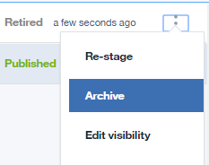
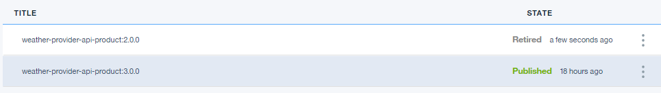

---

copyright:
  years: 2019
lastupdated: "2019-3-15"

subcollection: apiconnect

keywords: IBM Cloud, APIs, lifecycle, catalog, manage, toolkit, develop, dev portal, tutorial

---

{:new_window: target="_blank"}
{:shortdesc: .shortdesc}
{:screen: .screen}
{:codeblock: .codeblock}
{:pre: .pre}

# Archiviazione ed eliminazione dei prodotti API
{: #tut_manage_remove}

**Durata**: 15 minuti  
**Livello di competenza**: Principiante 

## Obiettivo
{: #object_tut_manage_remove}
In questa esercitazione, eliminerai, archivierai e ritirerai un'API.

---
## Prerequisiti
{: #prereq_tut_manage_remove}

1. [Configura la tua istanza {{site.data.keyword.apiconnect_full}}](/docs/services/apiconnect/tutorials?topic=apiconnect-tut_prereq_set_up_apic_instance).

2. Completa la [Esercitazione sulla sostituzione di un prodotto API](/docs/services/apiconnect/tutorials?topic=apiconnect-tut_manage_supercede).

---

## Eliminazione di un prodotto API
{: #delete_tut_manage_remove}

1. Accedi a {{site.data.keyword.Bluemix_short}}: https://cloud.ibm.com.
2. Nel **Dashboard** {{site.data.keyword.Bluemix_notm}}, fai clic su **Cloud Foundary Services**. Avvia il servizio {{site.data.keyword.apiconnect_short}}. 
3. In {{site.data.keyword.apiconnect_short}}, assicurati che il pannello di navigazione sia aperto. Se non lo è, fai clic su **>>** per aprirlo.  

  

4. Fai clic su **Sandbox** per aprire il catalogo Sandbox. **Nota**: potresti dover ritornare al dashboard per visualizzare i cataloghi disponibili. Inoltre, la tua pagina del dashboard potrebbe mostrare i cataloghi come tile invece che come un elenco.

5. Fai clic sulle ellissi verticali nella riga **Weather Provider API 1.0.0**.  

6. Seleziona **Delete from catalog**.  

7. Fai clic su **OK**.  

    Il prodotto scompare dall'elenco dei prodotti nel catalogo. A questo punto non è possibile ripristinarlo.

## Archiviazione di un prodotto API
{: #archive_tut_manage_remove}

1. Fai clic sulle ellissi verticali nella riga **Weather Provider API 2.0.0**.  

2. Seleziona **Retire**.  

3. Fai clic su **OK**.  

4. Fai clic sulle ellissi verticali nella riga **Weather Provider API 2.0.0**.  

5. Seleziona **Archive**.  

6. Fai clic su **OK**.  

    Il prodotto scompare dall'elenco dei prodotti nel catalogo. Non può essere ripristinato.

7. Fai clic sull'icona di visualizzazione dell'elenco.  

8. Controlla **Archived**.  

9. Fai clic sulle ellissi verticali nella riga **Weather Provider API 2.0.0**.  

10. Seleziona **Unarchive**.  

    Lo stato del prodotto viene modificato con Retired.
    

 
 
## Conclusioni
{: #conclusion_tut_manage_remove}

In questa esercitazione, hai completato le seguenti attività:

1. Eliminato un prodotto API
2. Ritirato un prodotto API
3. Archiviato un prodotto API
4. Annullata l'archiviazione di un prodotto API

---

