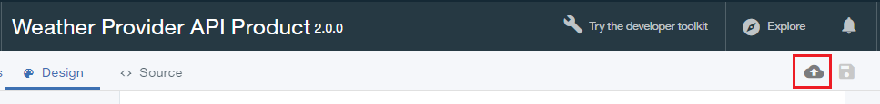
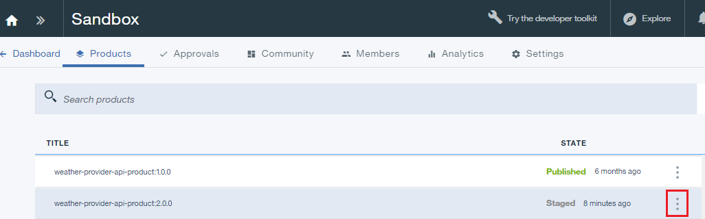
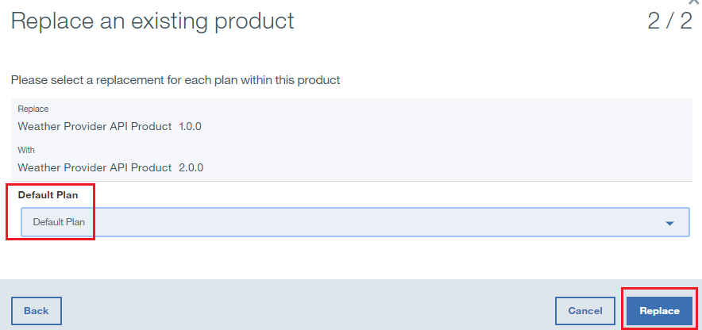

---

copyright:
  years: 2017
lastupdated: "2017-10-19"

---

{:new_window: target="_blank"}
{:shortdesc: .shortdesc}
{:screen: .screen}
{:codeblock: .codeblock}
{:pre: .pre}

# Sostituzione di un prodotto API
**Durata**: 15 minuti  
**Livello di competenza**: Principiante  

## Prerequisiti

1. [Configura la tua istanza {{site.data.keyword.apiconnect_full}}](tut_prereq_set_up_apic_instance.html).

2. Completa una delle seguenti esercitazioni:
 
    - [Importa una specifica OpenAPI2.0 e collegati tramite proxy a un servizio REST esistente](tut_rest_landing.html)
       **o**  
    - [Aggiungi una nuova specifica API e richiama un servizio REST esistente](tut_rest_landing.html).

---
## Obiettivo
In questa esercitazione, aggiornerai un prodotto API esistente sostituendolo con uno nuovo. Quando un prodotto API viene sostituito, le modifiche hanno effetto immediatamente e tutte le sottoscrizioni alle applicazioni vengono aggiornate automaticamente.  

---
## Sostituzione di un prodotto API
{: #repl_api_prod}

1. Accedi a {{site.data.keyword.Bluemix_short}}: [https://console.ng.bluemix.net/login ](https://console.ng.bluemix.net/login){:new_window}.

2. Nel dashboard {{site.data.keyword.Bluemix_short}}, avvia il servizio {{site.data.keyword.apiconnect_short}}.

3. In API Manager, se non hai precedentemente bloccato il riquadro di navigazione della IU fai clic sull'icona **Navigate to** . Viene aperto il pannello di navigazione della IU API Manager. Per bloccare il pannello di navigazione della IU, fai clic sull'icona **Pin menu** .

4. Fai clic su **Drafts** > **APIs**.

5. Nel pannello delle API, fai clic su **Weather Provider API** per aprire l'API proxy REST.  

6. Modifica **Version** con 2.0.0.  

7. Fare clic sull'icona disco per salvare le modifiche all'API.  

8. Fai clic su **All APIs**.  

9. Fai clic su **Products**.  

10.	Seleziona **Weather Provider API Product**.  

11.	Modifica **Version** con 2.0.0. Immetti `Updated API` nel campo **Description**. Fai clic sull'icona disco per salvare le modifiche.   

12.	Fai clic sull'icona **Stage** per caricare la nuova versione. Seleziona il catalogo **Sandbox** se non lo è già.

    **Nota**: è possibile preparare una nuova versione in un catalogo differente, consentendo il controllo agli sviluppatori di poter visualizzare questa versione. Questa capacità può essere utile quando si spostano i prodotti API dallo sviluppo al test per la produzione.

13.	Fai clic su **>>** per aprire il menu di navigazione e seleziona **Dashboard**.  

14.	Fai clic su **Sandbox**.  

15.	Fai clic sulle ellissi verticali nella riga **Weather Provider API Product 2.0.0 Staged**.  

16.	Seleziona **Replace an existing product**.  

17.	Seleziona **Weather Provider API Product 1.0.0** nell'elenco dei prodotti presentato. Fai clic su **Avanti**.  

18.	Seleziona **Default plan**. Fai clic su **Replace**.  

    Come risultato di questa sostituzione, il prodotto API Weather Provider 1.0.0 viene ritirato e viene pubblicato il prodotto API Weather Provider 2.0.0. **Nota**: è possibile modificare il piano associato a questo prodotto durante il processo di sostituzione. Questo è un modo veloce di modificare il piano di un prodotto API.
 

## Cosa hai fatto in questa esercitazione

In questa esercitazione, hai completato le seguenti attività:
1. Aggiornato un prodotto API.
2. Sostituito un prodotto API esistente con uno aggiornato.

---

