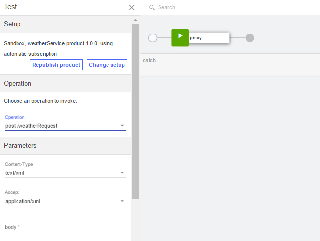

---
copyright:
  years: 2017
lastupdated: "2017-12-15"
---


{:new_window: target="_blank"}
{:shortdesc: .shortdesc}
{:screen: .screen}
{:codeblock: .codeblock}
{:pre: .pre}


# Gestione di un servizio SOAP
**Durata**: 15 minuti
**Livello di competenza**: Principiante

---
## Obiettivo
In questa esercitazione, utilizzerai API Manager per creare un'API SOAP che è un proxy di un servizio meteo basato su SOAP.

## Prerequisiti
- Prima di iniziare, dovrai [configurare la tua istanza {{site.data.keyword.apiconnect_short}}](tut_prereq_set_up_apic_instance.html).
- Prima di iniziare, copia il file di test [weatherprovider.wsdl ](https://raw.githubusercontent.com/IBM-Bluemix-Docs/apiconnect/master/tutorials/weatherprovider.wsdl){:new_window} nel tuo file system locale.
Nota: puoi fare clic su **Raw** e salvare la pagina risultante nel tuo sistema locale come un file `.wsdl`. Come suggerisce il nome, questo servizio SOAP restituisce i dati meteo quando viene fornito un codice postale.

---
## Configurazione di una definizione dell'API SOAP
1. Accedi a {{site.data.keyword.Bluemix_short}}: [https://new-console.ng.bluemix.net/login](https://new-console.ng.bluemix.net/login){:new_window}.

2. Nel **Dashboard** {{site.data.keyword.Bluemix_notm}}, scorri fino a **All Services**.

3. Seleziona **API Connect** per avviare il servizio {{site.data.keyword.apiconnect_short}}. 
  
4. Passa alla pagina delle bozze, se non già lì:  
    a. Nell'interfaccia {{site.data.keyword.apiconnect_short}}, fai clic su >> per aprire il pannello di navigazione.
    b. Fai clic su **Drafts** nel pannello di navigazione.
    c. Vai alla scheda **APIs**.

5. Nella scheda delle API, fai clic su `Add +`.

6. Nel menu a discesa, seleziona **API from a SOAP service**.
  

7. Viene aperta la finestra New API dalla finestra di dialogo WSDL. Fai clic su **Upload File**.
  

8. Seleziona il file `weatherprovider.wsdl` che hai salvato precedentemente.

9. Viene rivisualizzata la finestra New API dalla finestra di dialogo WSDL. Controlla la casella di spunta **weatherService**. Fai clic su **Done**.
  

10. Dopo una corretta importazione, viene visualizzata la vista di progettazione dell'API. Inoltre, puoi visualizzare la definizione OpenAPI nella scheda dell'origine.
   _Nella scheda dell'origine, vedrai che WSDL è incluso nella definizione OpenAPI._
  

11. Scorri fino alla **scheda Security** e fai clic sull'icona di eliminazione per rimuovere `clientIDHeader (API Key)` che è stato generato automaticamente quando hai creato il servizio.
   _Avrai informazioni sulla sicurezza con le chiavi API nella prossima esercitazione._

12. Fai clic sull'icona  per salvare le tue modifiche. Viene visualizzata momentaneamente una notifica di conferma "API Saved".

13. Nella barra del menu con l'icona di salvataggio, la scheda **Design** indica la tua ubicazione presente. Accanto ad essa, trovi la scheda **Source** dove puoi direttamente visualizzare il file Swagger (2.0) che rappresenta la tua API e accanto ad esso trovi la scheda **Assemble** che ti porta a un'interfaccia di trascinamento e rilascio per l'elaborazione dell'API. Fai clic su **Assemble**.
    

## Verifica della definizione dell'API SOAP

1. Nella scheda **Assemble**, fai clic sull'icona **More actions** (tre punti) e seleziona **Generate a default product** dal menu.  
   

2. Accetta le opzioni predefinite nella finestra a comparsa di dialogo **New Product** e seleziona **Create Product**. Viene creato e pubblicato **weatherService product 1.0.0** nel catalogo Sandbox.  
  
 
  _In {{site.data.keyword.apiconnect_short}}, **Products** fornisce un modo per raggruppare le API intese per un utilizzo particolare. I prodotti sono pubblicati in un **Catalog**. Riferimenti: [Glossario {{site.data.keyword.apiconnect_short}}](../apic_glossary.html)_

3. Salva le tue modifiche.  

4. Accanto alla casella di ricerca, fai clic sull'icona di test per verificare il servizio API. Viene visualizzato il menu di configurazione.

5. Dall'elenco dei prodotti, scegli `weatherService product 1.0.0`.  
  

6. Scorri fino alla fine e fai clic su **Next**.

7. Dall'elenco delle operazioni, seleziona `post /weatherRequest`.  
  

8. Scorri verso il basso. Immetti il seguente xml nel campo del corpo. Puoi selezionare e copiare il seguente XML di esempio e fare clic sul campo **body** per attivare il campo e posizionare l'XML di esempio.  
  ```
  <?xml version="1.0" encoding="UTF-8"?>
  <soap:Envelope xmlns:xsi="http://www.w3.org/2001/XMLSchema-instance" xmlns:xsd="http://www.w3.org/2001/XMLSchema" xmlns:soap="http://schemas.xmlsoap.org/soap/envelope/">
   <soap:Body>
  <wdata:WeatherRequest xmlns:wdata="http://www.ibm.com/wdata">
       <zipcode>10504</zipcode>
  </wdata:WeatherRequest>
   </soap:Body>
  </soap:Envelope>
  ```
  {: codeblock}  
  

9. Scorri verso il basso se necessario e fai clic su **Invoke**.
L'API restituisce una risposta **body** formata dal meteo corrente.  
  

## Cosa hai imparato in questa esercitazione
In questa esercitazione, hai completato quanto segue:
1. Configurato una definizione API SOAP
2. Verificato la tua definizione API
3. Ricevuto una risposta **body** dall'endpoint dell'API meteo che indica il risultato della tua richiesta.

---

## Passo successivo

[Esponi il tuo servizio come un'API REST](tut_expose_soap_service.html) o proteggi la tua API utilizzando [limitazione della frequenza](tut_rate_limit.html), [segreto e ID client](tut_secure_landing.html) o [proteggi tramite OAuth 2.0](tut_secure_oauth_2.html).

Create > **Manage** > Secure > Socialize > Analyze
