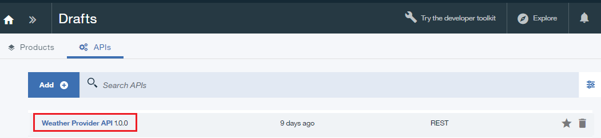

---

copyright:
  years: 2017
lastupdated: "2017-10-10"

---

{:new_window: target="_blank"}
{:shortdesc: .shortdesc}
{:screen: .screen}
{:codeblock: .codeblock}
{:pre: .pre}

# Sostituzione dei prodotto API
**Durata**: 15 minuti  
**Livello di competenza**: Principiante  

## Prerequisiti

1. [Configura la tua istanza {{site.data.keyword.apiconnect_full}}](tut_prereq_set_up_apic_instance.html).

2. Completa la [Esercitazione sulla sostituzione di un prodotto API](tut_manage_replace.html). 

---
## Obiettivo
In questa esercitazione, rimpiazzerai un prodotto API esistente con uno nuovo. 

---
## Sostituzione di un prodotto API
1. Accedi a {{site.data.keyword.Bluemix_short}}: [https://console.ng.bluemix.net/login ](https://console.ng.bluemix.net/login){:new_window}.

2. Nel dashboard {{site.data.keyword.Bluemix_short}}, avvia il servizio {{site.data.keyword.apiconnect_short}}.

3. In API Manager, se non hai precedentemente bloccato il riquadro di navigazione della IU fai clic sull'icona **Navigate to** . Viene aperto il pannello di navigazione della IU API Manager. Per bloccare il pannello di navigazione della IU, fai clic sull'icona **Pin menu** .

4. Fai clic su **Sandbox** per aprire il catalogo Sandbox. **Nota**: la tua schermata potrebbe visualizzare i tile invece di un elenco di cataloghi.

4. Fai clic su **Drafts** > **APIs**.

5. Nel pannello delle API, fai clic su **Weather Provider API** per aprire l'API proxy REST.  

6. Modifica **Version** con 3.0.0. 

7. Fare clic sull'icona disco per salvare le modifiche all'API.  

8. Fai clic su **All APIs**.  

9. Fai clic su **Products**.  

10.	Seleziona **Weather Provider API Product 2.0.0**.  

11.	Modifica **Version** con 3.0.0. Fai clic sull'icona disco per salvare le modifiche. Fai clic sull'icona **Stage**.  

12.	Fai clic su **>>** per aprire il pannello di navigazione e seleziona **Dashboard**.  

13.	Fai clic su **Sandbox**.

14.	Fai clic su **Community**.  

15.	Fai clic su **Subscriptions**.  

16.	Prendi nota delle sottoscrizioni all'applicazione a Weather Provider API Product 2.0.0. Fai clic su **Products**.
  

17.	Fai clic sulle ellissi verticali nella riga **Weather Provider API Product 3.0.0 Staged**.  

18.	Seleziona **Supersede an existing product**.  

19.	Seleziona **Weather Provider API Product 2.0.0** nell'elenco dei prodotti presentato. Fai clic su **Avanti**.  

20.	Seleziona **Default plan**. Fai clic su **Supercede**.  

    Come risultato di questa sostituzione, il prodotto API Weather Provider 2.0.0 diventa obsoleto e viene pubblicato il prodotto API Weather Provider 3.0.0.  
 
 
21.	Fai clic su **Community >> Subscriptions**.  

 
22.	Fai clic sulle ellissi verticali nella riga **Weather Provider API Product 2.0.0**. Seleziona **Manage**.  
 

23.	Seleziona **Default plan** nel prodotto API Weather Provider 3.0.0 . Fai clic su **Migrate**.  

    Come risultato di questa migrazione, il prodotto API Weather Provider 2.0.0 viene migrato al prodotto API Weather Provider 3.0.0.  
 
 

 
## Cosa hai fatto in questa esercitazione
In questa esercitazione, hai completato le seguenti attività:

1. Aggiornato un prodotto API.
2. Sostituito un prodotto API esistente con uno aggiornato.
3. Migrato la sottoscrizione di un prodotto API esistente al prodotto API aggiornato.

---

