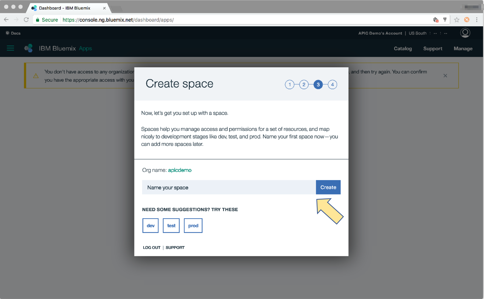
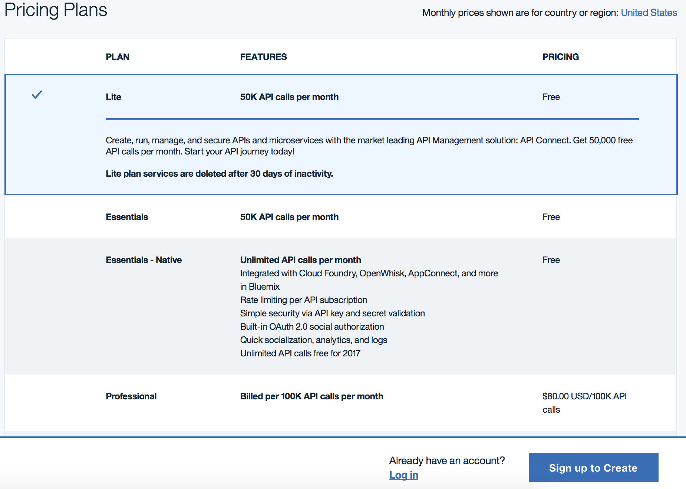

---

copyright:
  years: 2019
lastupdated: "2019-3-14"

keywords: IBM Cloud, APIs, lifecycle, catalog, manage, toolkit, develop, dev portal, tutorials

subcollection: apiconnect

---

{:new_window: target="blank"}
{:shortdesc: .shortdesc}
{:screen: .screen}
{:codeblock: .codeblock}
{:pre: .pre}

# Configurazione di un'istanza API Connect
{: #tut_prereq_set_up_apic_instance}

**Durata**: 15 minuti  
**Livello di competenza**: Principiante  

## Prerequisiti
{: #prereq_tut_prereq_set_up_apic_instance}

1. Un ID IBM
2. Un account {{site.data.keyword.Bluemix_short}}
3. Un'istanza {{site.data.keyword.apiconnect_full}} con almeno un piano _Lite_

<table>
  <tr><td><b>ID IBM</b>: utilizzato per accedere a tutte le applicazioni, community, supporto ed altro di IBM
     
    <b>{{site.data.keyword.Bluemix_notm}}</b>: la piattaforma cloud di IBM che ospita {{site.data.keyword.apiconnect_short}} con le altre applicazioni e servizi 
    <b>{{site.data.keyword.apiconnect_short}} Lite</b>: una versione gratuita di {{site.data.keyword.apiconnect_short}} ospitato in {{site.data.keyword.Bluemix_notm}}</td></tr>
  </table>  

---

1. Registra il tuo ID IBM Cloud al seguente URL: [https://cloud.ibm.com/registration/ ](https://cloud.ibm.com/registration/){: #new_window}.

	Hai già un ID IBM? Salta la registrazione e crea soltanto il tuo account {{site.data.keyword.Bluemix_short}} gratuito al seguente URL: [https://cloud.ibm.com/ ](https://cloud.ibm.com/){: #new_window}.  

2. Una volta che disponi del tuo ID IBM e dell'account {{site.data.keyword.Bluemix_notm}}, crea la tua istanza {{site.data.keyword.apiconnect_short}}.  
  a. Accedi a {{site.data.keyword.Bluemix_notm}}: [https://cloud.ibm.com/login ](https://cloud.ibm.com/login){: #new_window}.  
    
  b. Crea la tua _organizzazione_ in {{site.data.keyword.Bluemix_notm}}. Ti sarà richiesto di farlo la prima volta che accedi.  
  
  c. Crea il tuo _spazio_.  
  
  d. Vai a [https://console.ng.bluemix.net/catalog/services/api-connect ](https://console.ng.bluemix.net/catalog/services/api-connect){: #new_window}.  
    
  e. Seleziona il piano dei prezzi _Lite_ (gratuito) e fai clic su **Create** per iniziare.  
    
