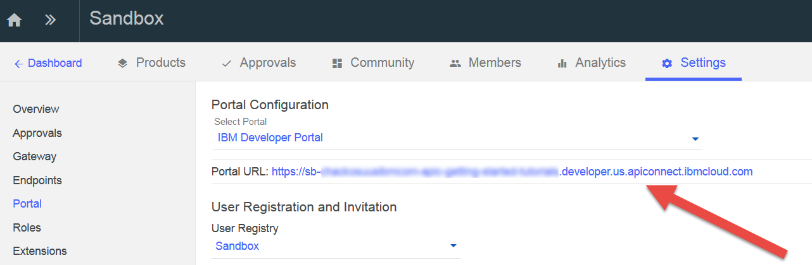
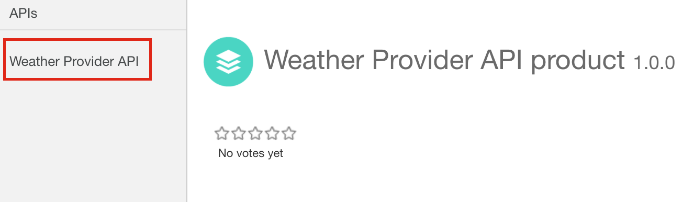

---
copyright:
  years: 2017
lastupdated: "2017-09-30"
---

{:new_window: target="blank"}
{:shortdesc: .shortdesc}
{:screen: .screen}
{:codeblock: .codeblock}
{:pre: .pre}

# Impostazione dei limiti di frequenza 
**Durata**: 15 minuti  
**Livello di competenza**: Principiante  

## Obiettivo
Questa esercitazione ti illustra come limitare la frequenza delle tue API. Configurando i limiti di frequenza puoi gestire il traffico di rete delle tue API
e per operazioni specifiche al loro interno. Un limite di frequenza è il numero massimo di chiamate che desideri consentire in un particolare intervallo di tempo.

In {{site.data.keyword.apiconnect_full}}, *Products* fornisce un modo di raggruppare le API in un pacchetto per un caso di utilizzo o per dei destinatari particolari. I prodotti inoltre contengono i *Piani*, che descrivono i termini che sei disposto ad offrire ai tuoi clienti dell'API. Più precisamente, i piani definiscono le regole associate alle sottoscrizioni dell'API: i limiti di frequenza dell'API e se la sottoscrizione deve essere approvata.

Quando uno sviluppatore dell'applicazione desidera utilizzare le tue API, selezionerà un prodotto che contiene l'API che desidera utilizzare e si sottoscriverà a uno dei piani del prodotto, in base a quale piano soddisfi i suoi bisogni di utilizzo.

In questa esercitazione, farai quanto segue:
1. Creare un nuovo piano limitato per frequenza in un prodotto esistente.
2. Vedere cosa succede quando un'applicazione supera i limiti di frequenza consentiti.

## Prerequisiti
Devi aver già creato un'API in {{site.data.keyword.apiconnect_short}} e averla protetta con almeno una chiave API. Nelle seguenti istruzioni, il nostro punto di partenza è il file di esempio [Weather Provider API ](https://raw.githubusercontent.com/ibm-apiconnect/getting-started/master/toolkit/1a-import/weather-provider-api_1.0.0.yaml){:new_window} protetto utilizzando [segreto e ID client](tut_secure_landing.html).

Completa le seguenti esercitazioni prima di iniziare questa esercitazione:
- [Importa la tua specifica API e collegati tramite proxy a un servizio REST esistente](tut_rest_landing.html).
- [Proteggi la tua API con un segreto e un ID client](tut_secure_landing.html).

---
## Avvio di API Connect

1. Accedi a {{site.data.keyword.Bluemix_short}}: [https://console.ng.bluemix.net/login ](https://console.ng.bluemix.net/login){:new_window}.
2. Una volta collegato a {{site.data.keyword.Bluemix_short}}, scorri fino a **All Services** e fai clic su **API Connect**.
3. Fai clic su **API Connect** per avviare il servizio {{site.data.keyword.apiconnect_short}}.

## Esplorazione del piano predefinito
1. Nel pannello di navigazione {{site.data.keyword.apiconnect_short}}, seleziona **Drafts**. (Se il pannello di navigazione non è aperto, fai clic su **>>** per aprirlo.)
2. Seleziona **Products tab** per visualizzare elencato il prodotto API Weather Provider.

         

3. Fai clic sul link del prodotto e la vista di progettazione aprirà l'elenco delle informazioni sul prodotto.
4. Scorri fino alla sezione dei piani della pagina. È stato creato un piano predefinito quando hai generato questo prodotto. 

       
5. Espandi i dettagli del piano predefinito. Nota il limite di frequenza (100 chiamate / 1 ora) e l'elenco delle API, che può essere espanso per mostrare operazioni specifiche.

    

   
## Creazione di un nuovo piano limitato per frequenza

Ora che hai visto a cosa assomiglia un piano predefinito, creiamo un nuovo piano con limiti di frequenza più restrittivi, per dimostrare cosa succede quando un'API supera i limiti del piano. 
1. Fai clic sul pulsante per aggiungere un nuovo piano.
 
     
    
    È stato creato un nuovo piano per te e per impostazione predefinita, è configurato per consentire l'utilizzo illimitato (che significa, nessun limite di frequenza). Forniamogli un nome più significativo e imposta un limite più restrittivo.
2. Fai clic sul nuovo piano (`New Plan 1`) per espanderne i dettagli.
3. Fai clic sul campo del titolo e impostalo su: `Demo`.
4. Fai clic sul campo del nome e impostalo su `demo-plan`.
5. Fai clic su + per aggiungere un nuovo limite di frequenza.
6. Ridenomina il nuovo limite di frequenza con `demo-rate-limit` e assicurati che sia impostato su `1 / 1 Minute`.
7. Controlla la casella di spunta `Enforce hard limit`. (Quando questa impostazione è abilitata, un'applicazione riceverà un errore se richiama un'API oltre il valore consentito dal limite del piano sottoscritto).
8. Accetta tutte le altre impostazioni predefinite e salva il prodotto.

    

## Preparazione e pubblicazione di un prodotto aggiornato nel catalogo Sandbox

Nei precedenti esempi, potresti aver pubblicato il tuo prodotto utilizzando lo strumento di test, che richiama la tua API con le credenziali dell'applicazione di test pre-fornite. Tuttavia, questa applicazione di test non è soggetta ai limiti di frequenza, per cui dovremo creare una nuova applicazione qui per scopi di limite di frequenza. Consulta [IBM Knowledge Center content for API Connect ](https://www.ibm.com/support/knowledgecenter/SSFS6T/com.ibm.apic.toolkit.doc/tapim_create_product.html){:new_window} per ulteriori informazioni.

1. Fai clic sull'icona di pubblicazione per *preparare* il prodotto nel catalogo **Sandbox**. Questa azione aggiunge le tue modifiche del prodotto della bozza al catalogo selezionato. Abbiamo bisogno di *pubblicare* le modifiche del prodotto successivamente, per renderle disponibili ai clienti tramite il portale sviluppatori.
    
2. Fai clic sul pulsante >> per aprire il menu di navigazione.
    
3. Seleziona il dashboard, quindi apri il catalogo **Sandbox**. Il prodotto API Weather Provider viene elencato come **Staged**.
4. Fai clic sulle ellissi e seleziona **Publish** dal menu.
    
5. Accetta le impostazioni di visibilità predefinite e fai clic sul pulsante **Publish**. Dopo aver pubblicato il prodotto e averlo reso visibile nel portale sviluppatori, gli sviluppatori dell'applicazione possono sottoscriversi ai piani disponibili.

## Registrazione di una nuova applicazione (cliente) nel portale sviluppatori
Gli sviluppatori dell'applicazione rilevano e utilizzano le tue API tramite il portale sviluppatori. Per ulteriori informazioni sul portale sviluppatori, controlla questo argomento [IBM Knowledge Center ](https://www.ibm.com/support/knowledgecenter/SSFS6T/com.ibm.apic.devportal.doc/tapim_tutorial_using_ADP.html){:new_window}.

Se questa è la prima volta che utilizzi il portale sviluppatori, dovrai eseguire il provisioning di un portale sviluppatori per il tuo catalogo Sandbox. L'account a cui hai eseguito l'accesso quando hai eseguito il provisioning del portale sarà l'account di gestione di tale portale. Quindi, per poter esplorare le API di test, dovrai creare e accedere con un nuovo account sviluppatore (utilizzando un indirizzo email diverso) da quello dell'account di gestione.

Le seguenti istruzioni ti guideranno attraverso questi passi.

1. Avvia il portale sviluppatori. Se non conosci l'URL, puoi trovarlo nella scheda delle impostazioni del catalogo Sandbox.

   
    - Per eseguire il provisioning del portale sviluppatori per la prima volta, seleziona **IBM Developer Portal** dall'elenco a discesa.
    - Questa operazione potrebbe richiedere fino a un'ora per completarsi. Come il portale sviluppatori Sandbox è pronto, riceverai un'email
con un link al tuo nuovo sito del portale sviluppatori. Il link è un link a utilizzo singolo per l'account amministratore. 
2. Accedi al portale utilizzando le tue credenziali di sviluppatore dell'applicazione (**non** il tuo ID IBM). ***(Crea un nuovo account sviluppatore se necessario, utilizzando un indirizzo differente da quello del tuo ID IBM.)***
3. Fai clic sul link **Apps** nella barra degli strumenti e sul pulsante **Create new App**.

   
4. Fornisci all'applicazione un titolo e fai clic su **Submit**.

   
5. Salva il segreto e l'ID client visualizzati. Sarà l'unica volta in cui è possibile copiare il tuo segreto client!

   

## Sottoscrizione a un prodotto API

1. Fai clic sul link **API Products** nella barra degli strumenti. Il prodotto API Weather Provider viene elencato!  

   
2. Fai clic sul link per visualizzare i dettagli e le opzioni. Dovresti vedere due piani disponibili: il piano predefinito originale e il tuo nuovo piano demo. (Se visualizzi solo un piano, ritorna a API Connect e assicurati che le modifiche al tuo piano siano state salvate, preparate e pubblicate nel catalogo Sandbox.) 

   
3. Fai clic su **Subscribe** al piano demo e seleziona l'applicazione che hai appena registrato. Ora, la tua applicazione può richiamare le API associate a questo piano, a una frequenza di *una* chiamata API ogni minuto. 

Siamo pronti a verificare questo comportamento e a osservare cosa succede quando l'applicazione supera la frequenza specificata.

## Richiamo di un'API limitata per frequenza

1. Nella pagina del prodotto dell'API Weather Provider nel portale sviluppatori, fai clic sul link dell'API.

   
2. La pagina si aggiornerà per visualizzare i dettagli sull'API, le sue operazioni e per fornire un'ubicazione per verificarla. (Così è come i tuoi clienti API rileveranno e verificheranno la tua API.) Nota che il pannello di test scuro e scorri fino alla prima sezione **Try this operation**.

3. Per verificare l'operazione `GET /current`, immetti il segreto client della tua applicazione e un codice postale valido. Fai clic sul pulsante **Call operation**. Dovresti ricevere una risposta `200 OK`, con i dati sul meteo corrente in tale codice postale, 

   

   

4. Ora, prima che passi un minuto, fai nuovamente clic sul pulsante **Call operation**, con un codice postale differente di tua scelta. Questa volta, dovresti ricevere un risposta `429 Too Many Requests`.

   

5. Per convalidare le reimpostazioni del limite di frequenza, attendi un minuto, riprova e conferma di aver ricevuto una risposta valida.

## Conclusioni

Congratulazioni! Hai correttamente creato un piano di limitazione della frequenza, lo hai associato alle tue API sicure e verificato che la tua API risponda solo alle richieste all'interno dei parametri che hai specificato.

---

## Passo successivo

Inizia a socializzare con la tua API [configurando un portale sviluppatori](tut_config_dev_portal.html).

Create > Manage > **Secure** > Socialize > Analyze
