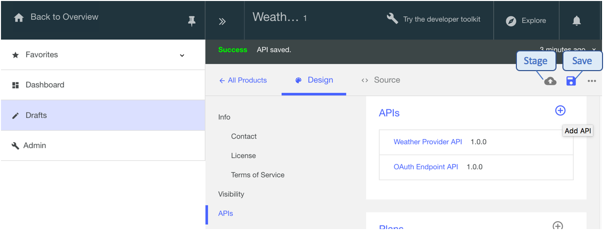

---
copyright:
  years: 2017
lastupdated: "2017-12-13"
---

{:new_window: target="blank"}
{:shortdesc: .shortdesc}
{:screen: .screen}
{:codeblock: .codeblock}
{:pre: .pre}

# Proteggi la tua API con OAuth a due fasi

Durata: 10 minuti  
Livello di competenza: Principiante

## Obiettivo

Questa esercitazione ti guiderà su come proteggere la tua API con un flusso OAuth 2.0 a due fasi. In questo flusso dell'applicazione, il client OAuth inizia una richiesta con il server di autorizzazione e ha ricevuto un token di accesso. Il client OAuth può quindi utilizzare il token per accedere alle risorse protette tramite la tua API.

## Prerequisiti

Prima di iniziare, devi aver completato la seguente esercitazione.  
- [Proteggi un'API con le chiavi segreto e ID client con {{site.data.keyword.Bluemix}}](tut_secure_id_secret_bm.html)
o
- [Proteggi un'API con le chiavi segreto e ID client con il toolkit](tut_secure_id_secret_tk.html)

Nota: questa esercitazione mostra i passi e le schermate per eseguire l'attività all'interno della IU {{site.data.keyword.Bluemix}}. Puoi anche completare la stessa procedura utilizzando la riga di comando. Puoi visualizzare tale procedura nel [IBM Knowledge Center](https://www.ibm.com/support/knowledgecenter/SSMNED_5.0.0/com.ibm.apic.toolkit.doc/tutorial_apionprem_security_OAuth_v506.html). 

## Procedura

1. Crea un'API provider OAuth e seleziona il tuo schema OAuth.  
	a. Apri **Drafts**, seleziona **APIs** e fai clic su **Add** > **OAuth 2.0 Provider API**.  
    
	b. Denominala "OAuth Endpoint API". Il nome e il percorso di base dovrebbe venire popolati automaticamente.   
	c. Seleziona **Create API**.  
	d. Nell'API endpoint OAuth appena creata, passa al pannello **OAuth 2** (o scorri fino ad esso) e seleziona "Confidential" come tipo di client.  
	e. In Scopes, ridenomina _scope1_ con _view_current_. Elimina _scope2_ e _scope3_.  
	f. In **Grants**, deseleziona **Implicit**, **Password** e **Access Code**. Lascia **Application** selezionato.  
	  
	g. Salva la tua API.  

2. Aggiorna la definizione di sicurezza della tua API Weather Provider per includere OAuth.  
	a. Passa a _Weather Provider API_. (Torna alle API e seleziona _Weather Provider API_.)  
	b. Nelle definizioni di sicurezza, aggiungi una nuova definizione per OAuth. Denominala "OAuth definition".  
	c. Nel campo del flusso, seleziona **Application**.  
	d. Immetti l'URL del token _<your base URL>/oauth-endpoint-api/oauth2/token_.  
	e. Aggiungi un nuovo ambito: view_current.  
	
	f. In **Security**, seleziona **OAuth Definition** e **view_current** e lascia il segreto e l'ID client selezionati.  
	
	g. Fai clic su Save.  
	h. Ritorna a **Drafts** e seleziona **Products**. Aggiungi l'API endpoint OAuth al tuo prodotto Weather Provider.  
	i. Salva il prodotto e preparalo nel tuo Sandbox.  
	

3. Verifica la tua configurazione di sicurezza di OAuth.  
	a. Pubblica il tuo prodotto aggiornato nel sandbox. Fai clic su **Dashboard > Sandbox** e pubblica il tuo prodotto.  
	  
	b. Fai clic su **Explore > Sandbox**.  
      
	c. In **Weather Provider API**, fai clic su **GET /current** dall'elenco delle operazioni.  
	d. Nel pannello di destra, controlla che il segreto e l'ID client siano già popolati.  
	e. Nella sezione **Parameters**, immetti un codice postale.  
      
	f. Nella sezione **Authorization**, fai clic su **Authorize** per richiamare il tuo token di accesso.  
	g. Dopo aver ricevuto il tuo token di accesso, fai clic su **Call operation** per completare la tua verifica.  
      

4. Controlla che la richiesta includa il token di accesso, l'ID e il segreto client. Per passare solo il token di accesso alla richiesta, dovrai rimuovere il segreto e l'ID client dai requisiti di sicurezza dell'API Weather Provider.  
    

5. Salva la tua API Weather Provider. Quindi preparala e pubblicala nel Sandbox. Dallo strumento Explore, esegui la stessa verifica come effettuato precedentemente.  
    
    
## Conclusioni
In questa esercitazione, hai imparato come creare un'API provider OAuth, aggiornare la definizione di sicurezza di un'API per includere OAuth e verificato la tua configurazione di sicurezza.

---

## Passo successivo

Inizia a socializzare con la tua API [configurando un portale sviluppatori](tut_config_dev_portal.html).

Create > Manage > **Secure** > Socialize > Analyze
