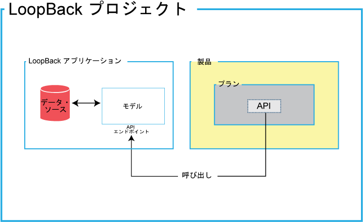
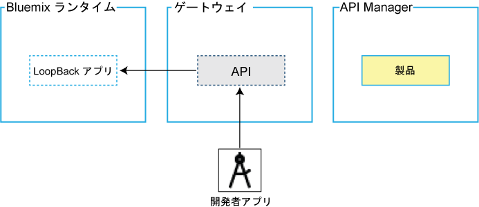
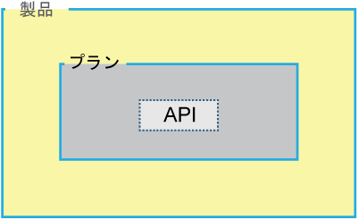

---

copyright:
  years: 2017
lastupdated: "2017-07-18"

---

{:new_window: target="_blank"}
{:shortdesc: .shortdesc}
{:screen: .screen}
{:codeblock: .codeblock}
{:pre: .pre}

# IBM API Connect について

{{site.data.keyword.apiconnect_full}} サービスを使用すると、Node.js および Java のランタイムに基づいて、API およびマイクロサービスを迅速に作成できます。
作成後、アプリケーション開発者と API を共有しながら、各種レベルのセキュリティー、可視性、およびレート制限を設定して、ビジネス・レベルの制御で API を管理できます。さらに、{{site.data.keyword.apiconnect_short}} サービスには、構造化されたフィルター検索を使用した詳細な分析を通じてさまざまな洞察を提供し、ビジネスの転換と拡張を実現するツールも用意されています。

<object height="315" type="application/x-shockwave-flash" width="560"
data="https://www.youtube.com/v/lmxyiNMER5Y?version=3&amp;hl=en_US">
<desc>このビデオは、{{site.data.keyword.apiconnect_short}} サービスの概要を紹介しています。</desc>
<param name="movie" value="https://www.youtube.com/v/lmxyiNMER5Y?version=3&amp;hl=en_US"/>
<param name="allowFullScreen" value="true"/>
<param name="allowscriptaccess" value="always"/>
<param name="scale" value="noScale"/>
</object>

## API 作成

{{site.data.keyword.apiconnect_short}} を使用すると、Swagger 定義から API をインポートすることができます。あるいは、プロキシー URL を使用するか、HTTP データ・ソースからデータをアセンブルすることで、API を作成することもできます。さらに、{{site.data.keyword.apiconnect_short}} では、オフラインでの API の作成とテストもサポートしています。デベロッパーズ・ツールキットには Micro Gateway が組み込まれています。これにより、バックエンドのデータ・ソース (SQL データベースなど) への接続が可能になり、作成、読み取り、更新、および削除ベースの操作を実行できるようになります。

API は、デベロッパーズ・ツールキット内に作成されます。デベロッパーズ・ツールキットには、CLI と API Designer グラフィカル・ユーザー・インターフェースが含まれています。デベロッパーズ・ツールキットにアクセスするには、NPM からダウンロードしてインストールする必要があります。ツールキットのインストール時には、まず LoopBack プロジェクトを作成することから始めます。以下の図は、LoopBack プロジェクトの内容を示しています。

- **LoopBack プロジェクト**: LoopBack プロジェクトには、LoopBack アプリケーションと API 製品が含まれています。

- **LoopBack アプリケーション**: Loopback アプリケーション内に API エンドポイントがあり、データ・ソース、ビジネス資産、またはクラウド・サービスへのアクセスを提供します。

- **製品**: 製品は、API の公開を可能にする単位です。製品にはプランが含まれ、プランには API が含まれており、API が呼び出されると API エンドポイントを起動します。

以下の図は、デベロッパーズ・ツールキットの CLI または UI から公開された後の、LoopBack アプリケーション、API、および製品のデプロイ先の場所を示しています。

- **{{site.data.keyword.Bluemix_short}} ランタイム**:
LoopBack アプリケーションは、選択した {{site.data.keyword.Bluemix_short}} ランタイムにデプロイされます。

- **ゲートウェイ**: API は、ゲートウェイにデプロイされます。

**API Manager**: 製品は API Manager にデプロイされ、そこで製品の使用方法を指定できます。

API の作成に必要な作業について詳しくは、[API の作成](creating_apis.html)を参照してください。

## API 管理の概要

製品のステージングと公開が完了した後、API Manager を開いて、セキュリティー、レート制限、およびポリシーを管理し、その後、開発者ポータルに製品を公開することができます。

以下の図に表示されているように、製品にはプランが含まれ、プランには API が含まれています。

### プラン

お客様が API を使用できるようにするには、API をプランに組み込む必要があります。プランは、さまざまなオファリングを差別化するために使用されます。プランは API を共有できますが、サブスクリプションの承認が必要かどうかは、プラン自体で決まります。
また、これらのプランを使用してレート制限を適用できます。あるいは、プランの API 内でプランのレート制限をオーバーライドする操作を使用してレート制限を適用することもできます。

### 製品

プランと API は、製品内にまとめられます。製品を介して、API およびプランの可用性と可視性を管理できます。製品の作成、編集、およびステージングを行うには、API Designer を使用します。製品のライフサイクルを管理するには、API Manager を使用します。

以下の図は、製品、プラン、および API の相互関係を示しています。
プランは、1 つの製品のみに属していること、同じ製品内の別のプランに対する異なる API を保持できること、任意の製品のプランと API を共有できることに注意してください。製品、プラン、API の階層を示す図。

プランは製品内でのみ作成でき、その後、これらの製品はカタログ内で公開されます。
これにより、ライフサイクル管理者は、API Manager を使用して、API とプランの可用性と可視性を制御できるようになります。お客様は、開発者ポータルを使用して、API Manager で指定された、お客様が使用可能なプランの 1 つをサブスクライブすることができます。ユーザーは、特定の製品から 1 つのプランのみサブスクライブできます。単一の製品内の複数のプランは、類似の目的を満たすことができるが、パフォーマンスのレベルは異なる場合に役立ちます。例えば、単一の API が使用可能な「デモ・プラン」と、複数の API が使用可能な「フルプラン」を定義するというようなことが可能です。

各種プランは、お客様がどの API を使用できるかを制御するだけでなく、レート制限を実装するためにも使用できます。レート制限は、あるプラン全体でのデフォルトのレートとして実装できます。また、そのプラン内の API の特定の操作に対して実装し、それらをプランのレート制限から除外することもできます。それぞれのプランで、異なるレート制限 (操作ごとと包括制限の両方) を定義できます。これは、お客様に異なるサービス・レベルを提供するために役立ちます。例えば、「デモ・プラン」には毎分 10 回の呼び出しのレート制限を適用し、「フルプラン」には毎分 1000 回の呼び出しまで許可することができます。

**注:** プラン・レベルでレート制限を適用すると、そのプラン内の各操作に適用されるデフォルトのレート制限が作成されます。特定の操作に特定のレート制限を設定する必要がある場合は、それらを操作自体の中で設定する必要あります。この設定はプラン・レベルでの設定をオーバーライドします。

また、IBM API Connect は、複数バージョンの製品の実装をサポートしています。バージョン番号を選択して、それらを製品およびプランの開発を支援するために使用できます。

**注:** 製品のバージョンは、関連するプランに含まれているどの API のバージョンとも異なります。プラン自体には固有のバージョンがなく、その親である製品のバージョンが使用されます。

API の管理に必要な作業について詳しくは、[API の管理](managing_apis.html)を参照してください。

### カタログ

製品がアプリケーション開発者から使用可能になるためには、カタログに掲載した上で、さまざまな開発者組織に向けて公開する必要があります。
{{site.data.keyword.apiconnect_short}} では、複数のカタログを作成できます。
カタログは、製品と API を開発者組織に提供する前にテストのために分離する場合に役に立ちます。

カタログはステージング・ターゲットであり、ゲートウェイと開発者ポータルの論理区画として動作します。
API 呼び出しと開発者ポータルの URL は、カタログごとに固有です。
典型的な構成の場合、API プロバイダーの組織では、開発中の API をテストするための開発カタログと、フル使用の準備ができた API ホスティング用の実動カタログが使用されます。
一般的なアプローチは、1 つの開発カタログといくつかのテスト・カタログによる開発クラウドと、実動クラウド (独自のテスト・カタログが含まれる場合がある) を設けることです。

#### カタログの設定

カタログには、以下の設定を適用できます。

- **開発**: デフォルトで、開発カタログが提供されます。開発カタログは、テスト用としてのみ使用しなければなりません。
開発カタログでは、ステージングと公開のアクションが強制適用されます。
つまり、既に公開されている製品をもう一度公開すると、警告なしで上書きされます。
競合が見つかった場合は、システムによって自動的に解決されます。非公開にするアクションは自動的に実行されます。
開発カタログでテスト・ツールを使用するときには、テストする製品がすべて強制され、操作が開発者ポータル上で使用されている場合でも、ステージング済み製品と公開済みの製品を上書きします。
開発カタログから作成された開発者ポータルも同じ方法で、つまり実動利用ではなく、テスト目的のみで使用される必要があります。

- **自動サブスクリプション**: カタログの自動サブスクリプションを有効にすると、API Manager ユーザー・インターフェースでの API のテストが容易になります。
これは、カタログ内のすべてのプランを自動的にサブスクライブするアプリケーション・テストが、事前に指定したクライアント ID とクライアント秘密鍵を使用して実行されるため、テスト時にプランやアプリケーションを指定する必要がなくなります。テスト・アプリケーションにはレート制限が適用されません。
自動サブスクリプションは、開発カタログの場合のみ使用可能です。

- **デフォルト**: カタログのうちの 1 つをデフォルト・カタログとして設定することができます。その後、そのカタログに公開される API に対する呼び出しで、カタログ名が含まれない短縮形の URL を使用できます。

開発者ポータルの使用方法について詳しくは、[Discovering and using APIs](https://www.ibm.com/support/knowledgecenter/en/SSFS6T/com.ibm.apic.devportal.doc/capim_devportal_overview.dita) を参照してください。

### シンジケーション

{{site.data.keyword.apiconnect_full}} シンジケーション・フィーチャーにより、カタログをパーティション化して複数のスペースにすることができます。
各スペースは、それぞれ異なる API プロバイダー開発チームによって使用されます。
それぞれには、関連するチームがそのスペースに公開する API に特に関係する管理機能の独自セットがあり、チームごとに独立してそれぞれの API を管理することが可能です。

スペースを有効にしたカタログに API を掲載または公開する際、掲載または公開先となるカタログ内のスペースを指定します。
しかし、そのカタログのために開発者ポータルにアクセスするアプリケーション開発者にとっては、カタログのスペース・パーティション化は認識されず、API は調整済みオファリングとして見えます。
各スペースにはそれぞれ独自のプロダクト・ライフサイクル・マネジメント、サブスクリプション承認、分析データがあります。
スペース固有のアクセス制御を使用することにより、各スペースへのユーザー・アクセスを制限します。
例えば、Flights チームの開発者は、Flights スペースにのみ API を掲載できるようにするなどです。

**注:** デフォルトでは、カタログでスペースは無効になっています。スペースを有効にするには、カタログの設定値に変更を加えます。

カタログのパーティション化については、[カタログのパーティション化](create_catalog.html#apic_spaces)を参照してください。
