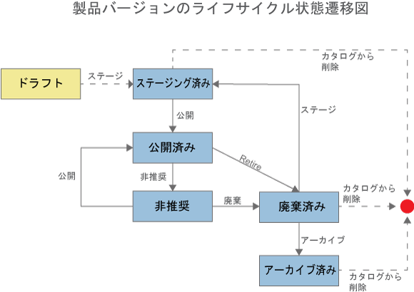

---
copyright:
  years: 2017
lastupdated: "2017-09-25"
---

{:new_window: target="blank"}
{:shortdesc: .shortdesc}
{:screen: .screen}
{:codeblock: .codeblock}
{:pre: .pre}

# 製品の管理

製品を管理する方法についての詳細は、IBM&reg; Knowledge Center の資料 [製品の管理 ](http://www.ibm.com/support/knowledgecenter/SSFS6T/com.ibm.apic.apionprem.doc/task_product_management.html){:new_window} を参照してください。

## 製品のライフサイクル
{: #prod_lifecycle}

製品のバージョンを管理する場合、製品のバージョンが一連のライフサイクル状態を遷移していくようにします。最初に、ドラフト製品バージョンを環境にステージングします。次に、製品バージョンを公開して、アプリケーション開発者が利用できるようにします。最後に、廃棄とアーカイブを行います。以下の表と図は、製品バージョンのさまざまなライフサイクル状態について説明しています。

<table summary="" id="apic_004__table_lym_rxj_gv" class="defaultstyle"><caption class="style-scope doc-content">表 1. API Management 製品のライフサイクル状態</caption>
<thead class="style-scope doc-content">
<tr class="style-scope doc-content doc-tr-even">
<th style="width: 11.25%" id="d3569e1968" class="thleft thbot style-scope doc-content">状態</th>
<th style="width: 88.75%" id="d3569e1970" class="thleft thbot style-scope doc-content">説明</th>
</tr>
</thead>
<tbody class="style-scope doc-content">
<tr class="style-scope doc-content doc-tr-odd">
<td style="width: 11.25%" headers="d3569e1968 " class="style-scope doc-content">ドラフト
</td>
<td style="width: 88.75%" headers="d3569e1970 " class="style-scope doc-content">製品はデプロイされておらず、API Connect カタログにも関連付けられていません。</td>
</tr>
<tr class="style-scope doc-content doc-tr-even">
<td style="width: 11.25%" headers="d3569e1968 " class="style-scope doc-content">ステージング済み</td>
<td style="width: 88.75%" headers="d3569e1970 " class="style-scope doc-content">製品バージョンの不変のコピーがターゲット環境にデプロイされます。「ステージング済み」は、ドラフト製品からステージングした初期状態です。ステージング済みの状態にある製品は、どの開発者もまだ表示もサブスクライブもできません。</td>
</tr>
<tr class="style-scope doc-content doc-tr-odd">
<td style="width: 11.25%" headers="d3569e1968 " class="style-scope doc-content">公開済み</td>
<td style="width: 88.75%" headers="d3569e1970 " class="style-scope doc-content">この製品バージョンは、ターゲットとなる開発者やコミュニティーで表示およびサブスクライブすることができます。</td>
</tr>
<tr class="style-scope doc-content doc-tr-even">
<td style="width: 11.25%" headers="d3569e1968 " class="style-scope doc-content">非推奨</td>
<td style="width: 88.75%" headers="d3569e1970 " class="style-scope doc-content">この製品バージョンは、自身のアプリケーションが現在サブスクライブされている開発者にのみ表示されます。製品への新規サブスクリプションはできません。</td>
</tr>
<tr class="style-scope doc-content doc-tr-odd">
<td style="width: 11.25%" headers="d3569e1968 " class="style-scope doc-content">廃棄済み</td>
<td style="width: 88.75%" headers="d3569e1970 " class="style-scope doc-content">この製品バージョンは、表示もサブスクライブもできず、関連付けられている API はすべて停止されます。廃棄済み製品バージョンは、デフォルトでは、API Manager UI の「製品」ページに表示されます。</td>
</tr>
<tr class="style-scope doc-content doc-tr-even"><td style="width: 11.25%" headers="d3569e1968 " class="style-scope doc-content">アーカイブ済み</td>
<td style="width: 88.75%" headers="d3569e1970 " class="style-scope doc-content">この製品バージョンは、表示もサブスクライブもできず、関連付けられている API はすべて停止されます。この製品バージョンは、デフォルトでは、API Manager UI の「製品」ページに表示されません。</td>
</tr>
</tbody>
</table>

### 製品のライフサイクルの流れ

以下の図は、製品バージョンが経る可能性のあるライフサイクルの状態、および製品バージョンをあるライフサイクル状態から別のライフサイクル状態に遷移させる製品管理の操作 (例えば、「廃棄」操作は、製品バージョンを「公開済み」状態から「廃棄済み」状態に移します) を示しています。




## 製品の作成
{: #create_product}

一連の API およびプランを収集して、開発者が利用できるようにする 1 つのオファリングとしてまとめるための製品を作成します。プランには、レート制限の設定が含まれます。レート制限は、プラン全体に適用することも、API 内の個々の操作に対して指定することもできます。製品およびプランを使用することで、開発者がアクセスできる API をより柔軟に制御できます。製品を作成した後、ステージングを行う必要があります。製品をステージングすると、製品はアクティブ状態に遷移し、製品内に含まれている API を呼び出してテストできるようになります。製品がステージングされた時点では、製品はまだどの開発者に対しても表示されません。

**ヒント**: このタスクで説明されている方法を使用するだけでなく、API を作成する際に製品を作成することもできます。デベロッパーズ・ツールキットのコマンド・ライン・インターフェースを使用して API を作成する場合、製品は自動的に作成されます。その後、API Designer の**「製品」**ページで新規製品を開くことにより、製品の設定を変更できます。

API Designer で製品を作成する場合は、以下の手順を実行します。
1. API Designer のユーザー・インターフェースを開くために、コマンド・ラインを開いて、以下のコマンドを入力します。
```
apic edit ```
API Designer がデフォルトのブラウザーで開きます。2. API Designer のナビゲーション・ペインで、**「製品」**をクリックします。「製品」タブが開きます。

3. **「追加」**をクリックし、**「新規製品」**をクリックします。「新規製品の追加」ウィンドウが開きます。

4. 以下のフィールドに情報を入力します。
    - タイトル
    - 名前
    - バージョン

5. **「追加」**をクリックします。
新規製品の「設計」タブが開きます。

6. **オプション**:
**「情報」**セクションに、製品の説明、問い合わせ先、ライセンス、サービスのご利用条件の情報を入力します。

7. **「可視性」**セクションで、この製品が表示されるユーザーを指定します。**「パブリック」**、**「認証済みユーザー」**、または**「カスタム」**を選択できます。
**「カスタム」**を選択した場合、**「入力して追加」**フィールドを使用して、
その製品内のプランを表示できるようにする開発者組織あるいはコミュニティーを検索できます。


    **注:**
    開発者組織またはコミュニティーを検索するには、製品はステージング済み、公開済み、または非推奨の状態になっている必要があります。ステージング済み、公開済み、または非推奨であるカタログがサンドボックス・カタログでない場合、これらの状態のいずれかである間は製品に対して他の変更はできません。
詳しくは、[製品のライフサイクル](#prod_lifecycle})を参照してください。

8. 製品をサブスクライブできるユーザーを指定します。**「認証済みユーザー」**または**「カスタム」**を選択できます。**「カスタム」**を選択した場合、**「入力して追加 (Type to add)」**フィールドを使用して、製品内のプランをサブスクライブできるようにする開発者組織またはコミュニティーを検索します。

9. 「API」セクションでは、製品に組み込む API を指定します。
    1. **「API の追加」**アイコンをクリックします。
    2. 組み込む API を選択して、**「適用」**をクリックします。選択した API がリストされます。

10. アプリケーション開発者が API を使用できるようにするには、API をプランに組み込む必要があります。1 つ以上のプランを製品に追加するには、**「プランの追加」**アイコンをクリックします。
    1. 作成した新規プランを展開します。既に API を製品に追加済みである場合、これらは自動的に組み込まれます。
    2. **「タイトル」**フィールドおよび**「名前」**フィールドでプランを名前変更します。オプションで説明を追加します。**注:** デフォルト・プランが自動的に作成されているため、独自のプランを作成しない場合はこのプランに API を組み込むことができます。ただし、デフォルト・プランを使用しないと決めた場合は、これを削除する必要があります。API が組み込まれていないプランが製品に含まれている場合、製品をステージングすることができないためです。

11. 必要な API がプランに組み込まれていることを確認します。
    1. API を追加するプランを展開します。
    2. 「組み込まれている API」の下で、必要な API のチェック・ボックスが選択されていることを確認します。既に選択されている API があり、編集中のプランにそれらの API を組み込まない場合は、そのチェック・ボックスをクリアします。

12. **オプション**:
プランの請求情報を追加します。請求情報を追加するには、クレジット・カード処理サービスにアカウントを設定して、利用者がクレジット・カードで支払いできるようにする必要があります。月次請求プランは、毎月同じ日に請求が行われます。

13. **オプション**:
API のどの操作をプランに含めるか調整する場合は、操作を含む API の上にカーソルを移動します。**「操作の表示」**アイコンをクリックし、含める操作のチェック・ボックスを選択するか、除外する操作のチェック・ボックスをクリアします。

14. **オプション**:
レート制限をプランに追加するには、**「無制限」**チェック・ボックスをクリアし、適用するレート制限を指定します。**「ハード制限の強制」**チェック・ボックスが選択されている場合、レート制限に到達した後、プランはアプリケーションによる API の呼び出しを停止します。選択されていない場合、警告が表示されます。

    **注:** プラン・レベルでレート制限を適用すると、そのプラン内の各操作に適用されるデフォルトのレート制限が作成されます。特定の操作に特定のレート制限を設定する必要がある場合は、それらを操作自体の中で設定する必要あります。この設定はプラン・レベルでの設定をオーバーライドします。

15. **オプション**:
プランにサブスクリプションの承認が必要かどうかを指定します。開発者によるサブスクリプションに API Manager ユーザー・インターフェースを介した承認が必要である場合は、**「サブスクリプションの承認が必要」**を選択します。不要な場合は、このチェック・ボックスがクリアされていることを確認します。

16. **オプション**:
操作にレート制限を追加します。
    1. 操作が含まれている API の上にカーソルを移動して、**「操作の表示」**アイコンをクリックします。
    2. レート制限を適用する操作の上にカーソルを移動します。**「レート制限の編集」**アイコンをクリックします。
    3. **「無制限」**チェック・ボックスがクリアされていることを確認してから、適用するレート制限を指定します。**「ハード制限の強制」**チェック・ボックスが選択されている場合、レート制限に到達した後、プランはアプリケーションによる API の呼び出しを停止します。選択されていない場合、警告が表示されます。

- **「保存」**アイコンをクリックして、変更内容を保存します。

製品を作成し、一連の API およびプランを指定して、1 つのオファリングにまとめました。これで、このオファリングを開発者が利用できるようすることが可能になりました。次に、製品をカタログにステージングします。
詳しくは、[製品のステージング](#stage_product})を参照してください。


## 製品のステージング
{: #stage_product}

製品を公開する前に、製品をステージングして、その製品の特定のバージョンをカタログ内に作成します。
ステージング済みの状態にある製品は、どの開発者もまだ表示もサブスクライブもできません。

**注:** API Manager UI にも製品をステージングする機能が含まれていますが、これらのタスクの優先方式は、以下の手順で説明するように API Designer UI を使用する方法です。

1. API Designer のナビゲーション・ペインで、**「製品」**をクリックします。「製品」タブが開きます。

2. 作業する**製品**をクリックします。製品のバージョンが複数ある場合は、必ず、作業対象のバージョンをクリックしてください。

3. **「公開」**アイコンをクリックします。

4. 製品をステージングする先のカタログがリストに表示されている場合、以下のようにします。
    1. 必要なカタログを選択します。 
    2. **「ステージのみ (製品は公開されません)」**、**「公開」**の順に選択します。
製品がステージングされました。

5. 製品のステージング先のカタログがリストに表示されていない場合は、以下のようにします。

    1. **「ターゲットの追加および管理」**をクリックします。
    2. **「IBM Bluemix ターゲットの追加」**をクリックします。
    3. 公開先の {{site.data.keyword.Bluemix_short}} の**「地域」**を選択します。
    4. 公開先の {{site.data.keyword.Bluemix_short}} の**「組織」**を選択します。
    5. カタログのリストが表示されます。
公開先のカタログを選択します。

    6. **「次へ」**をクリックします。

    7. 公開する LoopBack アプリケーションがある場合は、公開するアプリを選択します。
公開するアプリケーションがない場合は、**「なし」**を選択します。
    8. **「保存」**をクリックします。
    9. **「公開」**を再びクリックし、上記で追加したターゲットを選択します。
    10. 必要なカタログを選択します。
    11. **「ステージングのみ」**を選択します。
    12. **「公開」**をクリックします。

製品がカタログにステージングされました。
カタログ内の製品の状態を表示するには、API Manager UI を開き、ナビゲーション・ペイン内の「ダッシュボード」セクションを選択し、必要なカタログをクリックします。
製品が、「ステージング済み」の状態で表示されます。

- {{site.data.keyword.Bluemix_short}} の **「ダッシュボード」**を開きます。「アプリケーション」セクションに、アプリケーション・タイルが表示されます。

API Manager を開き、製品をコミュニティーに公開して、開発者ポータルでアプリケーション開発者が製品にアクセスできるようにします。詳しくは、[製品の公開](#publish_proj})を参照してください。


## 製品の公開
{: #publish_proj}

プランが公開されると、API が表示され、アプリケーション開発者はそれらの API にアクセス可能になります。
製品を公開すると、その製品が {{site.data.keyword.Bluemix_short}}
**「カタログ」**および組み込みの開発者ポータルに表示され、アプリケーション開発者が使用できるようになります。


### 前提条件
{: #prereq_publish_proj}

製品を公開するには、その前に製品をステージングする必要があります。製品のステージングについて詳しくは、[製品のステージング](#stage_product)を参照してください。


製品を公開するには、以下のステップを実行します。

1. API Manager のナビゲーション・ペインで、**「カタログ」**セクションを展開し、作業するカタログを選択します。
カタログの「製品」タブが開き、そのカタログで使用可能なすべての製品が表示されます。
どの状態を表示するかは、画面の右側にあるフィルター・チェック・ボックスを使用して選択できます。

2. 対象の製品バージョンの横に表示されている**「管理」**アイコンをクリックし、次に**「公開」**をクリックします。「可視性およびサブスクライバーの編集」ダイアログ・ボックスが表示されます。

3. 以下のオプションを指定します。
    - `閲覧可能者`: **「パブリック・ユーザー (Public users)」**、**「認証済みユーザー (Authenticated
users)」**、または**「カスタム (Custom)」**が選択できます。`「カスタム」`を選択した場合、**「入力して追加」**フィールドを使用して、製品を表示できるようにする組織またはコミュニティーを検索できます。

    - `サブスクライブ可能者`: **「認証済みユーザー」**または**「カスタム」**を選択できます。`「カスタム」`を選択した場合、**「入力して追加」**フィールドを使用して、製品を表示できるようにする組織またはコミュニティーを検索できます。


4. **「公開」**をクリックします。このカタログ内の製品を公開するために承認が必要な場合は、承認要求が送信され、製品が「保留」状態に移行します。製品は、要求が承認されたときに公開されます。
承認が不要な場合は、製品バージョンが直ちに公開され、「公開済み」状態に移行します。

製品は「公開済み」状態です。製品はカタログに公開され、指定された組織またはコミュニティーが使用できます。
選択されたグループ内のアプリケーション開発者は、製品内の API を表示して使用することができます。
製品の使用を求めるアプリケーション開発者からの要求はすべて、該当するカタログの「承認」タブに表示されます。
このタブで、要求を承認するか拒否するかを選択できます。


## Bluemix への製品の公開

{{site.data.keyword.apiconnect_short}} ダッシュボードの**「API の探索 (Explore APIs)」**セクションに製品を表示するには、以下の手順を実行します。

### 前提条件

始めに、LoopBack を実装した REST API を公開する場合は、アプリのランタイムが公開済みであり、その新規アプリをポインティングする呼び出しプロキシーを使用して製品をステージング済みであることを確認します。この方法について詳しくは、[LoopBack アプリケーションのステージングおよび公開](managing_apis.html#stage_publish_lb_app)を参照してください。

1. API Manager UI で、**「追加」**>**「カタログ」**をクリックします。**「カタログの追加」**ウィンドウが表示されます。

2. 次のフィールドに値を入力してから**「追加」**をクリックします。
    - 表示名
    - 名前
	
3. 作成した カタログ を選択します。

4. **「設定」**アイコンをクリックします。

5. **「ポータル」**をクリックして、以下のいずれかのオプションを選択します。
    - **IBM 開発者ポータル**。このオプションを選択すると、ポータル URL が表示されます。
    - **その他**。このオプションを選択した場合は、使用するポータルの URL を入力します。

6. 「ユーザー・レジストリーおよび招待 (User Registry and Invitation)」セクションで、**「ユーザー・レジストリー」**の矢印をクリックして、**「SAML」**を選択します。

7. ナビゲーション・ペインで、**「開発者」**アイコンをクリックします。

8. **「Bluemix 組織の追加 (Add Bluemix Organization)」**をクリックします。

9. {{site.data.keyword.Bluemix_short}} ユーザーの E メール・アドレスを追加して、**「追加」**をクリックします。

10. 招待は、E メール・アドレス宛てに送信されます。

11. E メールに記載されているリンクをクリックして、招待を受け入れます。{{site.data.keyword.Bluemix_short}} UI が開きます。

12. {{site.data.keyword.Bluemix_short}} 組織を選択し、**「確認」**をクリックします。

13. API Manager UI で、**「製品」**アイコンをクリックします。

14. 対象の製品バージョンの横に表示されている**「管理」**アイコンをクリックし、次に**「公開」**をクリックします。「可視性およびサブスクライバーの編集」ダイアログ・ボックスが表示されます。

15. 以下のオプションを指定します。
    - **表示可能:** **「カスタム」**を選択し、**「入力して追加」**フィールドを使用して、追加する開発者組織やその他の項目を選択します。

    - **サブスクライブ可能:** **「カスタム」**を選択し、**「入力して追加」**フィールドを使用して、追加する開発者組織やその他の項目を選択します。


16. **「公開」**をクリックします。

このカタログ内の製品を公開するために承認が必要な場合は、承認要求が送信され、製品が「保留」状態に移行します。製品は、要求が承認されたときに公開されます。
承認が不要な場合は、製品バージョンが直ちに公開され、「公開済み」状態に移行します。

{{site.data.keyword.apiconnect_short}} の**「ダッシュボード」**の**「API の探索 (Explore APIs)」**タブに、製品が表示されます。「製品」リンクをクリックすると、開発者ポータルの「製品」にリンクされます。
