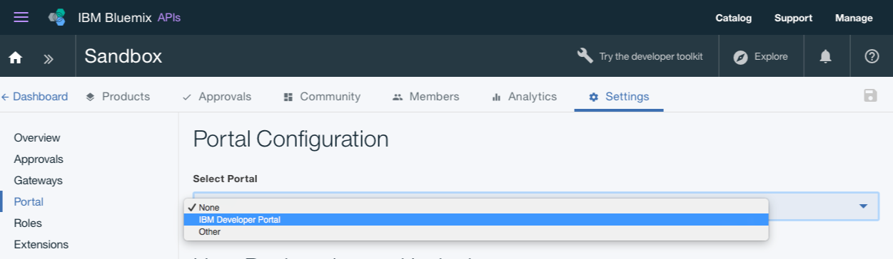

---
copyright:
  years: 2017
lastupdated: "2017-09-12"
---

{:new_window: target="blank"}
{:shortdesc: .shortdesc}
{:screen: .screen}
{:codeblock: .codeblock}
{:pre: .pre}

# 開発者ポータルのセットアップと構成
**所要時間**: 30 分  
**スキル・レベル**: ビギナー  

## 前提条件
始める前に、[API 仕様のインポートと既存の REST サービスへのプロキシー生成](tut_rest_landing.html)を行う必要があります。

## 目標
このチュートリアルでは、**API Connect 開発者ポータル**での構成作業を簡単に開始するための方法を取り上げます。 

---

## 開発者ポータルの作成
このセクションでは、カタログのための開発者ポータルを作成します。

*カタログ* とは、さまざまな環境を表す IBM 用語です。例えば、テスト環境、ステージング環境、実動環境にそれぞれ異なるカタログを作成します。「サンドボックス」という名前のカタログを作成する必要があります。このカタログを使用して、開発者ポータルを作成したり、新規カタログを作成して自由に名前を付けたりすることができます。

1. Bluemix ダッシュボードで**「API Connect」**サービスを選択し、API Connect ダッシュボードを起動します。

2. API Connect ダッシュボードで、開発者ポータルを作成するカタログを選択します。例えば、**「サンドボックス」**を選択します。

3. カタログで、**「設定」**タブを選択します。  
  

4. 「設定」タブで、**「ポータル」**を選択します。  
  

5. 「ポータル構成」ページで、「ポータルの選択」ドロップダウンから**「IBM 開発者ポータル」**を選択します。
   

6. **「ポータル URL」**をメモしてから、変更内容を保存します。  
  
  
7. ダイアログ・ボックスに示されているとおり、通常、開発者ポータルの作成には数分かかります。処理が完了すると、E メールを受け取ります。ダイアログ・メッセージを確認して**「OK」**を選択します。  
  

---

## 開発者ポータルの探索
このセクションでは、上記のステップで作成した開発者ポータルについて理解を深めます。

1. カタログの開発者ポータルを構成したら、ワンタイム・ログインへのリンクが記載された E メールを受け取ります。リンクを選択して、開発者ポータルを起動します。

2. **「ログイン」**を選択して開発者ポータルにログインします。

3. 新規パスワードを入力し、**「保存」**をクリックします。  
  

4. パスワードの設定が完了したので、開発者ポータルを探索してみましょう。まず、ページ上部にある**「ホーム」**から開始します。  
  
  
| タブ             | 説明| 
|:---------------- | -------------------- | 
| _ホーム_     | 「ホーム」ページは、開発者ポータルのウェルカム・ページです。必要に応じて、[ページをカスタマイズ](tut_custom_dev_portal.html)できます。| 
| _概説_       | 「概説」ページは、開発者ポータルの使用を開始する方法を開発者に説明するために使用します。|
| _API 製品_ | 「API 製品」ページは、ポータルで使用可能な API を探索してサブスクライブするために開発者が使用します。| 
| _アプリケーション_ | 「アプリケーション」ページには、API を使用しているアプリケーションが表示されます。| 
| _ブログ_ | 「ブログ」ページでは、API に関するブログ投稿を作成して表示できます。| 
| _フォーラム_ | 「フォーラム」ページでは、開発者が API に関する意見を交わし合い、質問を投稿することができます。| 
| _サポート_ | 「サポート」ページでは、開発者が API に対するサポートを受ける方法を説明できます。例えば、自分のフォーラムや FAQ を開発者に紹介できます。また、必要に応じて、サポート・チケットをオープンできるリンクを提供することもできます。| 

注:「API 製品」ページでは、いずれかの製品を選択して、API の「製品」ページと使用可能なプランを表示することができます。これにより、開発者は API をサブスクライブして、その詳細を表示することができます。 

  

### まとめ
このチュートリアルでは、API Connect 開発者ポータルをセットアップして構成する方法を学習しました。また、開発者ポータルを探索しました。

---

## 次のステップ

[開発者ポータルをカスタマイズしてテーマを選択します](tut_custom_dev_portal.html)。

作成 > 管理 > 保護 > **ソーシャル化** > 分析
