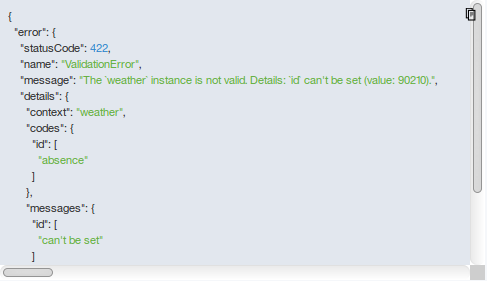
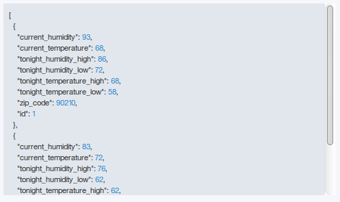

---

copyright:
  years: 2018
lastupdated: "2018-02-22"

---


{:new_window: target="_blank"}
{:shortdesc: .shortdesc}
{:screen: .screen}
{:codeblock: .codeblock}
{:pre: .pre}


# Node.js での API の作成

**所要時間**: 20 分  
**スキル・レベル**: ビギナー  

---
## 目標

このチュートリアルでは、Node.js で LoopBack フレームワークを使用して API を作成する手順を取り上げます。 チュートリアルでは以下の方法を説明します。
1. 新しい LoopBack プロジェクトを作成します。
2. {{site.data.keyword.apiconnect_full}} ツールキットに含まれている API Designer を使用して、LoopBack プロジェクトに新しいデータ・ソースとモデルを追加します。
3. API Designer の「探索」ツールを使用して、API エンドポイントをテストします。

---
## 前提条件

始める前に、[{{site.data.keyword.apiconnect_short}} ツールキットをインストールします](tut_prereq_install_toolkit.html)。 ツールキットがすでにインストールされている場合は、バージョン 5.0.8.1 以降が稼働していることを確認してください。 これは、コマンド・ラインで以下のコマンドを入力して検証できます。
	```
	apic -v
	```

---
## Loopback プロジェクトの作成

{{site.data.keyword.apiconnect_short}} デベロッパーズ・ツールキットのコマンド・ライン・インターフェースか API Designer インターフェースを使用して、Loopback プロジェクトを作成できます。 
 
### ツールキットのコマンド・ラインを使用した LoopBack プロジェクトの作成

{{site.data.keyword.apiconnect_short}} ツールキットのコマンド・ラインを使用して LoopBack プロジェクトを作成するには、以下の手順を実行します。
1.  コマンド・ライン・インターフェースで以下のコマンドを入力します。 そのようにして、LoopBack アプリケーションを作成して管理します。
```bash 
	apic loopback
	```
	>![情報]
	>このチュートリアルでは、weather-data というプロジェクトを作成します。
2.  プロンプトで、プロジェクト名として `weather-data` を入力し、**Enter** を押します。
```bash
	? What's the name of your application? weather-data
	```
  	>![重要]
  	>通常、プロジェクト名では、空白 (" ")、スラッシュ ("/")、アンパーサンド ("&")、アットマーク ("@")、正符号 ("+")、パーセント ("%")、コロン (":") 以外の文字を使用できます。
3.  プロジェクトを作成するディレクトリーの名前を入力します。 **Enter** を押してプロジェクトと同じ名前のディレクトリーを使用するか、新しい名前を入力してから **Enter** を押します。
```bash
	? Enter name of the directory to contain the project: weather-data
	```
4.  使用する LoopBack のバージョンを選択します。 現在の実動バージョンである 3.x を選択してください。
```bash
	? Which version of LoopBack would you like to use? 
  	2.x (long term support) 
	? 3.x (current) 
	```
5.  作成するアプリケーションの種類を指定します。矢印キーを使用して **empty-server** を選択してください。
```bash
	? What kind of application do you have in mind? (Use arrow keys)
	? empty-server (An empty LoopBack API, without any configured models or datasources) 
  	hello-world (A project containing a basic working example, including a memory database) 
  	notes (A project containing a basic working example, including a memory database)
	```
6.  **Enter** を押して、空の LoopBack API を作成します。 

ツールで、プロジェクト・ディレクトリーが作成され、そこに多数のディレクトリーとファイルが追加される間、多くのメッセージが表示されます。 また、npm install が実行され、package.json での指定に従ってすべてのプロジェクト依存関係がインストールされます。 この処理で node_modules ディレクトリーが作成されます。完了するまで、時間がかかることもあります。

空の LoopBack プロジェクトに以下のディレクトリーが含まれています。
- server: サーバー・モデルとデータ・ソースの定義、その他のサーバー・コードが入ります
- definitions: YAML 定義ファイルが入ります
- node_modules: node.js によって作成されます


### API Designer インターフェースを使用した LoopBack プロジェクトの作成

API Designer を使用して LoopBack プロジェクトを作成するには、以下の手順を実行します。
1.  コマンド・ライン・インターフェースで以下のコマンドを入力して、API Designer を開始します。
```bash
	apic edit
	```
	
>![情報]
	>上記のコマンドを実行すると、{{site.data.keyword.apiconnect_short}} ツールキットが初期化され、それが終了すると API Designer がデフォルトのブラウザーで起動します。
>![情報]
	>このチュートリアルでは、weather-data というプロジェクトを作成します。
2.  以前に UI ナビゲーション・ペインをピン留めしていなかった場合は、「ナビゲート」アイコン  をクリックします。 API Manager UI ナビゲーション・ペインが開きます。 UI ナビゲーション・ペインをピン留めするには、「メニューのピン留め」アイコン  をクリックします。
3.  サイドバーで、プロジェクトのプラス・アイコン  をクリックします。
4.  **「LoopBack プロジェクトの作成」**をクリックします。 **「新規 LoopBack プロジェクトの追加」**ダイアログが表示されます。
5.  プロジェクト・テンプレートとして **empty-server** を選択します。
6.  **「LoopBack バージョン」**でバージョン 3.x (現行バージョン) を選択します。
7.  「表示名」フィールドと「名前」フィールドに `weather-data` と入力します。
8.  **「プロジェクト・ディレクトリー」**で、**「参照」**ボタンをクリックして、手順 1 で作成した `weather-data` フォルダーを選択します。

9. **「追加」**をクリックしてプロジェクトを追加します。>![情報]
	>プロジェクト・ディレクトリーが作成され、そこに多くのディレクトリーやファイルが追加される時に、**「新規 LoopBack プロジェクトの追加」**ウィンドウに多くのメッセージが表示されます。 また、npm install が実行され、package.json での指定に従ってすべてのプロジェクト依存関係がインストールされます。 この処理で node_modules ディレクトリーが作成されます。完了するまで、時間がかかることもあります。
	
	>空の LoopBack プロジェクトに以下のディレクトリーが含まれています。
	- server: サーバー・モデルとデータ・ソースの定義、その他のサーバー・コードが入ります
	- definitions: YAML 定義ファイルが入ります
	- node_modules: node.js によって作成されます
10. **「終了」**をクリックして**「新規 LoopBack プロジェクトの追加」**ダイアログ・ボックスを閉じます。
11. **API Designer** を終了します。手順 1 のコマンド・ラインに戻って、`Ctrl + C` を押してください。`Y` を入力して、終了を確認します。
12. ブラウザー・セッションを閉じます。

---
## 新しいデータ・ソースとモデルの追加

API Designer を使用して新しいモデルとデータ・ソースを LoopBack プロジェクトに追加するには、以下の手順を実行します。

### データ・ソースの追加
API Designer を使用して新しいデータ・ソースを LoopBack プロジェクトに追加するには、以下の手順を実行します。
1. `コマンド・ラインを使用した LoopBack プロジェクトの作成`の説明に従って LoopBack プロジェクト (「weather-data」プロジェクト) を作成し、現行作業ディレクトリーをプロジェクトのルート・ディレクトリーにすることも必要です。
```bash
	cd weather-data
	```
2. コマンド・ラインから、以下のコマンドを入力します。
```bash
	apic edit
	```
	しばらくすると、コンソールに以下のメッセージが表示されます。
	```bash
	Express server listening on http://127.0.0.1:9000
	```
	API Designer がデフォルトの Web ブラウザーで開きます。最近ログインを行っていない場合は、最初にログイン・ページが表示されます。  
	>![情報]
	>{{site.data.keyword.Bluemix}} アカウントを使用してログインするか、アカウントを作成できます。
3. **「データ・ソース」**アイコン  をクリックします。
4. **「追加」**をクリックします。 「新規 LoopBack データ・ソース」ウィンドウが開きます。
5. **「名前」**テキスト・フィールドに `weatherDS` と入力します。>![情報]
	>データ・ソース名では、英数字、ダッシュ、下線を使用できます。
6. **「新規」**をクリックします。
7. デフォルトでは、**「コネクター」**設定に**「メモリー内 DB」**と表示され、その他の設定はブランクになります。 現時点ではデフォルト設定のままにして、API Designer が自動的に新しいデータ・ソースを保存するようにします。>![情報]
	>メモリー内データ・ソースは、LoopBack に組み込まれており、開発および初期テストにのみ適しています。 データベース・サーバーなどの実際のデータ・ソースにモデルを接続する準備ができたら、それに応じて**「コネクター」**設定を変更し、[LoopBack コネクターのインストール](https://www.ibm.com/support/knowledgecenter/SSMNED_5.0.0/com.ibm.apic.toolkit.doc/tapim-connector-install.html#task_i2p_dnw_vv){:new_window} の説明に従って、データ・ソースのコネクターをインストールします。 コネクターのタイプに応じてコネクターの設定 (ホスト名、ポート、データベース名、ユーザー名、パスワード) を入力し、**「保存」**アイコン  をクリックします。 API Designer によってデータ・ソースへの接続のテストが自動的に行われます。 このテストに成功すると、**「成功 - データ・ソース接続テストは正常に終了しました」**というメッセージが表示されます。
8. 「接続のテスト」アイコン  をクリックして、データ・ソース接続をテストします。 「データ・ソース接続テストは正常に終了しました」というメッセージが表示されます。
9. **「すべてのデータ・ソース」**をクリックします。 当該データ・ソースがデータ・ソースのリストに表示されます。また、エディターにより、server/datasources.json ファイルが新しいデータ・ソースの設定で更新されます。

### モデルの追加

API Designer を使用して新しいモデルを LoopBack プロジェクトに追加するには、以下の手順を実行します。
1. **「モデル」**アイコン  をクリックします。
2. **「追加」**をクリックします。 「新規ループバック・モデル」ウィンドウが開きます。
3. **「名前」**テキスト・フィールドに `weather` と入力し、**「新規」**をクリックします。
4. **「データ・ソース」**フィールドで **weatherDS** を選択します。

5. **「プロパティー」**で**「プロパティーの追加」**アイコン  をクリックします。
6. **「プロパティー名」**テキスト・フィールドに `zip_code` と入力します。
7. **「タイプ」**で**「数値」**を選択します。
8. **「必須」**を選択し、このプロパティーを必須にします。 これは、モデル・インスタンスを追加する場合および更新する場合にこのプロパティーに値が必要であるということを意味します。 
9. **「ID」**を選択し、プロパティーが固有 ID を持っていることを確認します。 現時点では、以下のその他の設定については、デフォルト値のままにしてください。
	- **配列である**: プロパティーが、指定されたタイプのエレメントを持つ JavaScript 配列であるかどうか。
	- **索引**: プロパティーが、データベース索引である列 (フィールド) を表すかどうか。
	- **説明**: プロパティーのテキスト記述。
9. **「プロパティーの追加」**アイコン  を再度クリックして、別のプロパティーを追加します。  残りのプロパティーの設定については、以下の表を参照してください。

10. **「保存」**アイコン  をクリックして、変更内容を保存します。
11. **「すべてのモデル」**をクリックして、モデルの編集を終了します。

weather-data LoopBack プロジェクトに新しいデータ・ソースとモデルを追加する作業が完了しました。

---

## LoopBack プロジェクトのテスト

>![情報]

	>「新しいモデルとデータ・ソースの追加」セクションの作業の完了後に {{site.data.keyword.apiconnect_short}} Designer を終了していない場合は、以下の手順 2 に直接進むことができます。
	
API Designer の「探索」ツールを使用して API エンドポイントをテストするには、以下の手順を実行します。
1. コマンド・ラインから、以下のコマンドを入力します。
```bash
	apic edit
	```
	しばらくすると、コンソールに以下のメッセージが表示されます。
	```bash
	Express server listening on http://127.0.0.1:9000
	```
	API Designer がデフォルトの Web ブラウザーで開きます。最近ログインを行っていない場合は、最初にログイン・ページが表示されます。
	
2. ローカル・テスト・サーバーを開始します。
	a. 画面下部のテスト・コンソールで、**「サーバーの開始」**アイコン  をクリックします。

	b. 「実行中」というメッセージが表示されるまで待ちます。


	>![情報]
	>プロジェクトの構成や他のプロセスが実行中かどうかによって、表示されるポート番号が異なる場合があります。3. **「http://127.0.0.1:port_number」**をクリックして、API ルート・エンドポイントを表示します。 デフォルトの LoopBack (空または hello-world) プロジェクトの場合、以下のように表示されます。
```bash
	{"started":"2017-05-24T19:21:47.807Z","uptime":80.876}
	```
	>![情報]
	>プロジェクトを停止するには、**「サーバーの停止」**アイコン  をクリックします。
	>
	
	>再開するには、**「サーバーの再始動」**アイコン  をクリックします。
>

	
4. **「探索」**アイコン  をクリックして、API Designer の「探索」ツールを表示します。 サイドバーに、API 内の LoopBack モデルのすべての REST 操作が表示されます。 PersistedModel に基づいているモデルは、デフォルトで、[作成、読み取り、更新、削除という標準的な操作セット](http://loopback.io/doc/en/lb2/PersistedModel-REST-API){:new_window} を備えています。

5. 左側のペインで **weather.create** 操作をクリックして、エンドポイントを表示します。

中央のペインには、エンドポイントの概要 (パラメーター、セキュリティー、モデル・インスタンス・データ、応答コードなど) が表示されます。 右側のペインには、curl コマンドを使用してエンドポイントを呼び出すためのテンプレート・コードと、Ruby、Python、Java、Node などの言語が表示されます。

6. API Designer の「探索」ツールで REST エンドポイントをテストするには、以下の手順を実行します。
    1. 右側のペインで**「試す (Try it)」**をクリックします。`id` データ・エレメントがある場合は、それを生成データから削除してテストを実行してください。 
	
	2. **「パラメーター」**までスクロールダウンし、**「生成」**をクリックしてダミー・データを生成します。 デフォルトでは、`zip_code`、`current_temperature`、`current_humidity`、`tonight_temperature_low`、`tonight_temperature_high`、 `tonight_humidity_low`、`tonight_humidity_high` の各プロパティーを含んだデータが生成されます。
	
	3. **「操作の呼び出し (Call operation)」**をクリックします。
	
>![トラブルシューティング]
>localhost の信頼できない証明書が原因でエラー・メッセージが表示された場合は、API Designer の「探索」ツールで、エラー・メッセージに記載されているリンクをクリックし、証明書を受け入れてください。そうすれば、Web ブラウザーでの操作の呼び出しを続行できます。 正確な手順は、ご使用の Web ブラウザーによって異なります。 REST エンドポイントを直接ブラウザーでロードすると、{"名前":"PreFlowError","メッセージ":"要求を処理できません"} というメッセージが表示されます。 ブラウザーで REST エンドポイントをテストするには、必要なヘッダーや他の要求パラメーターに対応するために、API Designer の「探索」ツールを使用する必要があります。
>
>![トラブルシューティング]
>**422 - Unprocessable Entity** という応答コードと以下のペイロードが表示されることがあります。
>
>
>生成されたデータから削除されていない `id` データ・エレメントがないことを確認してください。 ID エレメントがある場合は、それを削除してテストを再実行してください。
>![トラブルシューティング]
>**「要求本文の解析に失敗しました」**というエラーが表示された場合は、`humidity_high` の最後の数値の後のコンマを削除する必要があります。
7. **「データ」**セクションに表示されている JSON の値を編集します。 生成したダミー・データを変更してみてください。その後、**「操作の呼び出し」**を再度クリックします。 要求パラメーターと応答パラメーターのほかに、入力した JSON インスタンス・データが表示されるはずです。


8. 操作によってモデル・インスタンスが追加されたことを確認するために、**weather.find** をクリックします。 **「操作の呼び出し」**をクリックして、すべての weather インスタンスを表示します。 2 つのモデル・インスタンスを使用した例を以下に示します。

	
---

### このチュートリアルで学習したこと
このチュートリアルでは、以下を実行しました。
1. {{site.data.keyword.apiconnect_short}} ツールキットのコマンド・ラインを使用して、新しい LoopBack プロジェクトを作成しました。
2. {{site.data.keyword.apiconnect_short}} ツールキットに含まれている API Designer を使用して、新しいモデルとデータ・ソースを LoopBack プロジェクトに追加しました。
3. API Designer の「探索」ツールを使用して、API エンドポイントをテストしました。


---

## 次のステップ

[REST サービスの管理](tut_rest_landing.html)または [SOAP サービスの管理](tut_manage_soap_api.html)に進みます。

作成 > **管理** > 保護 > ソーシャル化 > 分析

 
[important]: ./images/important.png "重要!"
[info]: ./images/info.png "情報"
[troubleshooting]: ./images/troubleshooting.png "トラブルシューティング" 

