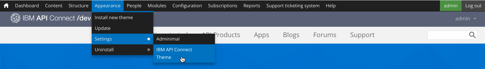
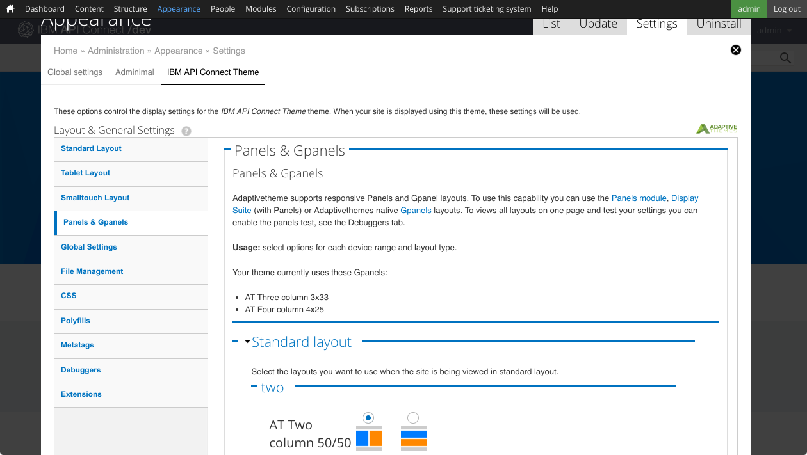

---
copyright:
  years: 2017
lastupdated: "2017-10-31"
---

{:new_window: target="blank"}
{:shortdesc: .shortdesc}
{:screen: .screen}
{:codeblock: .codeblock}
{:pre: .pre}

# 開発者ポータルのカスタマイズとテーマの選択
**所要時間**: 30 分  
**スキル・レベル**: ビギナー  

## 目標
このチュートリアルでは、{{site.data.keyword.apiconnect_full}} 開発者ポータルを短時間でカスタマイズしたり、それぞれのニーズに適したテーマを選択したりする方法を取り上げます。

---

## 前提条件

このチュートリアルを始める前に、[開発者ポータルのセットアップと構成](tut_config_dev_portal.html)のチュートリアルを完了し、ポータル管理者としてログインしておく必要があります。

---

## 開発者ポータルのカスタマイズ
開発者ポータルを作成したら、その外観をカスタマイズできます。

1. 最初に、ようこそバナーを変更します。 トップ・メニューで**「コンテンツ」**を選択し、**「ブロック」**を選択します。  
  

2. **「ようこそバナー」**ブロックで**「編集」**を選択します。  
  

3. 「コンテンツ」見出しの下で、ようこそバナーのコンテンツのテキストとイメージを変更できます。コンテンツ・エディターにテキストを入力することもできますし、「HTML ソースの編集」アイコンを選択して、イメージとテキストの指定内容を定義する HTML を直接編集するか貼り付けることもできます。  
   

4. ホーム画面にイメージも追加します。 「イメージ」の見出しまでスクロールダウンします。 背景として使用するイメージを見つけたら、適切なファイル・フォーマット (png、gif、jpg、jpeg) で保存します。 イメージがない場合は、[これ](images/Cloudy_Day.png)を使用できます。 **「ファイルの選択」**をクリックし、対象の背景イメージを参照して選択します。 イメージを選択したら、**「アップロード」**をクリックします。  
  

5. アップロードが完了すると、イメージが表示されます。 削除する場合は、**「削除」**をクリックします。  
  
 
6. ページの下部にある**「保存」**をクリックして変更を保存します。  
  
---

## 開発者ポータルのテーマのカスタマイズ
開発者ポータルの外観を変えるために、テーマを変更できます。

1. テーマを変更するには、トップ・メニューから**「外観」**を選択し、**「設定」**を選択し、**「IBM API Connect のテーマ」**を選択します。 これが、開発者ポータル作成時のデフォルトのテーマです。
   

2. **「標準レイアウト (Standard Layout)」**タブでは、大きな画面のあるデバイス (デスクトップなど) 向けにレイアウトを変更できます。 **「タブレット・レイアウト (Tablet Layout)」**タブでは、タブレット・デバイスで使用するようにレイアウトを変更できます。 **「スモールタッチ・レイアウト (Smalltouch Layout)」**タブでは、スマートフォンなどのデバイスで使用するようにレイアウトを変更できます。 それらのタブを調べたら、**「パネルと G パネル (Panels & Gpanels)」**を選択します。
  

3. 上記のようにサイドバーのレイアウトを変更することができますが、パネル・モジュールをインストールした場合は、デフォルトのテーマで G パネル (即応パネル) を使用することもできます。 標準デバイス、タブレット・デバイス、スモールタッチ・デバイスで使用するパネルのレイアウトを制御するには、このセクションを展開して、設定を更新します。
 

4. 他にも調整できる設定がありますが、ここではスキップして、**「拡張」**を選択します。 このタブでは、開発者ポータルのスタイルを構成するために使用できる追加設定を有効にすることができます。  
  

5. **「拡張」**タブで有効にした拡張設定は、メイン設定の下の**「拡張」**セクションで変更できます。     
  

6. 設定の変更が完了したら、ページの下部にある**「構成の保存」**を選択します。

---

## 開発者ポータルで使用する別のテーマの選択
開発者ポータルに用意されている追加のテーマを選択して、外観をカスタマイズすることもできます。

1. 別のテーマを使用可能にするには、「外観」設定の上部にある**「リスト」**タブを選択します。
   

2. **「リスト」**タブの上部に使用可能なテーマが表示されます。

3. 使用可能なテーマのリストの下に無効なテーマ・コレクションが表示されます。 **「使用可能にする」**を選択すれば、対象のテーマを使用可能にすることができます。   
   

4. テーマを使用可能にすると、そのテーマが**「リスト」**タブの上部の**「使用可能なテーマ (Enabled Themes)」**に表示されます。 **「設定」**を選択してカスタマイズできます。  
  

5. 設定の変更が終了した後に**「デフォルトの設定 (Set Default)」**を選択すると、そのテーマをデフォルトとして設定できます。     
  

---

## 開発者ポータルで使用する新しいテーマのインストール
既存のテーマの変更ではニーズに対応できない場合は、開発者ポータルの外観を変更するためにテーマをインストールすることもできます。

1. [drupal.org ](http://drupal.org){:new_window} からダウンロードしたモジュールやテーマを使用して開発者ポータルをカスタマイズすることもできれば、独自のモジュールやテーマを作成することもできます。

2. 開発者ポータルにテーマをインストールするには、トップ・メニューから**「外観」**を選択し、**「新規テーマのインストール」**を選択します。  
  

3. URL を使用して [drupal.org ](http://drupal.org){:new_window} からテーマを直接インストールすることもできれば、**「ファイルの選択」**、**「インストール」**の順にクリックすることによって、ダウンロードまたは作成したテーマをアップロードすることもできます。  
   

4. アップロードが完了したら、テーマを使用可能にする必要があります。 **「新規追加されたテーマを使用可能にする」**を選択します。  
  

5. リスト内をスクロールダウンして、新しくインストールしたテーマを見つけます。 **「使用可能にしてデフォルトとして設定する (Enable and set default)」**を選択します。  
  

6. ページの下部にある**「保存」**をクリックして変更を保存します。  

---

## サマリー
このチュートリアルが完了しました。 このチュートリアルでは、以下の方法を学習しました。

* 開発者ポータルのウェルカム・ページのカスタマイズ
* 開発者ポータルで使用するテーマのカスタマイズ 
* 開発者ポータルで使用する別のテーマの選択
* 開発者ポータルで使用する新しいテーマのインストール

---

## 次のステップ

[開発者ポータル内でユーザーがナビゲートする方法](tut_discover_apis.html)または[基本的な分析を行って洞察を深める方法](tut_insights_analytics.html)を学習します。

作成 > 管理 > 保護 > **ソーシャル化** > 分析  

