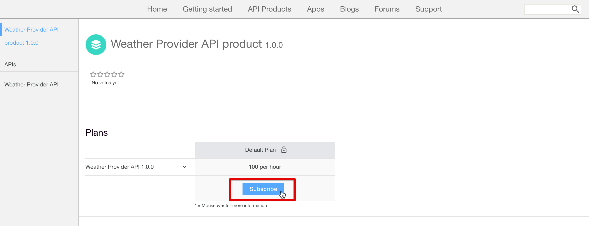

---

copyright:
  years: 2017
lastupdated: "2017-11-20"

subcollection: apiconnect

keywords: IBM Cloud, APIs, lifecycle, catalog, manage, toolkit, develop, dev portal, tutorial

---

{:new_window: target="_blank"}
{:shortdesc: .shortdesc}
{:screen: .screen}
{:codeblock: .codeblock}
{:pre: .pre}

# API の検出
{: #tut_discover_apis}

**所要時間**: 25 分  
**スキル・レベル**: ビギナー  

## 目標
{: #object_tut_discover_apis}

このチュートリアルでは、{{site.data.keyword.apiconnect_full}} 開発者ポータルでポータル・ユーザーが API を利用する方法を学習します。 ポータル・ユーザーが製品や API を探索したり、API を表示してテストしたり、API をサブスクライブしたりする方法を学習します。 

## 前提条件
{: #prereq_tut_discover_apis}

このチュートリアルに前提条件はありません。 ポータル管理者も、このチュートリアルで開発者ポータル内をナビゲートすることによって、ポータル・ユーザーが開発者ポータル内をナビゲートする方法を実際に体験できます。 ただし、開発者ポータルごとにスキンが違うことに留意してください。 

既存の開発者ポータルがない場合は、このチュートリアルの作業を進める前に、{{site.data.keyword.Bluemix_short}} で開発者ポータルをセットアップして構成できます。

## 製品と API の探索
{: #explore_tut_discover_apis}

このセクションでは、開発者ポータルでポータル・ユーザーが製品および API を探索する方法を取り上げます。

1. ブラウザーで、**API Connect 開発者ポータル**に移動します。

2. {{site.data.keyword.apiconnect_short}} 開発者ポータルで「API 製品」タブを選択します。

3. 使用可能な API 製品を 1 つ選択して、その製品で使用できる API とプランを表示します。  
  

4. API を選択し、使用可能な API の詳細を探索します。  
  

5. API の詳細ページに、使用可能な操作と、それぞれのパラメーターや返される応答が表示されます。 ページの最後に、API で使用されている定義が表示されます。  
   

6. コード・サンプルのパネルで、各種コーディング言語のサンプルを表示して、要求の呼び出し方や応答の内容を確認できます。 サンプルの 1 つ (**Node** など) を選択すると、そのコーディング言語のサンプルが表示されます。  
   

---

## API の表示とテスト
{: #view_tut_discover_apis}

このセクションでは、ポータル・ユーザーが製品で使用できる API を表示してテストする方法を取り上げます。 

1. {{site.data.keyword.apiconnect_short}} 開発者ポータルで API の詳細ページに移動します (前のセクションを参照)。  
   

2. **「Open API」**を選択して、API の Swagger yaml の情報をダウンロードして表示できます。  
   

3. 操作の 1 つまでスクロールダウンして、詳細を表示します。 操作のリンクをクリックして、ページ上のその操作にジャンプすることもできます。

4. サンプルの下にある右側のパネルで、**「この操作を試してみる」**セクションまでスクロールします。 パラメーターを入力して、**「操作の呼び出し」**を選択します。  
  

5. スクロールダウンして、操作の呼び出しの要求と応答を表示します。 応答 **200 OK** が返され、メッセージ本文と共に表示されます。これは、操作の呼び出しが正常に実行されたことを示しています。  
  

---

## API のサブスクライブ
{: #subscr_tut_discover_apis}

このセクションでは、開発者ポータルでポータル・ユーザーが API をサブスクライブする方法を取り上げます。 

1. **「アカウントの作成」**を選択します。

2. 必須フィールドにデータを入力して、ページの下部にある**「新規アカウントの作成 (Create new account)」**を選択します。 
**注:** 前のチュートリアルで開発者ポータルを作成した時に使用した E メール・アドレスとは別のアドレスを使用してください。

3. 開発者アカウントを作成したら、ログインしてホーム・ページを表示します。 API をサブスクライブするためのアプリケーションが必要です。 **「アプリケーション」**を選択して、登録済みアプリケーションのページに進みます。  
  

4. 新しいアプリケーションを登録する場合は、**「新しいアプリケーションの作成」**を選択します。  
  

5. アプリケーションの*タイトル*と*説明*を入力して、**「サブミット」**を選択します。  
   

6. アプリケーションが手に入ったので、API 製品プランをサブスクライブできます。 **使用可能な API** または **API 製品**を選択して、API 製品プランを表示します。  
   

7. サブスクライブする API 製品を選択します。  
   

8. **「サブスクライブ」**を選択して、API 製品プランをサブスクライブします。  
   

9. 製品プランをサブスクライブするアプリケーションを選択してから、**「サブスクライブ」**を選択します。
   

10. アプリケーションで製品プランをサブスクライブできました。
   

## まとめ
{: #conclusion_tut_discover_apis}

このチュートリアルでは、ポータル・ユーザーが製品や API を探索したり、API を表示してテストしたり、API をサブスクライブしたりする方法を学習しました。 

---

## 次のステップ
{: #next_tut_discover_apis}

[基本的な分析を行って洞察を深める方法](/docs/services/apiconnect/tutorials?topic=apiconnect-tut_insights_analytics)を学習します。

作成 > 管理 > 保護 > **ソーシャル化** > 分析  

