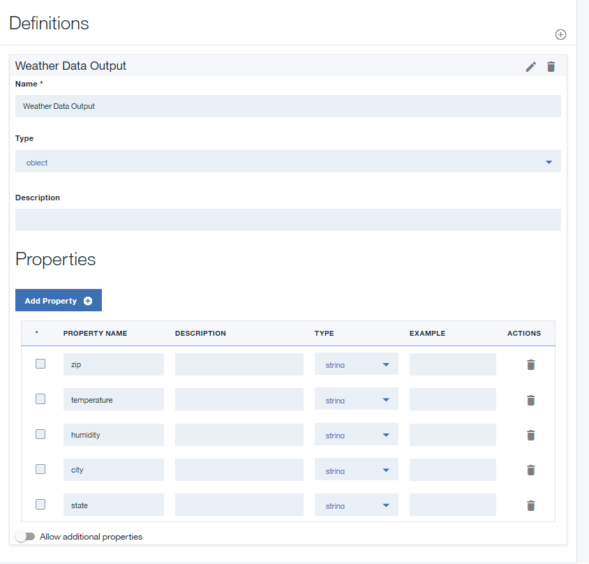

---

copyright:
years: 2019
lastupdated: "2019-3-12"

subcollection: apiconnect

keywords: IBM Cloud, APIs, lifecycle, catalog, manage, toolkit, develop, dev portal, tutorial

---

{:new_window: target="blank"}
{:shortdesc: .shortdesc}
{:screen: .screen}
{:codeblock: .codeblock}
{:pre: .pre}
 

# SOAP サービスを REST API として公開する
{: #tut_expose_soap_service}

**所要時間**: 20 分  
**スキル・レベル**: ビギナー  

---
## 目標
{: #object_tut_expose_soap_service}

API Manager で、既存の SOAP サービスにアクセスしてそのサービスを REST API として公開するための REST API を作成します。

## 前提条件
{: #prereq_tut_expose_soap_service}

1. 始める前に、[{{site.data.keyword.apiconnect_full}} インスタンスのセットアップ](/docs/services/apiconnect?topic=apiconnect-tut_prereq_set_up_apic_instance)が必要です。
2. 始める前に、[weatherprovider.wsdl テスト ](https://raw.githubusercontent.com/IBM-Bluemix-Docs/apiconnect/master/tutorials/weatherprovider.wsdl){: #new_window} ファイルをローカル・ファイル・システムにコピーしてください。
	>![images/info.png]
	>**「未加工 (Raw)」**をクリックし、結果のページを `.wsdl` ファイルとしてローカル・システムに保存することもできます。

---
## REST API 定義のセットアップ
{: #setup_tut_expose_soap_service}

1. {{site.data.keyword.Bluemix_short}} (https://cloud.ibm.com) にログインします。
2. {{site.data.keyword.Bluemix_notm}} の**ダッシュボード**で、**「Cloud Foundary サービス (Cloud Foundary Services)」**をクリックします。{{site.data.keyword.apiconnect_short}} サービスを起動します。 
3. {{site.data.keyword.apiconnect_short}} でナビゲーション・パネルが開いていることを確認します。 表示されていない場合は、**「>>」**をクリックして開きます。  

  

4. ナビゲーション・パネルで**「ドラフト」** を選択します。
5. **「追加 +」**>**「新規 API」**を選択します。

      

	
6. API に関する基本情報を指定します。
	- **「タイトル」**フィールドに `Weather Data` と入力します。
	- タイトルを入力すると、**「名前」**フィールドに `weather-data` という名前が取り込まれます。この名前はそのままにしておきます。	
	- **「基本パス」**フィールドは `/weather-data` のままにします。
	- **「バージョン」**フィールドは `1.0.0` のままにします。
7. **「追加プロパティー」**を展開して、API の追加プロパティーを指定します。
	- API 定義を作成するためにデフォルトのテンプレートを使用する場合は、**「API テンプレート」**フィールドから**「デフォルト」**を選択します。
	- 残りのフィールドは変更しません。

8. API を新規製品に追加してから、API 定義を作成します。
	- **「製品の追加」**を選択します。
	- **「タイトル」**フィールドで `Weather Data product` をデフォルトのまま使用します。
	- **「名前」**フィールドと**「バージョン」**フィールドは、そのままにしておきます。
	- **「この製品をカタログに公開」**チェック・ボックスを選択し、ターゲット・カタログとして**「サンドボックス」**を選択します。

	- **「API の作成」**をクリックします。 API 定義のドラフト用の**「設計」**タブが開きます。
9. API が作成されます。 「設計」ページが表示されます。

   

10. ナビゲーション・バーの**「定義」**をクリックします。**「定義の追加」**アイコンをクリックします。

11. 新しい定義をクリックして展開します。
12. その定義の名前を `Weather Data Output` にします。
13. その定義には 5 つのプロパティーがあります。 **「プロパティーの追加」**を 4 回クリックして、さらにプロパティーを追加します。 以下の説明を参考にして`「プロパティー名」`を名前変更し、`「説明」`、`「タイプ」`、`「例」`でデフォルトを使用します。
    a. **Weather Data Output** 定義に新しいプロパティーを追加します。    
       - 名前: zip         /  タイプ: ストリング   
       - 名前: temperature /  タイプ: 整数   
       - 名前: humidity    /  タイプ: 整数   
       - 名前: city        /  タイプ: ストリング   
       - 名前: state       /  タイプ: ストリング   

	
14. ナビゲーション・バーの**「パス」**をクリックします。**「パスの追加」**アイコンをクリックします。
15. 新しく作成したパスの**「タイトル」**を `/getweatherdata` に設定します。
16. **GET /getweatherdata** 操作をクリックして展開します。

17. **GET /getweatherdata** 操作で**「パラメーターの追加」**をクリックし、**「新規パラメーターの追加」**をクリックします。
18. 新しいパラメーターの名前を `zip_code` にして、残りをデフォルトのままにします。
19. **「応答」**セクションの**「200 OK」**応答の**「スキーマ」**列で **Weather Data Output** 定義を選択します。 API 呼び出しの応答では、**Weather Data Output** で定義されているオブジェクトが応答オブジェクトになります。

20. 「保存」アイコン  をクリックして、変更内容を保存します。

---
## Web サービス呼び出しの追加および構成
{: #add_web_tut_expose_soap_service}

Web サービスを API 定義に統合する invoke ポリシーと map ポリシーを追加して構成するには、以下の手順を実行します。
1. **「サービス」**セクションで**「サービスの追加」**アイコン  をクリックします。 `「WSDL による Web サービスのインポート」`ウィンドウが開きます。

2. **「ファイルのアップロード」**を選択します。
3. **「ファイルのアップロード」**ウィンドウで、**「前提条件」**セクションの`手順 2` でダウンロードした `weatherprovider.wsdl` ファイルの場所を指定し、**「開く」**をクリックして作業を続けます。
4. **weatherService** SOAP サービスを選択して、**「完了」**をクリックします。 **「サービス」**セクションで、**WeatherService** Web サービスに **weatherRequest** 操作が 1 つだけ表示されます。

		
5. **「アセンブル」**タブに移動して、**「DataPower Gateway ポリシー」**が選択されていることを確認します。
6. キャンバスで既存の **invoke** ポリシーを削除します。そのポリシーにカーソルを移動し、**「ポリシーの削除」**アイコン  をクリックしてください。
	
7. パレットにある **weatherRequest** Web サービスを、キャンバスに表示されている破線のボックスにドラッグします。 invoke ポリシーと 2 つの map ポリシーがアセンブリーに配置されます。 最初の map ポリシーは、変数を Web サービス呼び出しの入力に割り当てます。2 番目のポリシーは、Web サービス呼び出しの出力を変数に割り当てます。 最初の map の出力と 2 番目の map の入力は、手順 4 で指定した WSDL から生成されます。
	
8. **「weatherRequest: input」**という map ポリシーをクリックした後、プロパティー・シートの「入力」列にある**「入力の編集」**アイコン  をクリックします。
	
9. **「+ 操作用パラメーター」**をクリックし、`get /getweatherdata` を選択します。
10. **「完了」**をクリックして `zip_code` パラメーターを追加します。

11. 入力側の **zip_code string** に対応する円をクリックし、出力側の **zipcode string** に対応する円をクリックします。  
	
12. プロパティー・シートを閉じます。
13. パレットにある**「weatherRequest: output」**という map ポリシーをクリックした後、プロパティー・シートの「出力」列にある**「出力の編集」**アイコン  をクリックします。
14. **「+ 操作用出力」**を選択し、`get /getweatherdata` を選択します。
15. **「完了」**を選択して `Weather Data Output` 出力定義を追加します。

16. 入力側の **zip string** に対応する円をクリックし、出力側の **zip string** に対応する円をクリックします。 以下の説明を参考にして残りのパラメーターをマップします。

17. **「保存」**アイコン  をクリックして、変更内容を保存します。

Web サービス呼び出しをアセンブリーに組み込み、入力パラメーターを SOAP 要求の該当部分にマップし、SOAP 応答の該当部分を JSON 出力にマップしました。

---
## API 定義のテスト
{: #test_tut_expose_soap_service}

API Manager テスト・ツールを使用して API 定義をテストするには、以下の手順を実行します。
1. **「アセンブリー」**タブにある**「テスト」**アイコン  をクリックして、テスト・ペインを表示します。

2. 以前にテスト・ツールを使用した場合は、**「セットアップの変更」**をクリックします。
3. 製品のリストから `Weather Data product 1.0.0` を選択します。

4. **「製品の再公開」**をクリックします。
5. **「次へ」**をクリックします。
6. 操作のリストから `get /getweatherdata` を選択します。  
	
7. **zip_code** フィールドまでスクロールダウンし、`10504` と入力します。  
	
8. **「呼び出し」**をクリックします。 API から現在の天候が返されます。  
	

---
## まとめ
{: #conclusion_tut_expose_soap_service}

このチュートリアルでは、以下のアクティビティーを実行しました。
1. REST API 定義をセットアップしました
2. 既存の Web サービスを呼び出して出力を返すように API を構成しました
3. API 定義をテストしました

---

## 次のステップ
{: #next_tut_expose_soap_service}

[OAuth 2.0 を使用した保護](/docs/services/apiconnect/tutorials?topic=apiconnect-tut_secure_oauth_2)によって API を保護します。

作成 > **管理** > 保護 > ソーシャル化 > 分析

[important]: ./images/important.png "重要!"
[info]: ./images/info.png "情報"
[troubleshooting]: ./images/troubleshooting.png "トラブルシューティング" 
