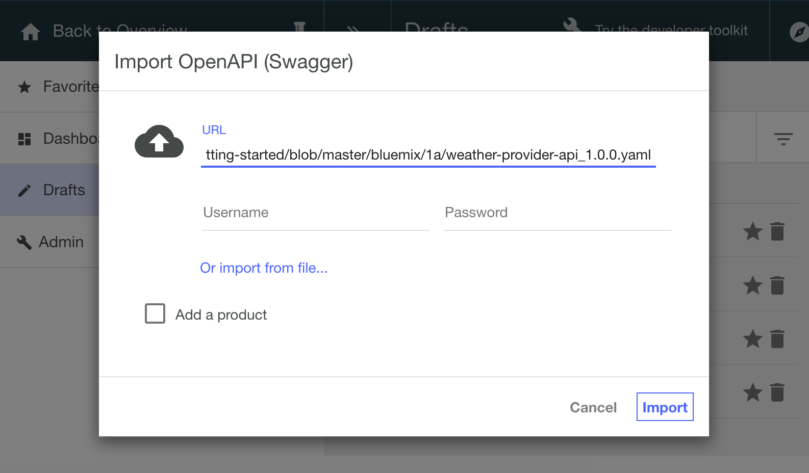
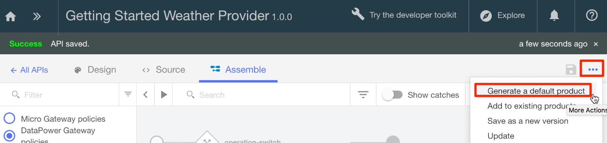
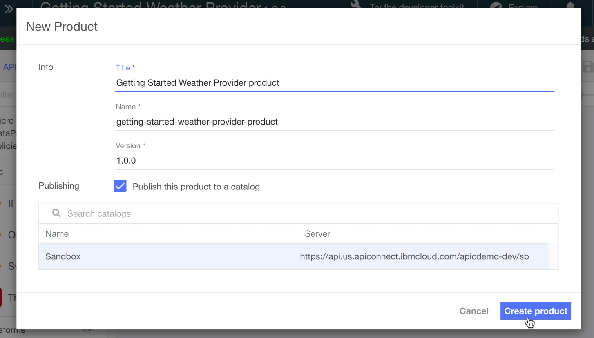

---
copyright:
  years: 2017
lastupdated: "2017-11-02"
---

{:new_window: target="blank"}
{:shortdesc: .shortdesc}
{:screen: .screen}
{:codeblock: .codeblock}
{:pre: .pre}

# API 仕様のインポートと既存の REST サービスへのプロキシー作成 ({{site.data.keyword.Bluemix_notm}} を使用する場合)
所要時間: 5 分  
スキル・レベル: ビギナー  

## 目標
このチュートリアルでは、{{site.data.keyword.apiconnect_full}} での作業を簡単に開始するための基礎として、既存の API を管理制御下に置くため方法を取り上げます。 まず OpenAPI 仕様をインポートしてから、既存の REST サービスのパススルー API プロキシーを作成します。

## 前提条件
始める前に、[{{site.data.keyword.apiconnect_short}} インスタンスのセットアップ](tut_prereq_set_up_apic_instance.html)が必要です。

---


## サンプル・アプリケーションの探索とターゲット・エンドポイントのテスト

このチュートリアルで使用する _Weather Provider_ サンプル・アプリケーションは、作成されています。 対応する API 仕様 (Swagger 2.0) は、[weather-provider-api_1.yaml ](https://raw.githubusercontent.com/IBM-Bluemix-Docs/apiconnect/master/tutorials/weather-provider-api_1.yaml){:new_window} ファイルにあります。

1. アプリケーションを探索するために、[http://gettingstartedweatherapp.mybluemix.net/ ](http://gettingstartedweatherapp.mybluemix.net/){:new_window} に移動します。  
2. アメリカの有効な 5 桁の郵便番号を入力して、_**現在の天候**_ と_**今日の予報**_ を入手します。  


3. 上の天候サンプル・アプリケーションは、天候データを提供する API を使用して作成されています。 **現在の**天候データを取得するエンドポイントは、`https:// myweatherprovider<span></span>.mybluemix.net/current?zipcode={zipcode}` です。 [https://myweatherprovider.mybluemix.net/current?zipcode=90210 ](https://myweatherprovider.mybluemix.net/current?zipcode=90210){:new_window} にアクセスして、テストしてください。  

  

4. また、**今日の**予報データを取得するエンドポイントは、`https:// myweatherprovider<span></span>.mybluemix.net/today?zipcode={zipcode}` です。 [https://myweatherprovider.mybluemix.net/today?zipcode=90210 ](https://myweatherprovider.mybluemix.net/today?zipcode=90210){:new_window} にアクセスして、テストしてください。  

  


---

## サンプル・アプリケーションの OpenAPI 仕様のインポートと REST API プロキシーの作成
1. {{site.data.keyword.Bluemix_short}} にログインします (https://new-console.ng.bluemix.net/login)。
2. {{site.data.keyword.Bluemix_notm}} のナビゲーション・パネルで**「サービス」**を選択して、**「ダッシュボード」**を選択します。 {{site.data.keyword.apiconnect_short}} サービスを起動します。 
3. {{site.data.keyword.apiconnect_short}} で、左側にナビゲーション・パネルが開いていることを確認します。 表示されていない場合は、**「>>」**をクリックして開きます。  
4. ナビゲーション・パネルで**「ドラフト」** を選択します。   
5. **「API」**タブで**「追加」**をクリックします。 ドロップダウン・メニューから**「ファイルまたは URL から API をインポート」**を選択します。  
     

6. OpenAPI の天候定義をインポートします。 開いた「OpenAPI (Swagger) のインポート」ダイアログ・ボックスに `https://raw.githubusercontent.com/IBM-Bluemix-Docs/apiconnect/master/tutorials/weather-provider-api_1.yaml` という URL を入力します。 他のオプションはデフォルト値のままにして、**「インポート」**をクリックします。  
      

7. OpenAPI 仕様をインポートすると、API の**「設計」**ビューが表示されます。 そこから OpenAPI 定義の各種セクションを確認できます。 スクロールして内容を探索し、**「ホスト」**の値を確認してください。 **「ソース」**タブで OpenAPI を表示することもできます。
  _注: 「ホスト」の値は_ `$(catalog.host)` _に設定されています。 これが API プロキシーの基本 URL です。_
8. API が保存されます。 


## API プロキシーのテスト

### _API Manager テスト・ツール_ によるテスト
1. **「アセンブル」**タブで、アクションをさらに表示するためのアイコンをクリックし、**「デフォルト製品の生成」**を選択します。  
     

2. **「新規製品」**ダイアログ・ボックスでデフォルト・オプションを受け入れ、**「製品の作成」**をクリックします。 **Weather Provider API product** が作成され、サンドボックス・カタログに公開されます。 製品の生成が成功したという趣旨のメッセージが表示されます。  
    

  

  _{{site.data.keyword.apiconnect_short}} では、**製品**という形で、API を用途ごとにグループ分けできます。 製品は**カタログ**に公開されます。  [{{site.data.keyword.apiconnect_short}} 用語集](../apic_glossary.html)_

3. 「アセンブル」タブで、再生アイコンをクリックして、API プロキシーのターゲット呼び出しをテストします。

4. テスト・パネルで **get /current** 操作を選択します。  
    a. この操作では郵便番号が必須パラメーターになっているので、アメリカの有効な郵便番号 (90210 など) を入力します。  
    b. **「呼び出し」**をクリックして、以下の応答が表示されることを確認します。  
    ```
    - 200 OK response
    - Current weather data for 90210  
    ```
_CORS エラーになった場合は、エラー・メッセージに記されている手順を実行してください。 エラーに含まれているリンクをクリックして例外をブラウザーに追加し、「呼び出し」ボタンを再び押します。_

    


### _「探索」ツールによるテスト_
_「探索」ツールを使用すれば、ユーザーは、OpenAPI 定義で設定されているパラメーター要件を適用して API の正しい操作をテストできます。 「アセンブル」タブにある API テスト・ツールではその要件が適用されないので、パラメーターが欠落している場合の API の動作をユーザーが確認できます。_

1. API プロキシー・エンドポイントをテストするために、**「探索」**を選択し、**「サンドボックス」**を選択します。

2. パレットから **GET /current** 操作を選択します。
3. 「試す (Try it)」を選択します。  
4. テスト・ボックスにアメリカの有効な郵便番号 (90210 など) を入力します。
5. **「操作の呼び出し」**をクリックして、応答を確認します。


    


### まとめ
このチュートリアルでは、API パススルー・プロキシーによって既存の REST サービスを呼び出す方法を確認しました。 まず、Web ブラウザーでサンプル・サービスを利用できるかどうかを確認しました。 次に、{{site.data.keyword.apiconnect_short}} で API プロキシーを作成し、そのプロキシーを呼び出し対象のサンプル・サービスにリンクしました。 その API を製品としてパッケージし、その製品をカタログに公開し、プロキシーをテストしました。

---

## 次のステップ

[レート制限](tut_rate_limit.html)、[クライアント ID と秘密鍵](tut_secure_landing.html)、[OAuth 2.0 を使用した保護](tut_secure_oauth_2.html)のいずれかを使用して API を保護します。

作成 > **管理** > 保護 > ソーシャル化 > 分析

