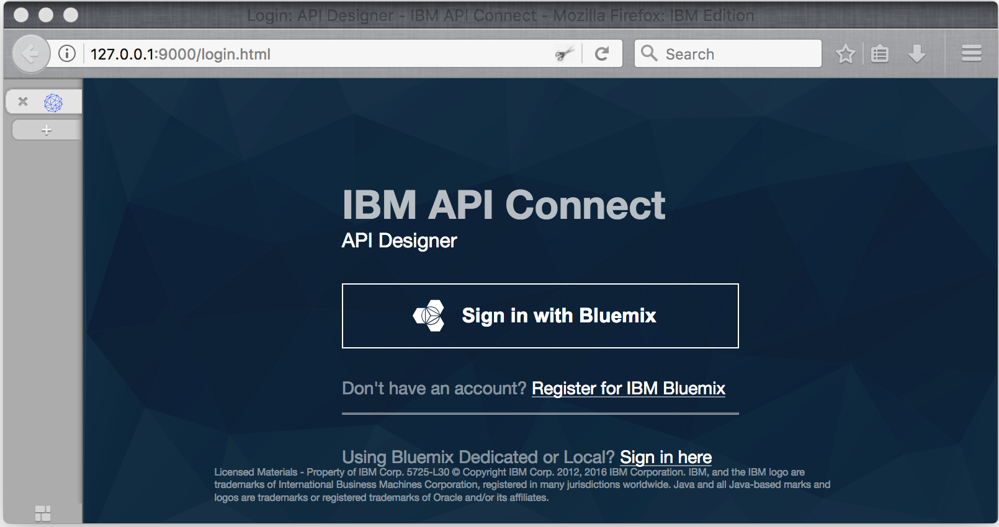

---
copyright:
  years: 2017
lastupdated: "2017-10-19"
---

{:new_window: target="blank"}
{:shortdesc: .shortdesc}
{:screen: .screen}
{:codeblock: .codeblock}
{:pre: .pre}

# API 仕様のインポートと既存の REST サービスへのプロキシー作成 (デベロッパーズ・ツールキットを使用する場合)
所要時間: 5 分  
スキル・レベル: ビギナー  

## 目標
このチュートリアルでは、{{site.data.keyword.apiconnect_short}} によって既存の API を管理制御下に置くため方法を取り上げます。このチュートリアルでは、OpenAPI 仕様をインポートしてから、既存の REST サービスのパススルー API プロキシーを作成します。

## 前提条件
始める前に、[API Connect インスタンスのセットアップ](tut_prereq_set_up_apic_instance.html)と [API Connect ツールキットのインストール](tut_prereq_install_toolkit.html)が必要です。

---

## サンプル・アプリケーションの探索とターゲット・エンドポイントのテスト

このチュートリアルで使用する _Weather Provider_ サンプル・アプリケーションは、作成されています。対応する API 仕様 (Swagger 2.0) は、[weather-provider-api_1.0.0.yaml ](https://raw.githubusercontent.com/ibm-apiconnect/getting-started/master/toolkit/1a-import/weather-provider-api_1.0.0.yaml){:new_window} ファイルにあります。

1. アプリケーションを探索するために、[http://gettingstartedweatherapp.mybluemix.net/ ](http://gettingstartedweatherapp.mybluemix.net/){:new_window} に移動します。  
2. アメリカの有効な 5 桁の郵便番号を入力して、_**現在の天候**_ と_**今日の予報**_ を入手します。  

3. 上の天候サンプル・アプリケーションは、天候データを提供する API を使用して作成されています。**現在の**天候データを取得するエンドポイントは、`https:// myweatherprovider.mybluemix.net/current?zipcode={zipcode}` です。[https://myweatherprovider.mybluemix.net/current?zipcode=90210 ](https://myweatherprovider.mybluemix.net/current?zipcode=90210){:new_window} にアクセスして、テストしてください。  

  

4. また、**今日の**予報データを取得するエンドポイントは、`https:// myweatherprovider.mybluemix.net/today?zipcode={zipcode}` です。[https://myweatherprovider.mybluemix.net/today?zipcode=90210 ](https://myweatherprovider.mybluemix.net/today?zipcode=90210){:new_window} にアクセスして、テストしてください。  

  

---

## サンプル・アプリケーションの OpenAPI 仕様のインポートと REST API プロキシーの作成
1. **API Designer** を起動します。端末ウィンドウで、`apic edit` コマンドを入力します。
2. IBMid を使用してログインします。
    
3. **API Designer** でナビゲーション・パネルが開いていることを確認します。表示されていない場合は、「>>」をクリックして開きます。
4. ナビゲーション・パネルで**「ドラフト」**をクリックします。
5. **「API」**タブに進みます。
6. 「API」タブで**「追加」**をクリックします。
7. ドロップダウン・メニューから**「ファイルまたは URL から API をインポート」**をクリックします。

8. このチュートリアルで使用する天候 API の OpenAPI 2.0 定義があります。「OpenAPI (Swagger) のインポート」ダイアログ・ボックスに `https://raw.githubusercontent.com/ibm-apiconnect/getting-started/master/toolkit/1a-import/weather-provider-api_1.0.0.yaml` という URL を入力します。

9. _「製品の追加」_オプションにチェック・マークを付けないでおき、**「インポート」**をクリックします。  
      

OpenAPI 仕様をインポートすると、API の「設計」ビューが表示されます。そこから OpenAPI 定義の各種セクションを確認できます。スクロールして内容を探索し、特に「ホスト」の値を確認してください。「ソース」タブで OpenAPI を表示することもできます。
_「ホスト」の値は `$(catalog.host)`_ に設定されています。これが API プロキシーの基本 URL です。
 

## API プロキシーのテスト

1. **「サーバーの開始」**アイコンを選択して、ローカル・テスト・サーバーを開始します。ゲートウェイが開始すると、状況が自動的に_**「実行中」**_に更新されます。

2. **「アセンブル」**タブを選択します。

3. 再生アイコン (>) をクリックして、API プロキシーのターゲット呼び出しをテストします。
   このチュートリアルでは組み込みの Micro Gateway を使用するので、**「Micro Gateway ポリシー」**が選択されていることを確認してください。

4. テスト・パネルで以下のようにします。
  - **get /current** 操作を選択します。  
  - この操作では郵便番号が必須パラメーターになっているので、アメリカの有効な郵便番号 (90210 など) を入力します。  
  - **「呼び出し」**を選択して、応答を確認します。

    CORS エラーになった場合は、エラー・メッセージに記されている手順を実行してください。エラーに含まれているリンクをクリックして例外をブラウザーに追加し、**「呼び出し」**を再びクリックします。
  
  - 予想される応答は、**「200 OK」**応答と郵便番号 90210 の現在の天候データです。
    

## まとめ

このチュートリアルでは、API パススルー・プロキシーによって既存の REST サービスを呼び出す方法を確認しました。まず、Web ブラウザーでサンプル・サービスを利用できるかどうかを確認しました。次に、API Connect で API プロキシーを作成し、そのプロキシーを呼び出し対象のサンプル・サービスにリンクしました。最後に、{{site.data.keyword.apiconnect_short}} の内部テスト・ツールでこのサービスをテストしました。

---

## 次のステップ

[レート制限](tut_rate_limit.html)、[クライアント ID と秘密鍵](tut_secure_landing.html)、[OAuth 2.0 を使用した保護](tut_secure_oauth_2.html)のいずれかを使用して API を保護します。

作成 > **管理** > 保護 > ソーシャル化 > 分析
