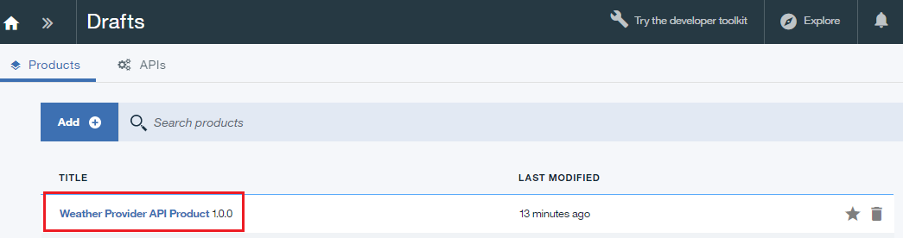
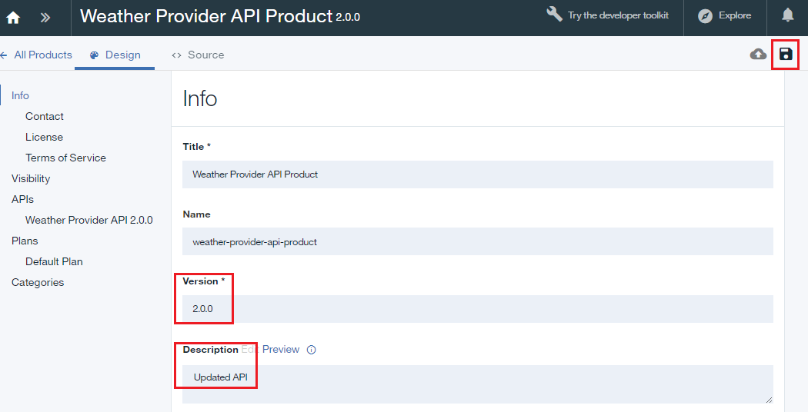
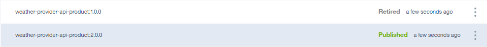

---

copyright:
  years: 2017
lastupdated: "2017-10-31"

---

{:new_window: target="_blank"}
{:shortdesc: .shortdesc}
{:screen: .screen}
{:codeblock: .codeblock}
{:pre: .pre}

# API 製品の置換
**所要時間**: 15 分  
**スキル・レベル**: ビギナー  

## 前提条件

1. [{{site.data.keyword.apiconnect_full}} インスタンスをセットアップします](tut_prereq_set_up_apic_instance.html)。

2. 以下のいずれかのチュートリアルを完了します。
 
    - [OpenAPI2.0 仕様のインポートと既存の REST サービスへのプロキシー作成](tut_rest_landing.html)
       **または**  
    - [新しい API 仕様の追加と既存の REST サービスの呼び出し](tut_rest_landing.html)

---
## 目標
このチュートリアルでは、既存の API 製品を新しい製品に置換して更新します。 API 製品を置換すると、変更内容がすぐに有効になり、すべてのアプリケーションのサブスクリプションが自動的に更新されます。  

---
## API 製品の置換
{: #repl_api_prod}

1. {{site.data.keyword.Bluemix_short}} にログインします ([https://console.ng.bluemix.net/login) ](https://console.ng.bluemix.net/login){:new_window}。

2. {{site.data.keyword.Bluemix_notm}} ダッシュボードで {{site.data.keyword.apiconnect_short}} サービスを起動します。

3. 以前に UI ナビゲーション・ペインをピン留めしていなかった場合は、API Manager で**「ナビゲート」**アイコン  をクリックします。 API Manager UI ナビゲーション・ペインが開きます。 UI ナビゲーション・ペインをピン留めするには、**「メニューのピン留め」**アイコン  をクリックします。

4. **「ドラフト」** > **「API」**をクリックします。

5. 「API」パネルで **Weather Provider API** をクリックして、REST プロキシー API を開きます。  

6. **バージョン**を 2.0.0 に変更します。  

7. ディスク・アイコンをクリックして、API の変更内容を保存します。  

8. **「すべての API」**をクリックします。  

9. **「製品」**をクリックします。  

10.	**Weather Provider API Product** を選択します。  

11.	**バージョン**を 2.0.0 に変更します。 **「説明」**フィールドに `Updated API` と入力します。 ディスク・アイコンをクリックして、変更内容を保存します。  

12.	**「ステージ」**アイコンをクリックして、新しいバージョンをアップロードします。 **「サンドボックス」** カタログが選択されていない場合は選択します。

    **注**: 新しいバージョンを別のカタログにステージングすることも可能です。そうすれば、そのバージョンの対象者をどの開発者にするかを制御できます。 開発、テスト、実動という順序で API 製品を移す時にこの機能を使用できます。

13.	**「>>」**をクリックしてナビゲーション・メニューを開き、**「ダッシュボード」**を選択します。  

14.	**「サンドボックス」**をクリックします。  

15.	**Weather Provider API Product 2.0.0 Staged** の行にある縦の省略符号をクリックします。  

16.	**「既存の製品の置換」**を選択します。  

17.	表示される製品リストで **Weather Provider API Product 1.0.0** を選択します。 **「次へ」**をクリックします。  

18.	**「デフォルトのプラン」**を選択します。 **「置換」**をクリックします。  

    このようにして置換すると、Weather Provider API Product 1.0.0 が破棄され、Weather Provider API Product 2.0.0 が公開されます。 **注**: 置換プロセスでこの製品に関連付けるプランを変更することも可能です。 そのようにして、API 製品のプランを簡単に変更できます。
  
 

## このチュートリアルで学習したこと

このチュートリアルでは、以下のアクティビティーを実行しました。
1. API 製品を更新しました。
2. 既存の API 製品を更新版の API 製品に置換しました。

---

