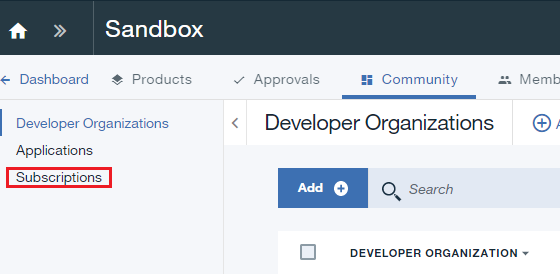
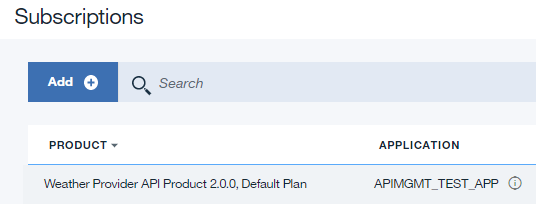
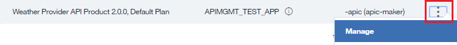

---

copyright:
  years: 2019
lastupdated: "2017-3-18"

subcollection: apiconnect

keywords: IBM Cloud, APIs, lifecycle, catalog, manage, toolkit, develop, dev portal, tutorial

---

{:new_window: target="_blank"}
{:shortdesc: .shortdesc}
{:screen: .screen}
{:codeblock: .codeblock}
{:pre: .pre}

# API 製品の取り替え
{: #tut_manage_supercede}

**所要時間**: 15 分  
**スキル・レベル**: ビギナー  

## 目標
{: #object_tut_manage_supercede}

このチュートリアルでは、既存の API を新しい API に取り替えます。

---
## 前提条件
{: #prereq_tut_manage_supercede}

1. [{{site.data.keyword.apiconnect_full}} インスタンスをセットアップ](/docs/services/apiconnect/tutorials?topic=apiconnect-tut_prereq_set_up_apic_instance)します。

2. [API 製品の置換のチュートリアル](/docs/services/apiconnect/tutorials?topic=apiconnect-tut_manage_replace)を完了します。

---

## API 製品の取り替え
{: #super_tut_manage_supercede}

1. {{site.data.keyword.Bluemix_short}} (https://cloud.ibm.com) にログインします。
2. {{site.data.keyword.Bluemix_notm}} の**ダッシュボード**で、**「Cloud Foundary サービス (Cloud Foundary Services)」**をクリックします。{{site.data.keyword.apiconnect_short}} サービスを起動します。 
3. {{site.data.keyword.apiconnect_short}} でナビゲーション・パネルが開いていることを確認します。 表示されていない場合は、**「>>」**をクリックして開きます。  

  

4. **「ドラフト」** > **「API」**をクリックします。

5. 「API」パネルで **Weather Provider API** をクリックして、REST プロキシー API を開きます。  

6. **バージョン**を 3.0.0 に変更します。

7. ディスク・アイコンをクリックして、API の変更内容を保存します。  

8. **「すべての API」**をクリックします。  

9. **「製品」**をクリックします。  

10.	**Weather Provider API Product 2.0.0** を選択します。  

11.	**バージョン**を 3.0.0 に変更します。 ディスク・アイコンをクリックして、変更内容を保存します。 **「ステージ」**アイコンをクリックします。  

12.	**「>>」**をクリックしてナビゲーション・ペインを開き、**「ダッシュボード」**を選択します。  

13.	**「サンドボックス」**をクリックします。

14.	**「コミュニティー」**をクリックします。  

15.	**「サブスクリプション」**をクリックします。  

16.	アプリケーションのサブスクリプションの対象が Weather Provider API Product 2.0.0 であることを確認します。 **「製品」**をクリックします。
  

17.	**Weather Provider API Product 3.0.0 Staged** の行にある縦の省略符号をクリックします。  

18.	**「既存の製品の取り替え」**を選択します。  

19.	表示される製品リストで **Weather Provider API Product 2.0.0** を選択します。 **「次へ」**をクリックします。  

20.	**「デフォルトのプラン」**を選択します。 **「取り替え」**をクリックします。  

    このようにして取り替えると、Weather Provider API Product 2.0.0 が非推奨になり、Weather Provider API Product 3.0.0 が公開されます。  
 
 
21.	**「コミュニティー」>>「サブスクリプション」**をクリックします。  

 
22.	**Weather Provider API Product 2.0.0** の行にある縦の省略符号をクリックします。 **「管理」**を選択します。  
 

23.	Weather Provider API Product 3.0.0 の下で**「デフォルトのプラン」**を選択します。 **「マイグレーション」**をクリックします。  

    このようにマイグレーションすると、Weather Provider API Product 2.0.0 が Weather Provider API Product 3.0.0 にマイグレーションされます。  
 
 

 
## まとめ
{: #conclusion_tut_manage_supercede}

このチュートリアルでは、以下のアクティビティーを実行しました。

1. API 製品を更新しました。
2. 既存の API 製品を更新版の API 製品に取り替えました。
3. 既存の API 製品のサブスクリプションを更新版の API 製品にマイグレーションしました。

---

