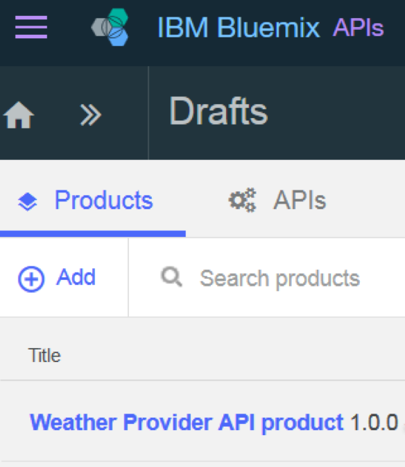
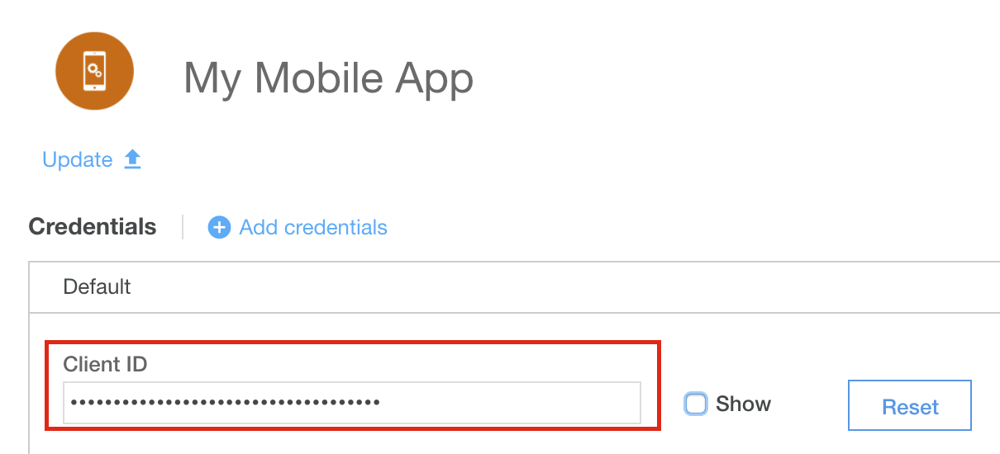

---

copyright:
  years: 2017
lastupdated: "2017-11-02"

keywords: IBM Cloud, APIs, lifecycle, catalog, manage, toolkit, develop, dev portal, tutorials

subcollection: apiconnect

---

{:new_window: target="_blank"}
{:shortdesc: .shortdesc}
{:screen: .screen}
{:codeblock: .codeblock}
{:pre: .pre}

# レート制限のセットアップ
{: #tut_rate_limit}

**所要時間**: 15 分  
**スキル・レベル**: ビギナー  

## 目標
{: #object_tut_rate_limit}

このチュートリアルでは、API のレート制限を設定する方法を取り上げます。 レート制限を設定すると、API や API 内の特定の操作のネットワーク・トラフィックを管理できます。 レート制限とは、特定の時間間隔内に実行できる呼び出しの最大数です。

{{site.data.keyword.apiconnect_full}} では、*製品* という形で、特定のユース・ケースや対象者に応じて API をグループ分けし、パッケージできます。 製品には*プラン* も組み込みます。プランによって、API 利用者に提示する条件を説明します。 さらに厳密に言えば、プランによって、API のサブスクリプションに関連したルールを定義します。つまり、API のレート制限と、サブスクリプションに承認が必要かどうかに関するルールです。

アプリケーション開発者は、API を利用する時に、使用する API が入っている製品を選択し、どのプランが使用ニーズを満たすかに基づいて、その製品のプランの 1 つをサブスクライブします。

このチュートリアルでは、以下の作業を行います。
1. 既存の製品で、新しいレート制限を組み込んだプランを作成します。
2. 許可されたレート制限をアプリケーションが超えた時の動作を確認します。

## 前提条件
{: #prereq_tut_rate_limit}

{{site.data.keyword.apiconnect_short}} で API を作成し、少なくとも API キーで保護しておく必要があります。 ここで取り上げる手順の開始点は、[ クライアント ID と秘密鍵](/docs/services/apiconnect/tutorials?topic=apiconnect-tut_secure_landing)を使用して保護されている、[Weather Provider API のサンプル・ファイル ](https://raw.githubusercontent.com/IBM-Bluemix-Docs/apiconnect/master/tutorials/weather-provider-api_1.yaml){: #new_window}です。

このチュートリアルを開始する前に、以下のチュートリアルを完了してください。
- [API 仕様のインポートと既存の REST サービスへのプロキシー作成](/docs/services/apiconnect/tutorials?topic=apiconnect-tut_rest_landing)
- [クライアント ID と秘密鍵による API の保護](/docs/services/apiconnect/tutorials?topic=apiconnect-tut_secure_landing)

---
## API Connect の起動
{: #launch_tut_rate_limit}

1. {{site.data.keyword.Bluemix_notm}} にログインします ([https://console.ng.bluemix.net/login) ](https://console.ng.bluemix.net/login){: #new_window}。
2. {{site.data.keyword.Bluemix_notm}} にログインしたら、**「すべてのサービス」**までスクロールダウンして、**「API Connect」**をクリックします。
3. **「API Connect」**をクリックして、{{site.data.keyword.apiconnect_short}} サービスを起動します。

## デフォルト・プランの探索
{: #explore_tut_rate_limit}

1. {{site.data.keyword.apiconnect_short}} のナビゲーション・パネルで**「ドラフト」**を選択します。 (ナビゲーション・パネルが開いていない場合は、**「>>」**をクリックして開いてください。)
2. **「製品」**タブを選択します。リストに Weather Provider API product が表示されます。

         

3. その製品のリンクをクリックします。「設計」ビューが開いてその製品に関する情報がリスト表示されます。
4. そのページの「プラン」セクションまでスクロールダウンします。 その製品の生成時にデフォルトのプランが作成されています。 

       
5. デフォルトのプランの詳細情報を展開します。 レート制限 (1 時間あたり 100 回の呼び出し) と API リストが表示されます。展開すれば、具体的な操作を確認できます。

    

   
## 新しいレート制限を組み込んだプランの作成
{: #create_tut_rate_limit}

デフォルトのプランについて確認できたので、レート制限を狭くした新しいプランを作成し、API 利用者がプランの制限を超えた場合の動作を確認します。 
1. 新しいプランを追加するためのボタンをクリックします。
 
     
    
    新しいプランが作成され、デフォルトで、無制限の使用に設定されます (つまり、レート制限がない状態です)。 このプランに意味のある名前を付けて、レート制限を狭くして設定します。 
2. 新しいプラン (`New Plan 1`) をクリックして、詳細情報を展開します。
3. 「タイトル」フィールドをクリックして、プランのタイトルを `Demo` に設定します。
4. 「名前」フィールドをクリックして、プラン名を `demo-plan` に設定します。
5. 「+」をクリックして、新しいレート制限を追加します。
6. 新しいレート制限の名前を `demo-rate-limit` に変更し、確実に `1 分あたり 1 回`に設定します。
7. `「ハード制限の強制」`チェック・ボックスにチェック・マークを付けます。 (この設定を有効にすると、アプリケーションによる API の呼び出し回数が、サブスクライブしたプランの制限を超えた時に、エラーが生成されます)。
8. 他のすべてのデフォルト設定を受け入れて、製品を保存します。

    

## 更新版の製品のサンドボックス・カタログへのステージングと公開
{: #stage_tut_rate_limit}

前の例でテスト・ツールを使用して製品を公開した場合、テスト・ツールは、テスト・アプリケーションにあらかじめ用意されている資格情報で API を呼び出していました。 しかし、このテスト・アプリケーションにはレート制限が適用されないので、レート制限について学習するために、ここで新しいアプリケーションを作成する必要があります。 詳しくは、[API Connect に関する IBM Knowledge Center のコンテンツ ](https://www.ibm.com/support/knowledgecenter/SSFS6T/com.ibm.apic.toolkit.doc/tapim_create_product.html){: #new_window} を参照してください。

1. 「公開」アイコンをクリックして、**サンドボックス**・カタログに製品を*ステージング* します。 このアクションによって、製品のドラフトの変更が選択対象のカタログに追加されます。 次に、製品の変更を*公開* する必要があります。そうすることで、利用者が開発者ポータルでその製品を使用できるようになります。
 
2. 「>>」ボタンをクリックしてナビゲーション・メニューを開きます。
3. 「ダッシュボード」を選択し、**「サンドボックス」**カタログを開きます。 Weather Provider API Product が**「ステージング済み」**の状態で表示されます。
4. 省略符号をクリックし、メニューから**「公開」**を選択します。
 
5. デフォルトの表示設定を受け入れ、**「公開」**ボタンをクリックします。 製品が公開されて開発者ポータルに表示されると、アプリケーション開発者は、使用可能なプランをサブスクライブできるようになります。

## 開発者ポータルでの新しい (利用者用) アプリケーションの登録
{: #reg_tut_rate_limit}

アプリケーション開発者は、開発者ポータルで API を検出して利用します。 開発者ポータルについて詳しくは、[IBM Knowledge Center のこのトピック ](https://www.ibm.com/support/knowledgecenter/SSFS6T/com.ibm.apic.devportal.doc/tapim_tutorial_using_ADP.html){: #new_window} で確認してください。

初めて開発者ポータルで作業する場合は、サンドボックス・カタログを使用できるように開発者ポータルをプロビジョンする必要があります。 ポータルのプロビジョンを実行する時にログインで使用したアカウントが、ポータルの管理アカウントになります。 API の探索やテストのためには、その管理アカウント以外の新しい開発者アカウントを (別の E メール・アドレスを使用して) 作成し、そのアカウントでログインする必要があります。

その作業を実行する時に、以下の手順を参考にしてください。

1. 開発者ポータルを起動します。 URL が分からない場合は、サンドボックス・カタログの「設定」タブで確認してください。 開発者ポータルで初めてプロビジョンを実行する場合、[「開発者ポータルのセットアップと構成」](/docs/services/apiconnect/tutorials?topic=apiconnect-tut_config_dev_portal)を参照してください。
    - 完了までに最大で 1 時間かかる場合があります。 サンドボックス開発者ポータルの準備ができると、新しい開発者ポータル・サイトのリンクが記載された E メールが送られてきます。 このリンクは、管理者アカウント用の 1 回限り使用するリンクです。
2. アプリケーション開発者の資格情報 (IBMid **ではない**) を使用してポータルにログインします。 ***(必要なら、IBMid 以外のアドレスを使用して新しい開発者アカウントを作成してください。)***
3. ツールバーにある**「アプリケーション」**リンクをクリックし、**「新しいアプリケーションの作成」**ボタンをクリックします。

4. アプリケーションにタイトルを付けて、**「サブミット」**をクリックします。

   
5. 表示されるクライアント ID とクライアント秘密鍵を保存します。 クライアント秘密鍵をコピーするチャンスは、この時しかありません。

   
   
   

## API 製品のサブスクライブ
{: #subscr_tut_rate_limit}

1. ツールバーの**「API 製品」**リンクをクリックします。 リストに Weather Provider API Product が表示されます。 

   
2. リンクをクリックして、詳細情報とオプションを表示します。 2 つのプラン (元のデフォルトのプランと新しい Demo プラン) が表示されるはずです。 (1 つのプランしか表示されない場合は、{{site.data.keyword.apiconnect_short}} に戻り、製品の変更が保存され、サンドボックス・カタログにステージングおよび公開されているかどうかを確認してください。) 

   
3. **「サブスクライブ」**をクリックして Demo プランをサブスクライブし、先ほど登録したアプリケーションを選択します。 これで、そのプランに関連する API をアプリケーションから呼び出せるようになります。レートは、1 分あたり最大 *1 回* の API 呼び出しです。 

この動作をテストして、アプリケーションが指定のレートを超えた時に何が起こるかを確認するための準備ができました。

## レート制限を組み込んだ API の呼び出し
{: #call_tut_rate_limit}

1. 開発者ポータルの Weather Provider API Product のページでその API のリンクをクリックします。

   
2. ページが最新表示され、その API と各操作に関する詳細が表示され、テストが可能になります。 (API 利用者が API を検出してテストする時も同じ要領になります。) 暗いテスト・ペインに注目してください。そして、最初の **「この操作を試してみる」**セクションまでスクロールダウンします。

3. `GET /current` 操作をテストするために、アプリケーションのクライアント秘密鍵と有効な郵便番号を入力します。 **「操作の呼び出し」**ボタンをクリックします。 `「200 OK」`応答とその郵便番号のエリアの現在の天候に関するデータが表示されるはずです。 

   

   

4. 1 分が経過する前に、**「操作の呼び出し」**ボタンを再びクリックします。別の郵便番号を使用してもかまいません。 今回は、`「429 Too Many Requests」`応答が表示されるはずです。

   

5. レート制限のリセットを確認するために、1 分が経過するまで待って、再び操作を実行し、有効な応答が返ってくることを確認します。

## まとめ
{: #conclusion_tut_rate_limit}

レート制限を組み込んだプランの作成、およびセキュアな API に関連付けが完了しました。さらに、指定のパラメーター範囲内の要求だけに API が正常に応答することを確認しました。

---

## 次のステップ
{: #next_tut_rate_limit}

[開発者ポータルのセットアップと構成](/docs/services/apiconnect/tutorials?topic=apiconnect-tut_config_dev_portal)に進んで、API のソーシャル化を開始します。

作成 > 管理 > **保護** > ソーシャル化 > 分析
