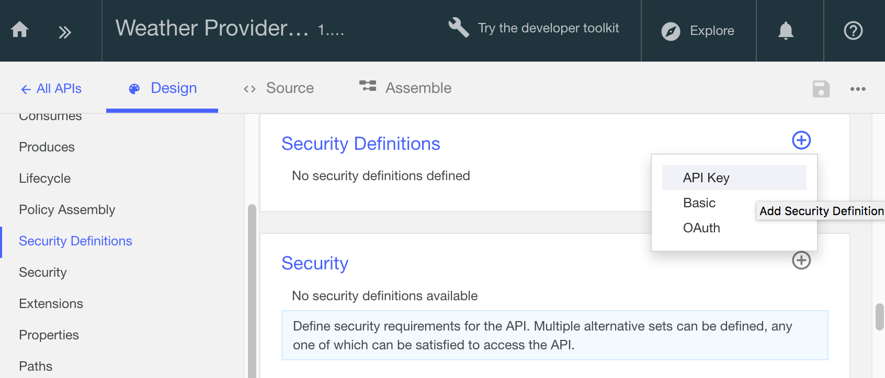
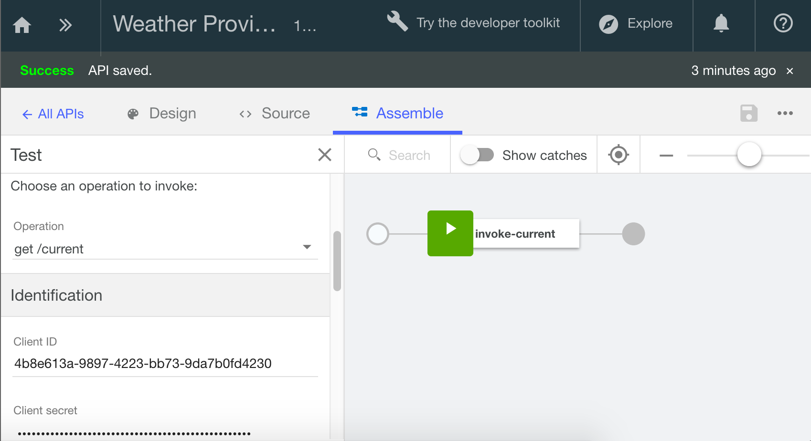

---

copyright:
  years: 2017
lastupdated: "2017-10-31"

keywords: IBM Cloud, APIs, lifecycle, catalog, manage, toolkit, develop, dev portal, tutorials

subcollection: apiconnect

---

{:new_window: target="blank"}
{:shortdesc: .shortdesc}
{:screen: .screen}
{:codeblock: .codeblock}
{:pre: .pre}

# クライアント ID とクライアント秘密鍵による API の保護 ({{site.data.keyword.Bluemix_notm}} を使用する場合)
{: #tut_secure_id_secret_bm}

**所要時間:** 10 分  
**スキル・レベル:** ビギナー

## 目標
{: #object_tut_secure_id_secret_bm}
このチュートリアルでは、クライアント ID とクライアント秘密鍵によって API を保護する手順を取り上げます。 開発者ポータルにアプリケーションを登録すると、そのアプリケーションを識別するためのクライアント ID が生成されます。 オプションとして、パスワードの役割を果たすクライアント秘密鍵を生成することもできます。 アプリケーションから API にアクセスするには、生成されたクライアント ID とクライアント秘密鍵を指定する必要があります。

## 前提条件
{: #prereq_tut_secure_id_secret_bm}

始める前に、以下のチュートリアルのいずれかを完了しておく必要があります。 
- [OpenAPI2.0 仕様のインポートと既存の REST サービスへのプロキシー作成](/docs/services/apiconnect/tutorials?topic=apiconnect-tut_rest_landing)  
**または**  
- [新しい API 仕様の追加と既存の REST サービスの呼び出し](/docs/services/apiconnect/tutorials?topic=apiconnect-tut_rest_landing)

## API の識別メカニズムの設定
{: #set_id_tut_secure_id_secret_bm}

1. API の「設計」ビューに移動します。  
   a. 左側のナビゲーション・パネルで**「ドラフト」**をクリックします。  
   b. **「API」**タブをクリックします。  
   c. 前のチュートリアルで作成した _Weather Provider API_ をクリックします。 その API の**「設計」**ビューが表示されます。  
     

2. 「設計」ビューで以下のようにします。
    a. **「セキュリティー定義」**までスクロールダウンします。  
    b. **「セキュリティー定義の追加」**アイコン (+) をクリックし、**「API キー」**をクリックします。  
    c. 以下に示す 2 つの新しい API キーを追加します。 どちらの新しいキーについても、「場所」フィールドを「ヘッダー」に設定してください。  
      - 名前: クライアント ID。パラメーター名: X-IBM-Client-Id  
      - 名前: クライアント秘密鍵。パラメーター名: X-IBM-Client-Secret    
          

3. **「セキュリティー」**パネルまでスクロールダウンして、新しいセキュリティー・オプションを追加します。  
    a. 新しく作成したクライアント ID とクライアント秘密鍵を選択します。  
    b. API を保存します。  
    c. **「アセンブル」**タブに切り替えます。  
      

## API に対する変更のテスト
{: #test_tut_secure_id_secret_bm}

1. 「アセンブル」タブで「►」ボタンをクリックして、変更をテストします。

2. 「テスト / セットアップ」パネルで**「製品の再公開」**をクリックして、最新の変更内容を取り込みます。 
> このオプションによって API 製品が更新され、サンドボックス・カタログに公開されます。

3. 製品を再公開したら、テスト・パネルで **get /current** 操作をクリックします。
4. テスト・パネルでスクロールダウンし、クライアント ID とクライアント秘密鍵の値が既に取り込まれていることを確認します。 
> そのデータは、サンドボックスで生成されたテスト値であり、API を使用するアプリケーションのキーになります。
> **注:** クライアント ID とクライアント秘密鍵は、「ダッシュボード」>「カタログ」>「設定」>「エンドポイント」でも確認できます。   
  
  

5. さらにスクロールダウンして、郵便番号 (90210 など) を入力します。 
6. **「呼び出し」**をクリックします。 _「200 OK」応答と天候情報のメッセージ本文が返されるはずです。_
7. スクロールして「クライアント ID」フィールドに戻ります。 
8. クライアント ID の値をランダムな値に置き換えます。
9. **「呼び出し」**をクリックしてテストを再実行します。 _「401 Unauthorized」応答と、クライアント ID が登録されていないというメッセージが返されます。_  

      

## クライアント ID とクライアント秘密鍵を使用した API の呼び出し
{: #call_tut_secure_id_secret_bm}

セキュリティー設定のテストは、「探索」ツールでも行えます。そのツールでは、プロキシー・エンドポイントを明示的に呼び出し、クライアント ID とクライアント秘密鍵をヘッダーの値として渡します。

1. **「探索」**をクリックし、**「サンドボックス」**をクリックします。

2. リストから **GET /current** 操作をクリックします。

3. 右側の列にある**「操作の呼び出し」**をクリックして、テストを再実行します。

---

## まとめ
{: #conclusion_tut_secure_id_secret_bm}

このチュートリアルでは、API の識別メカニズムを設定する方法、API に対する変更をテストする方法、クライアント ID とクライアント秘密鍵を使用して API を呼び出す方法を学習しました。 

---

## 次のステップ
{: #next_tut_secure_id_secret_bm}

[開発者ポータルのセットアップと構成](/docs/services/apiconnect/tutorials?topic=apiconnect-tut_config_dev_portal)に進んで、API のソーシャル化を開始します。

作成 > 管理 > **保護** > ソーシャル化 > 分析
