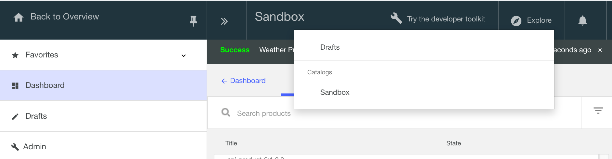

---
copyright:
  years: 2017
lastupdated: "2017-12-13"
---

{:new_window: target="blank"}
{:shortdesc: .shortdesc}
{:screen: .screen}
{:codeblock: .codeblock}
{:pre: .pre}

# 2-legged OAuth による API の保護

所要時間: 10 分  
スキル・レベル: ビギナー

## 目標

このチュートリアルでは、2-legged OAuth 2.0 のフローを使用して API を保護する手順を取り上げます。 このアプリケーション・フローの場合、OAuth クライアントは、許可サーバーへの要求を開始して、アクセス・トークンを受け取ります。 OAuth クライアントは、そのトークンを使用して、API 経由で保護リソースにアクセスできます。

## 前提条件

開始する前に、以下のチュートリアルを完了しておく必要があります。  
- [クライアント ID とクライアント秘密鍵による API の保護 ({{site.data.keyword.Bluemix}} を使用する場合)](tut_secure_id_secret_bm.html)
または
- [クライアント ID とクライアント秘密鍵による API の保護 (ツールキットを使用する場合)](tut_secure_id_secret_tk.html)

注: このチュートリアルでは、{{site.data.keyword.Bluemix}} UI 内でタスクを実行する手順とスクリーン・ショットを紹介します。コマンド・ラインでも同じ手順を行うことができます。その手順については、[IBM Knowledge Center](https://www.ibm.com/support/knowledgecenter/SSMNED_5.0.0/com.ibm.apic.toolkit.doc/tutorial_apionprem_security_OAuth_v506.html) を参照してください。 

## 手順

1. OAuth プロバイダー API を作成し、OAuth スキームを選択します。  
	a. **「ドラフト」**を開き、**「API」**を選択し、**「追加」**>**「OAuth 2.0 プロバイダー API」**をクリックします。  
    
	b. 「OAuth Endpoint API」というタイトルを付けます。 名前と基本パスのデータは自動的に取り込まれます。  
	c. **「API の作成」**を選択します。  
	d. 新しく作成した OAuth Endpoint API で**「OAuth 2」**パネルに移動して (スクロールダウンして)、クライアント・タイプとして「機密」を選択します。  
	e. 「スコープ」で _scope1_ という名前を _view_current_ に変更します。 _scope2_ と _scope3_ は削除します。  
	f. **「付与」**で、**「暗黙」**、**「パスワード」**、**「アクセス・コード」**を選択解除します。 **「アプリケーション」**は選択したままにします。  
	  
	g. API を保存します。  

2. Weather Provider API のセキュリティー定義を更新して OAuth を組み込みます。  
	a. _Weather Provider API_ に切り替えます。 (「API」に戻ってから _Weather Provider API_ を選択します。)  
	b. 「セキュリティー定義」で OAuth の新しい定義を追加します。 「OAuth definition」という名前を付けます。  
	c. 「フロー」フィールドで**「アプリケーション」**を選択します。  
	d. トークンの URL (_<基本 URL>/oauth-endpoint-api/oauth2/token_) を入力します。  
	e. 新しいスコープ view_current を追加します。  
	
	f. **「セキュリティー」**で **OAuth Definition** と **view_current** を選択し、クライアント ID とクライアント秘密鍵を選択した状態のままにします。  
	
	g. 「保存」をクリックします。  
	h. **「ドラフト」**に戻って、**「製品」**を選択します。 OAuth Endpoint API を Weather Provider 製品に追加します。  
	i. 製品を保存し、それをサンドボックスにステージングします。  
	

3. OAuth セキュリティー構成をテストします。  
	a. 更新版の製品をサンドボックスに公開します。 **「ダッシュボード」>「サンドボックス」**をクリックして、製品を公開します。  
	  
	b. **「探索」>「サンドボックス」**をクリックします。  
      
	c. **Weather Provider API** の操作のリストで **GET /current** をクリックします。  
	d. 右側のパネルで、クライアント ID とクライアント秘密鍵のデータが既に取り込まれていることを確認します。  
	e. **「パラメーター」**セクションで郵便番号を入力します。  
      
	f. **「許可」**セクションで**「許可」**をクリックして、アクセス・トークンを取得します。  
	g. アクセス・トークンを受け取ったら、**「操作の呼び出し」**をクリックしてテストを実行します。  
      

4. この要求には、アクセス・トークン、クライアント ID、クライアント秘密鍵が含まれています。 要求でアクセス・トークンだけを渡すには、Weather Provider API のセキュリティー要件からクライアント ID とクライアント秘密鍵を除外する必要があります。  
    

5. Weather Provider API を保存します。 それをサンドボックスにステージングしてから公開します。 前と同じ要領で「探索」ツールから同じテストを実行します。  
    
    
## まとめ
このチュートリアルでは、OAuth Provider API を作成する方法、API のセキュリティー定義を更新して OAuth を組み込む方法、セキュリティー構成をテストする方法を学習しました。

---

## 次のステップ

[開発者ポータルのセットアップと構成](tut_config_dev_portal.html)に進んで、API のソーシャル化を開始します。

作成 > 管理 > **保護** > ソーシャル化 > 分析
