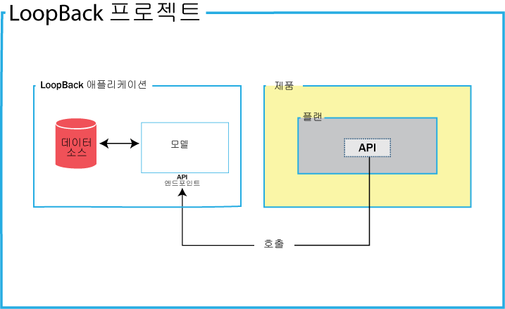
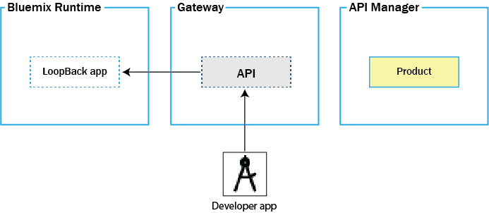
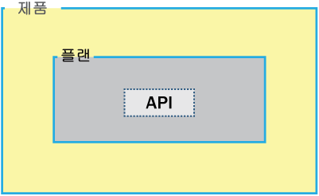

---

copyright:
  years: 2017
lastupdated: "2017-07-18"

---

{:new_window: target="_blank"}
{:shortdesc: .shortdesc}
{:screen: .screen}
{:codeblock: .codeblock}
{:pre: .pre}

# IBM API Connect 정보

{{site.data.keyword.apiconnect_full}}
서비스를 사용하여 Node.js 및 Java 런타임을 기반으로 API 및 마이크로서비스를 빠르게 작성할 수 있습니다. 
이를 작성한 후에는 API를 애플리케이션 개발자와 공유하면서
다양한 레벨의 보안, 가시성 및 비율 한계를 설정하여 비즈니스 수준의 제어로 API를 관리할 수 있습니다. 또한 {{site.data.keyword.apiconnect_short}}
서비스는 구조화되고 필터링된 검색으로 상세 분석을 수행함으로써 통찰력을 발휘하여
사용자 비즈니스를 변환하고 성장시킬 수 있는 도구를 사용자에게 제공합니다. 

<object height="315" type="application/x-shockwave-flash" width="560"
data="https://www.youtube.com/v/lmxyiNMER5Y?version=3&amp;hl=en_US">
<desc>이 동영상에서는 {{site.data.keyword.apiconnect_short}} 서비스의 개요를 제공합니다.</desc>
<param name="movie" value="https://www.youtube.com/v/lmxyiNMER5Y?version=3&amp;hl=en_US"/>
<param name="allowFullScreen" value="true"/>
<param name="allowscriptaccess" value="always"/>
<param name="scale" value="noScale"/>
</object>

## API 작성

{{site.data.keyword.apiconnect_short}}에서 사용자는
Swagger 정의로부터 API를 가져올 수 있습니다. 또는 프록시 URL을 사용하거나 HTTP 데이터 소스에서 데이터를 어셈블하여
API를 작성할 수도 있습니다. 또한 {{site.data.keyword.apiconnect_short}}는
오프라인 API 작성 및 테스트도 지원합니다. 개발자 툴킷에는 마이크로 게이트웨이가 임베디드되어 있으며, 이를 사용하면
SQL 데이터베이스 등의 백엔드 데이터 소스에 연결하고 작성, 읽기, 업데이트 및 삭제 기반 오퍼레이션을
수행할 수 있습니다. 

API는 개발자 툴킷 내에서 작성됩니다. 개발자 툴킷에는 CLI 및 API Designer 그래픽 사용자 인터페이스가
포함되어 있습니다. 개발자 툴킷에 액세스하려면 npm에서 이를 다운로드하고
설치해야 합니다.
툴킷을 설치할 때는 LoopBack 프로젝트 작성으로 시작하십시오. 다음 다이어그램은
LoopBack 프로젝트 내에 포함된 항목을 보여줍니다. 

- **LoopBack 프로젝트**: LoopBack 프로젝트에는 LoopBack 애플리케이션과 API 제품이 포함되어 있습니다.

- **LoopBack 애플리케이션**: LoopBack 애플리케이션 내에는 데이터 소스, 비즈니스 자산 또는 클라우드 서비스에 대한 액세스를
제공하는 API 엔드포인트가 있습니다.

- **제품**: 제품은 API를 공개할 수 있도록 허용하는 단위입니다. 제품에는 플랜이 포함되어 있으며,
플랜에는 호출 시에 API 엔드포인트를 호출하는 API가 포함되어 있습니다. 

다음 다이어그램은 개발자 툴킷 CLI 또는 UI에서 공개된 이후
LoopBack 애플리케이션, API 및 제품이 배치되는 위치를 보여줍니다. 

- **{{site.data.keyword.Bluemix_short}} 런타임**:
LoopBack 앱은 사용자가 선택한 {{site.data.keyword.Bluemix_short}} 런타임에 배치됩니다.

- **게이트웨이**: API는 게이트웨이에 배치됩니다.

**API Manager**: 제품은 사용자가 사용 방법을 지정할 수 있는 API Manager에 배치됩니다. 

API를 작성하는 데 필요한 태스크에 대한 자세한 정보는 [API 작성](creating_apis.html)을 참조하십시오.

## API 관리 개요

제품이 스테이징되고 공개된 이후에는 API Manager를 열어서 보안, 비율 한계 및 정책을 관리한 후에 해당 제품을 개발자 포털에 공개할 수 있습니다. 

다음 다이어그램에 표시된 대로, 제품에는 API가 포함된 플랜이 들어 있습니다. 

### 플랜

고객이 API를 사용할 수 있도록 하려면 이를 플랜에 포함해야 합니다. 플랜은 서로 다른 오퍼링을 서로 간에 구분하는 데 사용됩니다. 플랜은 API를 공유할 수 있지만, 등록 승인이 필요한지 여부는 해당 플랜마다 다릅니다. 또한 사용자는 플랜을 통해 또는 플랜의 비율 한계를 대체하는 플랜 API 내의 오퍼레이션을 통해 비율 한계를 적용할 수 있습니다. 

### 제품

플랜 및 API는 제품에서 그룹화되어 있습니다. 제품을 통해 사용자는 API 및 플랜의 가용성 및 가시성을 관리할 수 있습니다. API Designer를 사용하면 제품을 작성, 편집하고 스테이징할 수 있습니다. API Manager를 사용하면 제품의 라이프사이클을 관리할 수 있습니다. 

다음 다이어그램은 제품, 플랜 및 API가 어떻게 서로 관련되는지 보여줍니다. 어떻게 플랜이 한 제품에만 속해 있고, 동일 제품 내에서 다른 플랜에 대한 서로 다른 API를 보유할 수 있으며, 어느 제품의 플랜과도 API를 공유할 수 있는지 참고하십시오. 제품, 플랜 및 API의 계층 구조를 표시하는 그림입니다. 

사용자는 제품 내에서만 플랜을 작성할 수 있으며, 이 제품은 나중에 카탈로그에서 공개됩니다. 그리고 나서 라이프사이클 관리자는 API Manager를 통해 API 및 플랜의 가용성과 가시성을 제어할 수 있습니다. 개발자 포털을 통해 고객은 API Manager에서 판별된 대로 자신이 사용할 수 있는 플랜 중 하나를 등록할 수 있습니다. 사용자는 특정 제품에서 하나의 플랜만 등록할 수 있습니다. 비슷한 목적을 달성할 수 있지만
서로 다른 성능 레벨을 지닌다는 점에서, 단일 제품 내의 다중 플랜은 유용합니다. 예를 들어, 하나의 API가 사용 가능한 "데모 플랜"과 여러 API가 사용 가능한 "전체 플랜"이 있을 수 있습니다. 

고객이 사용할 수 있는 API를 제어함은 물론, 서로 다른 플랜을 사용하여 비율 한계를 구현할 수 있습니다. 비율 한계는 전체 플랜에 대한 기본 비율로 구현되거나 해당 플랜 내의 API의 특정 오퍼레이션에 대해 구현될 수 있으며 이 경우 해당 오퍼레이션은 플랜 비율 한계에서 제외됩니다. 서로 다른 플랜은 오퍼레이션 사이에 그리고 전체 한계에 대해 서로 다른 비율 한계를 가질 수 있습니다 .이는 고객에게 다양한 서비스 레벨을 제공하는 데 유용합니다. 예를 들어, "데모 플랜"은 분당 10개 호출의 비율 한계를 적용할 수 있으며 "전체 플랜"은 분당 최대 1000개 호출까지 허용할 수 있습니다. 

**참고:** 플랜 레벨에서 비율 한계를 적용하면 플랜 내의 각 오퍼레이션에 적용되는 기본 비율 한계가 작성됩니다. 특정 오퍼레이션에 대해 특정 비율 한계를 설정해야 하는 경우에는 오퍼레이션 자체 내에 이를 설정해야 하며 이 설정은 플랜 레벨의 설정을 대체합니다. 

IBM API Connect는 제품의 다중 버전 구현도 지원합니다. 버전 번호를 선택하고 이를 사용하여 제품 및 플랜의 개발을 지원할 수 있습니다. 

**참고:** 제품의 버전은 연관된 플랜에 포함된 API의 버전과 구분됩니다. 플랜은 자체 소유 버전을 직접 보유할 수 없으며, 이는 해당 상위 제품의 버전을 사용합니다. 

API를 관리하는 데 필요한 태스크에 대한 자세한 정보는 [API 관리](managing_apis.html)를 참조하십시오.

### 카탈로그

애플리케이션 개발자가 제품을 사용할 수 있도록 하려면 제품을 카탈로그에 스테이징한 다음 개발자 조직에 공개해야 합니다. {{site.data.keyword.apiconnect_short}}에서 카탈로그를 여러 개 작성할 수 있습니다. 카탈로그는 개발자 조직에 사용 가능하도록 하기 전에 테스트할 제품 및 API를 분리하는 데 유용합니다.

카탈로그는 스테이징 대상이며, 개발자 포털 및 게이트웨이의 논리 파티션으로 작동합니다. API 호출 및 개발자 포털에 대한 URL은 특정한 카탈로그에 고유합니다. 일반 구성의 API 제공자 조직은 개발 중인 API를 테스트하는 개발 카탈로그와 전체 사용 준비가 완료된 API를 호스트하는 프로덕션 카탈로그를 사용합니다. 일반적인 접근법에는 개발 카탈로그, 일부 테스트 카탈로그, 자체 테스트 카탈로그가 포함된 프로덕션 클라우드가 포함됩니다. 

#### 카탈로그 설정

카탈로그에 다음 설정을 적용할 수 있습니다. 

- **개발**: 기본적으로 사용자에게 개발 카탈로그가 제공됩니다. 개발 카탈로그는 테스트 용도로만 사용해야 합니다. 개발 카탈로그에서는 스테이징 및 공개 조치가 강제 실행되는데 이는 이전에 공개된 제품을 다시 공개하는 경우 경고 없이 겹쳐쓰는 것을 의미합니다. 충돌이 발견되는 경우 시스템이 자동으로 충돌을 해결합니다. 공개 취소 조치가 자동으로 발생합니다. 개발 카탈로그에서 테스트 도구를 사용하면 개발자 포털에서 오퍼레이션을 사용 중인 경우라도 테스트하는 모든 제품이 강제 실행되어 스테이징 및 공개된 제품을 겹쳐씁니다. 개발 카탈로그에서 작성된 개발자 포털은 동일한 방식으로만 사용해야 합니다. 즉, 테스트 용도로만 사용하고 실제 사례에는 쓰면 안 됩니다. 

- **자동 등록**: 카탈로그에 자동 등록을 사용하면 사전 제공된 클라이언트 ID 및 클라이언트 시크릿과 함께 테스트 애플리케이션이 사용되므로 API Manager 사용자 인터페이스에서 API를 더 쉽게 테스트할 수 있으며, 이는 카탈로그에서 모든 플랜에 자동으로 등록되어 사용자가 테스트 시 플랜 또는 애플리케이션을 지정할 필요가 없습니다. 테스트 애플리케이션은 비율 한계가 적용되지 않습니다. 자동 등록은 개발 카탈로그에 대해서만 가능합니다. 

- **기본값**: 카탈로그 중 하나를 기본 카탈로그로 설정할 수 있습니다. 그러면 카탈로그에 공개된 API에 대한 호출은 카탈로그 이름이 포함되지 않은 단축형 URL을 사용할 수 있습니다. 

개발자 포털에 대한 자세한 정보는 [API 감지 및 사용](https://www.ibm.com/support/knowledgecenter/en/SSFS6T/com.ibm.apic.devportal.doc/capim_devportal_overview.dita)을 참조하십시오. 

### 신디케이션

{{site.data.keyword.apiconnect_full}} 신디케이션 기능으로
카탈로그를 영역으로 파티셔닝할 수 있습니다. 각 영역은 서로 다른 API 제공자 개발 팀에서 사용하며
연관 팀이 해당 영역에 공개하는 API와 관련된 자체 관리 기능 세트가 있어서
개별 팀이 자체 API를 독립적으로
관리할 수 있습니다. 

API를 영역이 설정된 카탈로그에 스테이징하거나 공개할 때, 스테이징 또는 공개 대상인 카탈로그
내에 영역을 지정합니다. 그러나 카탈로그의 개발자 포털에 액세스하는 애플리케이션 개발자는
카탈로그의 영역 파티셔닝을 알지 못하며 API를 조정된 오퍼링으로 취급합니다.
각 영역에는 자체의 제품 라이프사이클 관리, 등록 승인, 분석 데이터가 있습니다.
영역별 액세스 제어를 사용하여 각 영역에 대한 사용자 액세스를 제한합니다.
예를 들어, Flights 팀의 개발자는 API를 Flights 영역에만
스테이징할 수 있습니다. 

**참고:** 기본적으로 카탈로그에는 영역이 설정되어 있지 않습니다. 카탈로그 설정을 수정하여
영역을 사용할 수 있습니다. 

카탈로그를 파티셔닝하려면 [카탈로그 파티셔닝](create_catalog.html#apic_spaces)을 참조하십시오.
