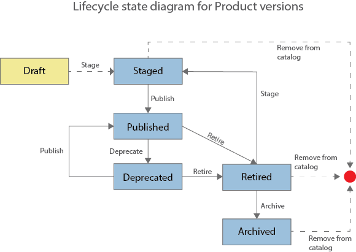

---
copyright:
  years: 2017
lastupdated: "2017-12-15"
---

{:new_window: target="blank"}
{:shortdesc: .shortdesc}
{:screen: .screen}
{:codeblock: .codeblock}
{:pre: .pre}

# 제품 관리

제품 관리 방법에 대한 세부사항은 IBM&reg; Knowledge Center 문서 [제품 관리 ](http://www.ibm.com/support/knowledgecenter/SSFS6T/com.ibm.apic.apionprem.doc/task_product_management.html){:new_window}을 참조하십시오.

## 제품 라이프사이클
{: #prod_lifecycle}

제품 버전을 관리할 때 사용자는 일련의 라이프사이클 상태를 통해
이를 이동합니다. 즉, 처음에는 드래프트 제품 버전을 환경에 스테이징하고, 애플리케이션 개발자가
해당 제품 버전을 사용할 수 있도록 공개하는 과정을 거친 후에, 최종적으로는 이를 폐기하고
아카이브합니다. 다음에 나오는 표와 다이어그램에서는 제품 버전의 다양한 제품 라이프사이클
상태를 설명합니다.

<table summary="" id="apic_004__table_lym_rxj_gv" class="defaultstyle"><caption class="style-scope doc-content">표 1. API Management 제품 라이프사이클 상태</caption>
<thead class="style-scope doc-content">
<tr class="style-scope doc-content doc-tr-even">
<th style="width: 11.25%" id="d3569e1968" class="thleft thbot style-scope doc-content">시/도</th>
<th style="width: 88.75%" id="d3569e1970" class="thleft thbot style-scope doc-content">설명</th>
</tr>
</thead>
<tbody class="style-scope doc-content">
<tr class="style-scope doc-content doc-tr-odd">
<td style="width: 11.25%" headers="d3569e1968 " class="style-scope doc-content">드래프트</td>
<td style="width: 88.75%" headers="d3569e1970 " class="style-scope doc-content">제품이 배치되지 않았으며 API Connect 카탈로그와 연관되어 있지 않습니다.</td>
</tr>
<tr class="style-scope doc-content doc-tr-even">
<td style="width: 11.25%" headers="d3569e1968 " class="style-scope doc-content">스테이징됨</td>
<td style="width: 88.75%" headers="d3569e1970 " class="style-scope doc-content">제품 버전의 변경 불가능한 사본이 대상 환경에
배치됩니다. 스테이징됨은 드래프트 제품에서 스테이징할 때의 초기 상태입니다. 
제품이 스테이징됨 상태인 경우, 개발자는 아직 이를 보거나 등록할 수 없습니다.</td>
</tr>
<tr class="style-scope doc-content doc-tr-odd">
<td style="width: 11.25%" headers="d3569e1968 " class="style-scope doc-content">공개됨</td>
<td style="width: 88.75%" headers="d3569e1970 " class="style-scope doc-content">대상 개발자 또는 커뮤니티가 제품 버전을 보고
이를 등록할 수 있습니다.</td>
</tr>
<tr class="style-scope doc-content doc-tr-even">
<td style="width: 11.25%" headers="d3569e1968 " class="style-scope doc-content">사용되지 않음</td>
<td style="width: 88.75%" headers="d3569e1970 " class="style-scope doc-content">현재 해당 애플리케이션을 등록 중인 개발자만 제품 버전을 볼 수 있습니다. 제품을 새로 등록할 수는 없습니다.</td>
</tr>
<tr class="style-scope doc-content doc-tr-odd">
<td style="width: 11.25%" headers="d3569e1968 " class="style-scope doc-content">폐기됨</td>
<td style="width: 88.75%" headers="d3569e1970 " class="style-scope doc-content">제품 버전을 보거나 등록할 수 없으며
연관된 모든 API가 중지됩니다. 폐기된 제품 버전은 기본적으로
API Manager UI의 제품 페이지에 표시됩니다.</td>
</tr>
<tr class="style-scope doc-content doc-tr-even"><td style="width: 11.25%" headers="d3569e1968 " class="style-scope doc-content">아카이브됨</td>
<td style="width: 88.75%" headers="d3569e1970 " class="style-scope doc-content">제품 버전을 보거나 등록할 수 없으며
연관된 모든 API가 중지됩니다. 해당 제품 버전은 기본적으로 API Manager UI의 제품 페이지에 표시되지 않습니다.</td>
</tr>
</tbody>
</table>

### 제품 라이프사이클 플로우

다음 다이어그램은 제품 버전의 가능한 라이프사이클 상태
및 제품 버전을 한 라이프사이클 상태에서 다른 라이프사이클 상태로 이동하는 제품 관리 오퍼레이션을
보여줍니다. 예를 들어, 폐기 오퍼레이션은 제품 버전을 공개됨에서 폐기됨 상태로 이동시킵니다.




## 제품 작성
{: #create_product}

제품을 작성하면 개발자가 사용할 수 있는 하나의 오퍼링으로 API 및 플랜 세트를
수집할 수 있습니다. 플랜에는 플랜에 전체적으로 적용되거나 API의 각 오퍼레이션마다 지정될 수 있는
비율 한계 설정이 포함되어 있습니다. 제품 및 플랜을 통해 사용자는 개발자가 액세스할 수 있는 API를
보다 잘 제어할 수 있습니다. 제품을 작성한 후에는 이를 스테이징해야 합니다. 
제품을 스테이징하면 제품이 활성 상태로 이동되며, 사용자가 제품 내에 포함된 API를 호출하고 테스트할 수 있습니다. 
제품이 스테이징될 때 개발자는 아직 이를 볼 수 없습니다.

**팁**: 이 태스크에서 설명하는 방법을 사용할 수 있음은 물론,
API 작성 중에 제품을 작성할 수도 있습니다. 개발자 툴킷 명령행 인터페이스를 사용하여 API를 작성하면
제품이 사용자를 위해 자동으로 작성됩니다. 그러면 API Designer의 **제품** 페이지에서
새 제품을 열어서 제품 설정을 변경할 수 있습니다.

API Designer를 사용하여 제품을 작성하려면 다음 단계를
완료하십시오.
1. API Designer 사용자 인터페이스를 열려면 명령행을 열고 다음 명령을 입력하십시오.
```
apic edit
```
API Designer가 기본 브라우저에서 열립니다.

2. API Designer의 탐색 분할창에서 **제품**을 클릭하십시오.
제품 탭이 열립니다.

3. **추가**를 클릭하고 **새 제품**을 클릭하십시오.
새 제품 추가 창이 열립니다.

4. 다음 필드를 채우십시오.
    - 제목
    - 이름
    - 버전

5. **추가**를 클릭하십시오.
새 제품의 디자인 탭이 열립니다.

6. **선택사항**:
**정보** 섹션에서 제품에 대한 설명, 담당자 및 서비스
이용 약관 정보를 입력하십시오.

7. **가시성** 섹션에서 제품을 볼 수 있도록 허용할 사용자를
지정하십시오. **공용**, **인증된 사용자**
또는 **사용자 정의**를 선택할 수 있습니다. **사용자 정의**를
선택하는 경우, **입력하여 추가** 필드를 사용하여 제품의 플랜을 볼 수 있도록
허용할 개발자 조직 또는 커뮤니티를 검색하십시오.

    **참고:**
    개발자 조직 또는 커뮤니티를 검색하려면 제품이 스테이징됨, 공개됨
    또는 사용되지 않음 상태여야 합니다. 제품이 스테이징됨, 공개됨 또는 사용되지 않음 상태인
    카탈로그가 샌드박스 카탈로그가 아닌 경우, 이 상태 중 하나가 유지되는 동안에는 제품에 대한 기타 변경을
    수행할 수 없습니다. 자세한 정보는 [제품 라이프사이클](#prod_lifecycle)을 참조하십시오.

8. 제품을 등록할 수 있는 사용자를 지정하십시오. **인증된 사용자** 또는
**사용자 정의**를 선택할 수 있습니다. **사용자 정의**를
선택하는 경우, **입력하여 추가** 필드를 사용하여 제품의 플랜을 등록할 수
있도록 허용할 개발자 조직 또는 커뮤니티를 검색하십시오.

9. API 섹션에서 제품에 포함할 API를 지정하십시오.
    1. **API 추가** 아이콘을 클릭하십시오.
    2. 포함할 API를 선택한 후에 **적용**을 클릭하십시오. 선택된 API가
    나열됩니다.

10. 애플리케이션 개발자가 API를 사용할 수 있도록 하려면 이를 플랜에 포함해야 합니다. 하나 이상의 플랜을
제품에 추가하려면 **플랜 추가** 아이콘을 클릭하십시오.
    1. 작성된 새 플랜을 펼치십시오. 이미 제품에 API가 추가된 경우,
이는 자동으로 포함됩니다.
    2. **제목** 및 **이름** 필드에서 플랜의 이름을 바꾸고
선택사항으로서 설명을 추가하십시오.
    **참고:** 기본 플랜이 사용자를 위해 자동으로 작성되며, 자체 플랜을 작성하지 않으려면
    API를 이 플랜에 포함할 수 있습니다. 그러나 기본 플랜을 사용하지 않으려면 이를 삭제해야 합니다.
    API를 포함하지 않은 플랜이 들어 있으면 제품이 스테이징될 수 없기 때문입니다.

11. 필요한 API가 플랜에 포함되는지 확인하십시오.
    1. API가 추가될 플랜을 펼치십시오.
    2. 포함된 API 아래에서, 필요한 API의 선택란이 선택되어 있는지 확인하십시오. 선택된 API가
이미 존재하며 편집 중인 플랜에 이를 포함하지 않으려면 해당 선택란을
선택 취소하십시오.

12. **선택사항**:
플랜의 비용 청구 정보를 추가하십시오. 비용 청구 정보를 추가하려면 고객이 신용 카드로 결제할 수 있도록 신용 카드 처리 서비스로 계정을 설정해야 합니다. 매달 비용 청구 플랜에서는 매달 동일한 날짜에 비용을 청구합니다.

13. **선택사항**:
플랜에 포함되는 API의 오퍼레이션을 사용자 조정하려면 해당 오퍼레이션이 포함된
API 위에 마우스 커서를 올려 놓으십시오. 
**오퍼레이션 표시** 아이콘을 클릭한 후에 포함 또는 제외할 오퍼레이션의 선택란을 선택하거나 선택 취소하십시오.

14. **선택사항**:
플랜에 비율 한계를 추가하려면 **무제한** 선택란을 선택 취소한 후에
적용하고자 하는 비율 한계를 지정하십시오. **하드 한계 적용** 선택란이
선택된 경우에는 비율 한계에 도달한 이후 플랜이 애플리케이션의 API 호출을 중지시키며,
그렇지 않은 경우에는 경고가 표시됩니다.

    **참고:** 플랜 레벨에서 비율 한계를 적용하면 플랜 내의 각 오퍼레이션에 적용되는
    기본 비율 한계가 작성됩니다. 특정 오퍼레이션에 대해 특정 비율 한계를 설정해야 하는 경우에는
    오퍼레이션 자체 내에 이를 설정해야 하며 이 설정은 플랜 레벨의 설정을
    대체합니다.

15. **선택사항**:
플랜에서 등록 승인이 필요한지 여부를 지정하십시오. API Manager 사용자 인터페이스를 통해
개발자의 등록에 승인을 요구하려면 **등록 승인 필요** 선택란을 선택하십시오.
그렇지 않은 경우, 해당 선택란이 선택 취소되었는지 확인하십시오.

16. **오퍼레이션**:
오퍼레이션에 대해 비율 한계를 추가하십시오.
    1. 오퍼레이션이 포함된 API 위에 커서를 올려놓고 **오퍼레이션 표시** 아이콘을
클릭하십시오.
    2. 비율 한계를 적용할 오퍼레이션 위에 마우스 커서를 올려 놓으십시오. **비율 한계 편집** 아이콘을
클릭하십시오.
    3. **무제한** 선택란이 선택 취소되었는지 확인한 후에 적용할 비율 한계를
지정하십시오. **하드 한계 적용** 선택란이 선택된 경우에는
비율 한계에 도달한 이후 플랜이 애플리케이션의 API 호출을 중지시키며,
그렇지 않은 경우에는 경고가 표시됩니다.

- **저장** 아이콘을 클릭하여 변경사항을 저장하십시오.

제품이 작성되었으며, 이제 개발자가 사용할 수 있는 하나의 오퍼링으로 API 및 플랜 세트가
지정되었습니다.
그다음, 제품을 카탈로그로 스테이징하십시오. 자세한 정보는 [제품 스테이징](#stage_product})을 참조하십시오.


## 제품 스테이징
{: #stage_product}

공개 이전에 카탈로그에서 해당 제품의 특정 버전을 작성하려면 제품을
스테이징하십시오. 제품이 스테이징됨 상태인 경우, 개발자는 아직 이를 보거나 등록할 수
없습니다.

**참고:** API Manager UI에는 제품을 스테이징하는 기능도 포함되어 있습니다. 그러나 이 태스크와
관련하여 선호하는 방법은 다음 프로시저에서 설명하는 대로 API Designer UI를 사용하는 것입니다.

1. API Designer의 탐색 분할창에서 **제품**을 클릭하십시오.
제품 탭이 열립니다.

2. 작업할 **제품**을 클릭하십시오. 제품 버전이 둘 이상인 경우에는
반드시 작업할 버전을 클릭하십시오.

3. **공개** 아이콘을 클릭하십시오.

4. 제품이 스테이징될 카탈로그가 목록에 표시되면 다음을 수행하십시오.
    1. 필요한 카탈로그를 선택하십시오. 
    2. **스테이징 전용(제품은 공개되지 않음)**
및 **공개**를 순서대로 선택하십시오. 이제 제품이
스테이징되었습니다.

5. 제품이 스테이징될 카탈로그가 목록에 표시되지 않으면 다음을 수행하십시오.
    1. **대상 추가 및 관리**를 클릭하십시오.
    2. **{{site.data.keyword.Bluemix_notm}} 대상 추가**를 클릭하십시오.
    3. 공개할 {{site.data.keyword.Bluemix_short}}
**지역**을 선택하십시오.
    4. 공개할 {{site.data.keyword.Bluemix_notm}}
**조직**을 선택하십시오.
    5. 카탈로그의 목록이 표시됩니다. 공개할 카탈로그를 선택하십시오.
    6. **다음**을 클릭하십시오.
    7. 공개하려는 LoopBack 애플리케이션이 있을 경우, 공개할 앱을 선택하십시오.
그렇지 않으면, **없음**을 선택하십시오.
    8. **저장**을 클릭하십시오.
    9. 다시 **공개**를 클릭하고 방금 추가한 대상을 선택하십시오.
    10. 필요한 카탈로그를 선택하십시오.
    11. **스테이징 전용**을 선택하십시오.
    12. **공개**를 클릭하십시오.

이제 제품이 카탈로그로 스테이징되었습니다. 카탈로그에서 제품의 상태를 보려면, API Manager UI를 열고
탐색 분할창에서 대시보드 섹션을 선택한 후에 필요한 카탈로그를 클릭하십시오. 제품이 스테이징됨 상태로 표시됩니다.

- {{site.data.keyword.Bluemix_notm}} **대시보드**를 여십시오. 애플리케이션 타일이 애플리케이션 섹션에 나타납니다.

API Manager를 열어서 애플리케이션 개발자가 개발자 포털에서 액세스할 수 있도록
제품을 커뮤니티에 공개하십시오. 자세한 정보는 [제품 공개](#publish_proj})를 참조하십시오.


## 제품 공개
{: #publish_proj}

애플리케이션 개발자는 플랜이 공개될 때 API를 보고 이에 액세스할 수 있습니다.
제품을 공개하면 애플리케이션 개발자가 사용할 수 있도록 {{site.data.keyword.Bluemix_short}}
**카탈로그** 및 기본 제공 개발자 포털에서 이를 볼 수
있습니다.

### 전제조건
{: #prereq_publish_proj}

공개하기 전에 우선 제품을 스테이징해야 합니다. 제품 스테이징에 대한 자세한 정보는
[제품 스테이징](#stage_product)을 참조하십시오.

제품을 공개하려면 다음 단계를 완료하십시오.

1. API Manager의 탐색 분할창에서 **카탈로그** 섹션을 펼치고
작업할 카탈로그를 선택하십시오. 카탈로그의 제품 탭이 열리며, 해당 카탈로그에서
사용할 수 있는 모든 제품이 표시됩니다. 화면 오른쪽의 필터 선택란을 사용하여
표시되는 상태를 선택할 수 있습니다.

2. 작업할 제품 버전 옆의 **관리** 아이콘을 클릭한 후에
**공개**를 클릭하십시오. 가시성 및
등록자 편집 대화 상자가 표시됩니다.

3. 다음 옵션을 지정하십시오.
    - `Visible to`: **공용 사용자**, **인증된 사용자**
   또는 **사용자 정의**를 선택할 수 있습니다. `사용자 정의`를 선택하는 경우 **입력하여 추가...** 필드를 사용하여
제품을 표시할 조직 또는 커뮤니티를 검색할 수 있습니다.
    - `Subscribable by`: **인증된 사용자** 또는 **사용자 정의**를 선택할 수 있습니다. `사용자 정의`를 선택하는 경우 **입력하여 추가...** 필드를 사용하여
제품을 표시할 조직 또는 커뮤니티를 검색할 수 있습니다.

4. **공개**를 클릭하십시오.
    이 카탈로그에서 제품을 공개하는 데 승인이 필요한 경우에는 승인 요청이 전송되며
    제품이 보류 상태로 이동됩니다. 제품은 요청이 승인될 때 공개됩니다. 승인이
    필요하지 않은 경우에는 제품 버전이 즉시 공개되며 공개됨 상태로
    이동됩니다.

제품이 이제 공개됨 상태입니다. 제품이 카탈로그에 공개되었으며, 지정된 조직 또는 커뮤니티가 이를 사용할 수 있습니다. 
선택한 그룹 내의 애플리케이션 개발자는 제품 내의 API를 보고 사용할 수 있습니다. 애플리케이션 개발자의
제품 사용 요청은 포함 카탈로그의 승인 탭에 표시되며, 여기서 해당 요청을 승인하거나 거부할 수 있습니다.


## Bluemix에 제품 공개

{{site.data.keyword.apiconnect_short}} 대시보드의 **API 탐색** 섹션에서 제품을 보려면 다음 단계를 완료하십시오.

### 전제조건

시작하기 전에, LoopBack으로 구현된 REST API를 공개하려면 앱 런타임을
공개했으며 새 앱을 지시하는 호출 프록시로 제품을 스테이징했는지
확인하십시오. 이 작업을 수행하는 방법에 대한 자세한 정보는 [LoopBack 애플리케이션에서 스테이징 및 공개](managing_apis.html#stage_publish_lb_app)를 참조하십시오.

1. API Manager UI에서 **추가** > **카탈로그**를 클릭하십시오. **카탈로그 추가** 창이 표시됩니다.

2. 다음 필드를 완료한 다음 **추가**를 클릭하십시오.
    - 표시 이름
    - 이름
	
3. 작성한 카탈로그를 선택하십시오.

4. **설정** 아이콘을 클릭하십시오.

5. **포털**을 클릭하고 다음 옵션 중 하나를 선택하십시오.
    - **IBM 개발자 포털**. 이 옵션을 선택하는 경우에는 포털 URL이
표시됩니다.
    - **기타**. 이 옵션을 선택하는 경우에는 사용할 포털의 URL을
입력하십시오.

6. 사용자 레지스트리 및 초대 섹션에서 **사용자 레지스트리** 화살표를 클릭하고
**SAML**을 선택하십시오.

7. 탐색 분할창에서 **개발자** 아이콘을 클릭하십시오.

8. **IBM Cloud 조직 추가**를 클릭하십시오.

9. {{site.data.keyword.Bluemix_short}}
사용자 이메일 주소를 추가하고 **추가**를 클릭하십시오.

10. 사용자의 이메일 주소로 초대가 발송됩니다.

11. 이메일의 링크를 클릭하여 초대를 수락하십시오.
{{site.data.keyword.Bluemix_notm}} UI가
열립니다.

12. {{site.data.keyword.Bluemix_notm}} 조직을 선택하고
**확인**을 클릭하십시오.

13. API Manager UI에서 **제품** 아이콘을 클릭하십시오.

14. 작업할 제품 버전 옆의 **관리** 아이콘을 클릭한 후에
**공개**를 클릭하십시오. 가시성 및
등록자 편집 대화 상자가 표시됩니다.

15. 다음 옵션을 지정하십시오.
    - **Visible to:** **사용자 정의**를 선택하고 **입력하여 추가...** 필드를
사용하여 추가하려는 개발자 조직과 다른 조직을 선택하십시오.
    - **Subscribable by:** **사용자 정의**를 선택하고 **입력하여 추가...** 필드를
사용하여 추가하려는 개발자 조직과 다른 조직을 선택하십시오.

16. **공개**를 클릭하십시오.

이 카탈로그에서 제품을 공개하는 데 승인이 필요한 경우에는 승인 요청이 전송되며
제품이 보류 상태로 이동됩니다. 제품은 요청이 승인될 때 공개됩니다. 승인이
필요하지 않은 경우에는 제품 버전이 즉시 공개되며 공개됨 상태로
이동됩니다.

제품이 {{site.data.keyword.apiconnect_short}}
**대시보드**의 **API 탐색** 탭에 표시됩니다. 제품 링크를 클릭하면 개발자 포털의 제품으로
이동됩니다.
