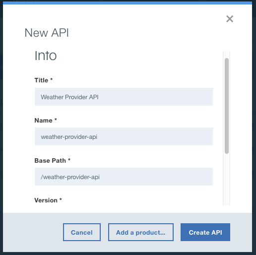
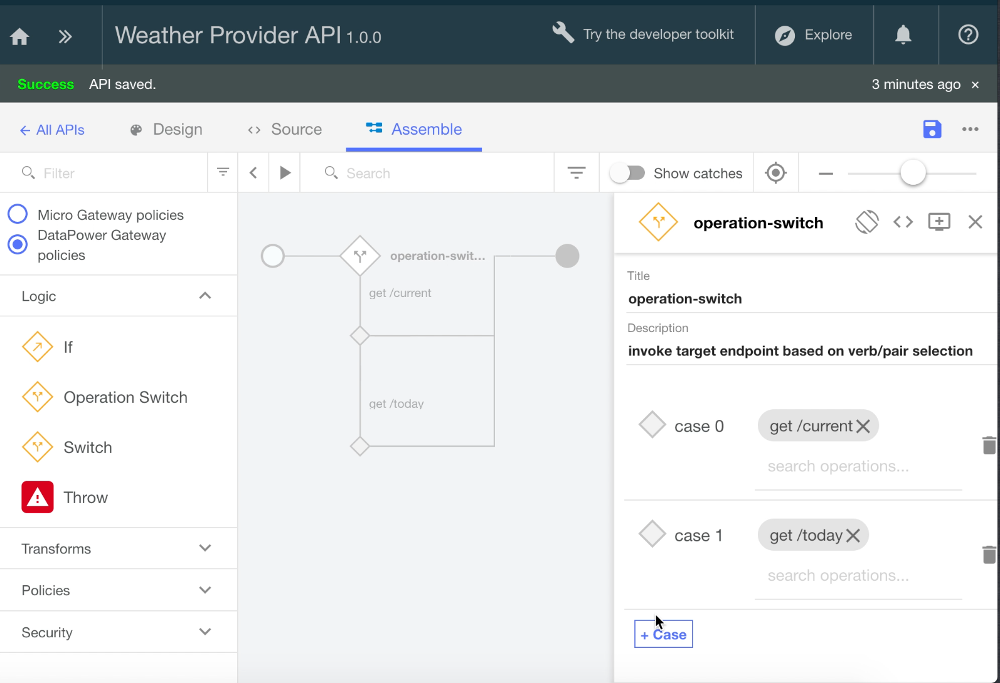
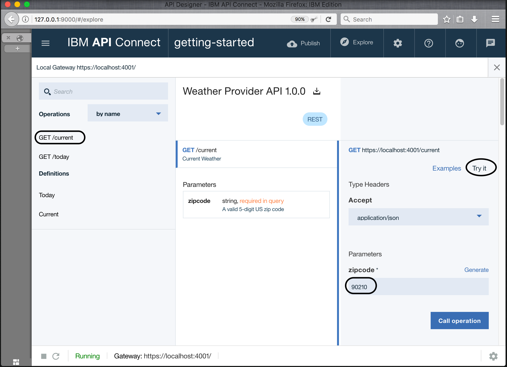

---
copyright:
  years: 2017
lastupdated: "2017-11-02"
---

{:new_window: target="blank"}
{:shortdesc: .shortdesc}
{:screen: .screen}
{:codeblock: .codeblock}
{:pre: .pre}

# 개발자 툴킷으로 새 API 스펙 추가 및 기존 REST 서비스 호출
**소요 시간**: 15분  
**스킬 레벨**: 초보자  

## 목표
이 튜토리얼을 사용하면 기존 API를 관리 제어하는 방법을 설명하여 {{site.data.keyword.apiconnect_full}}를 신속하게 시작할 수 있습니다. 새로운 OpenAPI 스펙 작성부터 시작한 다음 기존 REST 서비스의 통과(passthrough) API 프록시를 작성합니다.

## 전제조건
시작하기 전에 [API Connect 인스턴스를 설정](tut_prereq_set_up_apic_instance.html)하고 [API Connect 툴킷을 설치](tut_prereq_install_toolkit.html)해야 합니다.

---


## 샘플 앱 탐색 및 대상 엔드포인트 테스트
이 튜토리얼용으로 샘플 _날씨 제공업체_ 앱이 작성되었습니다.
1. 앱을 탐색하려면 [http://gettingstartedweatherapp.mybluemix.net/ ](http://gettingstartedweatherapp.mybluemix.net/){:new_window}으로 이동하십시오.  
2. 올바른 5자리 미국 우편번호를 입력하여 _**현재 날씨**_ 및 _**오늘의 예보**_를 보십시오.  


3. 위의 샘플 날씨 앱은 날씨 데이터를 제공하는 API를 사용하여 빌드되었습니다. **현재** 날씨 데이터를 가져오는 엔드포인트는 _**https:// myweatherprovider<span></span>.mybluemix.net/current?zipcode={zipcode}**_입니다. [https://myweatherprovider.mybluemix.net/current?zipcode=90210 ](https://myweatherprovider.mybluemix.net/current?zipcode=90210){:new_window}을 방문하여 테스트하십시오.  

  

4. 마찬가지로 **오늘의** 예보 데이터를 가져오는 엔드포인트는 `https:// myweatherprovider<span></span>.mybluemix.net/today?zipcode={zipcode}`입니다. [https://myweatherprovider.mybluemix.net/today?zipcode=90210 ](https://myweatherprovider.mybluemix.net/today?zipcode=90210){:new_window}으로 이동하여 테스트하십시오.  

  

---

## 새 OpenAPI 스펙 추가 및 기존 REST 서비스 호출
1. **API Designer**를 실행하십시오. 터미널에서 `apic edit`을 입력하십시오.
2. IBM ID를 사용하여 로그인하십시오.
    
3.   API Designer에서 탐색 패널이 열려 있는지 확인하십시오. 열려 있지 않으면 >>를 클릭하여 여십시오. **API Designer** 탐색 패널에서 **드래프트>API**를 선택하십시오.
4. **API** 패널에서 **추가 > 새 API**를 선택하십시오.
5. 새 API 창에서 제목으로 "Weather Provider API"를 입력하십시오. _이름과 기본 경로가 자동으로 채워집니다_.  
     
6. **API 작성**을 클릭하여 마법사를 완료하십시오.  

7. API를 작성하고 나면 **디자인** 탭이 선택됩니다.

8. **호스트** 패널로 스크롤하십시오. 필드가 자동으로 채워지지 않으면 `$(catalog.host)`를 값으로 입력하십시오.

9. **보안** 탭으로 스크롤하여 자동 생성된 "clientIDHeader (API Key)"를 삭제하십시오.  
_(다음 튜토리얼에서 API 키로 보안을 확인합니다.)_  

10. **경로** 패널에서 **+**를 클릭하여 새 경로를 작성하십시오.
  a. 새 경로의 이름을 "**/current**"로 지정하십시오.  
  b. 동일한 **경로** 패널에서 **GET /current** 섹션을 선택하십시오.  
  c. **GET /current** 섹션에서 새 **매개변수**를 추가하십시오. 샘플 앱을 탐색하는 중에 확인한 바와 같이 날씨 서비스에는 매개변수로 우편번호가 필요합니다.
      - 이름: zipcode  
      - 위치: Query  
      - 필수: Yes  
      - 유형: string  
    
  d. API를 저장하십시오.

11. 조회 매개변수가 이전 단계에 정의되어 있으므로 이제 weather API를 호출할 때 리턴되는 응답 오브젝트를 정의해야 합니다. 이 작업을 수행하려면 아래로 스크롤하여 **정의** 패널로 이동하십시오.

  1. 새 정의를 추가하십시오. 
  2. 새 정의의 이름을 _Current_로 지정하십시오.
  3. 유형을 _object_로 설정하십시오.
  4. **Current** 정의의 새 특성을 추가하십시오.
    - 이름: zip         /  유형: string
    - 이름: temperature /  유형: integer
    - 이름: humidity    /  유형: integer
    - 이름: city        /  유형: string
    - 이름: state       /  유형: string
    
  5. API를 저장하십시오.  

12. 이전 단계에서 응답 오브젝트를 정의했습니다. 다음으로 응답 오브젝트가 **get /current** 경로와 연관되어 있는지 확인해야 합니다. 탐색에서 **경로** 패널로 다시 스크롤하십시오.
  a. **GET /current** 오퍼레이션을 열고 **응답** 섹션으로 스크롤하십시오.
  b. 200OK 응답의 스키마를 "object"에서 "**Current**"로 변경하십시오.
  c. API를 저장하십시오.

13. 방금 작성된 경로와 오퍼레이션을 사용하여 현재 날씨 데이터를 가져옵니다. 이제 오늘의 날씨 데이터를 가져오기 위해 비슷한 경로와 오퍼레이션을 작성해야 합니다. 11단계에서 **/current** 경로를 작성한 방법과 비슷하게 새 경로, **/today**를 작성하십시오. 

14. **GET /today** 오퍼레이션에 새 매개변수를 추가하십시오.
    - 매개변수 이름: zipcode  
    - 위치: Query  
    - 필수: Yes  
    - 유형: string  

15. 새 정의를 작성하십시오. **Today**.

16. **Today** 정의의 새 특성을 추가하십시오.
  - 이름: zip / 유형: string
  - 이름: hi / 유형: integer
  - 이름: lo / 유형: integer
  - 이름: nightHumidity / 유형: integer
  - 이름: dayHumidity / 유형: integer
  - 이름: city / 유형: string
  - 이름: state / 유형: string

17. **GET /today** 섹션에서 응답 스키마를 "Today"로 업데이트하십시오.

18. API를 저장하십시오.

19. **어셈블** 탭으로 전환하십시오. 지금까지 두 개의 오퍼레이션, **GET /current** 및 **GET /today**를 작성했습니다. 올바른 대상 엔드포인트가 호출되었는지 확인하려면 호출되는 오퍼레이션에서 조건부를 실행할 로직을 작성해야 합니다. **오퍼레이션 스위치** 로직 구성을 사용하여 이 작업을 수행해 보겠습니다.  

    a. 이미 _캔버스_에 추가될 수 있는 **호출** 정책을 삭제하십시오.  
    b. _팔레트_에서 **오퍼레이션 스위치**를 끌어와 캔버스에 놓으십시오.  
      - **case 0**에 **get /current** 오퍼레이션을 지정합니다.
      - 새 케이스, **case 1**을 추가합니다.
      - **get /today** 오퍼레이션을 **case 1**에 지정합니다.
      
    **오퍼레이션 스위치**에서 의사결정 지점을 제공합니다. verb/path 쌍을 기반으로 적절한 오퍼레이션을 호출해야 합니다.  
    c. 팔레트에서 **호출** 정책을 끌어와 캔버스에 놓으십시오. **/get current** 경로와 **/get today** 경로에 각각 호출 조치를 놓습니다.
    d. **/get current** 경로에서 **호출** 정책을 선택하고 제목을 "**invoke-current**"로 업데이트하십시오.  
    e. URL 필드를 `https://myweatherprovider.mybluemix.net/current?zipcode=$(request.parameters.zipcode)`로 업데이트하십시오.
    f. **/get today** 경로에서 **호출** 정책을 선택하고 제목을 "**invoke-today**"로 업데이트하십시오.  
    g. URL 필드를 `https://myweatherprovider.mybluemix.net/today?zipcode=$(request.parameters.zipcode)`로 업데이트하십시오.  

20. API를 저장하십시오.

---

## API 프록시 테스트

### _API Manager 테스트 도구_로 테스트하십시오.
1. 디자이너의 왼쪽 하단에서 시작 서버 아이콘(>)을 클릭하여 로컬 테스트 서버를 시작하십시오. 게이트웨이가 시작되면 상태가 실행 중으로 자동 업데이트됩니다.

    

2. **어셈블** 탭에서 재생 아이콘(>)을 클릭하여 API 프록시의 대상 호출을 테스트하십시오. _이 튜토리얼에서는 임베디드 Micro Gateway를 사용하므로 Micro Gateway 정책을 선택해야 합니다._

    

3. 테스트 패널에서 **get /current** 오퍼레이션을 선택하십시오.  
  a. 우편번호는 이 오퍼레이션의 필수 매개변수이므로, 올바른 미국 우편번호(예: 90210)를 입력하십시오.  
  b. **호출**을 클릭하여 다음이 표시되는지 확인하십시오.
  ```
  200 OK response
  Current weather data for 90210  
  ```
      

_CORS 오류가 발생하면 오류 메시지의 지시사항을 따르십시오. 오류의 링크를 클릭하여 브라우저에 예외를 추가하고 "호출" 단추를 다시 누르십시오._

### _도구 탐색_으로 테스트하십시오.  
1. API 프록시 엔드포인트를 테스트하려면 _탐색_을 선택하십시오.
2. 팔레트에서 **GET /current** 오퍼레이션을 선택하십시오.
3. 테스트 상자에서 올바른 미국 우편번호(예: 90210)를 입력하십시오.
4. **오퍼레이션 호출**을 클릭하여 응답을 보십시오.  
    
  
---

## 결론
이 튜토리얼에서는 API 통과 프록시를 통해 기존 REST 서비스를 호출하는 방법을 확인했습니다. 웹 브라우저를 통해 샘플 서비스의 가용성을 확인하는 작업부터 시작했습니다. 그런 다음 {{site.data.keyword.apiconnect_short}}에서 새 OpenAPI 스펙을 작성하여 호출할 샘플 서비스에 연결했습니다. 마지막으로 기본 제공 테스트 도구를 사용하여 API 프록시를 테스트했습니다.

---

## 다음 단계

[비율 한계](tut_rate_limit.html), [클라이언트 ID 및 시크릿](tut_secure_landing.html) 또는 [OAuth 2.0를 사용하여 보호](tut_secure_oauth_2.html)를 사용하여 API를 보호합니다.

작성 > **관리** > 보안 > 소셜화 > 분석

