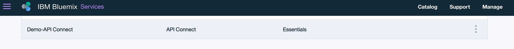
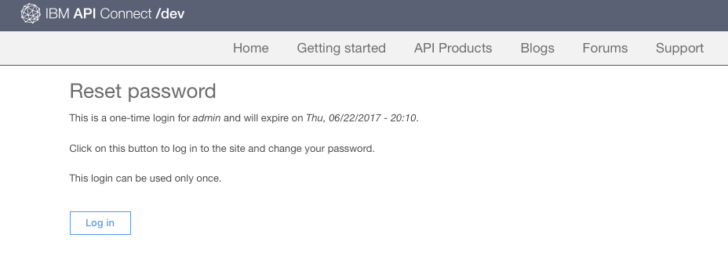

---

copyright:
  years: 2017
lastupdated: "2017-10-31"

subcollection: apiconnect

keywords: IBM Cloud, APIs, lifecycle, catalog, manage, toolkit, develop, dev portal, tutorial

---

{:new_window: target="blank"}
{:shortdesc: .shortdesc}
{:screen: .screen}
{:codeblock: .codeblock}
{:pre: .pre}

# 개발자 포털 설정 및 구성
{: #tut_config_dev_portal}

**소요 시간**: 30분  
**스킬 레벨**: 초보자  

## 목표
{: #object_tut_config_dev_portal}

이 튜토리얼을 사용하면 **API Connect 개발자 포털** 구성을 신속하게 시작할 수 있습니다. 

## 전제조건
{: #prereq_tut_config_dev_portal}

시작하기 전에 [API 스펙 가져오기 및 기존 REST 서비스 프록시](/docs/services/apiconnect/tutorials?topic=apiconnect-tut_rest_landing)를 수행해야 합니다.

---

## 개발자 포털 작성
{: #create_prereq_tut_config_dev_portal}

이 섹션에서는 카탈로그의 개발자 포털을 작성합니다.

*카탈로그*는 다른 환경을 나타내는 IBM 용어입니다. 예를 들어 테스트, 스테이징 및 프로덕션 환경을 나타내는 서로 다른 카탈로그를 작성합니다. 샌드박스라는 카탈로그가 있어야 합니다. 이 카탈로그를 자유롭게 사용하여 개발자 포털을 작성하거나 새 카탈로그를 작성한 다음 원하는 이름을 지정하십시오.

1. {{site.data.keyword.Bluemix_short}} 대시보드에서 **API Connect** 서비스를 선택하여 {{site.data.keyword.apiconnect_short}} 대시보드를 실행하십시오.

2. {{site.data.keyword.apiconnect_short}} 대시보드에서 개발자 포털을 작성할 카탈로그를 선택하십시오. 예를 들어, **샌드박스**입니다.

3. 카탈로그에서 **설정** 탭을 선택하십시오.  
  

4. 설정 탭에서 **포털**을 선택하십시오.  
  

5. 포털 구성 페이지의 포털 선택 드롭 다운에서 **IBM Developer Portal**을 선택하십시오.
   

6. **포털 URL**을 기록한 다음 변경사항을 저장하십시오.  
  
  
7. 대화 상자에 언급된 바와 같이 개발자 포털을 작성하는 데 일반적으로 몇 분이 걸립니다. 완료되면 이메일이 전송됩니다. **확인**을 선택하여 대화 상자 메시지를 승인하십시오.  
  

---

## 개발자 포털 탐색
{: #explore_prereq_tut_config_dev_portal}

이 섹션에서는 이전 단계에서 작성한 개발자 포털을 익힙니다.

1. 카탈로그에 맞게 개발자 포털을 구성하고 나면 일회 로그인할 수 있는 링크가 포함된 이메일이 전송됩니다. 개발자 포털을 실행하는 링크를 선택하십시오.

2. **로그인**을 선택하여 개발자 포털에 로그인하십시오.

3. 새 비밀번호를 입력하고 **저장**을 클릭하십시오.  
  

4. 이제 비밀번호를 설정했으므로 페이지 맨 위의 **홈**부터 개발자 포털을 탐색해 보겠습니다.  
  
  
|탭              |설명          | 
|:---------------- | -------------------- | 
|_홈_       |홈 페이지는 개발자 포털의 시작 페이지입니다. 요구사항에 맞게 [페이지를 사용자 정의](/docs/service/apiconnect/tutorials?topic=apiconnect-tut_custom_dev_portal)할 수 있습니다. | 
|_시작하기_       |개발자에게 개발자 포털을 사용하여 시작하는 방법을 지시하는 데 시작하기 페이지를 사용합니다. |
|_API 제품_ |API 제품 페이지는 개발자가 포털에서 사용할 수 있는 API를 탐색하고 등록하는 데 사용합니다. | 
|_앱_ |앱 페이지에는 API를 사용하는 애플리케이션이 표시됩니다. | 
|_블로그_ |블로그 페이지에서 API에 대한 블로그 게시물을 작성하고 표시할 수 있습니다. | 
|_포럼_ |포럼 페이지에서 개발자가 API에 대한 질문을 게시하고 토론할 수 있습니다. | 
|_지원_ |지원 페이지에서는 개발자가 API에 대한 지원을 받는 방법을 지시할 수 있습니다. 예를 들어 개발자에게 포럼과 FAQ를 추천할 수 있습니다. 필요한 경우 지원 티켓을 열 수 있는 링크도 제공할 수 있습니다. | 

참고: API 제품 페이지에서 제품 중 하나를 선택하여 API의 제품 페이지와 사용 가능한 플랜을 볼 수 있습니다. 개발자가 API 세부사항에 등록하고 볼 수 있습니다. 

  

### 결론
{: #conclusion_prereq_tut_config_dev_portal}

이 튜토리얼에서는 {{site.data.keyword.apiconnect_short}} 개발자 포털을 설정하고 구성하는 방법을 배웠습니다. 또한 개발자 포털을 탐색했습니다.

---

## 다음 단계
{: #next_prereq_tut_config_dev_portal}

[개발자 포털을 사용자 정의하고 테마를 선택](/docs/services/apiconnect/tutorials?topic=apiconnect-tut_custom_dev_portal)하십시오.

작성 >관리> 보안 > ** 소셜화 ** > 분석
