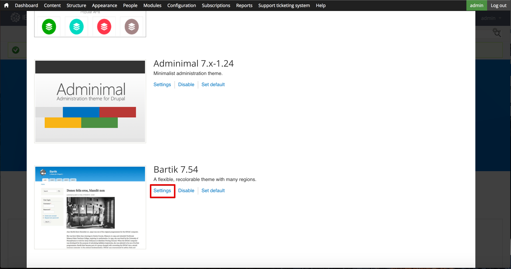

---
copyright:
  years: 2017
lastupdated: "2017-10-31"
---

{:new_window: target="blank"}
{:shortdesc: .shortdesc}
{:screen: .screen}
{:codeblock: .codeblock}
{:pre: .pre}

# 개발자 포털 사용자 정의 및 테마 선택
**기간**: 30분  
**스킬 레벨**: 초보자  

## 목표
이 튜토리얼을 사용하면 신속하게 {{site.data.keyword.apiconnect_full}} 개발자 포털을 사용자 정의하고 요구사항에 맞는 테마를 선택할 수 있습니다.

---

## 전제조건

이 튜토리얼을 시작하기 전에 [개발자 포털 설정 및 구성](tut_config_dev_portal.html) 튜토리얼을 완료하고 포털 관리자로 로그인해야 합니다.

---

## 개발자 포털 사용자 정의
개발자 포털을 작성하고 나면 룩앤필을 사용자 정의할 수 있습니다.

1. 먼저 시작 배너를 수정하겠습니다. 맨 위 메뉴에서 **컨텐츠**를 선택하고 **블록**을 선택하십시오.  
  

2. **시작 배너** 블록에서 **편집**을 선택하십시오.  
  

3. 컨텐츠 표제에서 컨텐츠 편집기에 텍스트를 입력하거나 HTML 소스 편집 아이콘을 선택하여 이미지와 텍스트 스펙을 정의하는 HTML을 직접 편집하거나 붙여넣어 시작 배너의 컨텐츠 텍스트 및 이미지를 변경할 수 있습니다.  
   

4. 홈 화면에도 이미지를 추가해 보겠습니다. 아래로 스크롤하여 이미지 표제로 이동합니다. 백그라운드에서 사용할 이미지를 찾아 적절한 파일 형식(png, gif, jpg, jpeg)으로 저장하십시오. 이미지가 없으면 [이 이미지](images/Cloudy_Day.png)를 사용할 수 있습니다. **파일 선택**을 클릭하고 선택한 배경 이미지를 찾아보십시오. 이미지를 선택한 후 **업로드**를 클릭하십시오.  
  

5. 이미지가 업로드되고 나면 표시됩니다. 제거하려면 **제거**를 클릭하십시오.  
  
 
6. 페이지의 맨 아래에서 **저장**을 클릭하여 변경사항을 저장하십시오.  
  
---

## 개발자 포털의 테마 사용자 정의
개발자 포털을 사용하면 테마를 수정하여 룩앤필을 변경할 수 있습니다.

1. 테마를 수정하려면 맨 위 메뉴에서 **모양**, **설정** 및 **IBM API Connect 테마**를 순서대로 선택하십시오. 개발자 포털을 작성할 때 이 테마가 기본값입니다.
   

2. **표준 레이아웃** 탭을 사용하면 데스크탑과 같이 큰 화면의 레이아웃을 수정할 수 있습니다. **태블릿 레이아웃** 탭을 사용하면 태블릿 디바이스에서 사용한 레이아웃을 수정할 수 있습니다. **소형 터치 레이아웃** 탭을 사용하면 스마트폰과 같은 디바이스에서 사용된 레이아웃을 수정할 수 있습니다. 이 탭을 검사한 후 **패널 및 Gpanel**을 선택하십시오.
  

3. 위의 사이드바 레이아웃을 수정하는 기능 외에도, 기본 테마에서는 패널 모듈을 설치한 경우 Gpanel 또는 응답 패널 사용을 지원합니다. 표준, 태블릿 및 소형 터치 디바이스에서 패널 레이아웃을 제어하려면 섹션을 확장하고 설정을 업데이트하십시오.
   

4. 다른 설정도 조정할 수 있지만 이 기능은 건너뛰고 **확장기능**을 선택합니다. 이 탭을 사용하면 개발자 포털의 스타일링을 구성하는 데 사용할 수 있는 추가 설정이 이용할 수 있습니다.  
  

5. **확장기능** 탭에서 사용된 확장기능의 설정은 기본 설정 아래 **확장기능** 섹션에서 수정할 수 있습니다.     
  

6. 설정 수정을 완료한 후 페이지의 맨 아래에서 **구성 저장**을 선택하십시오.

---

## 개발자 포털에 대해 다른 테마 선택
개발자 포털에는 선택하여 룩앤필을 변경할 수 있는 추가 테마가 함께 제공됩니다.

1. 다른 테마를 사용하려면 모양 설정의 맨 위에 있는 **목록** 탭을 선택하십시오.
   

2. **목록** 탭의 맨 위에 사용된 테마가 표시됩니다.
  

3. 사용된 테마 목록 아래에는 사용 안하는 테마의 콜렉션이 있습니다. **사용**을 선택하여 테마를 사용하게 설정할 수 있습니다.   
   

4. 테마를 사용하고 나면 **사용된 테마**에 있는 **목록** 탭의 맨 위에 해당 테마가 표시됩니다. **설정**을 선택하여 사용자 정의할 수 있습니다.  
  

5. 설정 수정을 완료하고 나면 **기본값 설정**을 선택하여 테마를 기본값으로 설정할 수 있습니다.     
  

---

## 개발자 포털의 새 테마 설치
기존 테마를 수정해도 요구사항에 맞지 않는 경우 개발자 포털을 통해 테마를 설치하여 룩앤필을 변경할 수 있습니다.

1. [drupal.org ](http://drupal.org){:new_window}에서 다운로드한 모듈 또는 테마를 사용하여 개발자 포털을 사용자 정의하거나 고유 포털을 작성할 수 있습니다.

2. 개발자 포털에 테마를 설치하려면 맨 위 메뉴에서 **모양**을 선택한 다음 **새 테마 설치**를 선택하십시오.  
  

3. URL을 사용하여 [drupal.org ](http://drupal.org){:new_window}에서 직접 테마를 설치하거나 **파일 선택**과 **설치**를 순서대로 클릭하여 다운로드하거나 작성한 테마를 업로드할 수 있습니다.  
   

4. 업로드가 완료되면 테마를 사용해야 합니다. **새로 추가된 테마 사용**을 선택하십시오.  
  

5. 목록에서 아래로 스크롤하여 새로 설치된 테마를 찾으십시오. **사용 및 기본값 설정**을 선택하십시오.  
  

6. 페이지의 맨 아래에서 **저장**을 클릭하여 변경사항을 저장하십시오.  

---

## 요약
축하합니다. 이 튜토리얼을 완료했습니다. 이 튜토리얼에서는 다음을 수행하는 방법을 학습했습니다.

* 개발자 포털 시작 페이지 사용자 정의
* 개발자 포털에서 사용한 테마 사용자 정의 
* 개발자 포털에서 사용할 다른 테마 선택
* 개발자 포털의 새 테마 설치

---

## 다음 단계

[개발자 포털을 통해 탐색하는 방법](tut_discover_apis.html) 또는 [기본 분석에서 인사이트를 얻는 방법](tut_insights_analytics.html)을 알아보십시오.

작성 >관리> 보안 > ** 소셜화 ** > 분석  

