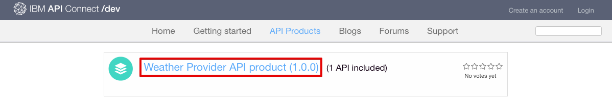
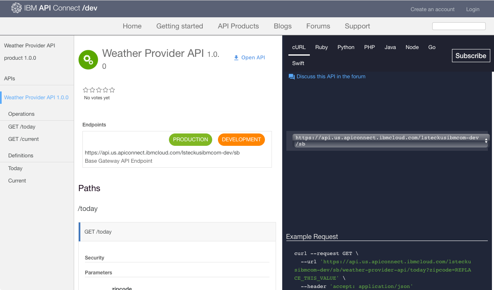
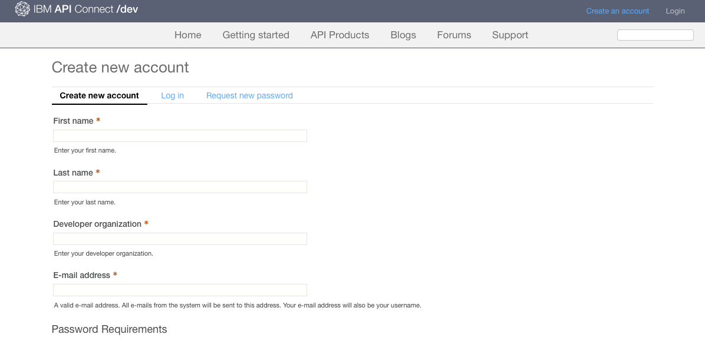
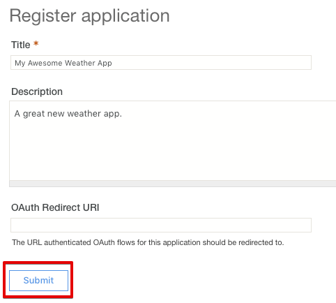

---
copyright:
  years: 2017
lastupdated: "2017-11-20"
---

{:new_window: target="_blank"}
{:shortdesc: .shortdesc}
{:screen: .screen}
{:codeblock: .codeblock}
{:pre: .pre}

# API 검색
**기간**: 25분  
**스킬 레벨**: 초보자  

## 전제조건
이 튜토리얼에는 전제조건이 없습니다. 포털 관리자로서 개발자 포털을 탐색하는 동안 이 튜토리얼을 완료하여 포털 사용자가 개발자 포털을 탐색하는 방법을 경험할 수 있습니다. 개발자 포털마다 스킨이 다르다는 점에 유의하십시오. 

기존 개발자 포털이 없으면 이 튜토리얼을 진행하기 전에 {{site.data.keyword.Bluemix_short}}에 개발자 포털을 설정하여 구성할 수 있습니다.

## 목표
이 튜토리얼에서는 포털 사용자가 {{site.data.keyword.apiconnect_full}} 개발자 포털에서 API를 이용할 수 있는 방법에 대해 알아봅니다. 포털 사용자가 제품과 API를 탐색하고 API를 보고 테스트하며 API에 등록하는 방법을 파악합니다. 

## 제품 및 API 탐색
이 섹션에서는 포털 사용자가 개발자 포털에서 API를 탐색하는 방법을 보여줍니다.

1. 브라우저에서 **API Connect 개발자 포털**로 이동하십시오.

2. {{site.data.keyword.apiconnect_short}} 개발자 포털에서 API 제품 탭을 선택하십시오.

3. 사용 가능한 API 제품 중 하나를 선택하여 제품에 사용 가능한 API와 플랜을 표시하십시오.  
  

4. 사용 가능한 API의 세부사항을 탐색하려면 API를 선택하십시오.  
  

5. API 세부사항 페이지에서 매개변수와 리턴된 응답과 함께 사용 가능한 오퍼레이션을 볼 수 있습니다. API에서 사용하는 정의는 페이지의 끝에 표시됩니다.  
   

6. 코드 예제 패널에서 여러 다른 코딩 언어로 요청과 응답을 호출하는 방법의 예를 볼 수 있습니다. **노드**와 같은 예를 선택하여 해당 코딩 언어로 예를 볼 수 있습니다.  
   

---

## API 보기 및 테스트
이 섹션에서는 포털 사용자가 제품에 사용 가능한 API를 보고 테스트하는 방법을 보여줍니다. 

1. 이전 섹션에 개요된 대로 {{site.data.keyword.apiconnect_short}} 개발자 포털에서 API 세부사항으로 이동하십시오.  
   

2. **Open API**를 선택하여 API Swagger yaml 정보를 다운로드하고 볼 수 있습니다.  
   

3. 아래로 스크롤하여 오퍼레이션 중 하나로 이동한 후 세부사항을 보십시오. 오퍼레이션 링크를 클릭하여 해당 페이지로 이동할 수도 있습니다.

4. 오른쪽 패널의 예제에서 **이 오퍼레이션 시도** 섹션으로 스크롤하십시오. 매개변수를 입력하고 **오퍼레이션 호출**을 선택하십시오.  
  

5. 아래로 스크롤하여 오퍼레이션 호출의 요청과 응답을 보십시오. 리턴되는 응답으로 **200 OK** 및 메시지 본문이 표시되어 오퍼레이션 호출이 완료되었음을 표시합니다.  
  

---

## API에 등록
이 섹션에서는 포털 사용자가 개발자 포털에서 API에 등록하는 방법을 보여줍니다. 

1. **계정 작성**을 선택하십시오.

2. 필수 필드를 완료하고 페이지의 맨 아래에서 **새 계정 작성**을 선택하십시오. 
**참고:** 이전 튜토리얼에서 개발자 포털을 작성하는 데 사용한 이메일 주소가 아닌 다른 주소를 사용하십시오.

3. 개발자 계정을 작성한 다음 로그인하여 홈 페이지를 보십시오. API에 등록할 앱이 있어야 합니다. **앱**을 선택하여 등록된 앱 페이지로 이동하십시오.  
  

4. 새 애플리케이션을 등록하려면 **새 앱 작성**을 선택하십시오.  
  

5. 앱의 *제목*과 *설명*을 입력하고 **제출**을 선택하십시오.  
   

6. 이제 앱이 있으므로 API 제품 플랜에 등록할 수 있습니다. **사용 가능한 API** 또는 **API 제품**을 선택하여 API 제품 플랜을 찾아보십시오.  
   

7. 등록할 API 제품을 선택하십시오.  
   

8. **등록**을 선택하여 API 제품 플랜에 등록하십시오.  
   

9. 제품 계획에 등록할 앱을 선택한 다음 **등록**을 선택하십시오.
   

10. 애플리케이션이 제품 플랜에 등록되었습니다.
   

## 결론

이 튜토리얼에서는 포털 사용자가 제품과 API를 탐색하고 API를 보고 테스트하며 API에 등록하는 방법을 학습했습니다. 

---

## 다음 단계

[기본 분석에서 인사이트를 얻는 방법](tut_insights_analytics.html)을 배우십시오.

작성 >관리> 보안 > ** 소셜화 ** > 분석  

