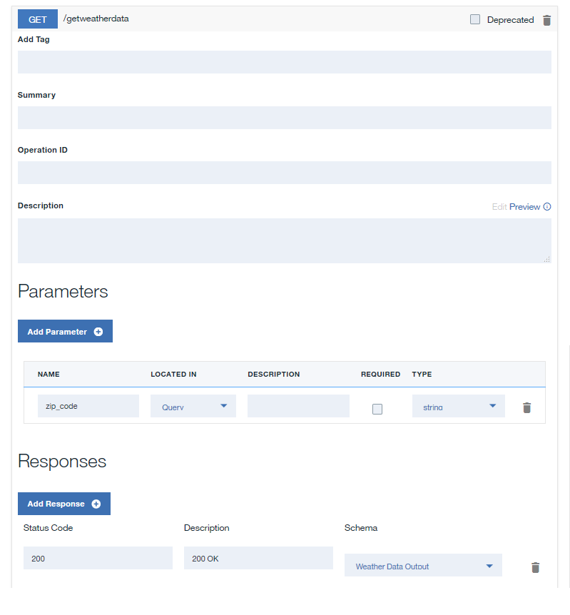
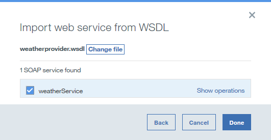
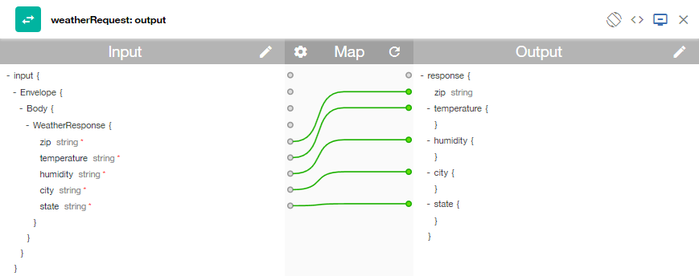

---

copyright:
years: 2017
lastupdated: "2017-10-19"

---

{:new_window: target="blank"}
{:shortdesc: .shortdesc}
{:screen: .screen}
{:codeblock: .codeblock}
{:pre: .pre}
 

# SOAP 서비스를 REST API로 노출
**기간**: 20분  
**스킬 레벨**: 초보자  

---
## 목표
API Manager에서 기존 SOAP 서비스에 액세스할 REST API를 작성하여 REST API로 노출합니다.

## 전제조건
1. 시작하기 전에 [{{site.data.keyword.apiconnect_full}} 인스턴스를 설정](tut_prereq_set_up_apic_instance.html)해야 합니다.
2. 시작하기 전에 [weatherprovider.wsdl 테스트](https://github.com/ibm-apiconnect/getting-started/blob/master/bluemix/manage-soap-api/files/weatherprovider.wsdl){:new_window} 파일을 로컬 파일 시스템에 복사하십시오.
	>![images/info.png]
	>**원시**를 클릭한 다음 로컬 시스템의 결과 페이지를 `.wsdl` 파일로 저장할 수 있습니다.

---
## REST API 정의 설정
1. {{site.data.keyword.Bluemix_short}}에 로그인: [https://new-console.ng.bluemix.net/login ](https://new-console.ng.bluemix.net/login){:new_window}.
2. {{site.data.keyword.Bluemix_short}} **대시보드**에서 아래로 스크롤하고 {{site.data.keyword.apiconnect_full}}를 선택하십시오. 또는 메뉴 아이콘에서 **서비스**와 **API**를 순서대로 선택하여 **API에 대한 작업** 창으로 이동하고 **API Connect**를 선택하십시오. **API Connect** 페이지에서 간단히 `Create`를 누르거나 기본 설정을 조정할 수 있습니다. 이 연습에서는 인스턴스를 바인드되지 않은 상태로 두고, 나중에 더 쉽게 인식할 수 있도록 서비스 이름을 조정하십시오. 예를 들어 `API Connect-weather-exercise`입니다.
`Create` 단추를 클릭하여 {{site.data.keyword.apiconnect_short}} 서비스를 실행하십시오.  
새로운 기능을 설명하는 경보 또는 **초안 API** 정보 스플래시 페이지가 표시될 수 있습니다. 이 정보를 읽은 후에 **"이해했습니다."** 아이콘을 클릭하여 API Manager를 보십시오.
3. {{site.data.keyword.apiconnect_short}}에서 이전에 UI 탐색 분할창을 고정하지 않은 경우 **이동 위치** 아이콘 을 클릭하십시오. API Manager UI 탐색 분할창이 열립니다. UI 탐색 분할창을 고정하려면 **핀 메뉴** 아이콘 을 클릭하십시오.
4. UI 탐색에서 **초안**을 선택한 다음 **API** 탭을 클릭하십시오. **API** 탭이 열립니다.
	
5. **추가 +** > **새 API**를 선택하십시오.
6. API에 대한 기본 정보를 지정하십시오.
	- **제목** 필드에 `Weather Data`를 입력하십시오.
	- 제목을 입력하는 동안 채워진 경우 **이름** 필드를 `weather-data`로 두십시오.	
	- **기본** 경로 필드는 `/weather-data`로 두십시오.
	- **버전** 필드는 `1.0.0`으로 두십시오.
7. **추가 특성**을 펼쳐 API의 추가 특성을 지정하십시오.
	- **API 템플리트** 필드에서 기본 템플리트를 사용하여 API 정의를 작성한다는 것을 표시하려면 **기본값**을 선택하십시오.
	- 나머지 필드를 변경하지 않은 상태로 두십시오.

8. API를 새 제품으로 추가한 후 API 정의를 작성하십시오.
	- **제품 추가**를 선택하십시오. 
	- **제목** 필드에서 기본값으로 `Weather Data product`를 사용하십시오.
	- **이름**과 **버전** 필드를 변경하지 말고 그대로 두십시오.
	- **이 제품을 카탈로그에 공개** 선택란이 선택되었는지 확인한 다음 **샌드박스**를 대상 카탈로그로 선택하십시오.
	
	- **API 작성**을 클릭하십시오. API 정의의 초안에 대한 **디자인** 탭이 열립니다.
9. 이제 API가 작성됩니다. 디자인 페이지가 표시됩니다. 탐색줄에서 **보안**을 클릭하십시오.

10. **ClientID** 옵션을 선택 취소하십시오.

	>![images/info.png]
	>디스크 저장 아이콘 옆에 표시되는 노란색 삼각형 아이콘이 있음을 알 수 있습니다. 이 아이콘은 정의되었지만 아직 사용되지 않은 정의가 있음을 알리는 경고입니다. (이 경고는 API 정의에 영향을 미치지 않습니다.)
11. **정의** 섹션에서 **정의 추가** 아이콘 을 클릭한 다음 새 정의를 클릭하여 펼치십시오.
12. 정의의 이름을 `Weather Data Output`으로 지정하십시오.
13. 정의에 5가지 특성이 있습니다. **특성 추가**를 4번 클릭하여 특성을 추가하십시오. 다음을 안내서로 사용하여 `Property Name`의 이름을 바꾸고 `Description`, `Type` 및 `Example`의 기본값을 사용하십시오.
	
14. **경로** 섹션에서 **경로 추가** 아이콘 을 클릭하십시오.
15. 새로 작성된 경로의 **경로** 필드에서 컨텐츠를 `/getweatherdata`로 바꾸십시오.
16. **GET /getweatherdata** 오퍼레이션을 클릭하여 펼치십시오.
	
17. **GET /getweatherdata** 오퍼레이션의 경우 **매개변수 추가**를 클릭한 다음 **새 매개변수 추가**를 클릭하십시오.
18. 새 매개변수의 이름을 `zip_code`로 지정하고 나머지를 기본값으로 두십시오.
19. **응답** 섹션에 있는 **200 OK** 응답의 **스키마** 열에서 **Weather Data Output** 정의를 선택하십시오. API 호출에 대한 응답의 경우 **Weather Data Output**을 통해 정의된 오브젝트가 응답 오브젝트입니다.
	
20. 저장 아이콘 을 클릭하여 변경사항을 저장하십시오.

---
## 웹 서비스 호출 추가 및 구성
웹 서비스를 API 정의에 통합하는 호출 및 맵 정책을 추가하여 구성하려면 다음 단계를 완료하십시오.
1. **서비스** 섹션에서 **서비스 추가** 아이콘 을 클릭하십시오. `Import web service from WSDL` 창이 열립니다.
	
2. **파일 업로드**를 선택하십시오.
3. **파일 업로드** 창에서 **전제조건** 섹션의 `step 2`에서 다운로드한 `weatherprovider.wsdl` 파일의 위치를 지정하고 **열기**를 클릭하여 계속하십시오.
4. **weatherService** SOAP 서비스를 선택한 다음 **완료**를 클릭하십시오. **서비스** 섹션에서 단일 **weatherRequest** 오퍼레이션을 사용하여 **WeatherService** 웹 서비스가 나열됩니다.

		
5. **어셈블** 탭으로 이동하여 **DataPower Gateway 정책**이 선택되었는지 확인하십시오.
6. 정책 위에 커서를 두고 **정책 삭제** 아이콘 을 클릭하여 캔버스에서 기존 **호출** 정책을 삭제하십시오.
 	
7. 팔레트에서 캔버스에 표시되는 파선 상자로 **weatherRequest** 웹 서비스를 끌어오십시오. 호출 정책과 두 개의 맵 정책이 어셈블리에 배치됩니다. 첫 번째 맵 정책은 웹 서비스 호출의 입력에 변수를 지정하고, 두 번째 정책은 변수에 웹 서비스 호출의 출력을 지정합니다. 첫 번째 맵의 출력과 두 번째 맵의 입력은 4단계에 제공된 WSDL에서 생성됩니다.
 	
8. **weatherRequest: input** 맵 정책을 클릭한 다음 특성 시트의 입력 열에서 **입력 편집** 아이콘 을 클릭하십시오.
 	
9. **오퍼레이션의 + 매개변수**를 클릭하고 `get /getweatherdata`를 선택하십시오.
10. **완료**를 클릭하여 `zip_code` 매개변수를 추가하십시오.
	
11. 입력 쪽에서 **zip_code string**에 해당하는 원을 클릭한 다음 출력 쪽에서 **zipcode string**에 해당하는 원을 클릭하십시오.  
	
12. 특성 시트를 닫으십시오.
13. 팔레트에서 **weatherRequest: output** 맵 정책을 클릭한 다음 특성 시트의 출력 열에서 **출력 편집** 아이콘 을 클릭하십시오.
14. **오퍼레이션의 + 출력**을 선택하고 `get /getweatherdata`를 선택하십시오.
15. **완료**를 선택하여 `Weather Data Output` 출력 정의를 추가하십시오.
	
16. 입력 쪽에서 **zip string**에 해당하는 원을 클릭한 다음 출력 쪽에서 **zip string**에 해당하는 원을 클릭하십시오. 다음을 안내서로 사용하여 나머지 매개변수를 맵핑하십시오.
 
17. **저장** 아이콘 을 클릭하여 변경사항을 저장하십시오.

어셈블리에 웹 서비스 호출을 포함시키고 입력 매개변수를 SOAP 요청의 해당 파트로 맵핑하고 SOAP 응답의 해당 파트를 JSON 출력으로 맵핑했습니다. 

---
## API 정의 테스트
API Manager 테스트 도구를 사용하여 API 정의를 테스트하려면 아래 단계를 완료하십시오.
1. **어셈블리**의 **테스트** 아이콘 을 클릭하여 테스트 분할창을 표시하십시오.
 
2. 이전에 테스트 도구를 사용한 경우 **설정 변경**을 클릭하십시오.
3. 제품 목록에서 `Weather Data product 1.0.0`를 선택하십시오.
	
4. **제품 재공개**를 클릭하십시오.
5. **다음**을 클릭하십시오. 
6. 오퍼레이션 목록에서 `get /getweatherdata`를 선택하십시오.  
	
7. 아래로 스크롤하여 **zip_code** 필드로 이동하고 `90210`을 입력하십시오.  
	
8. **호출**을 클릭하십시오. API에서 현재 날씨를 리턴합니다.  
	

---
## 이 튜토리얼에서 수행한 작업
이 튜토리얼에서 다음 활동을 완료했습니다.
1. REST API 정의 설정
2. 기존 웹 서비스를 호출하고 해당 출력을 리턴하도록 API 구성
3. API 정의 테스트

---

## 다음 단계

[비율 한계](tut_rate_limit.html), [클라이언트 ID 및 시크릿](tut_secure_landing.html) 또는 [OAuth 2.0를 사용하여 보호](tut_secure_oauth_2.html)를 사용하여 API를 보호합니다.

작성 > **관리** > 보안 > 소셜화 > 분석

[important]: ./images/important.png "중요!"
[info]: ./images/info.png "정보"
[troubleshooting]: ./images/troubleshooting.png "문제점 해결" 
