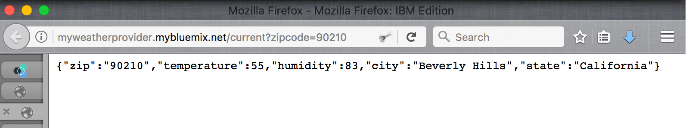
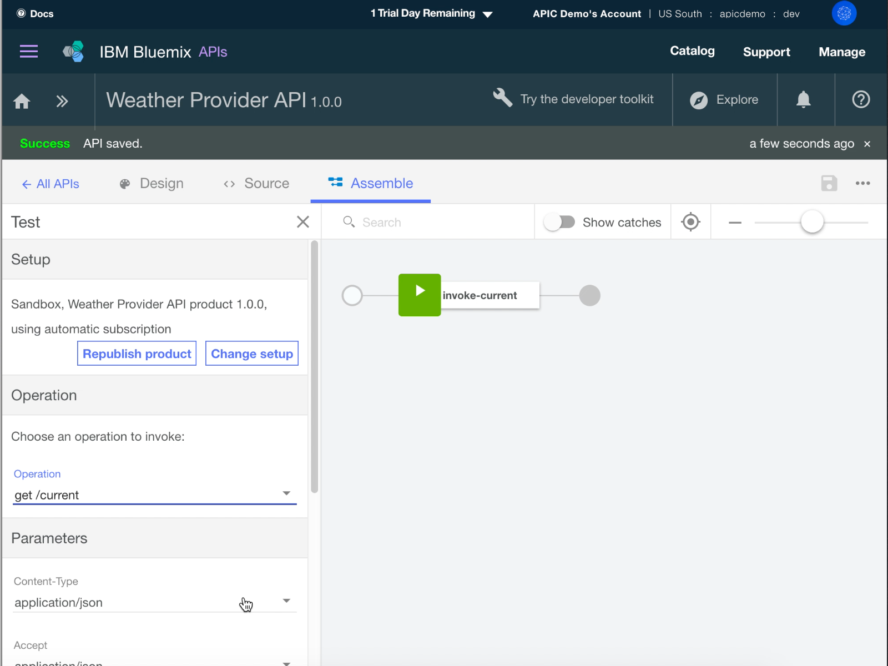

---
copyright:
  years: 2017
lastupdated: "2017-11-02"
---

{:new_window: target="blank"}
{:shortdesc: .shortdesc}
{:screen: .screen}
{:codeblock: .codeblock}
{:pre: .pre}

# {{site.data.keyword.Bluemix_notm}}로 API 스펙 가져오기 및 기존 REST 서비스 프록시
소요 시간: 5분  
스킬 레벨: 초보자  

## 목표
이 튜토리얼을 사용하면 기존 API를 관리 제어하는 방법을 설명하여 {{site.data.keyword.apiconnect_full}}를 신속하게 시작할 수 있습니다. 새로운 OpenAPI 스펙 가져오기부터 시작한 다음 기존 REST 서비스의 통과(passthrough) API 프록시를 작성합니다.

## 전제조건
시작하기 전에 [{{site.data.keyword.apiconnect_short}} 인스턴스를 설정](tut_prereq_set_up_apic_instance.html)해야 합니다.

---


## 샘플 앱 탐색 및 대상 엔드포인트 테스트

이 튜토리얼용으로 샘플 _날씨 제공업체_ 앱이 작성되었습니다. 해당 API 스펙(Swagger 2.0)은 [weather-provider-api_1.yaml ](https://raw.githubusercontent.com/IBM-Bluemix-Docs/apiconnect/master/tutorials/weather-provider-api_1.yaml){:new_window} 파일에 있습니다.

1. 앱을 탐색하려면 [http://gettingstartedweatherapp.mybluemix.net/ ](http://gettingstartedweatherapp.mybluemix.net/){:new_window}으로 이동하십시오.  
2. 올바른 5자리 미국 우편번호를 입력하여 _**현재 날씨**_ 및 _**오늘의 예보**_를 보십시오.  


3. 위의 샘플 날씨 앱은 날씨 데이터를 제공하는 API를 사용하여 빌드되었습니다. **현재** 날씨 데이터를 가져오는 엔드포인트는 `https:// myweatherprovider<span></span>.mybluemix.net/current?zipcode={zipcode}`입니다. [https://myweatherprovider.mybluemix.net/current?zipcode=90210 ](https://myweatherprovider.mybluemix.net/current?zipcode=90210){:new_window}을 방문하여 테스트하십시오.  

  

4. 마찬가지로 **오늘의** 예보 데이터를 가져오는 엔드포인트는 `https:// myweatherprovider<span></span>.mybluemix.net/today?zipcode={zipcode}`입니다. [https://myweatherprovider.mybluemix.net/today?zipcode=90210 ](https://myweatherprovider.mybluemix.net/today?zipcode=90210){:new_window}으로 이동하여 테스트하십시오.  

  


---

## 샘플 앱의 OpenAPI 스펙을 가져와 REST API 프록시 작성
1. {{site.data.keyword.Bluemix_short}}에 로그인하십시오. https://new-console.ng.bluemix.net/login.
2. {{site.data.keyword.Bluemix_notm}} 탐색 패널에서 **서비스**를 선택한 다음 **대시보드**를 선택하십시오. {{site.data.keyword.apiconnect_short}} 서비스를 시작하십시오. 
3. {{site.data.keyword.apiconnect_short}}에서 왼쪽에 탐색 패널이 열려 있는지 확인하십시오. 열려 있지 않으면 **>>**를 클릭하여 여십시오.  
4. 탐색 패널에서 **드래프트**를 선택하십시오.   
5. **API** 탭에서 **추가**를 클릭하십시오. 드롭 다운 메뉴에서 **파일 또는 URL에서 API 가져오기**를 선택하십시오.  
     

6. 이제 OpenAPI 날씨 정의를 가져옵니다. "OpenAPI(Swagger) 가져오기" 대화 상자가 열리면 다음 URL을 입력하십시오.
`https://raw.githubusercontent.com/IBM-Bluemix-Docs/apiconnect/master/tutorials/weather-provider-api_1.yaml`. 다른 옵션은 기본값을 그대로 두고 **가져오기**를 클릭하십시오.  
      

7. OpenAPI 스펙을 가져오고 나면 API의 **디자인** 보기로 이동합니다. 여기서 OpenAPI 정의의 다양한 섹션을 볼 수 있습니다. 스크롤하여 탐색하고 **호스트** 값을 기록하십시오. **소스** 탭에서 OpenAPI도 볼 수 있습니다.
  _참고: 호스트 값이 다음으로 설정됩니다._ `$(catalog.host)` _. 이 값은 API 프록시의 기본 URL입니다._
8. API가 저장됩니다. 


## API 프록시 테스트

### _API Manager 테스트 도구_로 테스트하십시오.
1. **어셈블** 탭에서 추가 조치를 위한 아이콘을 클릭한 다음 **기본 제품 생성**을 선택하십시오.  
     

2. **새 제품** 대화 상자에서 기본 옵션을 승인하고 **제품 작성**을 클릭하십시오. **Weather Provider API 제품**이 작성되어 샌드박스 카탈로그에 공개됩니다. 제품 생성 성공을 나타내는 메시지가 표시됩니다.  
    

  

  _{{site.data.keyword.apiconnect_short}}에서 **제품**을 사용하여 특정 용도로 사용할 API를 그룹화할 수 있습니다. 제품은 **카탈로그**에 공개됩니다.  [{{site.data.keyword.apiconnect_short}} 용어집](../apic_glossary.html)_

3. 어셈블 탭에서 재생 아이콘을 클릭하여 API 프록시의 대상 호출을 테스트하십시오.

4. 테스트 패널에서 **get /current** 오퍼레이션을 선택하십시오.  
    a. 우편번호는 이 오퍼레이션의 필수 매개변수이므로, 올바른 미국 우편번호(예: 90210)를 입력하십시오.  
    b. **호출**을 클릭하여 다음이 표시되는지 확인하십시오.  
    ```
    - 200 OK response
    - Current weather data for 90210  
    ```
_CORS 오류가 발생하면 오류 메시지의 지시사항을 따르십시오. 오류의 링크를 클릭하여 브라우저에 예외를 추가하고 "호출" 단추를 다시 누르십시오._

    


### _도구 탐색_으로 테스트하십시오.
_탐색 도구를 사용하면 OpenAPI 정의에 설정된 매개변수 요구사항을 적용하여 API의 올바른 오퍼레이션을 테스트할 수 있습니다. 어셈블 탭에 있는 API 테스트 도구에서는 이와 같은 요구사항이 적용되지 않으므로 매개변수가 누락되면 사용자가 API 동작을 확인할 수 있습니다._

1. API 프록시 엔드포인트를 테스트하려면 **탐색**, **샌드박스** 순으로 선택하십시오.
    
2. 팔레트에서 **GET /current** 오퍼레이션을 선택하십시오.
3. "시도"를 선택하십시오.  
4. 테스트 상자에서 올바른 미국 우편번호(예: 90210)를 입력하십시오.
5. **오퍼레이션 호출**을 클릭하여 응답을 보십시오.
  

    


### 결론
이 튜토리얼에서는 API 통과 프록시를 통해 기존 REST 서비스를 호출하는 방법을 확인했습니다. 웹 브라우저를 통해 샘플 서비스의 가용성을 확인하는 작업부터 시작했습니다. 그런 다음 {{site.data.keyword.apiconnect_short}}에서 API 프록시를 작성하고 호출할 샘플 서비스에 프록시를 연결했습니다. API를 제품에 패키징하고 제품을 카탈로그에 공개한 다음 프록시를 테스트했습니다.

---

## 다음 단계

[비율 한계](tut_rate_limit.html), [클라이언트 ID 및 시크릿](tut_secure_landing.html) 또는 [OAuth 2.0를 사용하여 보호](tut_secure_oauth_2.html)를 사용하여 API를 보호합니다.

작성 > **관리** > 보안 > 소셜화 > 분석

