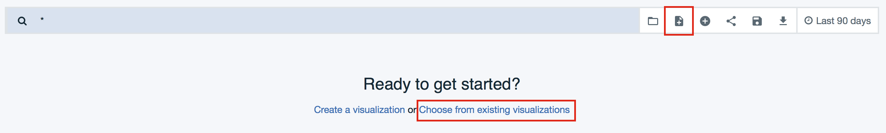
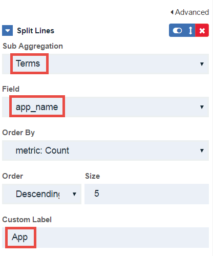

---
copyright:
  years: 2017
lastupdated: "2017-12-15"
---

{:new_window: target="blank"}
{:shortdesc: .shortdesc}
{:screen: .screen}
{:codeblock: .codeblock}
{:pre: .pre}

# 기본 분석을 통한 인사이트 확보
기간: 30분  
스킬 레벨: 초보자

## 목표
{{site.data.keyword.apiconnect_full}}의 API 분석에 대한 기본을 소개합니다. 사용 가능한 분석 대시보드를 둘러보고 고유 API를 따라 진행할 수 있습니다.

## 전제조건
고유 API 분석을 보려면 API 제품이 작성되고 공개되어 있어야 합니다. 또한 사전에 프로비저닝된 테스트 앱이 아니라 등록된 애플리케이션의 클라이언트 ID를 사용하여 분석 데이터를 생성하기 위해 API를 여러 번 호출해야 합니다.

이 튜토리얼에서 데이터를 생성하기 위해 Postman의 *Collection Runner*를 사용하여 여러 다른 데이터와 클라이언트 ID로 API를 여러 번 호출합니다. 비슷한 도구(예: Firefox의 HttpRequester)를 사용하거나 간단히 cURL을 사용하여 명령행에서 API를 여러 번 호출할 수 있습니다. {{site.data.keyword.apiconnect_short}}에서 **탐색** 링크를 클릭하여 API의 샘플 요청을 얻을 수 있습니다.

## 카탈로그 분석 소개
API 소유자로서 사용자가 제공하는 API의 성공과 성능을 평가하는 방법이 필요합니다. 분석을 수행할 기본 위치는 카탈로그 레벨입니다. 카탈로그에 대한 소개를 아직 보지 않은 경우 IBM Knowledge Center의 [카탈로그에 대한 작업 ](https://www.ibm.com/support/knowledgecenter/en/SSFS6T/com.ibm.apic.apionprem.doc/conref_working_with_env.html){:new_window}에서 소개를 확인하십시오. 

사용자와 앱 개발자가 개발자 포털에서 앱별 분석에 액세스할 수 있지만, 이 튜토리얼에서는 카탈로그 분석을 중점적으로 다룹니다.

해당 카탈로그에 공개된 API와 제품에 관한 최대 90일 간의 실시간 및 히스토리 정보에 액세스할 수 있습니다. 호출하는 사용자도 표시합니다. 카탈로그에 영역이 여러 개 있으면 영역 레벨로 이동할 수 있습니다.

이 튜토리얼은 다음 태스크를 완료하는 방법을 보여주는 4가지 활동으로 구성되어 있습니다.
* 분석 보기
* 이벤트 레코드 세부사항 보기
* 새 대시보드 빌드
* 새 시각화 작성

## 활동 1: 바로 사용할 수 있는 분석 보기
1. {{site.data.keyword.Bluemix_short}}의 {{site.data.keyword.apiconnect_short}} 서비스에서 대시보드를 실행하고 열려는 카탈로그를 선택하십시오. 
2. *분석* 탭을 클릭하십시오.

    
  
기본 개요 대시보드가 표시됩니다. 이 대시보드에는 지난 7일 동안의 다음 데이터를 포함하는 두 개의 막대형 차트 시각화가 표시됩니다.
* 가장 많이 사용되는 5개의 제품 
* 가장 많이 사용되는 5개의 API 

3. 막대 중 하나에 마우스 커서를 두고 API 수, API 이름 등의 추가 세부사항을 보십시오.

    

4. 검색 표시줄을 사용하여 표시된 데이터를 필터링하십시오. 다른 시간 필터 및/또는 자동으로 새로 고치기 비율도 선택할 수 있습니다. 시각화가 업데이트되어 선택사항을 반영합니다.

바로 사용할 수 있도록 제공되는 기타 대시보드가 있습니다.

5. 폴더 아이콘을 클릭하여 저장된 대시보드를 로드하고 드롭 다운 목록에서 **api_default**를 선택하십시오.

    

이 대시보드에는 API 상태, 오류, 응답 시간, 총 호출 수 및 일별 호출 수를 표시하는 다른 시각화 세트가 있습니다.

    

## 활동 2: 이벤트 세부사항 보기

시각화는 유용한 데이터 개요를 볼 수 있는 좋은 방법이지만 차트를 채우는 이벤트 레코드로 이동하는 방법도 필요합니다.

1. 시각화의 왼쪽 하단에 있는 화살표 아이콘에 커서를 두십시오. 작은 화살표가 표시됩니다.
2. 화살표를 클릭하여 시각화에 사용되는 데이터 테이블을 보십시오. 
3. **이벤트 보기** 레이블을 클릭하여 최대 100개 레코드의 개별 이벤트 세부사항을 탐색하십시오.

    

대시보드에서 시각화를 편집, 이동 및 삭제할 수 있습니다.

## 활동 3: 새 대시보드 빌드

이제 API 트래픽 패턴의 보기를 제공하는 새 대시보드를 작성하겠습니다. 이 패턴은 기본 제공 시각화를 사용하여 모두 지원됩니다. 

1. 새 대시보드 아이콘을 클릭하고 **기존 시각화에서 선택** 링크를 클릭하십시오. 

    
    사용 가능한 시각화 목록이 표시됩니다.

2. 대시보드에 추가할 시각화를 몇 가지 선택하십시오.  예:
  * 등록한 앱
  * 플랜당 앱 
  * 성공률
  * 일별 API 호출 수
  
  **팁** 각 시각화를 선택하면 선택 탭에서 대시보드 보기를 차단하므로, 시각화가 대시보드에 추가되었음을 모를 수 있습니다. 한 번에 하나의 시각화를 선택하고 매번 선택 탭을 닫아 대시보드의 변경사항을 표시하십시오.

3. **저장**을 클릭하고 대시보드의 이름을 `Subscriber Dashboard`로 지정하십시오.

   

    

## 활동 4: 새 가상화 작성
작성한 등록자 대시보드에서 일별 API 호출 수를 표시하는 기본 제공 시각화를 포함했습니다. 해당 정보가 모두 함께 표시되므로, 이제 앱별로 사용을 표시하고자 합니다. 이 정보를 표시하는 새 시각화를 작성해 보겠습니다.

1. **새 시각화**를 클릭하고 **시각화 작성** 링크를 선택하십시오.
    

2. **선형 차트**를 시각화 유형으로 선택하십시오. 초기화된 선형 차트에는 Y축에 API 호출 수가 설정되어 있습니다. 해당 설정은 이 차트에 적합합니다.

3. 다음을 선택하십시오.
	* 버킷 유형: **X축**
	* 집계: **날짜 히스토그램**
	* 사용자 정의 레이블: **시간** 
4. **실행**을 클릭하여 차트를 보십시오. **팁**: 데이터를 표시하도록 시간 범위를 조정해야 합니다.

   

이 차트(현재까지)에서는 API 호출의 시계열을 보여줍니다. 앱 이름별로 API 호출을 확인할 수 있습니다.

5. **하위 버킷 추가** 단추를 클릭하십시오.
6. 다음을 선택하십시오.
	* 버킷 유형: **행 나누기**
	* 하위 집계: **기간**
	* 필드: **app_name**
	* 사용자 정의 레이블: **앱**
	
   
8. **실행**을 클릭하여 차트를 보십시오.
9. **저장**을 클릭하고 차트의 이름을 `API Calls by App`으로 지정하십시오.
10. 컨텍스트에서 시각화를 보려면 등록자 대시보드에 추가하십시오.

   
 
API 호출, 호출자 등에 대한 세부사항을 시각화하는 데 사용 가능한 기타 정보가 있습니다. API Connect Knowledge Center나 시각화 작성 시 조건 목록에 전체 API 이벤트 목록이 표시됩니다.

## 결론

다른 스타일과 조합으로 API 분석을 시각화하는 기능을 통해 결론을 도출하거나 API 데이터를 더 상세히 분석할 수 있습니다. 이 인사이트를 사용하여 제공할 API, API를 바꾸거나 폐기할 시기, API 이용자 등을 결정할 수 있습니다.

예를 들어, "ACME"라는 제공업체의 API 버전 1(v1) 및 버전 2(v2)는 몇 년 동안 실행되어 왔습니다. v2가 릴리스되었을 때 v1은 더 이상 사용되지 않았습니다. 기존 v1 이용자가 특정 타임라인 내에 v2로 이동해야 함을 알고 있는지 확인했습니다. 이 최종 기한이 다가옴에 따라 ACME에서는 이용자가 얼마나 신속하게 v1에서 다른 버전으로 이동하는지 파악하고자 하므로, 중요한 파트너에게 지원을 제안할 수 있습니다. 

방금 빌드한 시각화와 비슷한 시각화를 사용하여 ACME에서는 이 정보를 한 눈에 확인할 수 있습니다.

이 튜토리얼에서는 API와 이용자 데이터의 유용한 조합을 작성할 수 있도록 여러 활동을 단계별로 안내했습니다. 올바른 API 조합을 제공하기 위해 시각화와 대시보드를 사용하여 데이터를 제공할 수 있는 도구를 신속하게 작성했습니다.

---

## 다음 단계

[API와 버전화 관리 방법](tut_manage_version_landing.html)을 배우십시오.

작성 > 관리 > 보안 > 소셜화 > **분석**  
