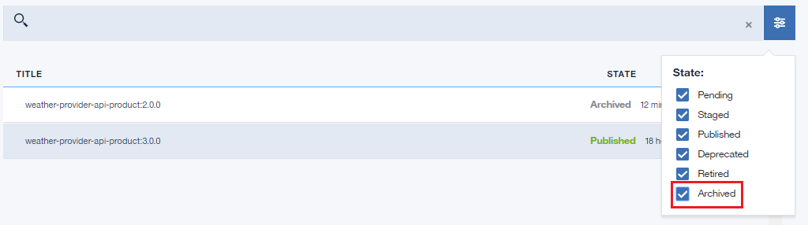

---

copyright:
  years: 2019
lastupdated: "2019-3-15"

subcollection: apiconnect

keywords: IBM Cloud, APIs, lifecycle, catalog, manage, toolkit, develop, dev portal, tutorial

---

{:new_window: target="_blank"}
{:shortdesc: .shortdesc}
{:screen: .screen}
{:codeblock: .codeblock}
{:pre: .pre}

# API 제품 아카이브 및 삭제
{: #tut_manage_remove}

**소요 시간**: 15분  
**스킬 레벨**: 초보자 

## 목표
{: #object_tut_manage_remove}
이 튜토리얼에서는 API를 삭제, 아카이브 및 폐기합니다.

---
## 전제조건
{: #prereq_tut_manage_remove}

1. [{{site.data.keyword.apiconnect_full}} 인스턴스를 설정](/docs/services/apiconnect/tutorials?topic=apiconnect-tut_prereq_set_up_apic_instance)하십시오.

2. [API 제품 튜토리얼 대체](/docs/services/apiconnect/tutorials?topic=apiconnect-tut_manage_supercede)를 완료하십시오.

---

## API 제품 삭제
{: #delete_tut_manage_remove}

1. {{site.data.keyword.Bluemix_short}}: https://cloud.ibm.com에 로그인하십시오.
2. {{site.data.keyword.Bluemix_notm}} **대시보드**에서 **Cloud Foundary 서비스**를 클릭하십시오.{{site.data.keyword.apiconnect_short}} 서비스를 시작하십시오. 
3. {{site.data.keyword.apiconnect_short}}에서 탐색 패널이 열려 있는지 확인하십시오. 열려 있지 않으면 **>>**를 클릭하여 여십시오.  

  
4. **샌드박스**를 클릭하여 샌드박스 카탈로그를 여십시오. **참고**: 사용 가능한 카탈로그를 보려면 대시보드로 리턴해야 할 수도 있습니다. 또한 대시보드 페이지에는 목록이 아니라 타일로 카탈로그가 표시될 수 있습니다.

5. **Weather Provider API 1.0.0** 행에서 세로 생략 기호를 클릭하십시오.  

6. **카탈로그에서 삭제**를 선택하십시오.  

7. **확인**을 클릭하십시오.  

    제품이 카탈로그의 제품 목록에서 사라집니다. 현재로서는 복구할 수 없습니다.

## API 제품 아카이브
{: #archive_tut_manage_remove}

1. **Weather Provider API 2.0.0** 행에서 세로 생략 기호를 클릭하십시오.  

2. **폐기**를 선택하십시오.  

3. **확인**을 클릭하십시오.  

4. **Weather Provider API 2.0.0** 행에서 세로 생략 기호를 클릭하십시오.  

5. **아카이브**를 선택하십시오.  

6. **확인**을 클릭하십시오.  

    제품이 카탈로그의 제품 목록에서 사라집니다. 이 제품은 복구할 수 있습니다.

7. 목록 보기 아이콘을 클릭하십시오.  

8. **아카이브됨**을 확인하십시오.  

9. **Weather Provider API 2.0.0** 행에서 세로 생략 기호를 클릭하십시오.  

10. **아카이브 해제**를 선택하십시오.  

    제품 상태가 폐기됨으로 변경됩니다.
    

 
 
## 결론
{: #conclusion_tut_manage_remove}

이 튜토리얼에서 다음 활동을 완료했습니다.

1. API 제품 삭제
2. API 제품 폐기
3. API 제품 아카이브
4. API 제품 아카이브 해제

---

