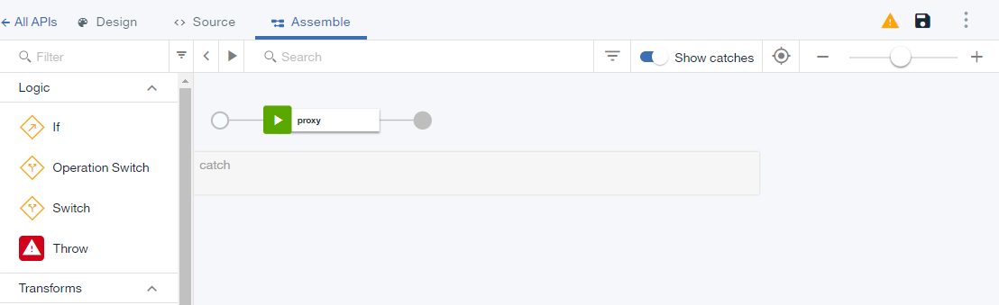
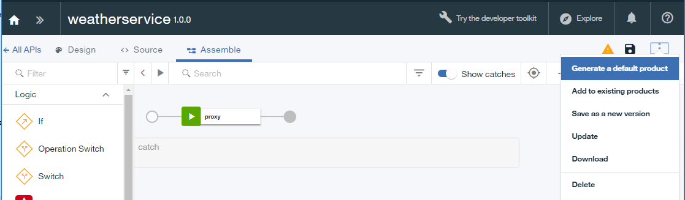

---
opyright:
  years: 2017
lastupdated: "2017-10-19"
---


{:new_window: target="_blank"}
{:shortdesc: .shortdesc}
{:screen: .screen}
{:codeblock: .codeblock}
{:pre: .pre}


# SOAP 서비스 관리
**기간**: 15분
**스킬 레벨**: 초보자

---
## 목표
이 튜토리얼에서는 API Manager를 사용햐여 SOAP 기반 날씨 서비스의 프록시인 SOAP API를 작성합니다.

## 전제조건
- 시작하기 전에 [{{site.data.keyword.apiconnect_short}} 인스턴스를 설정](tut_prereq_set_up_apic_instance.html)해야 합니다.
- 시작하기 전에 [weatherprovider.wsdl 테스트](https://github.com/ibm-apiconnect/getting-started/blob/master/bluemix/manage-soap-api/files/weatherprovider.wsdl){:new_window} 파일을 로컬 파일 시스템에 복사하십시오.
참고: **원시**를 클릭한 다음 로컬 시스템에 결과 페이지를 `.wsdl` 파일로 저장할 수 있습니다. 이름에서 알 수 있듯이 이 SOAP 서비스에서는 우편번호를 지정하면 날씨 데이터를 리턴합니다.

---
## SOAP API 정의 설정
1. {{site.data.keyword.Bluemix_short}}에 로그인: [https://new-console.ng.bluemix.net/login](https://new-console.ng.bluemix.net/login){:new_window}.

2. {{site.data.keyword.Bluemix_short}} **대시보드**에서 아래로 스크롤하여 **모든 서비스**로 이동하십시오.

3. **API Connect**를 선택하여 API Connect 서비스를 실행하십시오. 
  
4. 이미 초안 페이지에 있지 않은 경우 해당 페이지로 이동하십시오.  
    a. API Connect 인터페이스에서 >>를 클릭하여 탐색 페이지를 여십시오.
    b. 탐색 패널에서 **초안**을 클릭하십시오.
    c. **API** 탭으로 이동하십시오.

5. API 탭에서 `추가 +`를 클릭하십시오.

6. 드롭 다운 메뉴에서 **SOAP 서비스에서 API**를 선택하십시오.
  

7. WSDL에서 새 API 대화 상자가 열립니다. **파일 업로드**를 클릭하십시오.
  

8. 이전에 저장한 `weatherprovider.wsdl` 파일을 선택하십시오.

9. WSDL에서 새 API 대화 상자가 사라집니다. **weatherService** 선택란을 선택하십시오. **완료**를 클릭하십시오.
  

10. 가져오기에 성공하면 API의 디자인 보기로 이동합니다. 소스 탭에서 OpenAPI 정의도 볼 수 있습니다.
   _소스 탭에서 WSDL이 OpenAPI 정의에 랩핑됩니다._
  

11. 아래로 스크롤하여 **보안 탭**으로 이동하고 삭제 아이콘을 클릭하여 서비스를 작성할 때 자동으로 생성된 `clientIDHeader (API Key)`를 삭제하십시오.
   _다음 튜토리얼에서는 API 키로 보안에 대해 배웁니다._

12.  아이콘을 클릭하여 변경사항을 저장하십시오. "API가 저장됨" 확인 알림이 잠시 표시됩니다.

13. 저장 아이콘이 있는 메뉴 표시줄에서 **디자인** 탭에 현재 위치가 표시됩니다. 다음에는 API를 나타내는 Swagger(2.0) 파일을 직접 볼 수 있는 **소스** 탭이 있고, 그 다음에는 API 처리에 사용할 수 있는 끌어서 놓기 인터페이스가 있는 **어셈블** 탭이 있습니다. **어셈블**을 클릭하십시오.
    

## SOAP API 정의 테스트

1. **어셈블** 탭에서 **추가 조치**(세 개의 점) 아이콘을 클릭하고 메뉴에서 **기본 제품 생성**을 선택하십시오.  
   

2. **새 제품** 대화 상자 팝업에서 기본 옵션을 승인하고 **제품 작성**을 선택하십시오. **weatherService product 1.0.0**이 작성되고 샌드박스 카탈로그에 공개됩니다.  
  
 
  _{{site.data.keyword.apiconnect_short}}에서 **제품**은 특정 용도로 사용할 API를 그룹화하는 메커니즘을 제공합니다. 제품은 **카탈로그**에 공개됩니다. 참조: [{{site.data.keyword.apiconnect_short}} 용어집](../apic_glossary.html)_

3. 변경사항을 저장하십시오.  

4. 검색 상자 옆에서 테스트 아이콘을 클릭하여 API 서비스를 테스트하십시오. 설정 메뉴가 표시됩니다.

5. 제품 목록에서 `weatherService product 1.0.0`을 선택하십시오.  
  

6. 맨 아래로 스크롤하여 **다음**을 클릭하십시오.

7. 오퍼레이션 목록에서 `post /weatherRequest`를 선택하십시오.  
  

8. 아래로 스크롤하십시오. 본문 필드에 다음 xml을 입력하십시오. 다음 예제 XML을 선택하고 복사한 다음 **body**를 클릭하여 필드를 활성화하고 예제 XML을 두십시오.   
  ```
  <?xml version="1.0" encoding="UTF-8"?>
  <soap:Envelope xmlns:xsi="http://www.w3.org/2001/XMLSchema-instance" xmlns:xsd="http://www.w3.org/2001/XMLSchema" xmlns:soap="http://schemas.xmlsoap.org/soap/envelope/">
   <soap:Body>
  <wdata:WeatherRequest xmlns:wdata="http://www.ibm.com/wdata">
       <zipcode>10504</zipcode>
  </wdata:WeatherRequest>
   </soap:Body>
  </soap:Envelope>
  ```
  {: codeblock}  
  

9. 필요하면 아래로 스크롤하여 **호출**을 클릭하십시오.
API에서 현재 날씨로 구성된 응답 **body**를 리턴합니다.  
  

## 이 튜토리얼에서 수행한 작업
이 튜토리얼에서 다음과 같은 작업을 완료했습니다.
1. SOAP API 정의 설정
2. API 정의 테스트
3. 날씨 API 엔드포인트에서 요청의 결과를 표시하는 응답 **body** 수신

---

## 다음 단계

[서비스를 REST API로 노출](tut_expose_soap_api.html)하거나 [비율 한계](tut_rate_limit.html), [클라이언트 ID 및 시크릿](tut_secure_landing.html) 또는 [OAuth 2.0을 사용하여 보호](tut_secure_oauth_2.html)를 사용하여 API를 보호하십시오.

작성 > **관리** > 보안 > 소셜화 > 분석
