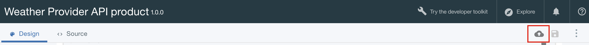

---
copyright:
  years: 2017
lastupdated: "2017-09-30"
---

{:new_window: target="blank"}
{:shortdesc: .shortdesc}
{:screen: .screen}
{:codeblock: .codeblock}
{:pre: .pre}

# 비율 한계 설정
**기간**: 15분  
**스킬 레벨**: 초보자  

## 목표
이 튜토리얼에서는 API의 비율 한계 설정 방법을 보여줍니다. 비율 한계를 설정하면 API와 API 내의
특정 오퍼레이션에 대한 네트워크 트래픽을 관리할 수 있습니다. 비율 한계는 특정 시간 간격으로 허용할 최대 호출 수입니다.

{{site.data.keyword.apiconnect_full}}에서 *제품*을 사용하면 특정 유스 케이스 또는 대상의 패키지로 API를 그룹화할 수 있습니다. 제품에는 API 이용자에게 제공할 조건을 설명하는 *플랜*도 포함됩니다. 더 정확히 플랜에서는 API 등록과 연관된 규칙, 즉 API 비율 한계와 등록 승인 여부를 정의합니다.

애플리케이션 개발자가 API를 사용하려면 사용할 API를 포함하는 제품을 선택하고 제품의 플랜 중 사용 요구사항을 충족시키는 플랜에 등록합니다.

이 튜토리얼에서 다음을 수행합니다.
1. 기존 제품에서 새 비율 한계 플랜을 작성합니다.
2. 애플리케이션이 허용된 비율 한계를 초과할 때 발생하는 사항을 확인합니다.

## 전제조건
{{site.data.keyword.apiconnect_short}}에 하나 이상의 API 키로 보호되는 API가 이미 작성되어 있어야 합니다. 다음 지시사항에서는 [클라이언트 ID 및 시크릿](tut_secure_landing.html)으로 보호되는 [Weather Provider API 예제 파일 ](https://raw.githubusercontent.com/ibm-apiconnect/getting-started/master/toolkit/1a-import/weather-provider-api_1.0.0.yaml){:new_window}부터 시작합니다.

이 튜토리얼을 시작하기 전에 다음 튜토리얼을 완료하십시오.
- [API 스펙 가져오기 및 기존 REST 서비스 프록시](tut_rest_landing.html).
- [클라이언트 ID 및 시크릿을 사용하여 API 보호](tut_secure_landing.html).

---
## API Connect 실행

1. {{site.data.keyword.Bluemix_short}}에 로그인: [https://console.ng.bluemix.net/login ](https://console.ng.bluemix.net/login){:new_window}.
2. {{site.data.keyword.Bluemix_short}}에 로그인하고 나면 아래로 스크롤하여 **모든 서비스**로 이동한 다음 **API Connect**를 클릭하십시오.
3. **API Connect**를 클릭하여 {{site.data.keyword.apiconnect_short}} 서비스를 실행하십시오.

## 기본 플랜 탐색
1. {{site.data.keyword.apiconnect_short}} 탐색 패널에서 **초안**을 선택하십시오. (탐색 패널이 열려 있지 않으면 **>>**를 클릭하여 여십시오.)
2. **제품 탭**을 선택하면 Weather Provider API 제품이 나열되어야 합니다.

         

3. 제품 링크를 클릭하면 제품에 대한 정보가 나열되는 디자인 보기가 열립니다.
4. 아래로 스크롤하여 페이지의 플랜 섹션으로 이동하십시오. 이 제품을 생성하면 기본 플랜이 작성됩니다. 

       
5. 기본 플랜 세부사항을 펼치십시오. 특정 오퍼레이션을 표시하기 위해 확장할 수 있는 비율 한계(100호출/1시간) 및 API 목록이 표시됩니다.

    

   
## 새 비율-한계 플랜 작성

기본 플랜이 표시되는 방식을 확인했으므로, API 이용자가 플랜의 한계를 초과하면 발생하는 사항을 보여주기 위해 비율 한계가 더 제한적인 새 플랜을 작성해 보겠습니다. 
1. 단추를 클릭하여 새 플랜을 추가하십시오.
 
     
    
    새로운 플랜이 작성되며, 기본적으로 무제한 사용을 허용하도록 설정됩니다(즉, 비율 한계가 없음). 더 의미 있는 이름을 부여하고 더 제한적인 한계를 설정해 보겠습니다.
2. 새 플랜(`New Plan 1`)을 클릭하여 세부사항을 펼치십시오.
3. 제목 필드를 클릭하고 플랜 제목을 `Demo`로 설정하십시오.
4. 이름 필드를 클릭하고 플랜 이름을 `demo-plan`으로 설정하십시오.
5. +를 클릭하고 새 비율 한계를 추가하십시오.
6. 새 비율 한계의 이름을 `demo-rate-limit`로 바꾸고 `1 / 1 Minute`로 설정되었는지 확인하십시오.
7. `Enforce hard limit` 선택란을 선택하십시오(이 설정이 사용 가능한 경우 등록된 플랜 한계에 따라 허용되는 수보다 많이 API를 호출하면 애플리케이션에서 오류가 발생함).
8. 다른 기본 설정을 모두 승인하고 제품을 저장하십시오.

    

## 업데이트된 제품을 샌드박스 카탈로그에 스테이징 및 공개

이전 예에서 테스트 도구를 사용하여 제품을 공개했습니다. 그러면 이 도구에서 사전 제공된 테스트 애플리케이션 신임 정보를 사용하여 API를 호출합니다. 그러나 이 테스트 애플리케이션에는 비율 한계가 적용되지 않으므로, 여기서는 비율 한계 용도로 새 애플리케이션을 작성하지 않습니다. 자세한 정보는 [API Connect에 대한 IBM Knowledge Center 컨텐츠](https://www.ibm.com/support/knowledgecenter/SSFS6T/com.ibm.apic.toolkit.doc/tapim_create_product.html){:new_window}을 참조하십시오.

1. 공개 아이콘을 클릭하여 제품을 **샌드박스** 카탈로그로 *스테이징*하십시오. 이 조치를 수행하면 선택한 카탈로그에 초안 제품 변경사항을 추가합니다. 다음으로, 개발자 포털을 통해 이용자가 사용할 수 있도록 제품 변경사항을 *공개*해야 합니다.
    
2. >> 단추를 클릭하여 탐색 메뉴를 여십시오.
    
3. 대시보드를 선택한 다음 **샌드박스** 카탈로그를 여십시오. Weather Provider API 제품이 **스테이징됨**으로 나열됩니다.
4. 생략 기호를 클릭하고 메뉴에서 **공개**를 선택하십시오.
    
5. 기본 가시성 설정을 승인하고 **공개** 단추를 클릭하십시오. 제품이 공개되어 개발자 포털에 표시되고 나면 애플리케이션 개ㅂ라자가 사용 가능한 플랜에 등록할 수 있습니다.

## 개발자 포털에서 새 (이용자) 애플리케이션 등록
애플리케이션 개발자가 개발자 포털을 사용하여 API를 검색하고 사용합니다. 개발자 포털에 대한 자세한 정보는 이 [IBM Knowledge Center 주제 ](https://www.ibm.com/support/knowledgecenter/SSFS6T/com.ibm.apic.devportal.doc/tapim_tutorial_using_ADP.html){:new_window}를 확인하십시오.

개발자 포털에서 처음 작업하는 경우 샌드박스 카탈로그용으로 개발자 포털을 프로비저닝해야 합니다. 포털을 프로비저닝할 때 로그인한 계정이 해당 포털의 관리자 계정이 됩니다. 그런 다음 API를 탐색하고 테스트하려면 관리자 계정과 다른 새로운 개발자 계정(다른 이메일 주소 사용)을 작성한 다음 이 계정으로 로그인해야 합니다.

다음 지시사항은 이 단계를 안내합니다.

1. 개발자 포털을 실행하십시오. URL을 모르면 샌드박스 카탈로그의 설정 탭에서 찾을 수 있습니다.

   
    - 개발자 포털을 처음으로 프로비저닝하려면 드롭 다운에서 **IBM Developer Portal**을 선택하십시오.
    - 이 작업을 완료하는 데 최대 1시간이 걸릴 수 있습니다. 샌드박스 개발자 포털이 준비되면
새 개발자 포털 사이트의 링크가 있는 이메일이 전송됩니다. 이 링크는 관리자 계정에 대한 일회용 링크입니다.
2. 앱 개발자 신임 정보(사용자의 IBM ID가 **아님**) 를 사용하여 포털에 로그인하십시오. ***(필요한 경우 IBM ID 이외의 다른 주소를 사용하여 새 개발자를 작성하십시오.)***
3. 도구 모음에서 **앱** 링크를 클릭한 다음 **새 앱 작성** 단추를 클릭하십시오.

   
4. 애플리케이션에 제목을 지정하고 **제출**을 클릭하십시오.

   
5. 표시되는 클라이언트 시크릿과 클라이언트 ID를 저장하십시오. 지금이 아니면 클라이언트 시크릿을 복사할 수 없습니다!

   

## API 제품에 등록

1. 도구 모음에서 **API 제품** 링크를 클릭하십시오. Weather Provider API 제품이 나열됩니다! 

   
2. 링크를 클릭하여 세부사항과 옵션을 표시하십시오. 사용 가능한 두 플랜(원래 기본 플랜과 새 데모 플랜)이 표시되어야 합니다. (한 플랜만 표시되는 경우 API Connect로 돌아가 제품 변경사항이 샌드박스 카탈로그에 저장, 스테이징 및 공개되었는지 확인하십시오.) 

   
3. 데모 플랜에 **등록**을 클릭하고 방금 등록한 애플리케이션을 선택하십시오. 이제 애플리케이션에서 분당 최대 *하나*의 API를 호출하는 비율로 이 플랜과 연관된 API를 호출할 수 있습니다. 

이 동작을 테스트하고 애플리케이션이 지정된 비율을 초과하면 발생하는 사항을 관찰한 준비가 되었습니다.

## 비율 한계 API 호출

1. 개발자 포털의 Weather Provider API 제품 페이지에서 API 링크를 클릭하십시오.

   
2. 페이지가 새로 고치기되어 API, 오퍼레이션에 대한 세부사항이 표시되고, 테스트할 위치가 제공됩니다(이 방식으로 API 이용자가 API를 검색하고 테스트함). 어두운 테스트 분할창이 표시되므로 아래쪽으로 스크롤하여 첫 번째 **이 오퍼레이션 시도** 섹션으로 이동하십시오.

3. `GET /current` 오퍼레이션을 테스트하려면 애플리케이션의 클라이언트 시크릿과 올바른 우편번호를 입력하십시오. **오퍼레이션 호출** 단추를 클릭하십시오. 해당 우편번호의 현재 날씨에 대한 데이터와 함께 `200 OK` 응답이 표시되어야 합니다. 

   

   

4. 이제 원하는 경우 1분이 지나기 전에 다른 우편번호를 사용하여 **오퍼레이션 호출** 단추를 다시 클릭하십시오. 이번에는 `429 Too Many Requests` 응답이 표시되어야 합니다.

   

5. 비율 한계 재설정의 유효성을 검증하려면 잠시 기다린 후 다시 시도하고 올바른 응답을 받는지 확인하십시오.

## 결론

축하합니다! 비율 한계 플랜이 작성되어, 보안 API와 연관되고, API가 사용자가 지정한 매개변수의 요청에만 응답하는지 확인했습니다.

---

## 다음 단계

[개발자 포털을 설정 및 구성](tut_config_dev_portal.html)하여 API의 소셜화를 시작하십시오.

작성 > 관리 > **보안** > 소셜화 > 분석
