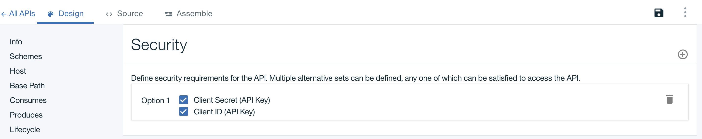

---
copyright:
  years: 2017
lastupdated: "2017-09-30"
---

{:new_window: target="blank"}
{:shortdesc: .shortdesc}
{:screen: .screen}
{:codeblock: .codeblock}
{:pre: .pre}

# 툴킷을 사용하여 클라이언트 ID와 클라이언트 시크릿으로 API 보호

**기간:** 10분  
**스킬 레벨:** 초보자

## 목표

이 튜토리얼에서는 클라이언트 ID와 클라이언트 시크릿으로 API를 보호하는 방법을 안내합니다. 개발자 포털에 애플리케이션이 등록되면 애플리케이션을 식별하기 위해 클라이언트 ID가 생성됩니다. 선택적으로 비밀번호 역할을 수행하는 클라이언트 시크릿도 생성될 수 있습니다. API에 액세스하려면 애플리케이션에서 생성된 클라이언트 ID와 클라이언트 시크릿 키를 제공해야 합니다.

## 전제조건
시작하기 전에 다음 튜토리얼 중 하나를 완료해야 합니다.
- [OpenAPI2.0 스펙 가져오기 및 기존 REST 서비스 프록시](tut_rest_landing.html)
**또는**  
- [새 API 스펙 추가 및 기존 REST 서비스 호출](tut_rest_landing.html)

## API의 ID 메커니즘 설정

1. 다음과 같이 API Designer를 실행하십시오(아직 열려있지 않은 경우).  
   a. 터미널을 여십시오.  
   b. 명령행에 `apic edit`를 입력하십시오. _API Designer는 웹 브라우저에서 실행됩니다._    
   c. **Bluemix로 로그인**을 클릭하십시오.  
   d. {{site.data.keyword.Bluemix_short}} 로그인 정보를 입력하십시오.  

2. 다음과 같이 API의 디자인 보기로 이동하십시오.
    a. 왼쪽 탐색 패널에서 **초안**을 클릭하십시오. 
    b. 그런 다음 **API** 탭을 클릭하십시오.
    c. 이전 튜토리얼에서 작성한 _Weather Provider API_를 클릭하십시오. 그러면 API의 **디자인** 보기가 열립니다.  
      

3. 디자인 보기에서 다음을 수행하십시오.  
   a. 아래로 스크롤하여 **보안 정의**로 이동하십시오.  
     

   b. **보안 정의 추가** 아이콘(+)을 클릭한 다음 **API 키**를 클릭하십시오.  
      - 이름: Client ID; 매개변수 이름: X-IBM-Client-ID  
      - 이름: Client Secret;  매개변수 이름: X-IBM-Client-Secret  
      - 새로운 두 키 모두에서 **Located In** 필드가 "Header"로 설정되었는지 확인하십시오.  
          

4. 아래로 스크롤하여 **보안** 패널로 이동하고 새 보안 옵션을 추가하십시오.  
   a. 새로 작성된 클라이언트 ID 및 클라이언트 시크릿 키를 선택하십시오.  
   b. API를 저장하십시오.  
   c. **어셈블** 탭으로 전환하십시오.   
     

## API 변경사항 테스트

1. 어셈블 탭에서 ►을 클릭하여 변경사항을 테스트하십시오.
2. 테스트 패널에서 **get /current** 오퍼레이션을 클릭하십시오.
3. 테스트 패널에서 아래로 스크롤하여 클라이언트 ID와 클라이언트 시크릿 값이 이미 채워져 있음을 확인하십시오. _이 값은 샌드박스에 대해 생성되는 테스트 값이며, API를 사용할 애플리케이션의 키를 나타냅니다._  
> 참고: 클라이언트 ID와 클라이언트 시크릿 키는 **대시보드** > **카탈로그** > **설정** > **엔드포인트**에도 있습니다.  

 

4. 아래로 스크롤하여 우편번호(예: 90210)를 입력하십시오. 
5. 그 다음 **호출**을 클릭하십시오. _날씨 정보를 리턴하는 메시지 본문과 함께 200 OK 응답이 표시되어야 합니다._  
6. 다시 위로 스크롤하여 클라이언트 ID 필드로 이동한 다음 클라이언트 ID 값을 임의 값으로 바꾸십시오(올바르지 않은 클라이언트가 전달되는 경우 동작 참조).  
7. **호출**을 클릭하여 테스트를 다시 실행하십시오. _"클라이언트 ID가 등록되지 않음" 메시지와 함께 401 권한 없음 응답이 표시됩니다._  
    
  

## 클라이언트 ID와 클라이언트 시크릿을 사용하여 API 호출

프록시 엔드포인트를 명시적으로 호출하고 클라이언트 ID와 클라이언트 시크릿 키를 헤더 값으로 전달하는 탐색 도구를 사용하여 보안 설정을 테스트할 수 있습니다.

1. **탐색**을 클릭한 다음 **샌드박스**를 클릭하십시오.  
    

2. 목록에서 **GET /current** 오퍼레이션을 클릭하십시오.  

3. 오른쪽 열에서 **오퍼레이션 호출**을 클릭하여 테스트를 다시 실행하십시오.  
      
    
---

### 결론
이 튜토리얼에서는 API의 ID 메커니즘을 설정하고 API의 변경사항을 테스트하며 클라이언트 ID와 클라이언트 시크릿을 사용하여 API를 호출하는 방법을 배웠습니다. 

---

## 다음 단계

[개발자 포털을 설정 및 구성](tut_config_dev_portal.html)하여 API의 소셜화를 시작하십시오.

작성 > 관리 > **보안** > 소셜화 > 분석
