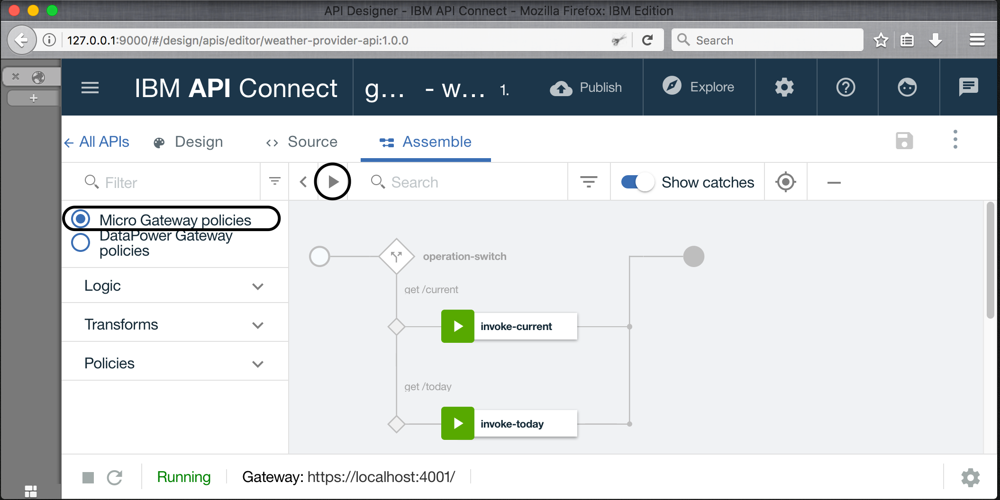

---
copyright:
  years: 2017
lastupdated: "2017-11-02"
---

{:new_window: target="blank"}
{:shortdesc: .shortdesc}
{:screen: .screen}
{:codeblock: .codeblock}
{:pre: .pre}

# Inclua uma nova especificação de API e chame um serviço REST existente usando o Developer Toolkit
**Duração**: 15 min  
**Nível de qualificação**: iniciante  

## Objetivo
Este tutorial ajuda você a começar rapidamente com o {{site.data.keyword.apiconnect_full}} ilustrando como é possível colocar sua API existente sob o controle de gerenciamento. Você iniciará criando uma nova especificação OpenAPI e, em seguida, criará um proxy de API de passagem para um serviço REST existente.

## Pré-requisito
Antes de iniciar, será necessário [configurar sua instância do API Connect](tut_prereq_set_up_apic_instance.html) e [instalar o kit de ferramentas do API Connect](tut_prereq_install_toolkit.html).

---


## Explore o app de amostra e teste os terminais de destino
Um app de _provedor de clima_ de amostra foi criado para este tutorial.
1. Para explorar o app, acesse [http://gettingstartedweatherapp.mybluemix.net/ ](http://gettingstartedweatherapp.mybluemix.net/){:new_window}.  
2. Insira um CEP válido de 5 dígitos dos EUA para obter o _**clima atual**_ e a _**previsão de hoje**_.  


3. O app de clima de amostra acima foi construído usando APIs que fornecem os dados de clima. O terminal para obter os dados de clima **atuais** é _**https:// myweatherprovider<span></span>.mybluemix.net/current?zipcode={zipcode}**_. Experimente-o visitando [https://myweatherprovider.mybluemix.net/current?zipcode=90210 ](https://myweatherprovider.mybluemix.net/current?zipcode=90210){:new_window}.  

  

4. Da mesma forma, o Terminal para obter os dados de previsão de **hoje** é `https:// myweatherprovider<span></span>.mybluemix.net/today?zipcode={zipcode}`. Experimente-o acessando [https://myweatherprovider.mybluemix.net/today?zipcode=90210 ](https://myweatherprovider.mybluemix.net/today?zipcode=90210){:new_window}.  

  

---

## Incluir uma nova especificação OpenAPI e chamar um serviço REST existente
1. Ative o **API Designer**. Em seu terminal, insira `apic edit`.
2. Efetue login usando seu IBMid. 
3.   No API Designer, assegure-se de que o painel de navegação esteja aberto. Caso contrário, clique em >> para abri-la. No painel de navegação **API Designer**, selecione **Rascunhos > APIs**.
4. No painel **APIs**, selecione **Incluir > Nova API**.
5. Na janela Nova API, insira "Weather Provider API" para o título. _O nome e o caminho base são preenchidos automaticamente_.  
     
6. Clique em **Criar API** para concluir o assistente.  

7. Após sua API ser criada, a guia **Design** é selecionada.

8. Role para o painel **Host**. Insira `$(catalog.host)` como o valor se o campo não for preenchido automaticamente.

9. Role para a guia **Segurança** e exclua o "clientIDHeader (Chave API)" que foi gerado automaticamente.  
_(Visitaremos a segurança com chaves API no próximo tutorial.)_  

10. No painel **Caminhos**, crie um novo caminho clicando em **+**.
  a. Dê o nome "**/current**" ao novo caminho.  
  b. No mesmo painel **Caminhos**, selecione a seção **GET /current**.  
  c. Na seção **GET /current**, inclua um novo **Parâmetro**. Conforme observado ao explorar o app de amostra, o serviço de clima requer zipcode como parâmetro.
      - Nome: CEP  
      - Localizado em: consulta  
      - Necessário: sim  
      - Tipo: sequência  
    
  d. Salve sua API.

11. Com seus parâmetros de consulta definidos na etapa anterior, agora você precisa definir o objeto de resposta que é retornado ao chamar a API de clima. Para isso, role para baixo para o painel **Definições**.

  1. Incluir uma nova definição. 
  2. Dê o nome _Atual_ à nova definição.
  3. Configure o Tipo de _Objeto_.
  4. Incluir novas propriedades para a definição **Atual**.
    - Nome: CEP/Tipo: sequência
    - Nome: temperatura/Tipo: número inteiro
    - Nome: umidade/Tipo: número inteiro
    - Nome: cidade/Tipo: sequência
    - Nome: estado      /  Tipo: sequência
    
  5. Salve sua API.  

12. Na etapa anterior, você definiu o objeto de resposta. Em seguida, será necessário assegurar-se de que o objeto de resposta esteja associado ao caminho **get /current**. Na navegação, role de volta até o painel **Caminhos**.
  a. Abra a operação **GET /current** e role para a seção **Respostas**.
  b. Mude o esquema da resposta 200OK de "objeto" para "**Atual**".
  c. Salve sua API.

13. O caminho e a operação recém-criados eram para obter os dados de clima atuais. Agora será necessário criar um caminho e uma operação semelhantes para obter os dados de clima de hoje. Semelhante a como você criou o caminho **/current** na etapa 11, crie um novo caminho: **/today**. 

14. Incluir um novo parâmetro na operação **GET /today**.
    - Nome do parâmetro: zipcode  
    - Localizado em: consulta  
    - Necessário: sim  
    - Tipo: sequência  

15. Criar uma nova definição: **Hoje**.

16. Incluir novas propriedades para a definição **Hoje**.
  - Nome: CEP/Tipo: sequência
  - Nome: hi/Tipo: número inteiro
  - Nome: lo/Tipo: número inteiro
  - Nome: nightHumidity/Tipo: número inteiro
  - Nome: dayHumidity/Tipo: número inteiro
  - Nome: cidade/Tipo: sequência
  - Nome: estado/Tipo: sequência

17. Atualize o esquema de resposta na seção **GET /today** para "Hoje".

18. Salve sua API.

19. Alterne para a guia **Montar**. Você criou duas operações até agora: **GET /current** e **GET /today**. Para assegurar que o terminal de destino correto seja chamado, será necessário criar alguma lógica que executará a condicional na operação que está sendo chamada. Vamos usar a construção lógica **Comutador de operação** para fazer isso.  

    a. Exclua a política **invoke** que já pode ser incluída na _tela_.  
    b. Na _paleta_, arraste o **Comutador de operação** e solte-o na tela.  
      - Para o **caso 0**, designe a operação **get /current**.
      - Incluir um novo caso: **caso 1**.
      - Designe a operação **get /today** ao **caso 1**.
    
    O **Comutador de operação** fornece um ponto de decisão. Baseado no par verbo/caminho, a operação apropriada deve ser chamada.  
    c. Arraste a política **invoke** da paleta e solte-a na tela. Solte uma no caminho **/get current** e uma no caminho **/get today**.
    d. Selecione a política **invoke** no caminho **/get current** e atualize seu título para "**invoke-current**".  
    e. Atualize o campo URL com: `https://myweatherprovider.mybluemix.net/current?zipcode=$(request.parameters.zipcode)`.
    f. Selecione a política **invoke** no caminho **/get today** e atualize seu título para "**invoke-today**".  
    g. Atualize o campo URL com: `https://myweatherprovider.mybluemix.net/today?zipcode=$(request.parameters.zipcode)`.  

20. Salve sua API.

---

## Teste seu proxy de API

### Teste com a _ferramenta de teste API Manager_.
1. Inicie o servidor de teste local clicando no ícone de início de servidores (>) na parte inferior esquerda do designer. Quando o Gateway for iniciado, você verá o status ser atualizado automaticamente para Em execução.

    

2. Na guia **Montar**, clique no ícone de reprodução (>) para testar a chamada de destino de seu proxy de API. _Para este tutorial, vamos usar o Micro Gateway integrado, então assegure-se de que Políticas de Micro Gateway estejam selecionadas._

    

3. No painel de teste, selecione a operação **get /current**.  
  a. Zipcode é um parâmetro necessário para esta operação, portanto, insira um CEP válido dos EUA (por exemplo, 90210).  
  b. Clique em **chamar** e verifique se vê:
  ```
  Resposta 200 OK Dados de clima atuais para 90210  
  ```
      

_Se você obtiver um erro CORS, siga as instruções na mensagem de erro. Clique no link com erro para incluir a exceção em seu navegador e, em seguida, pressione o botão "chamar" novamente._

### Teste com a _ferramenta Explorar_.  
1. Para testar seus terminais de proxy de API, selecione _Explorar_.
2. Selecione a operação **GET /current** na paleta.
3. Insira um CEP válido dos EUA (por exemplo, 90210) na caixa de teste.
4. Clique em **Chamar operação** para ver a resposta.  
    
  
---

## Conclusão
Neste tutorial, você viu como um serviço REST existente pode ser chamado por meio de um proxy de passagem de API. Você iniciou verificando a disponibilidade do serviço de amostra por meio do navegador da web. Depois, você criou uma nova especificação OpenAPI no {{site.data.keyword.apiconnect_short}} e a vinculou ao serviço de amostra a ser chamado. Finalmente, você testou o proxy de API com a ferramenta de teste integrada.

---

## Próxima etapa

Proteja sua API usando [limitação de taxa](tut_rate_limit.html), [identificador e segredo do cliente](tut_secure_landing.html) ou [protegendo usando OAuth 2.0](tut_secure_oauth_2.html).

Criar > **Gerenciar** > Assegurar > Socializar > Analisar

