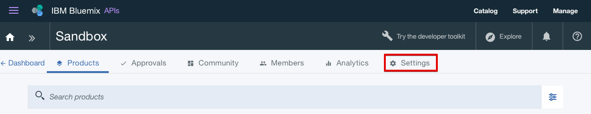

---

copyright:
  years: 2017
lastupdated: "2017-10-31"

subcollection: apiconnect

keywords: IBM Cloud, APIs, lifecycle, catalog, manage, toolkit, develop, dev portal, tutorial

---

{:new_window: target="blank"}
{:shortdesc: .shortdesc}
{:screen: .screen}
{:codeblock: .codeblock}
{:pre: .pre}

# Configurando o Portal do Desenvolvedor
{: #tut_config_dev_portal}

**Duração**: 30 min  
**Nível de qualificação**: iniciante  

## Objetivo
{: #object_tut_config_dev_portal}

Este tutorial ajudará a iniciar rapidamente a configuração do seu **Portal do Desenvolvedor do API Connect**. 

## Pré-requisito
{: #prereq_tut_config_dev_portal}

Antes de começar, será necessário [importar sua especificação de API e configurar o proxy de um serviço REST existente](/docs/services/apiconnect/tutorials?topic=apiconnect-tut_rest_landing).

---

## Criar seu portal do desenvolvedor
{: #create_prereq_tut_config_dev_portal}

Nesta seção, você criará um portal do desenvolvedor para um catálogo.

*Catálogos* são um termo IBM para ambientes diferentes. Por exemplo, você criaria catálogos diferentes para seus ambientes de teste, preparação e produção. É necessário ter um catálogo chamado Ambiente de simulação. Sinta-se livre para usar este catálogo para criar seu portal do desenvolvedor ou criar um novo catálogo e nomeá-lo como desejar.

1. Em seu painel do {{site.data.keyword.Bluemix_short}}, selecione seu serviço do **API Connect** para ativar o painel do {{site.data.keyword.apiconnect_short}}.

2. No painel do {{site.data.keyword.apiconnect_short}}, selecione o catálogo no qual deseja criar um portal do desenvolvedor. Por exemplo, **Ambiente de simulação**.

3. No catálogo, selecione a guia **Configurações**.  
  

4. Na guia Configurações, selecione **Portal**.  
  

5. Na página Configuração do portal, selecione **Portal do Desenvolvedor IBM** na lista suspensa Selecionar portal.
 

6. Anote a **URL do portal** e salve suas mudanças.  
  
  
7. Conforme observado na caixa de diálogo, geralmente demora alguns minutos para criar o portal do desenvolvedor. Você receberá um e-mail quando tiver concluído. Selecione **OK** para reconhecer a mensagem de diálogo.  
  

---

## Explorar seu portal do desenvolvedor
{: #explore_prereq_tut_config_dev_portal}

Nesta seção, você ficará familiarizado com o portal do desenvolvedor criado nas etapas anteriores.

1. Depois de ter configurado o desenvolvedor do portal para seu catálogo, você receberá um e-mail com um link para um login único. Selecione o link para ativar o portal do desenvolvedor.

2. Selecione **Login** para efetuar login no portal do desenvolvedor.

3. Insira uma nova senha e clique em **Salvar**.  
  

4. Agora que você configurou sua senha, vamos explorar o portal do desenvolvedor, começando com **Página inicial** na parte superior da página.  
  
  
| Guia              | Descrição          | 
|:---------------- | -------------------- | 
| _Página inicial_       | A Página inicial é a página de boas-vindas para seu portal do desenvolvedor. É possível [customizar a página](/docs/service/apiconnect/tutorials?topic=apiconnect-tut_custom_dev_portal) para adequar às suas necessidades. | 
| _Introdução_       | A página Introdução é usada para instruir os desenvolvedores como iniciar usando o portal do desenvolvedor. |
| _Produtos de API_ | A página Produtos de API é usada pelos desenvolvedores para explorar e assinar as APIs que estão disponíveis no portal. | 
| _Apps_ | A página Apps exibe os aplicativos que estão usando suas APIs. | 
| _Blogs_ | A página Blogs é onde as postagens do blog sobre suas APIs podem ser criadas e exibidas. | 
| _Fóruns_ | A página Fóruns é onde os desenvolvedores podem ter discussões e postar perguntas sobre suas APIs. | 
| _Suporte_ | Na página Suporte, é possível instruir os desenvolvedores sobre como eles podem receber suporte sobre suas APIs. Por exemplo, é possível referir-se a seus fóruns e Perguntas mais frequentes. Também é possível fornecer um link que permite que eles abram um chamado de suporte, se necessário. | 

Nota: na página Produtos de API, é possível selecionar um dos produtos para visualizar a página Produto para uma API e os planos disponíveis. Isso permite que os desenvolvedores assinem e visualizem os detalhes da API. 

  

### Conclusão
{: #conclusion_prereq_tut_config_dev_portal}

Neste tutorial, você aprendeu como configurar seu {{site.data.keyword.apiconnect_short}} Developer Portal. Você também explorou o portal do desenvolvedor.

---

## Próxima etapa
{: #next_prereq_tut_config_dev_portal}

[Customize o Portal do Desenvolvedor e selecione um tema](/docs/services/apiconnect/tutorials?topic=apiconnect-tut_custom_dev_portal).

Criar > Gerenciar> Assegurar > **Socializar** > Analisar
