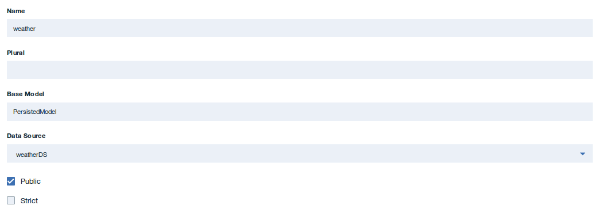

---

copyright:
  years: 2018
lastupdated: "2018-02-22"

---


{:new_window: target="_blank"}
{:shortdesc: .shortdesc}
{:screen: .screen}
{:codeblock: .codeblock}
{:pre: .pre}


# Criando uma API em Node.js

**Duração**: 20 min  
**Nível de qualificação**: iniciante  

---
## Objetivo

Este tutorial fornece orientação durante a criação de uma API em Node.js usando a estrutura LoopBack. O tutorial descreve como:
1. Criar um novo projeto LoopBack.
2. Incluir uma nova origem de dados e modelo em um projeto LoopBack usando o API Designer no kit de ferramentas do {{site.data.keyword.apiconnect_full}}.
3. Testar seus terminais de API usando a ferramenta API Designer Explore.

---
## Pré-requisito

Antes de iniciar, [instale o kit de ferramentas do {{site.data.keyword.apiconnect_short}}](tut_prereq_install_toolkit.html). Se o kit de ferramentas já estiver instalado, certifique-se de que você esteja executando a versão 5.0.8.1 ou mais recente. É possível verificar isso inserindo o comando a seguir na linha de comandos:
	```
	apic -v
	```

---
## Criar um projeto Loopback

É possível criar um projeto Loopback usando a interface da linha de comandos do kit de ferramentas do desenvolvedor do {{site.data.keyword.apiconnect_short}} ou a interface do API Designer. 
 
### Criar um projeto LoopBack usando a linha de comandos do kit de ferramentas

Para criar um projeto LoopBack usando a linha de comandos do kit de ferramentas do {{site.data.keyword.apiconnect_short}}, conclua as etapas a seguir:
1.  Na interface da linha de comandos, insira o comando a seguir. Ele é usado para criar e gerenciar aplicativos LoopBack.
	```bash 
	apic loopback
	```
	>![informações]
	>Neste tutorial, você criará um projeto chamado weather-data.
2.  No prompt, insira `weather-data` como o nome do projeto e pressione **Enter**.
	```bash
	? What's the name of your application? weather-data
	```
  	>![importante]
  	>Em geral, um nome de projeto pode conter quaisquer caracteres, exceto espaço em branco (" "), barra ("/"), e comercial ("&"), arroba ("@"), mais ("+"), percentual ("%"), e dois pontos (":").
3.  Insira o nome do diretório no qual criará o projeto. Pressione **Enter** para usar um diretório com o mesmo nome que o projeto ou digite um novo nome e pressione **Enter**.
	```bash
	? Enter name of the directory to contain the project: weather-data
	```
4.  Selecione a versão de LoopBack a ser usada. Escolha a versão de produção atual: 3.x.
	```bash
	? Which version of LoopBack would you like to use? 
  	2.x (long term support) 
	? 3.x (current) 
	```
5.  Especifique o tipo de aplicativo que você deseja criar usando as teclas de seta para selecionar **empty-server**.
	```bash
	? What kind of application do you have in mind? (Use arrow keys)
	? empty-server (An empty LoopBack API, without any configured models or datasources)
  	hello-world (A project containing a basic working example, including a memory database)
  	notes (A project containing a basic working example, including a memory database)
	```
6.  Pressione **Enter** para criar uma API LoopBack vazia. 

A ferramenta exibe várias mensagens à medida que ela cria o diretório de projeto e inclui vários diretórios e arquivos nele. Ele também executa npm install para instalar todas as dependências do projeto, conforme especificado em package.json. Esse processo cria um diretório node_modules e pode demorar um pouco.

Um projeto LoopBack vazio contém os diretórios a seguir:
- servidor: contém as definições de modelo de servidor e origem de dados, além de outro código do servidor
- definições: contém arquivos de definição YAML
- node_modules: criado por node.js


### Criar um projeto LoopBack usando a interface do API Designer

Para criar um projeto LoopBack usando o API Designer, conclua as etapas a seguir:
1.  Na interface da linha de comandos, insira o comando a seguir para iniciar o API Designer:
	```bash
	apic edit
	```
	
	>![informações]
	>O comando acima inicializa o kit de ferramentas do {{site.data.keyword.apiconnect_short}} e ativa o API Designer no navegador padrão quando ele é concluído.
	>![informações]
	>Nesse tutorial, você criará um projeto chamado weather-data.
2.  Se você não tiver fixado anteriormente a área de janela de navegação da UI, clique no ícone Navegar para . A área de janela de navegação da UI do API Manager é aberta. Para fixar a área de janela de navegação da UI, clique no ícone de menu Fixar .
3.  Na barra lateral, clique no ícone Mais projetos .
4.  Clique em **Criar projeto LoopBack**. Você verá o diálogo **Incluir novo projeto LoopBack**.
5.  Selecione **empty-server** como o modelo de projeto.
6.  Para **Versão do LoopBack**, selecione a versão 3.x (a versão atual).
7.  Insira `weather-data` para os campos Nome de exibição e Nome.
8.  Para o **Diretório de projeto**, selecione a pasta `weather-data` criada na etapa 1 clicando no botão **Procurar**.
 
9. Clique em **Incluir** para incluir o projeto.
	>![informações]
 >Várias mensagens serão exibidas na janela **Incluir novo projeto LoopBack** à medida que ela criar o diretório de projeto e incluir vários diretórios e arquivos nele. Ele também executa npm install para instalar todas as dependências do projeto, conforme especificado em package.json. Esse processo cria um diretório node_modules e pode demorar um pouco.
	
	>Um projeto LoopBack vazio contém os diretórios a seguir:
	- servidor: contém as definições de modelo de servidor e origem de dados, além de outro código do servidor
	- definições: contém arquivos de definição YAML
	- node_modules: criado por node.js
10. Clique em **Concluído** para fechar a caixa de diálogo **Incluir novo projeto LoopBack**.
11. Saia do **API Designer** voltando para a linha de comandos na etapa 1 e inserindo `Ctrl + C`. Digite `Y` para confirmar a saída.
12. Feche a sessão do navegador.

---
## Incluir uma nova origem de dados e um modelo

Para incluir um novo modelo e uma origem de dados para um projeto LoopBack usando o API Designer, conclua as etapas a seguir:

### Incluir uma origem de dados
Para incluir uma nova origem de dados em um projeto LoopBack usando o API Designer, conclua as etapas a seguir.
1. Deve-se criar também um projeto LoopBack (o projeto "weather-data") conforme descrito em `Criar um projeto LoopBack por meio da linha de comandos` e assegurar que o diretório atualmente em funcionamento seja o diretório-raiz do projeto:
	```bash
	cd weather-data
	```
2. Na linha de comandos, insira o comando a seguir:
	```bash
	apic edit
	```
	Após uma breve pausa, o console exibe esta mensagem:
	```bash
	Express server listening on http://127.0.0.1:9000
	```
	O API Designer será aberto no navegador da web padrão, exibindo inicialmente a página de login, se você não tiver efetuado login recentemente.  
	>![informações]
	>É possível efetuar login usando sua conta do {{site.data.keyword.Bluemix}} ou criar uma.
3. Clique no ícone **Origens de dados** .
4. Clique em **Incluir**. A janela Nova origem de dados de LoopBack é aberta.
5. Insira `weatherDS` no campo de texto **Nome**.
	>![informações]
	>É possível usar quaisquer caracteres alfanuméricos, traços e sublinhados em um nome de origem de dados.
6. Clique em **Novo**.
7. Por padrão, a configuração **Conector** mostra **BD na memória** e as outras configurações estão em branco. Mantenha as configurações padrão por enquanto e o API Designer salva automaticamente a nova origem de dados.
	>![informações]
 >A origem de dados na memória é construída no LoopBack e é adequada somente para desenvolvimento e teste inicial. Quando você estiver pronto para conectar seus modelos a uma origem de dados real, como um servidor de banco de dados, mude a configuração **Conector** adequadamente e instale o conector de origem de dados seguindo as instruções em [Instalando conectores LoopBack ](https://www.ibm.com/support/knowledgecenter/SSMNED_5.0.0/com.ibm.apic.toolkit.doc/tapim-connector-install.html#task_i2p_dnw_vv){:new_window}. Insira as configurações do conector (nome do host, porta, nome do banco de dados, nome do usuário, senha) conforme apropriado para seu tipo de Conector e clique no conector **Salvar** . O API Designer testa automaticamente a conexão com a origem de dados. Se o teste for bem-sucedido, ele exibirá a mensagem **Sucesso - teste de conexão de origem de dados bem-sucedido**.
8. Clique no ícone Conexão de teste  para testar a conexão de origem de dados. A mensagem "Teste de conexão de origem de dados bem-sucedido" é exibida.
9. Clique em **Todas as origens de dados**. A origem de dados aparecerá na lista de origens de dados e o editor atualizará o arquivo server/datasources.json com as configurações para a nova origem de dados.

### Incluir um modelo

Para incluir um novo modelo em um projeto LoopBack usando o API Designer, conclua as etapas a seguir:
1. Clique no ícone **Modelos** .
2. Clique em **Incluir**. A janela Novo modelo de LoopBack é aberta.
3. Insira `weather` no campo de texto **Nome**, em seguida, clique em **Novo**.
4. No campo **Origem de dados**, selecione **weatherDS**.
 
5. Nas **Propriedades**, clique no ícone **Incluir propriedade** .
6. No campo de texto **Nome da propriedade**, insira `zip_code`.
7. Para **Tipo**, selecione **número**.
8. Selecione **Necessário** para tornar a propriedade necessária. Isso significa que ela deve ter um valor ao incluir ou atualizar uma instância de modelo. 
9. Selecione **ID** para assegurar que a propriedade tenha um identificador exclusivo. Por enquanto, mantenha os valores padrão para as outras configurações:
	- **É matriz**: indica se a propriedade é uma matriz JavaScript com elementos do tipo especificado.
	- **Índice**: indica se a propriedade representa uma coluna (campo) que é um índice do banco de dados.
	- **Descrição**: descrição de texto da propriedade.
9. Clique no ícone **Incluir propriedade**  novamente para incluir outra propriedade.  Referencie a tabela abaixo para concluir as propriedades restantes:

10. Clique no ícone **Salvar**  para salvar suas mudanças.
11. Clique em **Todos os modelos** para concluir a edição do modelo.

Isso conclui a inclusão de uma nova origem de dados e um modelo no projeto LoopBack weather-data.

---

## Testar seu projeto LoopBack

>![informações]
	>É possível ir diretamente para a etapa 2 abaixo se você não sair do {{site.data.keyword.apiconnect_short}} Designer depois de concluir a seção "Incluir um novo modelo e origem de dados".
	
Para testar seus terminais de API usando a ferramenta API Designer Explore, conclua as etapas a seguir:
1. Na linha de comandos, insira o comando a seguir:
	```bash
	apic edit
	```
	Após uma breve pausa, o console exibe esta mensagem:
	```bash
	Express server listening on http://127.0.0.1:9000
	```
	O API Designer será aberto no navegador da web padrão, exibindo inicialmente a página de login, se você não tiver efetuado login recentemente.
	
2. Inicie os servidores de teste local.
	a. No console de teste na parte inferior da tela, clique no ícone **Iniciar os servidores** :
 
	b. Aguarde até que a mensagem Em execução seja exibida:
 

	>![informações]
 >Dependendo de sua configuração do projeto e se outros processos estão em execução, números de porta diferentes podem ser exibidos.
3. Clique em **http://127.0.0.1:port_number** para exibir o terminal raiz da API. Para o projeto LoopBack padrão (vazio ou hello-world), você verá algo como:
	```bash {2}{0}{1}{7}-05-24T19:21:47.807Z", "uptime": 80.876 }
	```
	>![informações]
	>Para parar o seu projeto, clique no ícone **Parar os servidores** :
	>
	
	>Para reiniciá-lo, clique no ícone **Reiniciar os servidores** :
	>
	
4. Clique no ícone **Explorar**  para ver a ferramenta API Designer Explore. A barra lateral mostra todas as operações REST para os modelos LoopBack na API. Os modelos que são baseados em PersistedModel têm, por padrão, um [conjunto padrão de operações de criação, leitura, atualização e exclusão ](http://loopback.io/doc/en/lb2/PersistedModel-REST-API){:new_window}.

5. Clique na operação **weather.create** na área de janela esquerda para exibir o terminal.

A área de janela central exibe informações de resumo sobre o terminal, incluindo seus parâmetros, segurança, dados de instância do modelo e códigos de resposta. A área de janela direita fornece o código de modelo para chamar o terminal usando o comando curl e linguagens como Ruby, Python, Java e Node.

6. Para testar os terminais REST na ferramenta API Designer Explore, conclua as etapas a seguir:
    1. Na área de janela direita, clique em **Experimente**. Se houver um elemento de dados `id`, remova-o dos dados gerados antes de executar o teste. 
	
	2. Role para baixo até **Parâmetros** e clique em **Gerar** para gerar alguns dados simulados. Por padrão, os dados gerados incluem as propriedades `zip_code`, `current_temperature`, `current_humidity`, `tonight_temperature_low`, `tonight_temperature_high`, `tonight_humidity_low` e `tonight_humidity_high`.
	
	3. Clique em **Chamar operação**.

	
>![: resolução de problemas]
>Se você vir uma mensagem de erro devido a um certificado não confiável para o host local, clique no link fornecido na mensagem de erro na ferramenta API Designer Explore para aceitar o certificado, em seguida, continue para chamar as operações em seu navegador da web. O procedimento exato depende do navegador da web que você está usando. Se você carregar os terminais REST diretamente em seu navegador, você verá a mensagem: {"name":"PreFlowError","message":"unable to process the request"}. Deve-se usar a ferramenta API Designer Explore para testar terminais REST em seu navegador porque ela inclui os cabeçalhos de requisito e outros parâmetros de solicitação.
>
>![: resolução de problemas]
>Se você obtém um código de resposta de **422 - Entidade não processável** com a carga útil a seguir:
>
>
>Assegure-se de que não haja um elemento de dados `id` que não tenha sido removido dos dados gerados. Se houver um elemento ID, remova-o e execute novamente o teste.
>![resolução de problemas]
>Se você obtém o erro **Falha ao analisar o corpo da solicitação**, é necessário remover a vírgula após o último número de `humidity_high`.
7. Edite os valores no JSON mostrado na seção **dados**. Tente mudar os dados simulados gerados e clique em **Chamar operação** novamente. Você verá os parâmetros de solicitação e de resposta, juntamente com os dados de instância JSON inseridos.


8. Para confirmar que a operação incluiu uma instância de modelo, clique em **weather.find**. Clique em **Chamar operação** para exibir todas as instâncias de clima. Por exemplo (com duas instâncias de modelo):

	
---

### O que você realizou neste tutorial
Neste tutorial, você concluiu o seguinte:
1. Criou um novo projeto LoopBack usando a linha de comandos do kit de ferramentas do {{site.data.keyword.apiconnect_short}}.
2. Incluiu um novo modelo e origem de dados em um projeto LoopBack usando o API Designer no kit de ferramentas do {{site.data.keyword.apiconnect_short}}.
3. Testou seus terminais de API usando a ferramenta API Designer Explore.


---

## Próxima etapa

[Gerenciar um serviço REST](tut_rest_landing.html) ou [Gerenciar um serviço SOAP](tut_manage_soap_api.html).

Criar > **Gerenciar** > Assegurar > Socializar > Analisar

 
[important]: ./images/important.png "Importante!"
[info]: ./images/info.png "Informações"
[troubleshooting]: ./images/troubleshooting.png "Resolução de problemas" 

