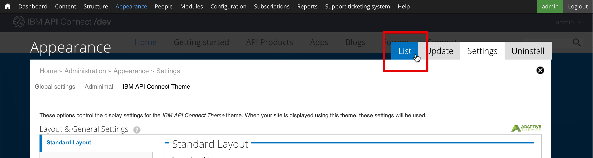

---
copyright:
  years: 2017
lastupdated: "2017-10-31"
---

{:new_window: target="blank"}
{:shortdesc: .shortdesc}
{:screen: .screen}
{:codeblock: .codeblock}
{:pre: .pre}

# Customizando o Portal do Desenvolvedor e selecionando um tema
**Duração**: 30 min  
**Nível de qualificação**: iniciante  

## Objetivo
Este tutorial ajudará você a customizar rapidamente o Portal do Desenvolvedor do {{site.data.keyword.apiconnect_full}} e selecionar um tema que se adeque às suas necessidades.

---

## Pré-requisito

Antes de iniciar este tutorial, é necessário ter concluído o tutorial [Configurando o Portal do Desenvolvedor](tut_config_dev_portal.html) e ter efetuado login como o administrador do portal.

---

## Customizar seu portal do desenvolvedor
Depois de ter criado seu desenvolvedor do portal, é possível customizar sua aparência.

1. Vamos começar a modificar o Banner de Boas-vindas. No menu superior, selecione **Conteúdo**, em seguida, selecione **Blocos**.  
  

2. Selecione **Editar** no bloco **Banner de Boas-vindas**.  
  

3. Sob o título Conteúdo, é possível mudar o texto e a imagem do Conteúdo para o banner de Boas-vindas, inserindo texto no editor de conteúdo ou selecionando o ícone Editar origem HTML para editar ou colar HTML diretamente que define as especificações de imagem e texto.  
   

4. Vamos também incluir uma imagem em nossa tela inicial. Role para baixo até o título Imagem. Localize uma imagem para usar para seu plano de fundo e salve-a no formato de arquivo apropriado (png, gif, jpg, jpeg). Se você não tiver uma imagem, será possível usar [esta](images/Cloudy_Day.png). Clique em **Escolher arquivo** e navegue para sua imagem de plano de fundo escolhida. Depois de ter selecionado a imagem, clique em **Fazer upload**.  
  

5. A imagem será exibida após ser transferida por upload. Se você desejar removê-la, clique em **Remover**.  
  
 
6. Na parte inferior da página, clique em **Salvar** para salvar suas mudanças.  
  
---

## Customizar o tema para seu portal do desenvolvedor
O portal do desenvolvedor permite modificar o tema para mudar sua aparência.

1. Para modificar o tema, selecione **Aparência** no menu superior, em seguida, selecione **Configurações** e, em seguida, **Tema do IBM API Connect**. Esse é o tema padrão quando você criou o portal do desenvolvedor.
 

2. A guia **Layout padrão** permite modificar os layouts para dispositivos com telas grandes, como áreas de trabalho. A guia **Layout do tablet** permite modificar os layouts usados em dispositivos tablet. A guia **Layout Smalltouch** permite modificar os layouts usados em dispositivos, como smartphones. Depois de inspecionar essas guias, selecione **Painéis e Gpanels**.
  

3. Além de modificar os layouts de Barra lateral acima, o tema padrão suporta o uso de Gpanels ou Painéis responsivos, se você instala o módulo Painéis. Para controlar o layout de painéis nos dispositivos padrão, tablet e smalltouch, expanda as seções e atualize as configurações.
 

4. Existem outras configurações que podem ser ajustadas, mas vamos pular para baixo e selecionar **Extensões**. Essa guia permite ativar configurações adicionais que podem ser usadas para configurar o estilo de seu portal do desenvolvedor.  
  

5. As configurações das extensões ativadas na guia **Extensões** podem ser modificadas na seção **Extensões** abaixo das configurações principais.     
  

6. Após as modificações de configurações serem concluídas, selecione **Salvar configuração** na parte inferior da página.

---

## Selecionar um tema diferente para seu portal do desenvolvedor
O portal do desenvolvedor vem com temas adicionais para você escolher e customizar para mudar a aparência.

1. Para ativar um tema diferente, selecione a guia **Lista** na parte superior das configurações de Aparência.
   

2. Na parte superior da guia **Listas**, os temas ativados são exibidos.

3. Abaixo da lista de temas ativados, há uma coleção de temas desativados. É possível ativar um tema selecionando **Ativar**   
   

4. Após o tema ser ativado, ele aparecerá na parte superior da guia **Lista** em **Temas ativados**. É possível customizá-lo selecionando **Configurações**.  
  

5. Depois que você termina a modificação das configurações, é possível configurar o tema como o padrão selecionando **Configurar padrão**.     
  

---

## Instalar um novo tema para seu portal do desenvolvedor
Se modificar um tema existente não se adequa às suas necessidades, o Portal do Desenvolvedor também permitirá instalar um tema para mudar sua aparência.

1. É possível usar módulos ou temas transferidos por download do [drupal.org ](http://drupal.org){:new_window} para customizar o seu portal do desenvolvedor ou é possível criar o seu próprio.

2. Para instalar um tema no portal do desenvolvedor, selecione **Aparência** no menu superior, em seguida, selecione **Instalar novo tema**.  
  

3. É possível instalar temas diretamente do [drupal.org ](http://drupal.org){:new_window} usando uma URL ou é possível fazer upload de um tema transferido por download ou criado clicando em **Escolher arquivo**, em seguida, **Instalar**.  
   

4. Quando o upload for concluído, será necessário ativar o tema. Selecione **Ativar temas recém-incluídos**.  
  

5. Role para baixo na lista e localize o tema recém-instalado. Selecione **Ativar e configurar padrão**.  
  

6. Na parte inferior da página, clique em **Salvar** para salvar suas mudanças.  

---

## Resumo
Parabéns, você concluiu este tutorial. Neste tutorial, você aprendeu como:

* Customizar sua página de boas-vindas do portal do desenvolvedor
* Customizar o tema usado por seu portal do desenvolvedor 
* Selecionar um tema diferente a ser usado para seu portal do desenvolvedor
* Instalar um novo tema para seu portal do desenvolvedor

---

## Próxima etapa

Saiba [como um usuário navega por meio de um Portal do Desenvolvedor](tut_discover_apis.html) ou [como obter insights de analítica básica](tut_insights_analytics.html).

Criar > Gerenciar> Assegurar > **Socializar** > Analisar  

