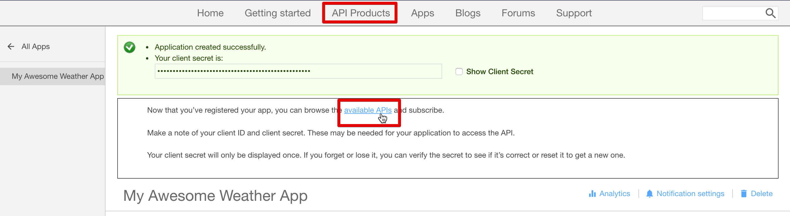
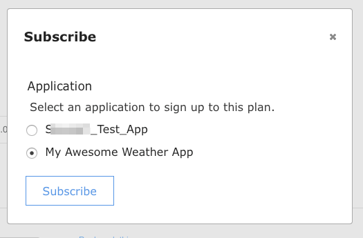

---

copyright:
  years: 2017
lastupdated: "2017-10-10"

{:new_window: target="_blank"}
{:shortdesc: .shortdesc}
{:screen: .screen}
{:codeblock: .codeblock}
{:pre: .pre}

# Descobrindo APIs
**Duração**: 25 minutos  
**Nível de qualificação**: iniciante  

## Pré-requisito
Não há pré-requisito para este tutorial. Como um administrador do portal, também é possível concluir este tutorial enquanto navega pelo portal do desenvolvedor para vivenciar como seus usuários do portal navegam por seu portal do desenvolvedor. Tenha em mente que todos os portais do desenvolvedor têm aparências diferentes.

Se você não tiver um portal do desenvolvedor existente, será possível configurar um portal do desenvolvedor no {{site.data.keyword.Bluemix_short}} antes de continuar com este tutorial.

## Objetivo
Neste tutorial, você aprenderá como um usuário do portal pode consumir as APIs no Portal do Desenvolvedor do {{site.data.keyword.apiconnect_short}}. Você entenderá como um usuário do portal exploraria produtos e APIs, visualizar e testar APIs e assinar as APIs.

## Explorar produtos e APIs
Esta seção mostra como um usuário do portal exploraria os produtos e APIs no portal do desenvolvedor.

1. Em um navegador, navegue para o **Portal do Desenvolvedor do API Connect**.

2. No Portal do desenvolvedor do {{site.data.keyword.apiconnect_short}}, selecione a guia Produtos de API.

3. Selecione um dos produtos de API disponíveis para exibir as APIs e os Planos disponíveis para o produto.  
  

4. Selecione uma API para explorar os detalhes das APIs disponíveis.  
  

5. Na página de detalhes de uma API, é possível visualizar as operações disponíveis juntamente com seus parâmetros e as respostas retornadas. No final da página, é possível visualizar as definições que são usadas pela API.  
   

6. No painel de exemplos de Código, é possível visualizar exemplos em diferentes linguagens de codificação de como chamar as solicitações e suas respostas. Selecione um dos exemplos, como **Nó**, para ver um exemplo dessa linguagem de codificação.  
   

---

## Visualizar e testar as APIs
Esta seção mostra como um usuário do portal que visualizar e testar as APIs disponíveis para um produto. 

1. Navegue para os detalhes da API no Portal do Desenvolvedor do {{site.data.keyword.apiconnect_short}}, conforme descrito na seção anterior.  
   

2. É possível fazer download e visualizar as informações de Swagger yaml de APIs selecionando **Abrir API**.  
   

3. Role para baixo para uma das operações para visualizar seus detalhes. Também é possível clicar no link de operações para ir para ele na página.

4. No painel direito sob os exemplos, role para a seção **Tentar esta operação**. Insira os parâmetros e selecione **Chamar operação**.  
  

5. Role para baixo para visualizar a solicitação e resposta da chamada de operação. Uma resposta retornada de **200 OK** e o corpo da mensagem são exibidos, indicando que a chamada de operação foi bem-sucedida.  
  

---

## Assinar APIs
Esta seção mostra como um usuário do portal assinaria as APIs no portal do desenvolvedor. 

1. Selecione **Criar uma conta**.

2. Conclua os campos necessários e selecione **Criar nova conta** na parte inferior da página.
**Nota:** use um endereço de e-mail diferente do que você usou para criar seu portal do desenvolvedor no tutorial anterior.

3. Após a conta do desenvolvedor ser criada, efetue login para visualizar a página inicial. Deve-se ter um app para assinar as APIs. Selecione **Apps** para acessar a página de apps registrados.  
  

4. Para registrar um novo aplicativo, selecione **Criar novo app**.  
  

5. Insira um *Título* e uma *Descrição* para seu app e selecione **Enviar**.  
   

6. Agora que você tem um App, é possível assinar os planos do Produto de API. Selecione **APIs disponíveis** ou **Produtos de API** para procurar os planos do Produto de API.  
   

7. Selecione o Produto de API que você deseja assinar.  
   

8. Selecione **Assinar** para assinar o Plano de Produto de API.  
   

9. Selecione o app que você deseja assinar no Plano de produto, em seguida, selecione **Assinar**.
 

10. Seu aplicativo foi inscrito com êxito no Plano de produto.
 

## Conclusão

Neste tutorial, você aprendeu como os usuários do portal poderiam explorar os produtos e APIs, visualizar e testar as APIs e assinar as APIs. 

---

## Próxima etapa

Saiba [como obter insights de analítica básica](tut_insights_analytics.html).

Criar > Gerenciar> Assegurar > **Socializar** > Analisar  

