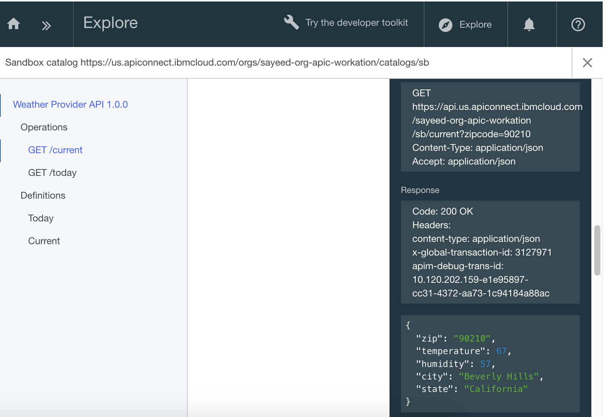

---
copyright:
  years: 2017
lastupdated: "2017-11-02"
---

{:new_window: target="blank"}
{:shortdesc: .shortdesc}
{:screen: .screen}
{:codeblock: .codeblock}
{:pre: .pre}

# Importar sua especificação de API e efetuar proxy de um serviço REST existente com o {{site.data.keyword.Bluemix_notm}}
Duração: 5 min  
Nível de qualificação: iniciante  

## Objetivo
Este tutorial ajuda você a começar rapidamente com o {{site.data.keyword.apiconnect_full}} ilustrando como é possível colocar sua API existente sob o controle de gerenciamento. Vamos iniciar importando uma especificação OpenAPI e, em seguida, criar um proxy de API de passagem para um serviço REST existente.

## Pré-requisito
Antes de iniciar, será necessário [configurar sua instância do {{site.data.keyword.apiconnect_short}}](tut_prereq_set_up_apic_instance.html).

---


## Explore o app de amostra e teste os terminais de destino

Um app de _provedor de clima_ de amostra foi criado para este tutorial. A especificação da API correspondente (Swagger 2.0) está no arquivo [clima-provider-api_1.yaml ](https://raw.githubusercontent.com/IBM-Bluemix-Docs/apiconnect/master/tutorials/weather-provider-api_1.yaml){:new_window}.

1. Para explorar o app, acesse [http://gettingstartedweatherapp.mybluemix.net/ ](http://gettingstartedweatherapp.mybluemix.net/){:new_window}.  
2. Insira um CEP válido de 5 dígitos dos EUA para obter o _**clima atual**_ e a _**previsão de hoje**_.  


3. O app de clima de amostra acima foi construído usando APIs que fornecem os dados de clima. O terminal para obter os dados de clima **atuais** é `https:// myweatherprovider<span></span>.mybluemix.net/current?zipcode={zipcode}`. Experimente-o visitando [https://myweatherprovider.mybluemix.net/current?zipcode=90210 ](https://myweatherprovider.mybluemix.net/current?zipcode=90210){:new_window}.  

  

4. Da mesma forma, o Terminal para obter os dados de previsão de **hoje** é `https:// myweatherprovider<span></span>.mybluemix.net/today?zipcode={zipcode}`. Experimente-o acessando [https://myweatherprovider.mybluemix.net/today?zipcode=90210 ](https://myweatherprovider.mybluemix.net/today?zipcode=90210){:new_window}.  

  


---

## Importe a especificação OpenAPI do app de amostra para criar um proxy de API de REST
1. Efetue login no {{site.data.keyword.Bluemix_short}}: https://new-console.ng.bluemix.net/login.
2. No painel de navegação do {{site.data.keyword.Bluemix_notm}}, selecione **Serviços**, em seguida, **Painel**. Ative o serviço {{site.data.keyword.apiconnect_short}}. 
3. No {{site.data.keyword.apiconnect_short}}, certifique-se de que o painel de navegação no lado esquerdo esteja aberto. Caso contrário, clique em **>>** para abri-la.  
4. Selecione **Rascunhos** no painel de navegação.   
5. Na guia **APIs**, clique em **Incluir**. No menu suspenso, selecione **Importar API de um arquivo ou URL**.  
     

6. Vamos agora importar a definição de clima OpenAPI. Na caixa de diálogo "Importar OpenAPI (Swagger)" que é aberta, insira a URL a seguir: `https://raw.githubusercontent.com/IBM-Bluemix-Docs/apiconnect/master/tutorials/weather-provider-api_1.yaml`. Deixe as outras opções com seus valores padrão e clique em **Importar**.  
      

7. Depois de importar a especificação OpenAPI, você é levado para a visualização **Design** da API. Aqui é possível visualizar várias seções da definição OpenAPI. Role para explorar e anote o valor **Host**. Também é possível visualizar o OpenAPI sob a guia **Origem**.
  _Nota: você notará que o valor do Host está configurado para_ `$(catalog.host)`_. Essa é a URL base para seu proxy de API._
8. Sua API é salva. 


## Teste seu proxy de API

### Teste com a _ferramenta de teste API Manager_.
1. Na guia **Montar**, clique no ícone para obter mais ações e, em seguida, selecione **Gerar um produto padrão**.  
     

2. Aceite as opções padrão na caixa de diálogo **Novo produto** e clique em **Criar produto**. O **Produto de API Weather Provider** é criado e publicado no catálogo Ambiente de simulação. Uma mensagem indicando geração bem-sucedida do produto é exibida.  
    

  

  _No {{site.data.keyword.apiconnect_short}}, **Produtos** fornecem uma maneira de agrupar as APIs que são destinadas para um uso específico. Os produtos são publicados em um **Catálogo**.  [{{site.data.keyword.apiconnect_short}} glossário](../apic_glossary.html)_

3. Na guia Montar, clique no ícone de reprodução para testar a chamada de destino do proxy de API.

4. No painel de teste, selecione a operação **get /current**.  
    a. Zipcode é um parâmetro necessário para esta operação, então insira um CEP dos EUA válido (por exemplo, 90210).  
    b. Clique em **chamar** e verifique se vê:  
    ```
    - 200 OK response
    - Current weather data for 90210  
    ```
_Se você obtiver um erro CORS, siga as instruções na mensagem de erro. Clique no link com erro para incluir a exceção em seu navegador e, em seguida, pressione o botão "chamar" novamente._

    


### Teste com a _ferramenta Explore_.
_A ferramenta Explore permite que os usuários testem a operação correta da API cumprindo quaisquer requisitos de parâmetros configurados na definição OpenAPI. Esse cumprimento não é feito na Ferramenta de Teste da API localizada na guia Montar, portanto isso permite que o usuário verifique o comportamento da API quando o parâmetro está ausente._

1. Para testar seus terminais de proxy de API, selecione **Explore**, em seguida, selecione **Ambiente de simulação**.

2. Selecione a operação **GET /current** na paleta.
3. Selecione "Experimente".  
4. Insira um CEP válido dos EUA (por exemplo, 90210) na caixa de teste.
5. Clique em **Chamar operação** para ver a resposta.
  

    


### Conclusão
Neste tutorial, você viu como um serviço REST existente pode ser chamado por meio de um proxy de passagem de API. Você iniciou verificando a disponibilidade do serviço de amostra por meio do navegador da web. Então você criou um proxy de API no {{site.data.keyword.apiconnect_short}} e vinculou o proxy ao serviço de amostra a ser chamado. Você empacotou sua API em um produto, publicou o produto no catálogo e testou o proxy.

---

## Próxima etapa

Proteja sua API usando [limitação de taxa](tut_rate_limit.html), [identificador e segredo do cliente](tut_secure_landing.html) ou [protegendo usando OAuth 2.0](tut_secure_oauth_2.html).

Criar > **Gerenciar** > Assegurar > Socializar > Analisar

