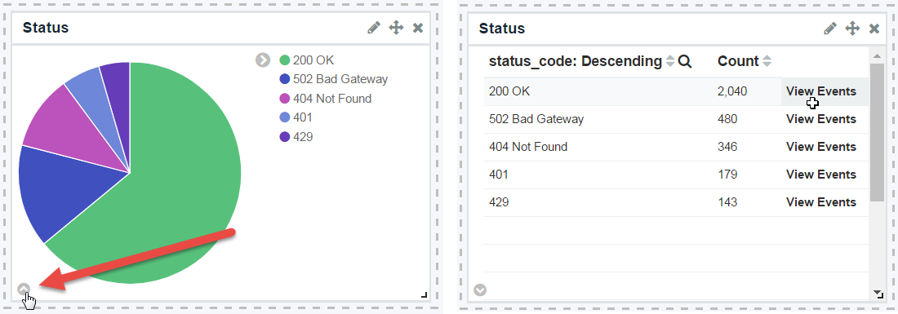
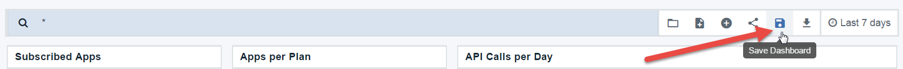
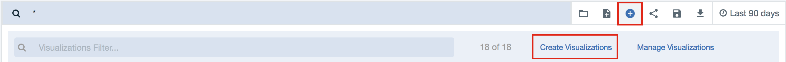

---
copyright:
  years: 2017
lastupdated: "2017-09-30"
---

{:new_window: target="blank"}
{:shortdesc: .shortdesc}
{:screen: .screen}
{:codeblock: .codeblock}
{:pre: .pre}

# Obtendo insights de analítica básica
Duração: 30 minutos  
Nível de qualificação: iniciante

## Objetivo
Esta é uma introdução básica para analítica de API no {{site.data.keyword.apiconnect_long}}. Faremos um tour nos painéis de análise de dados disponíveis e será possível seguir junto com suas próprias APIs.

## Pré-requisito
Para visualizar sua própria analítica de API, deve-se ter um Produto de API criado e publicado. Além disso, você precisará chamar sua API várias vezes para gerar alguns dados de analítica, de preferência usando um ID de cliente de um aplicativo registrado (não o app de teste pré-provisionado).

Para gerar os dados neste tutorial, usamos o *Collection Runner* do Postman para chamar uma API várias vezes, com diferentes dados e IDs de cliente. É possível usar uma ferramenta semelhante (como HttpRequester para Firefox) ou apenas usar cURL para chamar sua API várias vezes por meio da linha de comandos. É possível obter solicitações de amostra para sua API clicando no link **Explorar** no {{site.data.keyword.apiconnect_short}}.

## Introdução à analítica do catálogo
Como um proprietário de API, você precisa de uma maneira de avaliar o sucesso e o desempenho das APIs oferecidas. O local principal em que você procurará a analítica é no nível de catálogo. Se você não tiver feito a introdução aos catálogos, veja [Trabalhando com catálogos ](https://www.ibm.com/support/knowledgecenter/en/SSFS6T/com.ibm.apic.apionprem.doc/conref_working_with_env.html){:new_window} no IBM Knowledge Center para obter uma introdução. 

Você e seus desenvolvedores de aplicativo também podem acessar a analítica específica do app no Portal do Desenvolvedor, mas vamos nos concentrar na Analítica de catálogo neste tutorial.

Você tem acesso a até 90 dias de informações históricas e em tempo real sobre suas APIs e os Produtos que são publicadas nesse catálogo. Isso também mostra quem está chamando-as. Se seu catálogo tiver múltiplos espaços, será possível navegar para o nível de Espaço.

Este tutorial consiste em quatro atividades que mostram como concluir as tarefas a seguir:
* Visualizar analítica
* Visualizar detalhes de registro de eventos
* Construa novos painéis
* Criar novas visualizações

## Atividade 1: visualizando a analítica pronta para utilização
1. Em seu serviço {{site.data.keyword.apiconnect_short}} no {{site.data.keyword.Bluemix_short}}, ative o Painel e selecione o Catálogo que você deseja abrir. 
2. Clique na guia *Analítica*.

    
  
Você verá o painel Visão geral padrão, que mostra duas visualizações do gráfico de barras que contêm os dados a seguir dos últimos 7 dias:
* 5 produtos mais ativos 
* 5 APIs mais ativas 

3. Passe o mouse sobre qualquer uma das barras para ver detalhes adicionais, como a contagem de API, os nomes de API e assim por diante.

    

4. Use a barra de procura para filtrar os dados mostrados. Também é possível selecionar um filtro de tempo diferente e/ou taxa de atualização automática. As visualizações são atualizadas para refletir suas seleções.

Existem outros painéis que são fornecidos prontos para utilização.

5. Clique no ícone de pasta para carregar um painel salvo e selecione **api_default** na lista suspensa.

    

Este painel tem um conjunto diferente de visualizações que exibem o status de API, erros, tempos de resposta, número total de chamadas e chamadas por dia.

    

## Atividade 2: visualizando detalhes do evento

As visualizações são um ótimo jeito de ter uma visão geral útil de dados, mas você também precisa de uma maneira de navegar para os registros de eventos que preenchem os gráficos.

1. Passe o mouse sobre o ícone de seta no canto inferior esquerdo de qualquer visualização. Uma seta pequena aparece.
2. Clique na seta para ver uma tabela dos dados usados nessa visualização. 
3. Clique no rótulo **Visualizar eventos** para navegar nos detalhes dos eventos individuais para até 100 registros.

    

É possível editar, mover e excluir visualizações em seu painel.

## Atividade 3: construindo novos painéis

Agora, vamos criar um novo painel que fornecerá a visualização de padrões de tráfego da API. Eles estão todos disponíveis usando visualizações integradas. 

1. Clique no ícone de novo painel e clique no link **Escolher entre as visualizações existentes**. 

    
    Uma lista de visualizações disponíveis é exibida.

2. Selecione alguns visualizações para incluir em seu painel. Por exemplo:
  * Apps assinados
  * Apps por plano 
  * Taxa de sucesso
  * Chamadas API por dia
  
  **Dica** ao selecionar cada visualização, a guia de seleção bloqueia sua visualização de painel, então você pode não perceber que a visualização foi incluída no painel. Selecione uma visualização por vez e feche a guia de seleção cada vez para ver as mudanças em seu painel.

3. Clique em **Salvar** e dê ao seu painel um nome: `Subscriber Dashboard`.

   

    

## Atividade 4: criando novas visualizações
No Subscriber Dashboard que criamos, nós incluímos a visualização integrada que mostra Chamadas API por dia. Quando olhamos para todas essas informações apresentadas juntas, nós realmente gostaríamos de ver o uso por App. Vamos criar uma nova visualização que mostre essas informações.

1. Clique em **Nova visualização** e selecione o link **Criar visualizações**.
 

2. Selecione **Gráfico de linha** como seu tipo de visualização. O gráfico de linha inicializado tem a configuração de Eixo Y com uma contagem de chamadas API. Isso é apropriado para o nosso gráfico.

3. Selecione o seguinte:
	* Tipo de depósito: **Eixo X**
	* Agregação: **Histograma de data**
	* Rótulo customizado: **Horário** 
4. Clique em **Executar** para ver seu gráfico. **Dica**: você pode precisar ajustar o prazo para ver os dados.

   

Este gráfico (até agora) mostra uma série temporal de chamadas API. Desejamos ver chamadas API por nome do app.

5. Clique no botão **Incluir subdepósitos**.
6. Selecione o seguinte:
	* Tipo de depósito: **Linhas de divisão**
	* Subagregação: **Termos**
	* Campo: **app_name**
	* Rótulo customizado: **App**
	
   
8. Clique em **Executar** para ver seu gráfico.
9. Clique em **Salvar** e dê ao gráfico um nome `API Calls by App`.
10. Para ver sua visualização no contexto, inclua-a no painel Assinante.

   
 
Há outras informações disponíveis para visualizar detalhes sobre chamadas API, responsáveis pela chamada e assim por diante. Uma lista integral de eventos de API está disponível no Knowledge Center do API Connect ou na lista de Termos quando você cria visualizações.

## Conclusão

A capacidade de visualizar a analítica da API em diferentes estilos e combinações dá uma oportunidade de tirar conclusões ou aprofundar-se em seus dados da API. É possível usar esse insight para tomar decisões sobre quais APIs oferecer, quando substituir ou desativar uma API, quem está consumindo suas APIs e assim por diante.

Por exemplo, as APIs versão 1 (v1) e versão 2 (v2) de um provedor chamado "ACME" têm sido executadas por vários anos. Eles descontinuaram a v1 quando liberaram a v2. Eles asseguraram também que os consumidores existentes da v1 estavam cientes de que tinham uma certa linha de tempo para mover-se para a v2. Conforme esse prazo final se aproxima, o ACME deseja ver a rapidez com que os consumidores estão se deslocando da v1, assim eles podem oferecer assistência aos valiosos parceiros. 

Usando uma visualização semelhante àquela que acabamos de construir, o ACME tem essas informações disponíveis em uma visão rápida.

Neste tutorial, percorremos várias atividades para ajudar a criar combinações úteis de dados da API e do consumidor. Usando visualizações e painéis, criamos rapidamente as ferramentas que podem fornecer dados para ajudar a garantir que estamos oferecendo a combinação certa de APIs.

---

## Próxima etapa

Saiba [como gerenciar suas APIs e o versionamento](tut_version_landing.html).

Criar > Gerenciar > Proteger > Socializar > **Analisar**  
