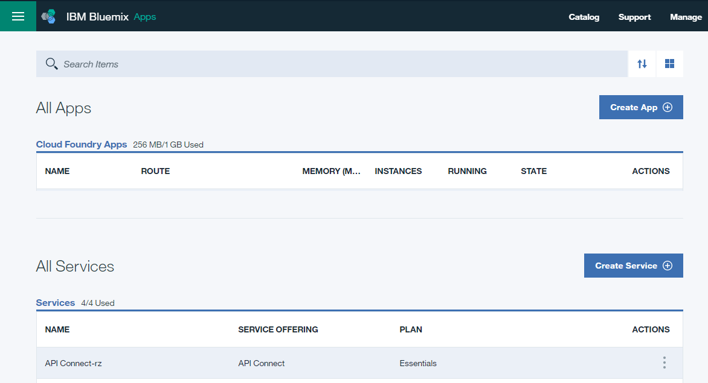
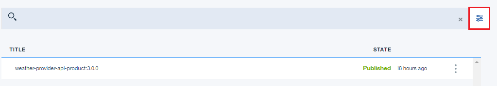

---

copyright:
  years: 2017
lastupdated: "2017-10-10"

---

{:new_window: target="_blank"}
{:shortdesc: .shortdesc}
{:screen: .screen}
{:codeblock: .codeblock}
{:pre: .pre}

# Arquivando e excluindo produtos de API
**Duração**: 15 min  
**Nível de qualificação**: iniciante 

## Pré-requisito

1. [Configure sua instância do {{site.data.keyword.apiconnect_full}}](tut_prereq_set_up_apic_instance.html).

2. Conclua o [tutorial Substituir um produto de API](tut_manage_supercede.html).

---
## Objetivo
Neste tutorial, você irá excluir, arquivar e desativar uma API.

---
## Excluindo um Produto de API
1. Efetue login no {{site.data.keyword.Bluemix_short}}: [https://console.ng.bluemix.net/login ](https://console.ng.bluemix.net/login){:new_window}.

2. No Painel do {{site.data.keyword.Bluemix_short}}, ative o serviço {{site.data.keyword.apiconnect_short}}. 

3. No API Manager, se você não tiver fixado anteriormente a área de janela de navegação da UI, clique no ícone **Navegar para** . A área de janela de navegação da UI do API Manager é aberta. Para fixar a área de janela de navegação da UI, clique no ícone do **menu Fixar** .

4. Clique em **Ambiente de simulação** para abrir o catálogo Ambiente de simulação. **Nota**: você pode precisar retornar para o Painel para ver os catálogos disponíveis. Além disso, sua página de painel pode mostrar catálogos como tiles em vez de uma lista.

5. Clique no botão de reticências verticais na linha **Weather Provider API 1.0.0**.  

6. Selecione **Excluir do catálogo**.  

7. Clique em **OK**.  

    O produto desaparece da lista de produtos no catálogo. Ele não pode ser recuperado neste momento.

## Arquivando um Produto de API
1. Clique nas reticências verticais na linha **API do Provedor de clima 2.0.0**.  

2. Selecione **Desativar**.  

3. Clique em **OK**.  

4. Clique nas reticências verticais na linha **API do Provedor de clima 2.0.0**.  

5. Selecione **Arquivar**.  

6. Clique em **OK**.  

    O produto desaparece da lista de produtos no catálogo. Ele pode ser recuperado.

7. Clique no ícone de visualização de lista.  

8. Marque **Arquivado**.  

9. Clique nas reticências verticais na linha **API do Provedor de clima 2.0.0**.  

10. Selecione **Desarquivar**.  

    O estado do produto muda para Obsoleto.
    

 
 
## O que você realizou neste tutorial
Neste tutorial, você concluiu as atividades a seguir:

1. Excluiu um Produto de API
2. Desativou um Produto de API
3. Arquivou um Produto de API
4. Desarquivou um Produto de API

---

