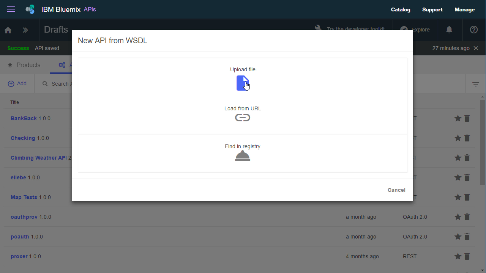
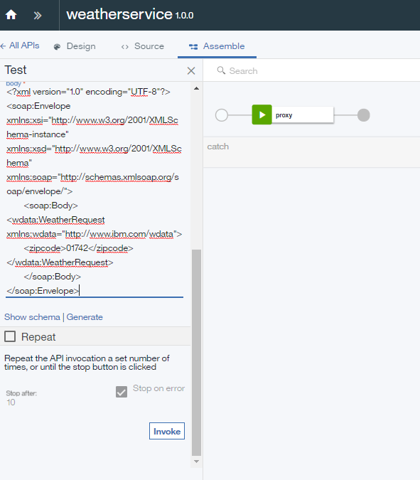

---

copyright:
  years: 2019
lastupdated: "2019-3-11"

subcollection: apiconnect

keywords: IBM Cloud, APIs, lifecycle, catalog, manage, toolkit, develop, dev portal, tutorial

---


{:new_window: target="_blank"}
{:shortdesc: .shortdesc}
{:screen: .screen}
{:codeblock: .codeblock}
{:pre: .pre}


# Gerenciando um serviço SOAP
{: #tut_manage_soap_api}

**Duração**: 15 minutos
**Nível de qualificação**: iniciante

---
## Objetivo
{: #object_tut_manage_soap_api}

Neste tutorial, você usará o API Manager para criar uma API SOAP que é um proxy para um serviço de clima baseado em SOAP.

## Pré-requisito
{: #prereq_tut_manage_soap_api}

- Antes de começar, será necessário [configurar sua instância do {{site.data.keyword.apiconnect_short}}](/docs/services/apiconnect/tutorials?topic=apiconnect-tut_prereq_set_up_apic_instance).
- Antes de iniciar, copie o arquivo de [teste weatherprovider.wsdl ](https://raw.githubusercontent.com/IBM-Bluemix-Docs/apiconnect/master/tutorials/weatherprovider.wsdl){: #new_window} para seu sistema de arquivos local.
Nota: é possível clicar em **Bruto** e, em seguida, salvar a página resultante em seu sistema local como um arquivo `.wsdl`. Como o nome sugere, esse serviço SOAP retorna os dados de clima quando um CEP é fornecido.

---
## Configurando uma definição de API SOAP
{: #setup_tut_manage_soap_api}

1. Efetue login no {{site.data.keyword.Bluemix_short}}: https://cloud.ibm.com.
2. No **Painel** do {{site.data.keyword.Bluemix_notm}}, clique em **Serviços do Cloud Foundry**. 
3. Ative o serviço {{site.data.keyword.apiconnect_short}}. 
4. No {{site.data.keyword.apiconnect_short}}, certifique-se de que o painel de navegação no lado esquerdo esteja aberto. Caso contrário, clique em **>>** para abri-la.  
5. Selecione **Rascunhos** no painel de navegação.   

6. No menu suspenso, selecione **API de um serviço SOAP**.
  

7. A caixa de diálogo Nova API do WSDL é aberta. Clique em **Fazer upload de arquivo**.


8. Selecione o arquivo `weatherprovider.wsdl` que você salvou anteriormente.

9. A caixa de diálogo Nova API do WSDL reaparece. Marque a caixa de seleção **weatherService**. Clique em **Pronto**.
  

10. Na importação bem-sucedida, você é levado para a visualização Design da API. Além disso, é possível visualizar a definição de OpenAPI na guia Origem.
   _Na guia Origem, você verá que o WSDL é agrupado dentro da definição de OpenAPI._


11. Clique no ícone  para salvar suas mudanças. Uma notificação de confirmação "API salva" aparece momentaneamente.

12. Na barra de menus com o ícone de salvamento, a guia **Design** indica sua localização atual. Junto a isso, você localiza a guia **Origem** na qual é possível visualizar diretamente o arquivo Swagger (2.0) que representa sua API e, próximo a isso, localiza a guia **Montar** que o leva para uma interface arrastar e soltar para processamento da API. Clique em **Montar**.
  

## Testando a definição da API SOAP
{: #test_tut_manage_soap_api}

1. Na guia **Montar**, clique no ícone **Mais ações** (três pontos) e selecione **Gerar um produto padrão** no menu.  
   

2. Aceite as opções padrão no diálogo pop-up **Novo produto** e selecione **Criar produto**. O **Produto weatherService 1.0.0** é criado e publicado no catálogo Ambiente de simulação.  
  
 
  _No {{site.data.keyword.apiconnect_short}}, os **Produtos** fornecem um mecanismo para agrupar as APIs que são destinadas para um uso específico. Os produtos são publicados em um **Catálogo**. Referência:
[glossário
do {{site.data.keyword.apiconnect_short}}](docs/services/apiconnect/tutorials/tut_expose_soap_service/apic_glossary.html)

3. Salve as suas mudanças.  

4. Próximo à caixa Procurar, clique no ícone de teste para testar o serviço de API. O menu Configuração aparece.

5. Na lista de produtos, escolha `weatherService product 1.0.0`.  
  

6. Role para baixo e clique em **Avançar**.

7. Na lista de Operações, selecione `post /weatherRequest`.  
  

8. Role para baixo. Insira o XML a seguir no campo de corpo. É possível selecionar e copiar o XML de exemplo a seguir, em seguida, clicar no campo **corpo** para ativar o campo e colocar o XML de exemplo.  
  ```
  <?xml version="1.0" encoding="UTF-8"?>
  <soap:Envelope xmlns:xsi="http://www.w3.org/2001/XMLSchema-instance" xmlns:xsd="http://www.w3.org/2001/XMLSchema" xmlns:soap="http://schemas.xmlsoap.org/soap/envelope/">
   <soap:Body>
  <wdata:WeatherRequest xmlns:wdata="http://www.ibm.com/wdata">
       <zipcode>10504</zipcode>
  </wdata:WeatherRequest>
   </soap:Body>
  </soap:Envelope>
  ```
 
  

9. Role para baixo, se necessário, e clique em **Chamar**.
A API retorna um **corpo** de Resposta consistindo no clima atual.  
  

## Conclusão
{: #conclusion_tut_manage_soap_api}

Neste tutorial, você concluiu o seguinte:
1. Configurou uma definição de API SOAP
2. Testou sua definição de API
3. Recebeu um **corpo** de Resposta do terminal de API de clima indicando o resultado de sua solicitação.

---

## Próxima etapa
{: #next_tut_manage_soap_api}

[Exponha seu serviço como uma API de REST](/docs/services/apiconnect/tutorials?topic=apiconnect-tut_expose_soap_service) ou proteja sua API usando o [OAuth 2.0](/docs/services/apiconnect/tutorials?topic=apiconnect-tut_secure_oauth_2).

Criar > **Gerenciar** > Assegurar > Socializar > Analisar
