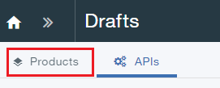
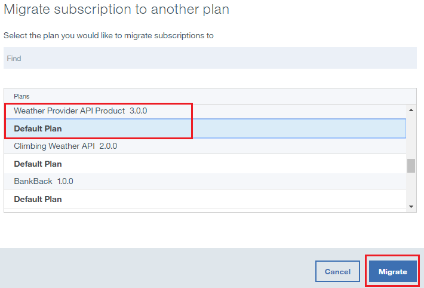

---

copyright:
  years: 2017
lastupdated: "2017-10-31"

---

{:new_window: target="_blank"}
{:shortdesc: .shortdesc}
{:screen: .screen}
{:codeblock: .codeblock}
{:pre: .pre}

# Suplantando produtos de API
**Duração**: 15 min  
**Nível de qualificação**: iniciante  

## Pré-requisito

1. [Configure sua instância do {{site.data.keyword.apiconnect_full}}](tut_prereq_set_up_apic_instance.html).

2. Conclua o [tutorial Substituir um produto de API](tut_manage_replace.html).

---
## Objetivo
Neste tutorial, você irá suplantar uma API existente por uma nova.

---
## Suplantando uma API de Produto
1. Efetue login no {{site.data.keyword.Bluemix_short}}: [https://console.ng.bluemix.net/login ](https://console.ng.bluemix.net/login){:new_window}.

2. No Painel do {{site.data.keyword.Bluemix_notm}}, ative o serviço {{site.data.keyword.apiconnect_short}}. 

3. No API Manager, se você não tiver fixado anteriormente a área de janela de navegação da UI, clique no ícone **Navegar para** . A área de janela de navegação da UI do API Manager é aberta. Para fixar a área de janela de navegação da UI, clique no ícone do **menu Fixar** .

4. Clique em **Ambiente de simulação** para abrir o catálogo Ambiente de simulação. **Nota**: sua tela pode mostrar tiles em vez de uma lista de catálogos.

4. Clique em **Rascunhos** > **APIs**.

5. No painel APIs, clique em **API do Provedor de clima** para abrir a API do proxy de REST.  

6. Mude a **Versão** para 3.0.0.

7. Clique no ícone de disco para salvar as mudanças da API.  

8. Clique em **Todas as APIs**.  

9. Clique em **Produtos**.  

10.	Selecione **Weather Provider API Product 2.0.0**.  

11.	Mude a **Versão** para 3.0.0. Clique no ícone de disco para salvar as mudanças. Clique no ícone **Montar**.  

12.	Clique em **>>** para abrir a área de janela de navegação, em seguida, selecione **Painel**.  

13.	Clique em **Ambiente de simulação**.

14.	Clique em **Comunidade**.  

15.	Clique em **Assinaturas**.  

16.	Observe as assinaturas do aplicativo para o Weather Provider API Product 2.0.0. Clique em **Produtos**.
  

17.	Clique nas reticências verticais na linha **Weather Provider API Product 3.0.0 montado**.  

18.	Selecione **Suplantar um produto existente**.  

19.	Selecione **Weather Provider API Product 2.0.0** na lista de produtos apresentados. Clique em **Avançar**.  

20.	Selecione **Plano padrão**. Clique em **Suplantar**.  

    Como resultado dessa substituição, o Weather Provider API Product 2.0.0 é descontinuado e o Weather Provider API Product 3.0.0 é publicado.  
 
 
21.	Clique em **Comunidade >> Assinaturas**.  

 
22.	Clique nas reticências verticais na linha **Weather Provider API Product 2.0.0**. Selecione **Gerenciar**.  
 

23.	Selecione **Plano padrão** sob Weather Provider API Product 3.0.0. Clique em **Migrar**.  

    Como resultado desta migração, o Weather Provider API Product 2.0.0 é migrado para o Weather Provider API Product 3.0.0.  
 
 

 
## O que você realizou neste tutorial
Neste tutorial, você concluiu as atividades a seguir:

1. Atualizou um produto de API.
2. Substituiu um produto de API existente por um produto de API atualizado.
3. Migrou a assinatura do Produto de API existente para o Produto de API atualizado.

---

