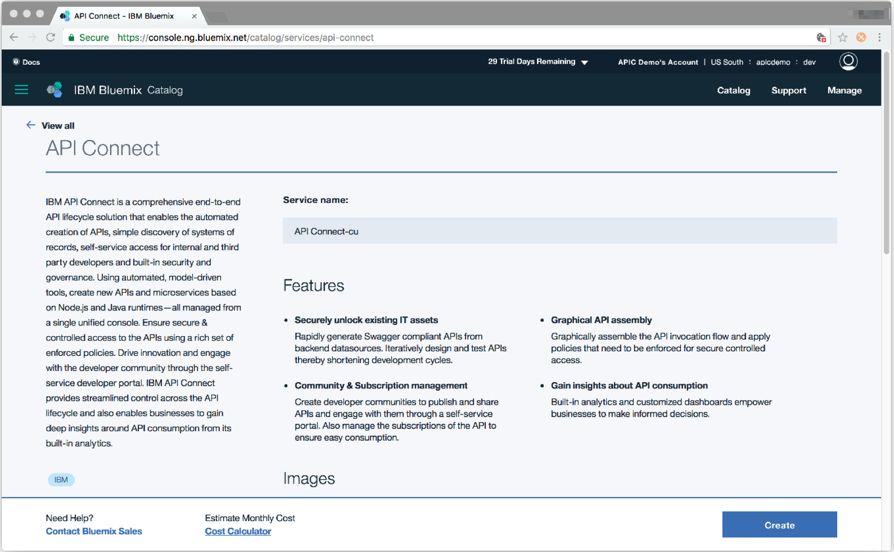

---
copyright:
  years: 2017
lastupdated: "2017-10-10"
---

{:new_window: target="blank"}
{:shortdesc: .shortdesc}
{:screen: .screen}
{:codeblock: .codeblock}
{:pre: .pre}

# Configurando uma instância do API Connect
**Duração**: 15 min  
**Nível de qualificação**: iniciante  

## O que você precisará:
1. Um IBMid
2. Um {{site.data.keyword.Bluemix_short}} conta
3. Uma instância do {{site.data.keyword.apiconnect_short}} com pelo menos um plano _Lite_

<table>
  <tr><td><b>IBMid</b>: usado para acessar todos os apps da IBM, comunidades, suporte e mais
     
    <b>{{site.data.keyword.Bluemix_short}}</b>: a plataforma de nuvem da IBM que hospeda o {{site.data.keyword.apiconnect_short}} junto com outros apps e serviços 
    <b>{{site.data.keyword.apiconnect_short}} Lite</b>: uma versão grátis do {{site.data.keyword.apiconnect_short}} hospedada no {{site.data.keyword.Bluemix_short}}</td></tr>
  </table>  

---

1. Inscreva-se para o seu IBMid na URL a seguir: [https://console.ng.bluemix.net/registration/ ](https://console.ng.bluemix.net/registration/){:new_window}.

	Já tem um IBMid? Em seguida, ignore o registro e apenas crie sua conta grátis do {{site.data.keyword.Bluemix_short}} na URL a seguir: [https://console.ng.bluemix.net/ ](https://console.ng.bluemix.net/){:new_window}.  

2. Quando você tiver seu IBMid e conta do {{site.data.keyword.Bluemix_short}}, crie sua instância do {{site.data.keyword.apiconnect_short}}.  
  a. Efetue login no {{site.data.keyword.Bluemix_short}}: [https://new-console.ng.bluemix.net/login ](https://new-console.ng.bluemix.net/login){:new_window}.  
    
  b. Crie sua _organização_ no {{site.data.keyword.Bluemix_short}}. Você será solicitado a fazer isso na primeira vez que efetuar login.  
  
  c. Crie seu _espaço_.  
  
  d. Acesse [https://console.ng.bluemix.net/catalog/services/api-connect ](https://console.ng.bluemix.net/catalog/services/api-connect){:new_window}.  
    
  e. Selecione o plano de precificação _Lite_ (grátis) e clique em **Criar** para iniciar.  
    
