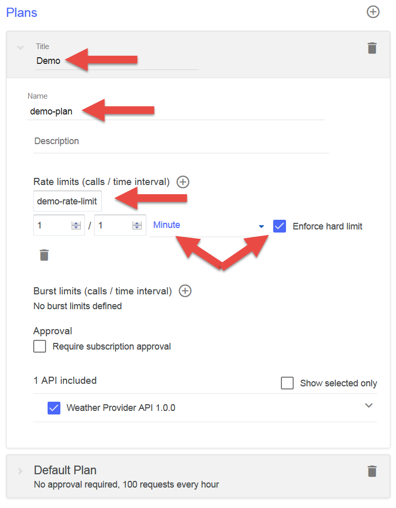
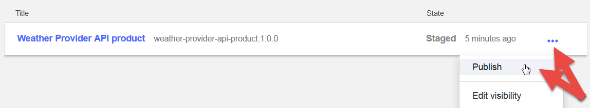
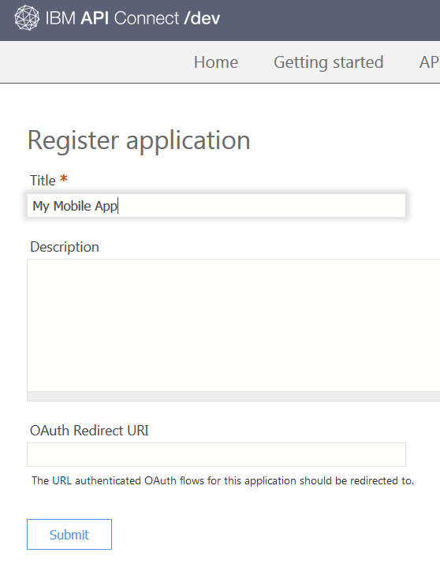
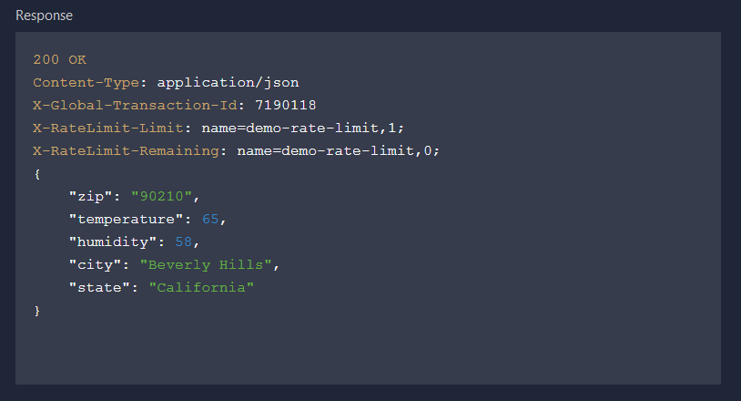

---
copyright:
  years: 2017
lastupdated: "2017-11-02"
---

{:new_window: target="_blank"}
{:shortdesc: .shortdesc}
{:screen: .screen}
{:codeblock: .codeblock}
{:pre: .pre}

# Configurando limites de taxa
**Duração**: 15 min  
**Nível de qualificação**: iniciante  

## Objetivo
Este tutorial mostra como configurar o limite de taxa de suas APIs. Configurar os limites de taxa permite gerenciar o tráfego de rede para suas
APIs e para operações específicas dentro de suas APIs. Um limite de taxa é o número máximo de chamadas que você deseja permitir em um intervalo de tempo específico.

No {{site.data.keyword.apiconnect_full}}, os *Produtos* fornecem uma maneira de agrupar as APIs em um pacote para um caso de uso específico ou público-alvo. Os Produtos também contêm *Planos*, que descrevem os termos que você está disposto a oferecer aos seus consumidores de API. Mais precisamente, os Planos definem regras associadas a assinaturas de API: limites de taxa da API e se a assinatura precisa ser aprovada.

Quando um desenvolvedor de aplicativos desejar usar suas APIs, eles selecionarão um Produto que contenha a API que desejam usar e assinarão um dos Planos do Produto, com base em qual Plano atende suas necessidades de uso.

Neste tutorial, você fará o seguinte:
1. Criar um novo Plano de taxa limitada em um Produto existente.
2. Veja o que acontece quando um aplicativo excede os limites de taxa permitidos.

## Pré-requisito
Deve-se já ter criado uma API no {{site.data.keyword.apiconnect_short}}, protegida com pelo menos uma Chave API. Nas instruções a seguir, o nosso ponto de início é o [Arquivo de exemplo do Weather Provider API](https://raw.githubusercontent.com/IBM-Bluemix-Docs/apiconnect/master/tutorials/weather-provider-api_1.yaml){:new_window}, protegido usando um [ID de cliente e o segredo](tut_secure_landing.html).

Conclua os tutoriais a seguir antes de iniciar este tutorial:
- [Importar a especificação de API e usar proxy de um serviço REST existente](tut_rest_landing.html).
- [Proteger sua API com um ID de cliente e o segredo](tut_secure_landing.html).

---
## Ativando o API Connect

1. Efetue login no {{site.data.keyword.Bluemix_notm}}: [https://console.ng.bluemix.net/login ](https://console.ng.bluemix.net/login){:new_window}.
2. Depois de efetuar login no {{site.data.keyword.Bluemix_notm}}, role para baixo para **Todos os serviços** e clique em **API Connect**.
3. Clique em **API Connect** para ativar o serviço {{site.data.keyword.apiconnect_short}}.

## Explorando o Plano padrão
1. No painel de navegação do {{site.data.keyword.apiconnect_short}}, selecione **Rascunhos**. (Se o painel de navegação não estiver aberto, clique em **> >** para abri-lo.)
2. Selecione a **guia Produtos** e você deverá ver o produto Weather Provider API listado.

         

3. Clique no link Produto e a visualização Design é aberta listando informações sobre o Produto.
4. Role para baixo para a seção Planos da página. Um Plano padrão foi criado quando você gerou esse Produto. 

       
5. Expanda os detalhes do Plano padrão. Observe o limite de taxa (100 chamadas/1 hora) e a lista de APIs, que pode ser expandida para mostrar operações específicas.

    

   
## Criando um novo Plano de taxa limitada

Agora que vimos a aparência do Plano padrão, vamos criar um novo Plano com limites de taxa mais restritivos, para demonstrar o que acontece quando um consumidor de API excede os limites de um Plano. 
1. Clique no botão para incluir um novo Plano.
 
     
    
    Um novo Plano é criado para você e, por padrão, ele é configurado para permitir o uso ilimitado (ou seja, sem nenhum limite de taxa). Vamos dar um nome mais significativo a ele e configurar um limite mais restritivo. 
2. Clique no novo Plano (`Novo plano 1`) para expandir os detalhes.
3. Clique no campo Título e configure o título Plano para: `Demo`.
4. Clique no campo Nome e configure o nome Plano para `demo-plan`.
5. Clique em + para incluir um novo limite de taxa.
6. Renomeie o novo limite de taxa para `demo-rate-limit` e assegure-se de que seja configurado para `1 / 1 Minute`.
7. Marque a caixa de seleção `Enforce hard limit`. (Quando essa configuração for ativada, um aplicativo receberá um erro se ele chamar uma API mais do que permitido pelo limite de Plano inscrito).
8. Aceite todas as outras configurações padrão e salve o Produto.

    

## Montando e publicando um Produto atualizado para o catálogo Ambiente de simulação

Em exemplos anteriores, você pode ter publicado o seu Produto usando a ferramenta de teste, que chama sua API com as credenciais de um aplicativo de teste pré-fornecido. No entanto, esse aplicativo de teste não está sujeito a limites de taxa, então vamos precisar criar um novo aplicativo aqui para propósitos de limitação de taxa. Veja o [conteúdo do IBM Knowledge Center para o API Connect ](https://www.ibm.com/support/knowledgecenter/SSFS6T/com.ibm.apic.toolkit.doc/tapim_create_product.html){:new_window} para obter mais informações.

1. Clique no ícone Publicar para *montar* o Produto no catálogo **Ambiente de simulação**. Essa ação inclui suas mudanças do Produto de rascunho no Catálogo selecionado. Precisamos *publicar* as mudanças do Produto em seguida, para torná-las disponíveis para os consumidores por meio do Portal do Desenvolvedor.     
2. Clique no botão >> para abrir o menu de navegação.
3. Selecione Painel, em seguida, abra o catálogo **Ambiente de simulação**. O Weather Provider API Product é listado como **Montado**.
4. Clique nas reticências e selecione **Publicar** no menu.
    
5. Aceite as configurações de visibilidade padrão e clique no botão **Publicar**. Depois que o Produto for publicado e ficar visível no Portal do desenvolvedor, os desenvolvedores de aplicativos poderão assinar os Planos disponíveis.

## Registrando um novo aplicativo (consumidor) no Portal do Desenvolvedor
Os desenvolvedores de aplicativos descobrem e usam suas APIs usando o Portal do Desenvolvedor. Para obter mais informações sobre o Portal do Desenvolvedor, verifique este [tópico do IBM Knowledge Center ](https://www.ibm.com/support/knowledgecenter/SSFS6T/com.ibm.apic.devportal.doc/tapim_tutorial_using_ADP.html){:new_window}.

Se esta for sua primeira vez trabalhando com o Portal do Desenvolvedor, você precisará provisionar um Portal do Desenvolvedor para seu catálogo Ambiente de simulação. A conta em que você efetuou login ao provisionar o Portal será a conta do administrador para esse Portal. Em seguida, a fim de explorar e testar APIs, você precisará criar e efetuar login com uma nova conta do desenvolvedor, usando um endereço de e-mail diferente daquele da conta do administrador.

As instruções a seguir guiarão você por estas etapas.

1. Ative o Portal do Desenvolvedor. Se você não sabe a URL, é possível localizá-la na guia Configurações do catálogo Ambiente de simulação. Para provisionar o Portal do Desenvolvedor pela primeira vez, consulte [Instalando e configurando o Portal do Desenvolvedor](tut_config_dev_portal.html).
    - Isso pode levar até uma hora para ser concluído. Quando seu Portal do Desenvolvedor do Ambiente de simulação estiver pronto, você receberá um e-mail
com um link para seu novo site do Portal do Desenvolvedor. Esse é um link somente de uso único para a conta do administrador.
2. Efetue login no Portal usando suas credenciais do desenvolvedor de aplicativo (**não** seu IBMid). ***(Crie uma nova conta do desenvolvedor, se necessário, usando um endereço diferente do seu IBMid.)***
3. Clique no link **Apps** na barra de ferramentas e clique no botão **Criar novo app**.

4. Dê ao aplicativo um título e clique em **Enviar**.

   
5. Salve o segredo do cliente e ID de cliente exibidos. Esta será a única vez que seu segredo do cliente estará disponível para você copiar!

   
   
   

## Assinando um Produto de API

1. Clique no link **Produtos de API** na barra de ferramentas. Seu Weather Provider API Product é listado! 

   
2. Clique no link para ver detalhes e opções. Você deverá ver dois Planos disponíveis: o Plano padrão original e seu novo Plano demo. (Se você vir somente um Plano, retorne para o {{site.data.keyword.apiconnect_short}} e assegure-se de que as mudanças em seu Produto tenham sido salvas, montadas e publicadas no Catálogo do Ambiente de Simulação.) 

   
3. Clique em **Assinar** para o Plano demo e selecione o aplicativo que você acabou de registrar. Agora, seu aplicativo pode chamar as APIs associadas a esse Plano, em uma taxa de até *uma* chamada API a cada minuto. 

Estamos prontos para testar esse comportamento e observar o que acontece quando o aplicativo excede a taxa especificada.

## Chamando uma API de taxa limitada

1. Na página Weather Provider API Product no Portal do Desenvolvedor, clique no link da API.

   
2. A página será atualizada para mostrar detalhes sobre a API, suas operações e fornecer um local para testá-la. (Isso é como seus consumidores de API descobrirão e testarão a sua API também.) Observe a área de teste escura e role para baixo para a primeira seção **Tente esta operação**.

3. Para testar a operação `GET /current`, insira o segredo do cliente do seu aplicativo e um CEP válido. Clique no botão **Chamar operação**. Você deverá obter uma resposta `200 OK` com dados sobre o clima atual nesse CEP. 

   

   

4. Agora, antes o tempo se esgote, clique no botão **Chamar operação** novamente, com um CEP diferente se desejar. Você deverá obter uma resposta `429 Too Many Requests` desta vez.

   

5. Para validar se o limite de taxa está reconfigurado, espere um minuto, tente novamente e confirme se você recebe uma resposta válida.

## Conclusão

Parabéns! Você criou com êxito um Plano de limitação de taxa, o associou às suas APIs seguras e verificou se sua API responde somente a solicitações dentro dos parâmetros especificados.

---

## Próxima etapa

Comece a socializar sua API [instalando e configurando um portal do desenvolvedor](tut_config_dev_portal.html).

Criar > Gerenciar > **Assegurar** > Socializar > Analisar
