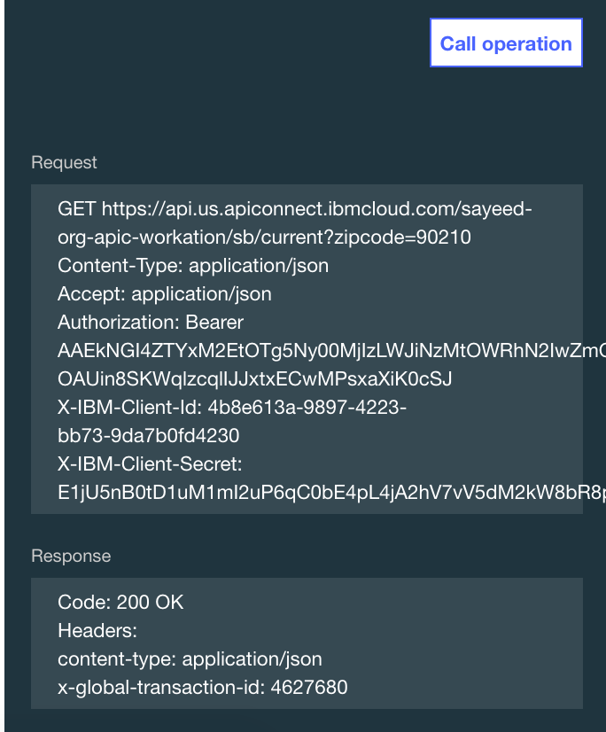

---

copyright:
  years: 2019
lastupdated: "2019-3-14"

subcollection: apiconnect

keywords: IBM Cloud, APIs, lifecycle, catalog, manage, toolkit, develop, dev portal, tutorial

---

{:new_window: target="blank"}
{:shortdesc: .shortdesc}
{:screen: .screen}
{:codeblock: .codeblock}
{:pre: .pre}

# Protegendo sua API com o OAuth de duas etapas
{: #tut_secure_oauth_2}

Duração: 10 minutos  
Nível de qualificação: iniciante

## Objetivo
{: #object_tut_secure_oauth_2}

Este tutorial orientará você para proteger sua API usando um fluxo OAuth 2.0 de duas etapas. Neste fluxo de aplicativo, o cliente OAuth inicia uma solicitação com o servidor de autorizações e recebe um token de acesso. O cliente OAuth pode então usar o token para acessar os recursos protegidos por meio de sua API.

## Pré-requisito
{: #prereq_tut_secure_oauth_2}

Antes de iniciar, deve-se ter concluído o tutorial a seguir.  
- [Protegendo uma API com chaves de ID de cliente ou Segredo do cliente com o {{site.data.keyword.Bluemix}}](/docs/services/apiconnect/tutorials?topic=apiconnect-tut_secure_id_secret_bm) ou
- [Protegendo uma API com chaves de ID de cliente ou Segredo do cliente com o kit de ferramentas](/docs/services/apiconnect/tutorials?topic=apiconnect-tut_secure_id_secret_tk)

Nota: este tutorial mostra as etapas e capturas de tela para realizar a tarefa na UI do {{site.data.keyword.Bluemix}}. Também é possível concluir o mesmo procedimento usando a linha de comandos. É possível visualizar esse procedimento no [IBM Knowledge Center ](https://www.ibm.com/support/knowledgecenter/SSMNED_5.0.0/com.ibm.apic.toolkit.doc/tutorial_apionprem_security_OAuth_v506.html){: #new_window}. 

## Procedimento
{: #steps_tut_secure_oauth_2}

1. Crie uma API do Provedor OAuth e selecione seu esquema do OAuth.  
	a. Abra **Rascunhos**, selecione **APIs** e clique em **Incluir** > **API do Provedor OAuth 2.0**.  
    
	b. Forneça o título "API de terminal OAuth". O nome e o caminho base devem ser preenchidos automaticamente.  
	c. Selecione **Criar API**.  
	d. Na API de terminal do OAuth recém-criada, navegue para o painel **OAuth 2** (ou role para baixo até ele) e selecione "Confidencial" como o Tipo de cliente.  
	e. Em Escopos, renomeie _scope1_ para _view_current_. Exclua _scope2_ e _scope3_.  
	 
	
	f. Em **Concessões**, cancele a seleção **Implícito**, **Senha** e **Código de acesso**. Deixe **Aplicativo** selecionado.  
	  
	
	g. Salve sua API.  

2. Atualize a definição de segurança do Weather Provider API para incluir OAuth.  
	a. Alterne para _Weather Provider API_. (Volte para APIs e, em seguida, selecione _Weather Provider API_.)  
	
	
	b. Em Definições de segurança, clique no ícone **+** para incluir uma nova definição para o OAuth.
	
	c. Configure o Nome como "Definição do OAuth".  
	d. No campo Fluxo, selecione **Aplicativo**.  
	e. Insira a URL do token _**sua URL base**/oauth-endpoint-api/oauth2/token_.  
	
	
	f. Incluir um novo escopo: view_current.  
	
	g. Em **Segurança**, selecione **Definição de OAuth** e **view_current** e mantenha o ID de cliente e Segredo do cliente selecionados.  
	
	
	h. Clique em Salvar.  
	
	i. Navegue de volta para **Rascunhos** e selecione **Produtos**.  Abra o **produto Weather Provider API**.
	
	
	j. Clique em **APIs** na barra de navegação. Clique no ícone **+** para incluir uma nova API. Inclua a API de terminal OAuth em seu produto Weather Provider.  
	
	k. Salve o produto e monte-o em seu Ambiente de simulação.  
	

3. Teste sua configuração de segurança OAuth.  
	a. Publique seu produto atualizado no ambiente de simulação. Clique em **Painel > Ambiente de simulação** e, em seguida, publicar seu produto.  
	  
	b. Aceite os padrões na caixa de diálogo Visibilidade. Clique em **Publicar**.
	  
	  
	c. Clique em **Explorar > Ambiente de simulação**.  
      
	d. Em seu **Weather Provider API**, clique em **GET /current** na lista de operações. 
	
	e. Clique em **Experimentar**. 
	
	f. No painel à direita, observe se o ID de cliente e Segredo do cliente já estão preenchidos.  
	
	g. Na seção **Parâmetros**, insira _10504_ no campo **zipcode**.  
	  
	
	h. Na seção **Autorização**, clique em **Autorizar** para obter seu token de acesso.
	  
	
	i. Depois de ter recebido o seu token de acesso, clique em **Chamar operação** para concluir seu teste.  
      

4. Observe se a solicitação inclui o token de acesso, ID de cliente e Segredo do cliente. Para passar somente o token de acesso na solicitação, você precisará remover o ID e o Segredo do cliente dos requisitos de segurança para o Weather Provider API.  
    

5. Salve seu Weather Provider API. Em seguida, monte e publique-o no Ambiente de simulação. Na ferramenta Explore, execute o mesmo teste que você executou anteriormente.  
    
    
## Conclusão
{: #conclusion_tut_secure_oauth_2}

Neste tutorial, você aprendeu como criar uma API de Provedor OAuth, atualizar a definição de segurança de uma API para incluir OAuth e testar sua configuração de segurança.

---

## Próxima etapa
{: #next_tut_secure_oauth_2}

Comece a socializar sua API [instalando e configurando um portal do desenvolvedor](/docs/services/apiconnect/tutorials?topic=apiconnect-tut_config_dev_portal).

Criar > Gerenciar > **Assegurar** > Socializar > Analisar
